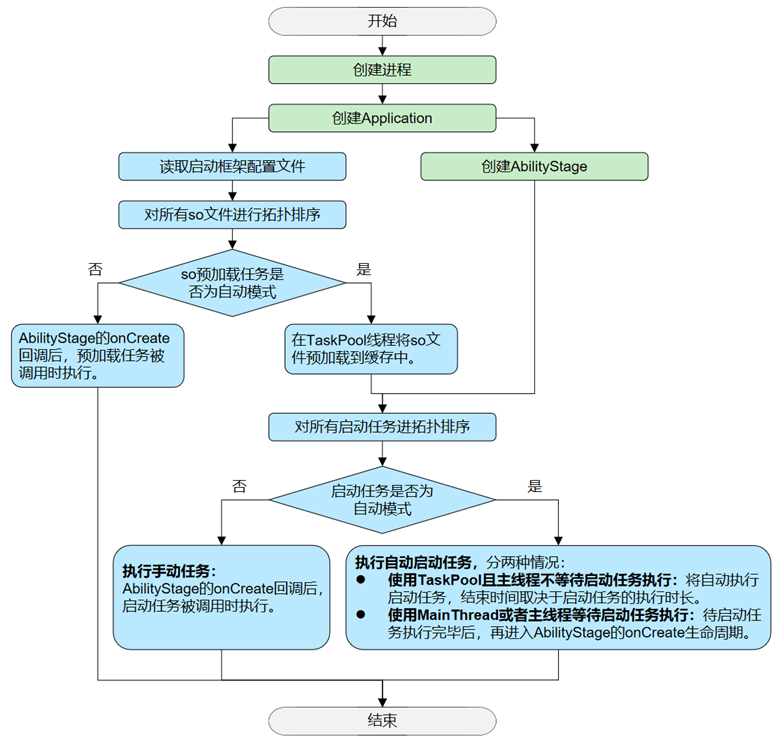
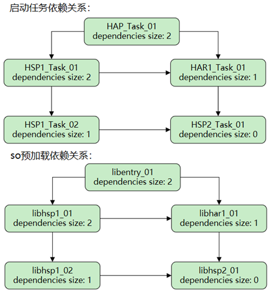

# 应用启动框架AppStartup


## 概述

应用启动时通常需要执行一系列初始化启动任务，如果将启动任务都放在[HAP](../quick-start/hap-package.md)的[UIAbility](../reference/apis-ability-kit/js-apis-app-ability-uiAbility.md)组件的[onCreate](../reference/apis-ability-kit/js-apis-app-ability-uiAbility.md#oncreate)生命周期中，那么只能在主线程中依次执行，不但影响应用的启动速度，而且当启动任务过多时，任务之间复杂的依赖关系还会使得代码难以维护。

AppStartup提供了一种简单高效的应用启动方式，可以支持任务的异步启动，加快应用启动速度。同时，通过在一个配置文件中统一设置多个启动任务的执行顺序以及依赖关系，让执行启动任务的代码变得更加简洁清晰、容易维护。

## 运行机制

启动框架支持以自动模式或手动模式执行启动任务，默认采用自动模式。在构造[AbilityStage](ability-terminology.md#abilitystage)过程中开始加载开发者配置的启动任务，并执行自动模式的启动任务。开发者也可以在AbilityStage创建完后调用[startupManager.run](../reference/apis-ability-kit/js-apis-app-appstartup-startupManager.md#startupmanagerrun)方法，执行手动模式的启动任务。

  **图1** 启动框架执行时机  
  


## 支持的范围

- HAP：entry类型的HAP支持以自动和手动模式启动。从API version 20开始，feature类型的HAP支持以自动和手动模式启动。

- HSP/HAR: 从API version 18开始，支持在[HSP](../quick-start/in-app-hsp.md)和[HAR](../quick-start/har-package.md)中配置启动任务。HSP和HAR的启动任务、so预加载任务无法主动配置为自动模式，但可以被HAP中自动模式的启动任务、so预加载任务拉起。

- 启动框架从API 18开始支持配置so预加载任务，so文件开发可以参考[Node-API](../napi/use-napi-process.md)创建Native C++工程。


## 约束限制

- 使用启动框架必须在[HAP](../quick-start/hap-package.md)的[module.json5配置文件](../quick-start/module-configuration-file.md)中开启启动框架。

- ExtensionAbility组件启动场景单一，使用启动框架会带来额外开销，因此不支持ExtensionAbility组件启动时拉起启动框架。

- 启动任务之间或so预加载任务之间不允许存在循环依赖。


## 开发流程

1. [定义启动框架配置文件](#定义启动框架配置文件)：在资源文件目录下创建启动框架配置文件、添加启动任务的配置信息，并在[module.json5](../quick-start/module-configuration-file.md)配置文件中引用。
2. [设置启动参数](#设置启动参数)：在启动参数文件中，设置超时时间和启动任务的监听器等参数。
3. [为每个待初始化功能组件添加启动任务](#为每个待初始化功能组件添加启动任务)：通过实现[StartupTask](../reference/apis-ability-kit/js-apis-app-appstartup-startupTask.md)接口，启动框架将会按顺序执行初始化流程。

## 开发步骤

### 定义启动框架配置文件

1. 在[HAP](../quick-start/hap-package.md)的“resources/base/profile”路径下，新建启动框架配置文件。文件名可以自定义，本文以"startup_config.json"为例。

2. 在启动框架配置文件startup_config.json中，依次添加各个启动任务和so预加载任务的配置信息。

    假设当前应用启动框架共包含6个启动任务和6个so预加载任务，任务之间的依赖关系如下图所示。为了便于并发执行启动任务，单个启动任务文件包含的启动任务应尽量单一，本例中每个启动任务对应一个启动任务文件。不建议应用在so文件的加载回调中运行代码逻辑，so文件的加载不宜过长，否则会影响主线程的运行。

    **图2** 启动任务与so预加载任务依赖关系图  
     
    
    1. 在“ets/startup”路径下，依次创建6个启动任务文件、以及一个公共的启动参数配置文件。文件名称必须确保唯一性。
    
        1. 创建启动任务文件。本例中的6个文件名分别为StartupTask_001.ets~StartupTask_006.ets。
        2. 参考[Node-API](../napi/use-napi-process.md)创建so文件。本例中的6个so文件名称分别为libentry_001.so~libentry_006.so。
        3. 创建启动任务参数配置文件。本例中的文件名为StartupConfig.ets。
        
    2. 在启动框架配置文件startup_config.json中，添加所有启动任务以及启动参数配置文件的相关信息。
    
        startup_config.json文件示例如下：
        
        ```json
        {
          "startupTasks": [
            {
              "name": "StartupTask_001",
              "srcEntry": "./ets/startup/StartupTask_001.ets",
              "dependencies": [
                "StartupTask_002",
                "StartupTask_003"
              ],
              "runOnThread": "taskPool",
              "waitOnMainThread": false
            },
            {
              "name": "StartupTask_002",
              "srcEntry": "./ets/startup/StartupTask_002.ets",
              "dependencies": [
                "StartupTask_003",
                "StartupTask_004"
              ],
              "runOnThread": "taskPool",
              "waitOnMainThread": false
            },
            {
              "name": "StartupTask_003",
              "srcEntry": "./ets/startup/StartupTask_003.ets",
              "dependencies": [
                "StartupTask_004"
              ],
              "runOnThread": "taskPool",
              "waitOnMainThread": false
            },
            {
              "name": "StartupTask_004",
              "srcEntry": "./ets/startup/StartupTask_004.ets",
              "runOnThread": "taskPool",
              "waitOnMainThread": false
            },
            {
              "name": "StartupTask_005",
              "srcEntry": "./ets/startup/StartupTask_005.ets",
              "dependencies": [
                "StartupTask_006"
              ],
              "runOnThread": "mainThread",
              "waitOnMainThread": true,
              "excludeFromAutoStart": true
            },
            {
              "name": "StartupTask_006",
              "srcEntry": "./ets/startup/StartupTask_006.ets",
              "runOnThread": "mainThread",
              "waitOnMainThread": false,
              "excludeFromAutoStart": true
            }
          ],
          "appPreloadHintStartupTasks": [
            {
              "name": "libentry_001",
              "srcEntry": "libentry_001.so",
              "dependencies": [
                "libentry_002",
                "libentry_003"
              ],
              "runOnThread": "taskPool"
            },
            {
              "name": "libentry_002",
              "srcEntry": "libentry_002.so",
              "dependencies": [
                "libentry_003",
                "libentry_004"
              ],
              "runOnThread": "taskPool"
            },
            {
              "name": "libentry_003",
              "srcEntry": "libentry_003.so",
              "dependencies": [
                "libentry_004"
              ],
              "runOnThread": "taskPool"
            },
            {
              "name": "libentry_004",
              "srcEntry": "libentry_004.so",
              "runOnThread": "taskPool"
            },
            {
              "name": "libentry_005",
              "srcEntry": "libentry_005.so",
              "dependencies": [
                "libentry_006"
              ],
              "runOnThread": "taskPool",
              "excludeFromAutoStart": true
            },
            {
              "name": "libentry_006",
              "srcEntry": "libentry_006.so",
              "runOnThread": "taskPool",
              "excludeFromAutoStart": true
            }
          ],
          "configEntry": "./ets/startup/StartupConfig.ets"
        }
        ```
        
    
        **表1** startup_config.json配置文件标签说明

        | 属性名称 | 含义 | 数据类型 | 是否可缺省 |
        | -------- | -------- | -------- | -------- |
        | startupTasks | 启动任务配置信息，标签说明详见下表。 | 对象数组 | 该标签可缺省，缺省值为空。 |
        | appPreloadHintStartupTasks | 预加载so任务配置信息，标签说明详见下表。 | 对象数组 | 该标签可缺省，缺省值为空。 |
        | configEntry | 启动参数配置文件所在路径。<br/>**说明：**<br/>- HSP、HAR中不允许配置`configEntry`字段。<br/>- 如果应用开启了[文件名混淆](../arkts-utils/source-obfuscation.md#-enable-filename-obfuscation)，则需要将文件路径添加到保留白名单中。具体操作详见[ArkGuard混淆原理及功能](../arkts-utils/source-obfuscation.md)的[-keep-file-name](../arkts-utils/source-obfuscation.md#-keep-file-name)部分。 | 字符串 | 该标签不可缺省。 |
        
        
        **表2** startupTasks标签说明

        | 属性名称 | 含义 | 数据类型 | 是否可缺省 |
        | -------- | -------- | -------- | -------- |
        | name | 启动任务名称，可自定义，推荐与类名保持一致。 | 字符串 | 该标签不可缺省。 |
        | srcEntry | 启动任务对应的文件路径。<br/>**说明：** <br/> 如果应用开启了[文件名混淆](../arkts-utils/source-obfuscation.md#-enable-filename-obfuscation)，则需要将文件路径添加到保留白名单中。具体操作详见[ArkGuard混淆原理及功能](../arkts-utils/source-obfuscation.md)的[-keep-file-name](../arkts-utils/source-obfuscation.md#-keep-file-name)部分。 | 字符串 | 该标签不可缺省。 |
        | dependencies | 启动任务依赖的其他启动任务的类名数组。 | 对象数组 | 该标签可缺省，缺省值为空。 |
        | excludeFromAutoStart | 是否排除自动模式，详细介绍可以查看[修改启动模式](#可选修改启动模式)。 <br/>-&nbsp;true：手动模式。 <br/>-&nbsp;false：自动模式。<br/>**说明：**<br/> HSP、HAR中startupTask里的excludeFromAutoStart标签必须配置为true。 | 布尔值 | 该标签可缺省，缺省值为false。 |
        | runOnThread | 执行初始化所在的线程。<br/>-&nbsp;`mainThread`：在主线程中执行。<br/>-&nbsp;`taskPool`：在异步线程中执行。 | 字符串 | 该标签可缺省，缺省值为`mainThread`。 |
        | waitOnMainThread | 主线程是否需要等待启动框架执行。当runOnThread取值为`taskPool`时，该字段生效。 <br/>-&nbsp;true：主线程等待启动框架执行完之后，才会加载应用首页。 <br/>-&nbsp;false：主线程不等待启动任务执行。 | 布尔值 | 该标签可缺省，缺省值为true。 |
        | matchRules | 该字段用于筛选需要以自动模式启动的启动任务，加速应用启动过程。适用于快速拉起某个页面的场景，例如，通过桌面卡片、通知或意图调用等方式触发的页面跳转，实现功能服务的一步直达体验。操作指导详见[添加任务匹配规则](#可选添加任务匹配规则)。<br/>**说明：** <br/>- 从API version 20开始，支持该字段。当前仅支持在HAP中配置该字段。<br/>- 该字段的优先级高于excludeFromAutoStart。如果所有启动任务均匹配失败，则按任务的excludeFromAutoStart配置处理。 | 对象 | 该标签可缺省。|
        
        **表3** appPreloadHintStartupTasks标签说明

        | 属性名称 | 含义 | 数据类型 | 是否可缺省 |
        | -------- | -------- | -------- | -------- |
        | name | 预加载so文件名。 | 字符串 | 该标签不可缺省。 |
        | srcEntry | 带后缀预加载so文件名。 | 字符串 | 该标签不可缺省。 |
        | dependencies | 预加载任务依赖的其他预加载任务的so名数组。 | 对象数组 | 该标签可缺省，缺省值为空。 |
        | excludeFromAutoStart | 是否排除自动模式，详细介绍可以查看[修改启动模式](#可选修改启动模式)。 <br/>-&nbsp;true：手动模式。 <br/>-&nbsp;false：自动模式。<br/>**说明：**<br/> HSP、HAR中appPreloadHintStartupTask的excludeFromAutoStart标签必须配置为true。 | 布尔值 | 该标签可缺省，缺省值为false。|
        | runOnThread | 执行预加载所在的线程。<br/>-&nbsp;`taskPool`：在异步线程中执行。<br/>**说明：**<br/> so预加载只允许在`taskPool`线程执行。 | 字符串 | 该标签不可缺省。 |
        | matchRules | 该字段用于筛选需要以自动模式启动的预加载so任务，加速应用启动过程。适用于快速拉起某个页面的场景，例如，通过桌面卡片、通知或意图调用等方式触发的页面跳转，实现功能服务的一步直达体验。操作指导详见[添加任务匹配规则](#可选添加任务匹配规则)。<br/>**说明：** <br/>- 从API version 20开始，支持该字段。当前仅支持在HAP中配置该字段。<br/>- 该字段的优先级高于excludeFromAutoStart。如果所有预加载so任务均匹配失败，则按任务的excludeFromAutoStart配置处理。 | 对象 | 该标签可缺省。|

      3. 在[module.json5配置文件](../quick-start/module-configuration-file.md)的appStartup标签中，添加启动框架配置文件的索引。

          module.json5示例代码如下。

          ```json
          {
            "module": {
              "name": "entry",
              "type": "entry",
              // ...
              "appStartup": "$profile:startup_config", // 启动框架的配置文件
              // ...
            }
          }
          ```

### 设置启动参数

在启动参数配置文件（本文为“ets/startup/StartupConfig.ets”文件）中，使用[StartupConfigEntry](../reference/apis-ability-kit/js-apis-app-appstartup-startupConfigEntry.md)接口实现启动框架公共参数的配置，包括超时时间和启动任务的监听器等参数，其中需要用到如下接口：

- [StartupConfig](../reference/apis-ability-kit/js-apis-app-appstartup-startupConfig.md)：用于设置任务超时时间和启动框架的监听器。
- [StartupListener](../reference/apis-ability-kit/js-apis-app-appstartup-startupListener.md)：用于监听启动任务是否执行成功。


```ts
import { StartupConfig, StartupConfigEntry, StartupListener } from '@kit.AbilityKit';
import { hilog } from '@kit.PerformanceAnalysisKit';
import { BusinessError } from '@kit.BasicServicesKit';

export default class MyStartupConfigEntry extends StartupConfigEntry {
  onConfig() {
    hilog.info(0x0000, 'testTag', `onConfig`);
    let onCompletedCallback = (error: BusinessError<void>) => {
      hilog.info(0x0000, 'testTag', `onCompletedCallback`);
      if (error) {
        hilog.error(0x0000, 'testTag', 'onCompletedCallback: %{public}d, message: %{public}s', error.code, error.message);
      } else {
        hilog.info(0x0000, 'testTag', `onCompletedCallback: success.`);
      }
    };
    let startupListener: StartupListener = {
      'onCompleted': onCompletedCallback
    };
    let config: StartupConfig = {
      'timeoutMs': 10000,
      'startupListener': startupListener
    };
    return config;
  }
}
```

### 为每个待初始化功能组件添加启动任务

上述操作中已完成启动框架配置文件、启动参数的配置，还需要在每个功能组件对应的启动任务文件中，通过实现[StartupTask](../reference/apis-ability-kit/js-apis-app-appstartup-startupTask.md)来添加启动任务。其中，需要用到下面的两个方法：

- [init](../reference/apis-ability-kit/js-apis-app-appstartup-startupTask.md#init)：启动任务初始化。当该任务依赖的启动任务全部执行完毕，即onDependencyCompleted完成调用后，才会执行init方法对该任务进行初始化。
- [onDependencyCompleted](../reference/apis-ability-kit/js-apis-app-appstartup-startupTask.md#ondependencycompleted)：当前任务依赖的启动任务执行完成时，调用该方法。


下面以[startup_config.json](#定义启动框架配置文件)中的StartupTask_001.ets文件为例，示例代码如下。开发者需要分别为每个待初始化功能组件添加启动任务。

> **说明：** 
> 
> 由于StartupTask采用了[Sendable协议](../arkts-utils/arkts-sendable.md#sendable协议)，在继承该接口时，必须添加Sendable注解。

```ts
import { StartupTask, common } from '@kit.AbilityKit';
import { hilog } from '@kit.PerformanceAnalysisKit';

@Sendable
export default class StartupTask_001 extends StartupTask {
  constructor() {
    super();
  }

  async init(context: common.AbilityStageContext) {
    hilog.info(0x0000, 'testTag', 'StartupTask_001 init.');
    return 'StartupTask_001';
  }

  onDependencyCompleted(dependence: string, result: Object): void {
    hilog.info(0x0000, 'testTag', 'StartupTask_001 onDependencyCompleted, dependence: %{public}s, result: %{public}s',
      dependence, JSON.stringify(result));
  }
}
```

 ### （可选）HSP与HAR中使用启动框架

 通常大型应用会有多个[HSP](../quick-start/in-app-hsp.md)和[HAR](../quick-start/har-package.md)，本节将提供一个应用示例，以展示如何在HSP包和HAR包中使用启动框架。该示例应用包括两个HSP包（hsp1、hsp2）和一个HAR包（har1），并且包含启动任务和so预加载任务。

 开发步骤如下：

  1. 除[HAP](../quick-start/hap-package.md)外，在HSP包和HAR包的“resources/base/profile”目录下创建启动框架配置文件，不同模块可以使用相同文件名，本文以"startup_config.json"为例。
  
  2. 分别在各个模块的启动框架配置文件startup_config.json中， 添加对应的配置信息。
     
        假设当前应用存在的启动任务与so预加载任务如下表所示。
        
        **表4** 应用启动任务与so预加载任务说明
        | 模块 | 启动任务 | so预加载任务 |
        | ------- | -------------------------------- | -------------------------------- |
        | entry | HAP_Task_01 | libentry_01 |
        | hsp1 | HSP1_Task_01 <br/> HSP1_Task_02 | libhsp1_01 <br/> libhsp1_02 |
        | hsp2 | HSP2_Task_01 | libhsp2_01 |
        | har | HAR1_Task_01 | libhar1_01 |
        
        **图3** 启动任务与so预加载依赖关系图  
         
  
        [HAP](../quick-start/hap-package.md)的startup_config.json可参考[定义启动框架配置文件](#定义启动框架配置文件)，HSP与HAR的startup_config.json文件无法配置"configEntry"字段，以hsp1包配置文件为例，示例如下：
        
        ```json
        {
          "startupTasks": [
            {
              "name": "HSP1_Task_01",
              "srcEntry": "./ets/startup/HSP1_Task_01.ets",
              "dependencies": [
                "HSP1_Task_02",
                "HAR1_Task_01"
              ],
              "runOnThread": "taskPool",
              "waitOnMainThread": false,
              "excludeFromAutoStart": true
            }
          ],
          "appPreloadHintStartupTasks": [
            {
              "name": "libhsp1_01",
              "srcEntry": "libhsp1_01.so",
              "dependencies": [
                "libhsp1_02",
                "libhar1_01"
              ],
              "runOnThread": "taskPool",
              "excludeFromAutoStart": true
            }
          ]
        }
        ```

  3. 分别在各个模块的[module.json5配置文件](../quick-start/module-configuration-file.md)的appStartup标签中，添加启动框架配置文件的索引。

        hsp1、hsp2以及har1的module.json5示例代码如下。

        ```json
        {
          "module": {
            "name": "hsp1",
            "type": "shared",
            // ...
            "appStartup": "$profile:startup_config", // 启动框架的配置文件
            // ...
          }
        }
        ```
        ```json
        {
          "module": {
            "name": "hsp2",
            "type": "shared",
            // ...
            "appStartup": "$profile:startup_config", // 启动框架的配置文件
            // ...
          }
        }
        ```
        ```json
        {
          "module": {
            "name": "har1",
            "type": "har",
            // ...
            "appStartup": "$profile:startup_config", // 启动框架的配置文件
            // ...
          }
        }
        ```

  其余步骤请参考[设置启动参数](#设置启动参数)和[为每个待初始化功能组件添加启动任务](#为每个待初始化功能组件添加启动任务)章节进行配置。


### （可选）修改启动模式

AppStartup分别提供了自动和手动两种方式来执行启动任务，entry模块中默认采用自动模式，开发者可以根据需要修改为手动模式，HSP与HAR只能配置为手动模式。

- 自动模式：当AbilityStage完成创建后，自动执行启动任务。
- 手动模式：在UIAbility完成创建后手动调用，来执行启动任务与so预加载任务。对于某些使用频率不高的模块，不需要应用最开始启动时就进行初始化。开发者可以选择将该部分启动任务修改为手动模式，在应用启动完成后调用[startupManager.run](../reference/apis-ability-kit/js-apis-app-appstartup-startupManager.md#startupmanagerrun)方法来执行启动任务与so预加载任务。

下面以UIAbility的onCreate生命周期中为例，介绍如何采用手动模式来启动任务，示例代码如下。

```ts
import { AbilityConstant, UIAbility, Want, startupManager } from '@kit.AbilityKit';
import { hilog } from '@kit.PerformanceAnalysisKit';
import { BusinessError } from '@kit.BasicServicesKit';

export default class EntryAbility extends UIAbility {
  onCreate(want: Want, launchParam: AbilityConstant.LaunchParam): void {
    hilog.info(0x0000, 'testTag', '%{public}s', 'Ability onCreate');
    let startParams = ['StartupTask_005', 'StartupTask_006'];
    try {
      startupManager.run(startParams).then(() => {
        console.log(`StartupTest startupManager run then, startParams = ${JSON.stringify(startParams)}.`);
      }).catch((error: BusinessError) => {
        console.error(`StartupTest promise catch error, error = ${JSON.stringify(error)}.`);
        console.error(`StartupTest promise catch error, startParams = ${JSON.stringify(startParams)}.`);
      })
    } catch (error) {
      let errMsg = (error as BusinessError).message;
      let errCode = (error as BusinessError).code;
      console.error(`Startup catch error, errCode= ${errCode}.`);
      console.error(`Startup catch error, errMsg= ${errMsg}.`);
    }
  }

  // ...
}
```

开发者还可以在页面加载完成后，在页面中调用启动框架手动模式，示例代码如下。

```ts
import { startupManager } from '@kit.AbilityKit';

@Entry
@Component
struct Index {
  @State message: string = "手动模式";
  @State startParams1: Array<string> = ["StartupTask_006"];
  @State startParams2: Array<string> = ["libentry_006"];

  build() {
    RelativeContainer() {
      Button(this.message)
        .id('AppStartup')
        .fontSize(20)
        .fontWeight(FontWeight.Bold)
        .onClick(() => {
          if (!startupManager.isStartupTaskInitialized("StartupTask_006") ) { // 判断是否已经完成初始化
            startupManager.run(this.startParams1)
          }
          if (!startupManager.isStartupTaskInitialized("libentry_006") ) {
            startupManager.run(this.startParams2)
          }
        })
        .alignRules({
          center: {anchor: '__container__', align: VerticalAlign.Center},
          middle: {anchor: '__container__', align: HorizontalAlign.Center}
        })
    }
    .height('100%')
    .width('100%')
  }
}
```

### （可选）添加任务匹配规则

在通过卡片、通知、意图调用等方式拉起某个页面时，为了实现功能服务一步直达，可以通过添加matchRules匹配规则，仅加载与当前场景相关的部分启动任务，无需加载全部默认的自动启动任务，以提高启动性能。

可以通过以下两种方式添加匹配规则：

* 通过matchRules中的uris、actions、insightIntents字段，根据UIAbility启动时的uri、action或意图名称，匹配不同场景启动任务及预加载so任务。
* 如果上述方式不能满足需求，可以通过matchRules中的customization自定义匹配规则。

  **表** matchRules标签说明

  | 属性名称 | 含义 | 数据类型 | 是否可缺省 | 适用场景 |
  | -------- | -------- | -------- | -------- | -------- |
  | uris | 表示自动模式执行的任务的uri取值范围。当UIAbility启动时，会将[Want](../reference/apis-ability-kit/js-apis-app-ability-want.md)中携带的uri属性，与此处配置的uris数组取值进行匹配。格式为`scheme://host/path`，uri中的其它内容会被忽略（如port、fragment等）。 | 字符串数组 | 可缺省，缺省值为空。 | 通过特定uri拉起UIAbility的场景。 |
  | actions | 表示自动模式执行的任务的action取值范围。当UIAbility启动时，会将[Want](../reference/apis-ability-kit/js-apis-app-ability-want.md)中携带的action属性，与此处配置的actions数组取值进行匹配。 | 字符串数组 | 可缺省，缺省值为空。 | 通过特定action拉起UIAbility的场景。 |
  | insightIntents | 表示自动模式执行的任务的意图名称取值范围。当UIAbility启动时，会将意图名称与此处配置的insightIntents数组取值进行匹配。 | 字符串数组 | 可缺省，缺省值为空。 | 通过特定意图名称拉起UIAbility的场景。 |
  | customization | 表示自动模式执行的任务的自定义规则取值范围。通过实现StartupConfigEntry的[onRequestCustomMatchRule](../reference/apis-ability-kit/js-apis-app-appstartup-startupConfigEntry.md#startupconfigentryonrequestcustommatchrule20)接口返回自定义规则值。当UIAbility启动时，会将自定义规则值与此处配置的customization数组取值进行匹配。<br/>**说明：**<br/>仅支持startupTasks中的任务配置。 | 字符串数组 | 可缺省，缺省值为空。 | 如果使用uris、actions、insightIntents字段无法满足要求，可以使用customization自定义规则。 |

  > **说明：** 
  >
  > * uris、insightIntents、actions、customization任一属性匹配成功即为任务匹配成功。
  > * 匹配成功的任务及其依赖任务都将在自动模式执行。
  > * 所有任务均匹配失败，则按任务的excludeFromAutoStart配置处理。

下面以uri匹配（action和意图名称类似）和customization匹配来举例，介绍如何实现添加任务匹配规则来筛选启动任务。

**场景1：uri匹配**

假定需要用户点击通知消息跳转到通知详情页面时，仅自动执行StartupTask_004和libentry_006任务。若启动通知详情UIAbility时Want中的uri属性为`test://com.example.startupdemo/notification`，可以通过uri匹配。示例如下：

1. 对[定义启动框架配置文件](#定义启动框架配置文件)步骤中的startup_config.json文件进行修改，增加StartupTask_004任务和libentry_006任务的matchRules配置。

    ```json
    {
      "startupTasks": [
        {
          "name": "StartupTask_004",
          "srcEntry": "./ets/startup/StartupTask_004.ets",
          "runOnThread": "taskPool",
          "waitOnMainThread": false,
          "matchRules": {
            "uris": [
              "test://com.example.startupdemo/notification"
            ]
          }
        },
      ],
      "appPreloadHintStartupTasks": [
        {
          "name": "libentry_006",
          "srcEntry": "libentry_006.so",
          "runOnThread": "taskPool",
          "excludeFromAutoStart": true,
          "matchRules": {
            "uris": [
              "test://com.example.startupdemo/notification"
            ]
          }
        }
      ],
      "configEntry": "./ets/startup/StartupConfig.ets"
    }
    ```

**场景2：customization匹配**

假定需要用户点击天气卡片跳转到天气界面时，仅自动执行StartupTask_006启动任务和excludeFromAutoStart=false配置的预加载so任务。若启动天气UIAbility时Want中传入的自定义参数`fromType`为`card`，可以通过customization匹配。示例如下：

  1. 对[设置启动参数](#设置启动参数)步骤中的MyStartupConfigEntry.ets文件进行修改，新增[onRequestCustomMatchRule](../reference/apis-ability-kit/js-apis-app-appstartup-startupConfigEntry.md#startupconfigentryonrequestcustommatchrule20)方法。

      ```ts
      import { StartupConfig, StartupConfigEntry, StartupListener, Want } from '@kit.AbilityKit';
      import { hilog } from '@kit.PerformanceAnalysisKit';
      import { BusinessError } from '@kit.BasicServicesKit';

      export default class MyStartupConfigEntry extends StartupConfigEntry {

        // onConfig ...

        onRequestCustomMatchRule(want: Want): string {
          if (want?.parameters?.fromType == 'card') {
            return 'ruleCard';
          }
          return '';
        }

      }
      ```

  2. 对[定义启动框架配置文件](#定义启动框架配置文件)步骤中的startup_config.json文件进行修改，增加StartupTask_006任务的matchRules配置。预加载so任务不支持customization字段，按任务原有的excludeFromAutoStart配置处理。

      ```json
      {
        "startupTasks": [
          {
            "name": "StartupTask_006",
            "srcEntry": "./ets/startup/StartupTask_006.ets",
            "runOnThread": "mainThread",
            "waitOnMainThread": false,
            "excludeFromAutoStart": true,
            "matchRules": {
              "customization": [
                "ruleCard"
              ]
            }
          }
        ],
        "configEntry": "./ets/startup/StartupConfig.ets"
      }
      ```