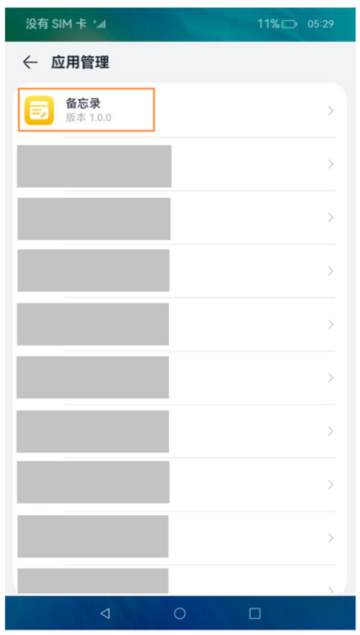

# 应用/组件级配置

在开发应用时，需要配置应用的一些标签，例如应用的包名、图标等标识特征的属性。本文描述了在开发应用需要配置的一些关键标签。

## 应用包名配置

应用需要在工程的AppScope目录下的[app.json5配置文件](../quick-start/app-configuration-file.md)中配置bundleName标签，该标签用于标识应用的唯一性。推荐采用反域名形式命名（如com.example.demo，建议第一级为域名后缀com，第二级为厂商/个人名，第三级为应用名，也可以多级）。

## 图标和标签配置
图标和标签通常一起配置，对应[app.json5配置文件](../quick-start/app-configuration-file.md)和[module.json5配置文件](../quick-start/module-configuration-file.md)中的icon和label标签。

### app.json5配置文件的图标和标签配置

#### 应用场景

用于在应用界面内展示当前应用，例如：
* 设置应用中，展示应用列表
* 在隐私管理中，展示应用申请的权限

**图1** app.json5配置文件的图标和标签



#### 配置示例

```json
{
  "app": {
    "icon": "$media:app_icon",
    "label": "$string:app_name"
    // ...
  }
}
```

### module.json5配置文件的图标和标签配置

#### 应用场景
应用安装完成后在设备桌面上显示出来的图标和标签，应用场景如下：
* 桌面上需要显示图标时
* 最近任务列表中显示时

**图2** module.json5配置文件的图标和标签


#### 配置示例

如果需要在桌面显示UIAbility图标，除了需要配置icon与label字段，还需要在skills标签下面的entities中添加"entity.system.home"、actions中添加"ohos.want.action.home"。

```json
{
  "module": {
    // ...
    "abilities": [
      {
        "icon": "$media:icon",
        "label": "$string:EntryAbility_label",
        "skills": [
          {
            "entities": [
              "entity.system.home"
            ],
            "actions": [
              "ohos.want.action.home"
            ]
          }
        ],
      }
    ]
  }
}
```
#### 管控规则
系统对无图标应用实施严格管控，防止一些恶意应用故意配置无桌面应用图标，导致用户找不到软件所在的位置，无法操作卸载应用，在一定程度上保证用户终端设备的安全。

如果预置应用确需隐藏桌面应用图标，需要配置AllowAppDesktopIconHide应用特权<!--Del-->，具体配置方式参考[应用特权配置指南](../../device-dev/subsystems/subsys-app-privilege-config-guide.md)<!--DelEnd-->。申请该特权后，应用不会在桌面上显示。

除预置应用外，其他应用不支持隐藏桌面图标，图标显示规则如下：
* HAP中包含UIAbility
  * 如果在module.json5配置文件的abilities标签中设置了桌面应用图标，系统将使用该UIAbility配置的icon和label作为桌面应用图标和标签。用户点击该图标，页面跳转到该UIAbility首页。如果没有配置label，系统将使用app.json5中的label作为桌面应用标签。

  * 如果在module.json5配置文件的abilities标签中未设置桌面应用图标，系统将使用app.json5中的icon和label作为桌面应用图标。用户点击该图标，页面跳转到应用管理中对应的应用详情页面。

* HAP中不包含UIAbility，系统将使用app.json5中的icon和label作为桌面应用图标和标签。用户点击该图标，页面跳转到应用管理中对应的应用详情页面。


  **图3** 应用的详情页示意图

  

## 应用版本声明配置

应用版本声明需要在工程的AppScope目录下的[app.json5配置文件](../quick-start/app-configuration-file.md)中配置versionCode标签和versionName标签。versionCode用于标识应用的版本号，该标签值为32位非负整数。此数字仅用于确定某个版本是否比另一个版本更新，数值越大表示版本越高。versionName标签标识版本号的文字描述。

## Module支持的设备类型配置

Module支持的设备类型需要在[module.json5配置文件](../quick-start/module-configuration-file.md)中配置[deviceTypes标签](../quick-start/module-configuration-file.md#devicetypes标签)，如果deviceTypes标签中添加了某种设备，则表明当前的Module支持在该设备上运行。

## Module权限配置

Module访问系统或其他应用受保护部分所需的权限信息需要在[module.json5配置文件](../quick-start/module-configuration-file.md)中配置[requestPermissions标签](../security/AccessToken/declare-permissions.md)。该标签用于声明需要申请权限的名称、申请权限的原因以及权限使用的场景。
