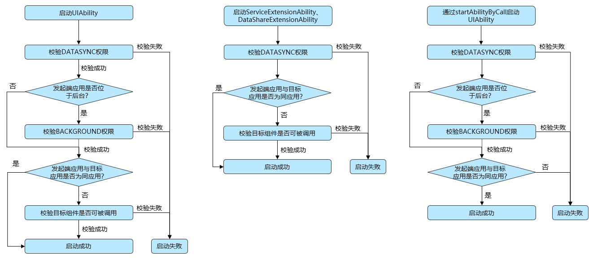

# 组件启动规则（Stage模型）

启动组件是指一切启动或连接应用组件的行为：

- 启动UIAbility、ServiceExtensionAbility、DataShareExtensionAbility，如使用startAbility()、startServiceExtensionAbility()、startAbilityByCall()等相关接口。

- 连接ServiceExtensionAbility、DataShareExtensionAbility，如使用connectServiceExtensionAbility()、createDataShareHelper()等相关接口。

## 组件启动总体规则

为了保证用户具有更好的使用体验，对以下几种易影响用户体验与系统安全的行为做了限制：

- 后台应用任意弹框，如各种广告弹窗，影响用户使用。

- 后台应用相互唤醒，不合理的占用系统资源，导致系统功耗增加或系统卡顿。

- 前台应用任意跳转至其他应用，如随意跳转到其他应用的支付页面，存在安全风险。

鉴于此，制订了一套组件启动规则，主要包括：

- **跨应用启动组件，需校验目标组件是否可以被其他应用调用。**

  若目标组件exported字段配置为true，表示可以被其他应用调用；若目标组件exported字段配置为false，表示不可以被其他应用调用，还需进一步校验`ohos.permission.START_INVISIBLE_ABILITY`权限。组件exported字段说明可参考[abilities标签](../quick-start/module-configuration-file.md#abilities标签)。

- **位于后台的UIAbility应用，启动组件需校验BACKGROUND权限`ohos.permission.START_ABILITIES_FROM_BACKGROUND`。**

  > 说明：
  > 
  > 前后台应用的判断依据：若应用进程获焦或所属的UIAbility组件位于前台则判定为前台应用，否则为后台应用。
 
- **跨设备使用startAbilityByCall接口，需校验分布式权限`ohos.permission.DISTRIBUTED_DATASYNC`。**

上述组件启动规则自API 9版本开始生效。开发者需熟知组件启动规则，避免业务功能异常。启动组件的具体校验流程见下文。

## 同设备组件启动规则

  设备内启动组件，不同场景下的规则不同，可分为如下三种场景：

- 启动UIAbility。

- 启动ServiceExtensionAbility、DataShareExtensionAbility。

- 通过startAbilityByCall接口启动UIAbility。

## 分布式跨设备组件启动规则

  跨设备启动组件，不同场景下的规则不同，可分为如下三种场景：

- 启动UIAbility。

- 启动ServiceExtensionAbility、DataShareExtensionAbility。

- 通过startAbilityByCall接口启动UIAbility。

