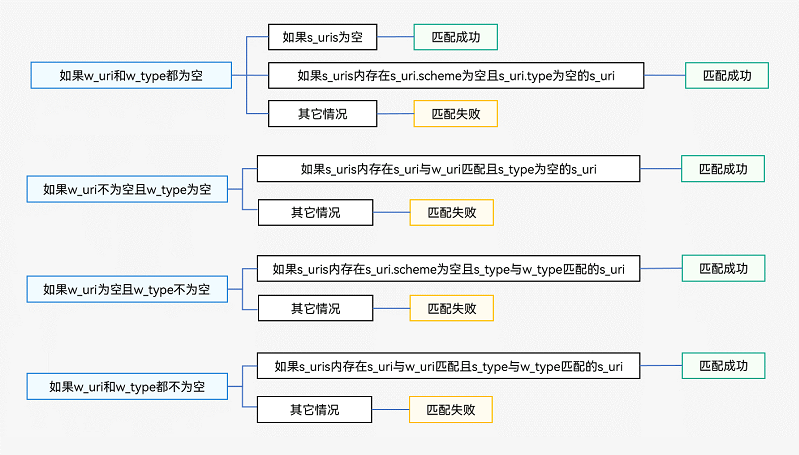

# 显式Want与隐式Want匹配规则

在启动目标应用组件时，会通过显式[Want](../reference/apis-ability-kit/js-apis-app-ability-want.md)或者隐式[Want](../reference/apis-ability-kit/js-apis-app-ability-want.md)进行目标应用组件的匹配，这里说的匹配规则就是调用方传入的[want](../reference/apis-ability-kit/js-apis-app-ability-want.md)参数中设置的参数如何与目标应用组件声明的配置文件进行匹配。

## 显式Want匹配原理

显式[Want](../reference/apis-ability-kit/js-apis-app-ability-want.md)匹配原理如下表所示。

| 名称 | 类型 | 匹配项 | 必选 | 规则 |
| -------- | -------- | -------- | -------- | -------- |
| deviceId | string | 是 | 否 | 留空将仅匹配本设备内的应用组件。 |
| bundleName | string | 是 | 是 | 如果指定abilityName，而不指定bundleName，则匹配失败。 |
| moduleName | string | 是 | 否 | 留空时当同一个应用内存在多个模块且模块间存在重名应用组件，将默认匹配第一个。 |
| abilityName | string | 是 | 是 | 该字段必须设置表示显式匹配。 |
| uri | string | 否 | 否 | 系统匹配时将忽略该参数，但仍可作为参数传递给目标应用组件。 |
| type | string | 否 | 否 | 系统匹配时将忽略该参数，但仍可作为参数传递给目标应用组件。 |
| action | string | 否 | 否 | 系统匹配时将忽略该参数，但仍可作为参数传递给目标应用组件。 |
| entities | Array&lt;string&gt; | 否 | 否 | 系统匹配时将忽略该参数，但仍可作为参数传递给目标应用组件。 |
| flags | number | 否 | 否 | 不参与匹配，直接传递给系统处理，一般用来设置运行态信息，例如URI数据授权等。 |
| parameters | {[key:&nbsp;string]:&nbsp;Object} | 否 | 否 | 不参与匹配，应用自定义数据将直接传递给目标应用组件。 |

## 隐式Want匹配原理

隐式[Want](../reference/apis-ability-kit/js-apis-app-ability-want.md)匹配原理如下表所示。

| 名称        | 类型                           | 匹配项 | 必选 | 规则                                                         |
| ----------- | ------------------------------ | ------ | ---- | ------------------------------------------------------------ |
| deviceId    | string                         | 是     | 否   | 跨设备目前不支持隐式调用。                                   |
| abilityName | string                         | 否     | 否   | 该字段必须留空表示隐式匹配。                                 |
| bundleName  | string                         | 是     | 否   | 匹配对应应用包内的目标应用组件。                              |
| moduleName  | string                         | 是     | 否   | 匹配对应Module内的目标应用组件。                              |
| uri         | string                         | 是     | 否   | 参见[want参数的uri和type匹配规则](#want参数的uri和type匹配规则)。                                                             |
| type        | string                         | 是     | 否   | 参见[want参数的uri和type匹配规则](#want参数的uri和type匹配规则)。                                                             |
| action      | string                         | 是     | 否   | 参见[want参数的action匹配规则](#want参数的action匹配规则)。                                                             |
| entities    | Array&lt;string&gt;            | 是     | 否   | 参见[want参数的entities匹配规则](#want参数的entities匹配规则)。                                                             |
| flags       | number                         | 否     | 否   | 不参与匹配，直接传递给系统处理，一般用来设置运行态信息，例如URI数据授权等。 |
| parameters  | {[key:&nbsp;string]:&nbsp;Object} | 是     | 否   | 应用自定义数据将直接传递给目标应用组件。当前支持使用key为linkFeature的参数进行匹配，当linkFeature配置且对应字符串不为空时，优先进行parameters匹配。|

从隐式Want的定义，可得知：

- 调用方传入的want参数，表明调用方需要执行的操作，并提供相关数据以及其他应用类型限制。

- 待匹配应用组件的skills配置，声明其具备的能力（[module.json5配置文件](../quick-start/module-configuration-file.md)中的[skills标签](../quick-start/module-configuration-file.md#skills标签)参数）。

系统将调用方传入的want参数（包含action、entities、uri、type和parameters属性）与已安装待匹配应用组件的skills配置（包含actions、entities、uris和type属性）进行匹配。当want参数五个属性匹配均未配置，隐式匹配失败。
- 当parameters中的linkFeature未配置或其对应的字符串为空时，只有当action、entities、uri和type四个属性均匹配通过时，此应用才会被应用选择器展示给用户进行选择。
- 当配置了parameters中的linkFeature且其对应的字符串不为空时，系统将优先进行linkFeature匹配。如果linkFeature匹配成功，还需要匹配uri和type属性，均匹配成功则隐式匹配成功；否则，不进行后续属性匹配，匹配失败。

### want参数的action匹配规则

将调用方传入的want参数的action与待匹配应用组件的skills配置中的actions进行匹配。

- 调用方传入的want参数的action为空，待匹配Ability的skills配置中的actions为空，则action匹配失败。

- 调用方传入的want参数的action不为空，待匹配应用组件的skills配置中的actions为空，则action匹配失败。

- 调用方传入的want参数的action为空，待匹配应用组件的skills配置中的actions不为空，则action匹配成功。

- 调用方传入的want参数的action不为空，待匹配应用组件的skills配置中的actions不为空且包含调用方传入的want参数的action，则action匹配成功。

- 调用方传入的want参数的action不为空，待匹配应用组件的skills配置中的actions不为空且不包含调用方传入的want参数的action，则action匹配失败。

  **图1** want参数的action匹配规则

### want参数的entities匹配规则

将调用方传入的want参数的entities与待匹配应用组件的skills配置中的entities进行匹配。

- 调用方传入的want参数的entities为空，待匹配应用组件的skills配置中的entities不为空，则entities匹配成功。

- 调用方传入的want参数的entities为空，待匹配应用组件的skills配置中的entities为空，则entities匹配成功。

- 调用方传入的want参数的entities不为空，待匹配应用组件的skills配置中的entities为空，则entities匹配失败。

- 调用方传入的want参数的entities不为空，待匹配应用组件的skills配置中的entities不为空且包含调用方传入的want参数的entities，则entities匹配成功。

- 调用方传入的want参数的entities不为空，待匹配应用组件的skills配置中的entities不为空且不完全包含调用方传入的want参数的entities，则entities匹配失败。

  **图2** want参数的entities匹配规则

### want参数的uri和type匹配规则

调用方传入的want参数中设置uri和type参数发起启动应用组件的请求，系统会遍历当前系统已安装的组件列表，并逐个匹配待匹配应用组件的skills配置中的uris数组，如果待匹配应用组件的skills配置中的uris数组中只要有一个可以匹配调用方传入的want参数中设置的uri和type即为匹配成功。

实际应用中，uri和type共存在四种情况，下面将讲解四种情况的具体匹配规则：

- 调用方传入的want参数的uri和type都为空。
  1. 如果待匹配应用组件的skills配置中的uris数组为空，匹配成功。
  2. 如果待匹配应用组件的skills配置中的uris数组中存在uri的scheme和type都为空的元素，匹配成功。
  3. 除以上两种情况，其他情况均为匹配失败。

- 调用方传入的want参数的uri不为空，type为空。
  1. 如果待匹配应用组件的skills配置中的uris数组为空，匹配失败。
  2. 如果待匹配应用组件的skills配置中的uris数组存在一条数据[uri匹配](#uri匹配规则)成功且type为空，则匹配成功，否则匹配失败。
  3. 如果前两条均匹配失败，并且传入的uri为文件路径uri，则根据文件后缀获取文件的MIME类型，如果该类型与skills文件中配置的type相匹配，则匹配成功。

- 调用方传入的want参数的uri为空，type不为空。
  1. 如果待匹配应用组件的skills配置中的uris数组为空，匹配失败。
  2. 如果待匹配应用组件的skills配置中的uris数组存在一条数据uri的scheme为空且[type匹配](#type匹配规则)成功，则匹配成功，否则匹配失败。

- 调用方传入的want参数的uri和type都不为空，如下图所示。
  1. 如果待匹配应用组件的skills配置中的uris数组为空，匹配失败。
  2. 如果待匹配应用组件的skills配置中的uris数组存在一条数据[uri匹配](#uri匹配规则)和[type匹配](#type匹配规则)需要均匹配成功，则匹配成功，否则匹配失败。

最左uri匹配：当配置文件待匹配应用组件的skills配置中的uris数组中只配置scheme；或者只配置scheme和host；或者只配置scheme、host和port时。传入want参数的uri的最左边依次需要和scheme，或者scheme和host，或者scheme、host和port都匹配，才满足最左uri匹配。

**图3** want参数中uri和type皆不为空时的匹配规则

为了简化描述：

- 称调用方传入的want参数中的uri参数为w_uri；待匹配应用组件的skills配置中uri为s_uri，其中每个元素为s_uri。
- 称调用方传入的want参数的type参数为w_type，待匹配应用组件的skills数组中uris的type数据为s_type。

**图4** want参数中uri和type的具体匹配规则

### uri匹配规则

具体的匹配规则如下：

- 如果s_uri的scheme为空，当w_uri为空时匹配成功，否则匹配失败。

- 如果s_uri的host为空，当w_uri和s_uri的scheme相同时匹配成功，否则匹配失败。

- 如果s_uri的port为空，当w_uri和s_uri中的scheme和host相同时匹配成功，否则匹配失败。

- 如果s_uri的path、pathStartWith和pathRegex都为空，当w_uri和s_uri中的scheme，host和port相同时匹配成功，否则匹配失败。

- 如果s_uri的path不为空，当w_uri和s_uri**全路径表达式**相同时匹配成功，否则继续进行pathStartWith的匹配。

- 如果s_uri的pathStartWith不为空，当w_uri包含s_uri**前缀表达式**时匹配成功，否则继续进行pathRegex的匹配。

- 如果s_uri的pathRegex不为空，当w_uri满足s_uri**正则表达式**时匹配成功，否则匹配失败。

> **说明：**
>
> 待匹配应用组件的skills配置的uris中scheme、host、port、path、pathStartWith和pathRegex属性拼接，如果依次声明了path、pathStartWith和pathRegex属性时，uris将分别拼接为如下三种表达式：
>
> - **前缀uri表达式**：当配置文件只配置scheme，或者只配置scheme和host，或者只配置scheme，host和port时，参数传入以配置文件为前缀的Uri
>     * `scheme://`
>     * `scheme://host`
>     * `scheme://host:port`
> - **全路径表达式**：`scheme://host:port/path`
> - **前缀表达式**：`scheme://host:port/pathStartWith`
> - **正则表达式**：`scheme://host:port/pathRegex`
>
> 系统应用预留uri的scheme统一以`ohos`开头，例如`ohosclock://`。三方应用组件配置的uri不能与系统应用重复，否则会导致无法通过该uri拉起三方应用组件。

### type匹配规则

> **说明：**
>
> 本章节所述的type匹配规则的适用性需建立在want参数内type不为空的基础上。当want参数内type为空时请参见[want参数的uri和type匹配规则](#want参数的uri和type匹配规则)。

具体的匹配规则如下：

- 如果s_type为空，则匹配失败。

- 如果s_type或者w_type为通配符`*/*`，则匹配成功。

- 如果s_type最后一个字符为通配符`*`，如`prefixType/*`，则当w_type包含`prefixType/`时匹配成功，否则匹配失败。

- 如果w_type最后一个字符为通配符`*`，如`prefixType/*`，则当s_type包含`prefixType/`时匹配成功，否则匹配失败。

### parameters匹配规则

> **说明：**
>
> 本章节所述的parameters匹配规则适用于want参数中的parameters包含linkFeature键且其对应的值为非空字符串的基础上。

将调用方传入的want参数的parameters与待匹配应用组件的skills配置中的uris进行匹配。具体的匹配规则如下：

- 如果skills配置中的uris中存在一条uri数据，其linkFeature字段对应的字符串与parameters中linkFeature对应的字符串相同，且uri和type属性均匹配（参见[want参数的uri和type匹配规则](#want参数的uri和type匹配规则)），则匹配成功。

- 如果skills配置中的uris中不存在任何一条uri数据，其linkFeature字段对应的字符串与parameters中linkFeature对应的字符串相同，或者uri和type属性均不匹配（参见[want参数的uri和type匹配规则](#want参数的uri和type匹配规则)），则匹配失败。