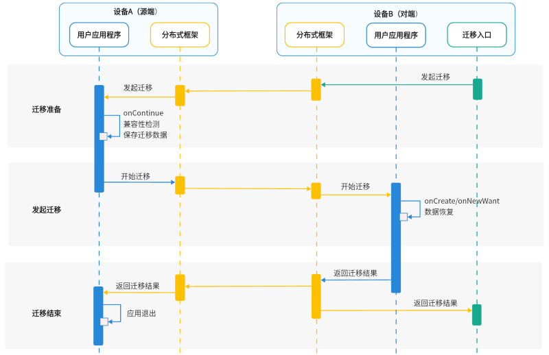

# 跨端迁移

## 概述

在用户使用设备的过程中，当使用情境发生变化时（例如从室内走到户外或者周围有更适合的设备等），之前使用的设备可能已经不适合继续当前的任务，此时，用户可以选择新的设备来继续当前的任务，原设备可按需决定是否退出任务，这个就是跨端迁移的场景。常见的跨端迁移场景实例：在平板上播放的视频，迁移到智慧屏继续播放，从而获得更佳的观看体验；平板上的视频应用退出。在应用开发层面，跨端迁移指在A端运行的UIAbility迁移到B端上，完成迁移后，B端UIAbility继续任务，而A端UIAbility可按需决定是否退出。

跨端迁移的核心任务是将应用的当前状态（包括页面控件、状态变量等）无缝迁移到另一设备，从而在新设备上无缝接续应用体验。这意味着用户在一台设备上进行的操作可以在另一台设备的相同应用中快速切换并无缝衔接。

主要功能包括：

- 支持用户自定义数据存储及恢复。

- 支持页面路由信息和页面控件状态数据的存储及恢复。

- 支持应用兼容性检测。

- 支持应用根据实际使用场景动态设置迁移状态（默认迁移状态为 **ACTIVE** 激活状态）。例如，编辑类应用在编辑文本的页面下才需要迁移，其他页面不需要迁移，则可以通过[`setMissionContinueState`](../reference/apis-ability-kit/js-apis-inner-application-uiAbilityContext.md#uiabilitycontextsetmissioncontinuestate10)进行控制。

- 支持应用动态选择是否进行页面栈恢复（默认进行页面栈信息恢复）。例如，应用希望自定义迁移到其他设备后显示的页面，则可以通过[`SUPPORT_CONTINUE_PAGE_STACK_KEY`](../reference/apis-ability-kit/js-apis-app-ability-wantConstant.md#wantconstantparams)进行控制。

- 支持应用动态选择迁移成功后是否退出迁移源端应用（默认迁移成功后退出迁移源端应用）。可以通过[`SUPPORT_CONTINUE_SOURCE_EXIT_KEY`](../reference/apis-ability-kit/js-apis-app-ability-wantConstant.md#wantconstantparams)进行控制。

  > **说明：**
  >
  > 开发者可以开发具有迁移能力的应用，迁移的触发由系统应用完成。


## 运作机制


1. 在源端，通过`UIAbility`的[`onContinue()`](../reference/apis-ability-kit/js-apis-app-ability-uiAbility.md#uiabilityoncontinue)回调，开发者可以保存待接续的业务数据。例如，在浏览器应用中完成跨端迁移，开发者需要使用[`onContinue()`](../reference/apis-ability-kit/js-apis-app-ability-uiAbility.md#uiabilityoncontinue)回调保存页面URL等业务内容，而系统将自动保存页面状态，如当前浏览进度。
2. 分布式框架提供了跨设备应用界面、页面栈以及业务数据的保存和恢复机制，它负责将数据从源端发送到对端。 
3. 在对端，同一`UIAbility`可以通过[`onCreate()`](../reference/apis-ability-kit/js-apis-app-ability-uiAbility.md#uiabilityoncreate)（冷启动）和[`onNewWant()`](../reference/apis-ability-kit/js-apis-app-ability-uiAbility.md#uiabilityonnewwant)（热启动）接口来恢复业务数据。

## 跨端迁移流程

以从对端的迁移入口发起迁移为例，跨端迁移流程如下图所示。


## 约束限制

- 跨端迁移要求在同一`UIAbility`之间进行，也就是需要相同的`bundleName`、`abilityName`和签名信息。
- 为了获得最佳体验，使用`wantParam`传输的数据需要控制在100KB以下。

## 开发步骤

1. 在[module.json5配置文件](../quick-start/module-configuration-file.md)的abilities标签中配置跨端迁移标签`continuable`。

   ```json
   {
     "module": {
       // ...
       "abilities": [
         {
           // ...
           "continuable": true, // 配置UIAbility支持迁移
         }
       ]
     }
   }
   ```

   > **说明：**
   >
   > 根据需要配置应用启动模式类型，配置详情请参照[UIAbility组件启动模式](uiability-launch-type.md)。

2. 在源端`UIAbility`中实现[`onContinue()`](../reference/apis-ability-kit/js-apis-app-ability-uiAbility.md#uiabilityoncontinue)回调。

   当`UIAbility`实例触发迁移时，[`onContinue()`](../reference/apis-ability-kit/js-apis-app-ability-uiAbility.md#uiabilityoncontinue)回调在源端被调用，开发者可以在该接口中通过同步或异步的方式来保存迁移数据，实现应用兼容性检测，决定是否支持此次迁移。

   - 保存迁移数据：开发者可以将要迁移的数据通过键值对的方式保存在`wantParam`参数中。
   - 应用兼容性检测：开发者可以通过从`wantParam`参数中获取对端应用的版本号与源端应用版本号做兼容性校验。开发者可以在触发迁移时从[`onContinue()`](../reference/apis-ability-kit/js-apis-app-ability-uiAbility.md#uiabilityoncontinue)回调中`wantParam.version`获取到迁移对端应用的版本号与迁移源端应用版本号做兼容校验。
   - 迁移决策：开发者可以通过[`onContinue()`](../reference/apis-ability-kit/js-apis-app-ability-uiAbility.md#uiabilityoncontinue)回调的返回值决定是否支持此次迁移，接口返回值详见[`AbilityConstant.OnContinueResult`](../reference/apis-ability-kit/js-apis-app-ability-abilityConstant.md#abilityconstantoncontinueresult)。

   ```ts
   import { AbilityConstant, UIAbility } from '@kit.AbilityKit';
   import { hilog } from '@kit.PerformanceAnalysisKit';
   
   const TAG: string = '[MigrationAbility]';
   const DOMAIN_NUMBER: number = 0xFF00;
   
   export default class MigrationAbility extends UIAbility {
     onContinue(wantParam: Record<string, Object>):AbilityConstant.OnContinueResult {
       let version = wantParam.version;
       let targetDevice = wantParam.targetDevice;
       hilog.info(DOMAIN_NUMBER, TAG, `onContinue version = ${version}, targetDevice: ${targetDevice}`); // 准备迁移数据
   
       // 获取源端版本号
       let versionSrc: number = -1; // 请填充具体获取版本号的代码
   
       // 兼容性校验
       if (version !== versionSrc) {
         // 在兼容性校验不通过时返回MISMATCH
         return AbilityConstant.OnContinueResult.MISMATCH;
       }
   
       // 将要迁移的数据保存在wantParam的自定义字段（例如data）中
       const continueInput = '迁移的数据';
       wantParam['data'] = continueInput;
   
       return AbilityConstant.OnContinueResult.AGREE;
     }
   }
   ```

3. 源端设备`UIAbility`实例在冷启动和热启动情况下分别会调用不同的接口来恢复数据和加载UI。  
   在对端设备的`UIAbility`中，需要实现[`onCreate()`](../reference/apis-ability-kit/js-apis-app-ability-uiAbility.md#uiabilityoncreate)/[`onNewWant()`](../reference/apis-ability-kit/js-apis-app-ability-uiAbility.md#uiabilityonnewwant)接口来恢复迁移数据。不同情况下的函数调用如下图所示：

   

   - 通过在[`onCreate()`](../reference/apis-ability-kit/js-apis-app-ability-uiAbility.md#uiabilityoncreate)/[`onNewWant()`](../reference/apis-ability-kit/js-apis-app-ability-uiAbility.md#uiabilityonnewwant)回调中检查`launchReason`，可以判断此次启动是否有迁移触发。
   - 开发者可以从`want`中获取之前保存的迁移数据
   - 数据恢复后调用`restoreWindowStage()`来触发**页面恢复**，包括页面栈信息。

   ```ts
   import { AbilityConstant, UIAbility, Want } from '@kit.AbilityKit';
   import { hilog } from '@kit.PerformanceAnalysisKit';
   
   const TAG: string = '[MigrationAbility]';
   const DOMAIN_NUMBER: number = 0xFF00;
   
   export default class MigrationAbility extends UIAbility {
     storage : LocalStorage = new LocalStorage();
   
     onCreate(want: Want, launchParam: AbilityConstant.LaunchParam): void {
       hilog.info(DOMAIN_NUMBER, TAG, '%{public}s', 'Ability onCreate');
       if (launchParam.launchReason === AbilityConstant.LaunchReason.CONTINUATION) {
         // 将上述保存的数据从want.parameters中取出恢复
         let continueInput = '';
         if (want.parameters !== undefined) {
           continueInput = JSON.stringify(want.parameters.data);
           hilog.info(DOMAIN_NUMBER, TAG, `continue input ${continueInput}`);
         }
         // 触发页面恢复
         this.context.restoreWindowStage(this.storage);
       }
     }
   
     onNewWant(want: Want, launchParam: AbilityConstant.LaunchParam): void {
        hilog.info(DOMAIN_NUMBER, TAG, 'onNewWant');
        if (launchParam.launchReason === AbilityConstant.LaunchReason.CONTINUATION) {
          // 将上述保存的数据从want.parameters中取出恢复
          let continueInput = '';
          if (want.parameters !== undefined) {
            continueInput = JSON.stringify(want.parameters.data);
            hilog.info(DOMAIN_NUMBER, TAG, `continue input ${continueInput}`);
          }
          // 触发页面恢复  
          this.context.restoreWindowStage(this.storage);
        }
      }
   }
   ```

## 可选配置迁移能力

### 动态配置迁移能力

从API version 10开始，提供了支持动态配置迁移能力的功能。即应用可以根据实际使用场景，在需要迁移时开启应用迁移能力；在业务不需要迁移时则可以关闭迁移能力。

开发者可以通过调用[`setMissionContinueState()`](../reference/apis-ability-kit/js-apis-inner-application-uiAbilityContext.md#uiabilitycontextsetmissioncontinuestate10)接口对迁移能力进行设置。默认状态下，应用的迁移能力为**ACTIVE**状态，即迁移能力开启，可以迁移。

**设置迁移能力的时机**

迁移能力的改变可以根据实际业务需求和代码实现，发生在应用生命周期的绝大多数时机。本文介绍常用的几种配置方式。

在`UIAbility`的[`onCreate()`](../reference/apis-ability-kit/js-apis-app-ability-uiAbility.md#uiabilityoncreate)回调中调用接口，可以在应用创建时设置应用的迁移状态。

```ts
// MigrationAbility.ets
import { AbilityConstant, UIAbility, Want } from '@kit.AbilityKit';
import { hilog } from '@kit.PerformanceAnalysisKit';

const TAG: string = '[MigrationAbility]';
const DOMAIN_NUMBER: number = 0xFF00;

export default class MigrationAbility extends UIAbility {
  onCreate(want: Want, launchParam: AbilityConstant.LaunchParam): void {
    // ...
    this.context.setMissionContinueState(AbilityConstant.ContinueState.INACTIVE, (result) => {
      hilog.info(DOMAIN_NUMBER, TAG, `setMissionContinueState: ${JSON.stringify(result)}`);
    });
    // ...
  }
}
```

在页面的`onPageShow()`回调中调用接口，可以设置单个页面出现时应用的迁移状态。

```ts
// Page_MigrationAbilityFirst.ets
import { AbilityConstant, common } from '@kit.AbilityKit';
import { hilog } from '@kit.PerformanceAnalysisKit';

const TAG: string = '[MigrationAbility]';
const DOMAIN_NUMBER: number = 0xFF00;

@Entry
@Component
struct Page_MigrationAbilityFirst {
  private context = getContext(this) as common.UIAbilityContext;
  build() {
    // ...
  }
  // ...
  onPageShow(){
    // 进入该页面时，将应用设置为可迁移状态
    this.context.setMissionContinueState(AbilityConstant.ContinueState.ACTIVE, (result) => {
      hilog.info(DOMAIN_NUMBER, TAG, '%{public}s', `setMissionContinueState ACTIVE result: ${JSON.stringify(result)}`);
    });
  }
}
```

在某个组件的触发事件中设置应用迁移能力。

```ts
// Page_MigrationAbilityFirst.ets
import { AbilityConstant, common } from '@kit.AbilityKit';
import { hilog } from '@kit.PerformanceAnalysisKit';
import { promptAction } from '@kit.ArkUI';

const TAG: string = '[MigrationAbility]';
const DOMAIN_NUMBER: number = 0xFF00;

@Entry
@Component
struct Page_MigrationAbilityFirst {
  private context = getContext(this) as common.UIAbilityContext;
  build() {
    // ...
    Button() {
      // ...
    }
    .onClick(()=>{
      // 点击该按钮时，将应用设置为可迁移状态
      this.context.setMissionContinueState(AbilityConstant.ContinueState.ACTIVE, (result) => {
        hilog.info(DOMAIN_NUMBER, TAG, '%{public}s', `setMissionContinueState ACTIVE result: ${JSON.stringify(result)}`);
      });
    })
  }
}
```

### **保证迁移连续性**

由于迁移加载时，对端拉起的应用可能执行过自己的迁移状态设置命令（例如，冷启动时对端在[`onCreate()`](../reference/apis-ability-kit/js-apis-app-ability-uiAbility.md#uiabilityoncreate)中设置了 **INACTIVE** ；热启动时对端已打开了不可迁移的页面，迁移状态为 **INACTIVE** 等情况）。为了保证迁移过后的应用依然具有可以迁移回源端的能力，应在 [`onCreate()`](../reference/apis-ability-kit/js-apis-app-ability-uiAbility.md#uiabilityoncreate)/[`onNewWant()`](../reference/apis-ability-kit/js-apis-app-ability-uiAbility.md#uiabilityonnewwant)的迁移调用判断中，将迁移状态设置为 **ACTIVE** 。

```ts
// MigrationAbility.ets
import { AbilityConstant, UIAbility, Want } from '@kit.AbilityKit';
import { hilog } from '@kit.PerformanceAnalysisKit';

const TAG: string = '[MigrationAbility]';
const DOMAIN_NUMBER: number = 0xFF00;

export default class MigrationAbility extends UIAbility {
  // ...
  onCreate(want: Want, launchParam: AbilityConstant.LaunchParam): void {
    // ...
    // 调用原因为迁移时，设置状态为可迁移，应对冷启动情况
    if (launchParam.launchReason == AbilityConstant.LaunchReason.CONTINUATION) {
      this.context.setMissionContinueState(AbilityConstant.ContinueState.ACTIVE, (result) => {
        hilog.info(`setMissionContinueState ACTIVE result: ${JSON.stringify(result)}`);
      });
    }
  }
  
  onNewWant(want: Want, launchParam: AbilityConstant.LaunchParam): void {
    // ...
    // 调用原因为迁移时，设置状态为可迁移，应对热启动情况
    if (launchParam.launchReason == AbilityConstant.LaunchReason.CONTINUATION) {
      this.context.setMissionContinueState(AbilityConstant.ContinueState.ACTIVE, (result) => {
        hilog.info(DOMAIN_NUMBER, TAG, `setMissionContinueState ACTIVE result: ${JSON.stringify(result)}`);
      });
    }
  }
  // ...
}
```

### 按需迁移页面栈

支持应用动态选择是否进行页面栈恢复（默认进行页面栈信息恢复）。如果应用不想使用系统默认恢复的页面栈，则可以设置不进行页面栈迁移，而需要在`onWindowStageRestore()`设置迁移后进入的页面，参数定义见[SUPPORT_CONTINUE_PAGE_STACK_KEY](../reference/apis-ability-kit/js-apis-app-ability-wantConstant.md#wantconstantparams)。

应用在源端的页面栈中存在Index和Second路由，而在对端恢复时不需要按照源端页面栈进行恢复，需要恢复到指定页面。

例如，`UIAbility`迁移不需要自动迁移页面栈信息。

```ts
// MigrationAbility.ets
import { AbilityConstant, UIAbility, wantConstant } from '@kit.AbilityKit';
import { hilog } from '@kit.PerformanceAnalysisKit';
import { window } from '@kit.ArkUI';

const TAG: string = '[MigrationAbility]';
const DOMAIN_NUMBER: number = 0xFF00;

export default class MigrationAbility extends UIAbility {
  // ...
  onContinue(wantParam: Record<string, Object>):AbilityConstant.OnContinueResult {
    hilog.info(DOMAIN_NUMBER, TAG, `onContinue version = ${wantParam.version}, targetDevice: ${wantParam.targetDevice}`);
    wantParam[wantConstant.Params.SUPPORT_CONTINUE_PAGE_STACK_KEY] = false;
    return AbilityConstant.OnContinueResult.AGREE;
  }

  onWindowStageRestore(windowStage: window.WindowStage) : void {
    // 若不需要自动迁移页面栈信息，则需要在此处设置应用迁移后进入的页面
    windowStage.loadContent('pages/page_migrationability/Page_MigrationAbilityThird', (err, data) => {
      if (err.code) {
        hilog.error(DOMAIN_NUMBER, TAG, 'Failed to load the content. Cause: %{public}s', JSON.stringify(err) ?? '');
        return;
      }
    });
  }
}
```

### 按需退出

支持应用动态选择迁移成功后是否退出迁移源端应用（默认迁移成功后退出迁移源端应用）。如果应用不想让系统自动退出迁移源端应用，则可以设置不退出，参数定义见[SUPPORT_CONTINUE_SOURCE_EXIT_KEY](../reference/apis-ability-kit/js-apis-app-ability-wantConstant.md#wantconstantparams)。

示例：`UIAbility`设置迁移成功后，源端不需要退出迁移应用。

```ts
import { AbilityConstant, UIAbility, wantConstant } from '@kit.AbilityKit';
import { hilog } from '@kit.PerformanceAnalysisKit';

const TAG: string = '[MigrationAbility]';
const DOMAIN_NUMBER: number = 0xFF00;

export default class MigrationAbility extends UIAbility {
  // ...
  onContinue(wantParam: Record<string, Object>):AbilityConstant.OnContinueResult {
    hilog.info(DOMAIN_NUMBER, TAG, `onContinue version = ${wantParam.version}, targetDevice: ${wantParam.targetDevice}`);
    wantParam[wantConstant.Params.SUPPORT_CONTINUE_SOURCE_EXIT_KEY] = false;
    return AbilityConstant.OnContinueResult.AGREE;
  }
}
```

## 跨端迁移中的数据迁移
当前支持两种不同的数据迁移方式，开发者可以根据实际使用需要进行选择。
  > **说明：**
  >
  > 部分ArkUI组件支持通过配置`restoreId`的方式，在迁移后将特定状态恢复到对端设备。详情请见[分布式迁移标识](../../application-dev/reference/apis-arkui/arkui-ts/ts-universal-attributes-restoreId.md)。
  >
  > 如果涉及分布式对象迁移时应注意：
  > 1. 需要申请`ohos.permission.DISTRIBUTED_DATASYNC`权限，配置方式请参见[声明权限](../security/AccessToken/declare-permissions.md)。
  > 2. 同时需要在应用首次启动时弹窗向用户申请授权，使用方式请参见[向用户申请授权](../security/AccessToken/request-user-authorization.md)。

### 使用wantParam迁移数据

在需要迁移的数据较少（100KB以下）时，开发者可以选择在`wantParam`中增加字段进行数据迁移。示例如下：

```ts
import { AbilityConstant, UIAbility, Want } from '@kit.AbilityKit';

const TAG: string = '[MigrationAbility]';
const DOMAIN_NUMBER: number = 0xFF00;

export default class MigrationAbility extends UIAbility {
  // 源端保存
  onContinue(wantParam: Record<string, Object>):AbilityConstant.OnContinueResult {
    // 将要迁移的数据保存在wantParam的自定义字段（例如data）中
    const continueInput = '迁移的数据';
    wantParam['data'] = continueInput;
    return AbilityConstant.OnContinueResult.AGREE;
  }

  // 对端恢复
  onCreate(want: Want, launchParam: AbilityConstant.LaunchParam): void {
    if (launchParam.launchReason === AbilityConstant.LaunchReason.CONTINUATION) {
      // 将上述保存的数据取出恢复
      let continueInput = '';
      if (want.parameters !== undefined) {
        continueInput = JSON.stringify(want.parameters.data);
        hilog.info(DOMAIN_NUMBER, TAG, `continue input ${continueInput}`);
      }
      // 触发页面恢复
      this.context.restoreWindowStage(this.storage);
    }
  }

  onNewWant(want: Want, launchParam: AbilityConstant.LaunchParam): void {
    if (launchParam.launchReason == AbilityConstant.LaunchReason.CONTINUATION) {
      let continueInput = '';
      if (want.parameters !== undefined) {
        continueInput = JSON.stringify(want.parameters.data);
        hilog.info(DOMAIN_NUMBER, TAG, `continue input ${JSON.stringify(continueInput)}`);
      }
      // 触发页面恢复
      this.context.restoreWindowStage(this.storage);
    }
  }
}
```
### 使用分布式对象迁移数据和资产       

当需要迁移的数据较大（100KB以上）时，可以选择[分布式对象](../../application-dev/reference/apis-arkdata/js-apis-data-distributedobject.md)进行数据迁移。使用分布式对象可分为迁移普通数据和迁移资产文件（文件、图片、视频等类型文件）两种方式。

#### 迁移普通数据：

1. 在源端`onContinue()`接口中创建一个分布式数据对象[`DataObject`](../../application-dev/reference/apis-arkdata/js-apis-data-distributedobject.md#dataobject)，将所要迁移的普通数据填充到分布式对象数据中，并将生成的`sessionId`通过`want`传递到对端。
2. 对端在`onCreate()/onNewWant`中进行数据恢复时，可以从want中读取该`sessionId`，通过分布式对象恢复数据。

#### 迁移资产文件：

使用参考详见[分布式数据对象跨设备数据同步](../../application-dev/database/data-sync-of-distributed-data-object.md)。

## 验证指导

为方便开发者验证已开发的可迁移应用，系统提供了一个全局任务中心demo作为迁移的入口。下面介绍通过安装全局任务中心来验证迁移的方式。

### 1. 编译安装全局任务中心

#### **配置环境**

public-SDK不支持开发者使用所有的系统API，例如：全局任务中心使用的[**@ohos.distributedDeviceManager**](../../application-dev/reference/apis-distributedservice-kit/js-apis-distributedDeviceManager.md)不包括在public_SDK中。因此为了正确编译安装全局任务中心，开发者需要替换full-SDK，具体操作可参见[替换指南](../../application-dev/faqs/full-sdk-switch-guide.md)。

> **说明**：
>
> 本文中的截图仅为参考，具体的显示界面请以实际使用的DevEco Studio和SDK的版本为准。

#### **下载MissionCenter_Demo[示例代码](https://gitee.com/openharmony/ability_dmsfwk/tree/master/services/dtbschedmgr/test/missionCenterDemo/dmsDemo/entry/src/main)**

#### **编译工程文件**

​	a.新建一个工程，找到对应的文件夹替换下载文件  


​	b.自动签名，编译安装。

​		DevEco的自动签名模板默认签名权限为normal级。而本应用设计到ohos.permission.MANAGE_MISSIONS权限为system_core级别。自动生成的签名无法获得足够的权限，所以需要将权限升级为system_core级别，然后签名。

​	c.系统权限设置(以api10目录为例): 将Sdk目录下的openharmony\api版本(如：10)\toolchains\lib\UnsignedReleasedProfileTemplate.json文件中的"apl":"normal"改为"apl":"system_core"。

1. 点击file->Project Structure。  
   
2. 点击Signing Configs  点击OK。  
   
3. 连接开发板运行生成demo。

### 2. 设备组网

1. 打开A，B两设备的计算器。
2. 点击右上角箭头选择B设备。
3. 在B设备选择信任设备，弹出PIN码。
4. 在A设备输入PIN码。
5. 已组网成功，验证方法：在A设备输入数字，B设备同步出现则证明组网成功。

### 3. 发起迁移

1. 在B设备打开多设备协同权限的应用，A设备打开全局任务中心demo，A设备出现A设备名称(即：本机:OpenHarmony 3.2)和B设备名称(OpenHarmony 3.2)。  
   
2. 点击B设备名称，然后出现B设备的应用。  
   
3. 最后将应用拖拽到A设备名称处，A设备应用被拉起，B设备应用退出。  
   
