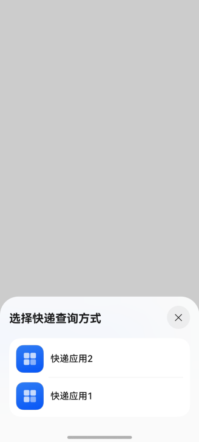

# 拉起快递类应用（startAbilityByType）

本章节介绍如何拉起快递类应用扩展面板。

例如，在消息类App中，用户收到快递单号，应用能够识别快递单号信息并提供快递查询的链接。用户点击链接后，应用将通过调用[UIAbilityContext.startAbilityByType](../reference/apis-ability-kit/js-apis-inner-application-uiAbilityContext.md#uiabilitycontextstartabilitybytype11)或[UIExtensionContentSession.startAbilityByType](../reference/apis-ability-kit/js-apis-app-ability-uiExtensionContentSession.md#uiextensioncontentsessionstartabilitybytype11)接口，拉起快递类应用的扩展面板。面板上将展示设备上所有支持快递查询的应用，供用户选择并跳转至所需应用。

## 快递类应用扩展面板参数说明

startAbilityByType接口中type字段为express，支持查询快递意图，对应的wantParam参数如下：


| 参数名    | 类型   | 必填 | 说明                                   |
| --------- | ------ | ---- | -------------------------------------- |
| sceneType | number | 否   | 意图，默认为1，查询快递填场景填1或不填。 |
| expressNo | string | 是   | 快递单号。                               |


## 拉起方开发步骤

1. 导入ohos.app.ability.common模块。 
    ```ts
    import { common } from '@kit.AbilityKit';
    ```
2. 构造接口参数并调用startAbilityByType接口。 
   
    ```ts
    let context = getContext(this) as common.UIAbilityContext;
        let wantParam: Record<string, Object> = {
        'sceneType': 1,
        'expressNo': 'SF123456'
        };
        let abilityStartCallback: common.AbilityStartCallback = {
        onError: (code: number, name: string, message: string) => {
            console.log(`onError code ${code} name: ${name} message: ${message}`);
        },
        onResult: (result)=>{
            console.log(`onResult result: ${JSON.stringify(result)}`);
        }
        }
        
        context.startAbilityByType("express", wantParam, abilityStartCallback, 
            (err) => {
                if (err) {
                    console.error(`startAbilityByType fail, err: ${JSON.stringify(err)}`);
                } else {
                    console.log(`success`);
                }
        });

    ```
    
    效果示例图：    
    

## 目标方开发步骤

1. 在module.json5中配置[uris](../quick-start/module-configuration-file.md#skills标签)，步骤如下：
    1. 设置linkFeature属性以声明当前应用支持的特性功能，从而系统可以从设备已安装应用中找到当前支持该特性的应用，取值范围如下：
        | 取值         | 含义                 |
        | ------------ | -------------------- |
        | QueryExpress | 声明应用支持快递查询。 |
    2. 设置scheme、host、port、path/pathStartWith属性，与Want中URI相匹配，以便区分不同功能。
        ```json
        {
            "abilities": [
                {
                    "skills": [
                        {
                            "uris": [
                                {
                                    "scheme": "express",
                                    "host": "queryExpress",
                                    "path": "",
                                    "linkFeature": "QueryExpress"
                                }
                            ]
                        }
                    ]
                }
            ]
        }
        ```

2. 解析参数并做对应处理。

    ```ts
    UIAbility::onCreate(want: Want, launchParam: AbilityConstant.LaunchParam): void
    ```

    在参数**want.uri**中会携带目标方配置的linkFeature对应的uri;

    在参数**want.parameters**中会携带Caller方传入的参数，如下所示：
    
    | 参数名    | 类型   | 必填 | 说明     |
    | --------- | ------ | ---- | -------- |
    | expressNo | string | 是   | 快递单号。 |

    

**完整示例：**

```ts
import { AbilityConstant, UIAbility, Want } from '@kit.AbilityKit';
import { hilog } from '@kit.PerformanceAnalysisKit';
import { window } from '@kit.ArkUI';

const TAG = 'EntryAbility'

export default class EntryAbility extends UIAbility {
    windowStage: window.WindowStage | null = null;

    uri?: string;
    expressNo?: string;

    onCreate(want: Want, launchParam: AbilityConstant.LaunchParam): void {
        hilog.info(0x0000, TAG, `onCreate, want=${JSON.stringify(want)}`);
        super.onCreate(want, launchParam);
        this.parseWant(want);
    }

    onNewWant(want: Want, launchParam: AbilityConstant.LaunchParam): void {
        hilog.info(0x0000, TAG, `onNewWant, want=${JSON.stringify(want)}`);
        super.onNewWant(want, launchParam);
        this.parseWant(want);
        if (!this.windowStage) {
            hilog.error(0x0000, TAG, 'windowStage is null');
            this.context.terminateSelf();
            return;
        }
        this.loadPage(this.windowStage);
    }

    private parseWant(want: Want): void {
        this.uri = want.uri as string | undefined;
        this.expressNo = want.parameters?.expressNo as string | undefined;
    }

    private loadPage(windowStage: window.WindowStage): void {
        hilog.info(0x0000, TAG, `loadPage, uri=${this.uri}`);
        if (this.uri === 'express://queryExpress') {
            // 构建快递查询参数
            const storage: LocalStorage = new LocalStorage({
                "expressNo": this.expressNo
            } as Record<string, Object>);
            // 拉起快递查询页面
            windowStage.loadContent('pages/QueryExpressPage', storage)
        } else {
            // 默认拉起首页
            windowStage.loadContent('pages/Index', (err) => {
                if (err.code) {
                    hilog.error(0x0000, TAG, 'Failed to load the content. Cause: %{public}s',
                        JSON.stringify(err) ?? '');
                    return;
                }
                hilog.info(0x0000, TAG, 'Succeeded in loading the content.');
            });
        }
    }

    onDestroy(): void {
        hilog.info(0x0000, TAG, `onDestroy`);
    }

    onWindowStageCreate(windowStage: window.WindowStage): void {
        hilog.info(0x0000, TAG, `onWindowStageCreate`);
        this.windowStage = windowStage;
        this.loadPage(this.windowStage);
    }

    onWindowStageDestroy(): void {
        hilog.info(0x0000, TAG, '%{public}s', 'Ability onWindowStageDestroy');
    }

    onForeground(): void {
        hilog.info(0x0000, TAG, '%{public}s', 'Ability onForeground');
    }

    onBackground(): void {
        hilog.info(0x0000, TAG, '%{public}s', 'Ability onBackground');
    }
}
```