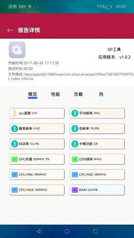

# SmartPerf性能工具使用指导

## 功能介绍

SmartPerf是一款基于系统开发的性能功耗测试工具，操作简单易用。工具可以检测性能、功耗相关指标，包括FPS、CPU、GPU、RAM、Trace、Temp等，通过量化的指标项帮忙了解游戏性能状况。在开发过程中，使用的可能是有屏或无屏设备，对此SmartPerf提供了两种方式：分别是SmartPerf-Device和SmartPerf-Daemon。SmartPerf-Device适用于有屏设备，支持可视化操作。测试时是通过悬浮窗的开始和暂停来实时展示性能指标数据，保存后可生成数据报告，在报告中可分析各指标数据详情。SmartPerf-Daemon支持shell命令行方式，适用于无屏设备。

- CPU：衡量应用占用CPU资源的情况，占用过多的CPU资源会出现芯片发烫的现象。每秒读取一次设备节点下各CPU的频点信息和负载信息。
- GPU：衡量应用占用GPU资源的情况，占用过多的GPU资源同样会出现芯片发烫的现象。每秒读取一次设备节点下各GPU的频点信息和负载信息。
- DDR：每秒读取一次设备节点下各DDR的频点信息。
- FPS：衡量游戏画面的流畅度，帧率越高，流畅度越高。应用界面每秒真实的刷新次数。
- POWER：每秒读取一次设备节点下的电流信息、电池的电压信息。
- TEMP： 每秒读取一次设备的soc温度等信息，异常的温度不仅带来不好的用户体验，还会存在其它安全隐患。
- RAM：衡量应用的内存占比情况。每秒读取一次应用进程的实际物理内存。
- TRACE：当帧绘制时间超过100ms以上会自动抓取trace，1min内抓取1次。
- 屏幕截图：每秒截取一张应用界面截图。

## 实现原理

下图展示了SmartPerf工具的主要功能组成。Device设置好采集项和采集参数后，启动应用，FPS、RAM、Trace等指标通过消息发送给Daemon端，Daemon端进行数据采集、持久化和数据分析，将生成的报告回传给Device，Device进行可视化显示。


## 约束与限制

1.SmartPerf-Device、SmartPerf-Daemon在API 9版本开始预置使用。

2.SmartPerf-Device需在有屏幕设备使用，SmartPerf-Daemon执行需连接硬件设备。

3.SmartPerf-Daemon执行前需完成[hdc环境配置](https://gitee.com/openharmony/developtools_hdc)。

## 执行性能测试

### SmartPerf-Device

下面的操作步骤和界面内容以RK3568设备为例。

1.获取应用列表和设置采集项。

点击设备上"SmartPerf-Device"应用图标，进入"首页"，点击"请选择一个应用"，在应用列表页选择需要测试的应用。


2.设置采集参数。

应用选择完成后回到开始测试页面，根据实际业务需要，配置"测试指标"。同时，可修改测试名称（测试名称包含测试的应用名称和测试时间，会呈现在报告列表中），是否抓取trace，选择是否开启截图。配置完成后，点击底部"开始测试"按钮。

3.悬浮窗控制采集。

点击悬浮窗"start"开始采集，点击悬浮窗"计时器"（如下图中00:07）暂停采集。再次点击"计时器"，继续开始采集。双击"计时器"，实时展示采集数据。长按"计时器"，结束采集。<br>整个过程中，可拖动悬浮框调整悬浮框位置。


4.查看报告。

点击"报告"，查看测试报告列表。点击项目，进入报告详情页，查看测试指标项详情。




### SmartPerf-Daemon

**命令参数**

| 命令   | 功能                   |必选|
| :-----| :--------------------- |:-----|
| -N    | 设置采集次数(一秒采集一次)             |是|
| -PKG  | 设置包名                | 否|
| -c    | 采集cpu             | 否|
| -g    | 采集gpu             |否|
| -f    | 采集指定应用的fps             |否|
| -t    | 采集温度             |否|
| -p    | 采集电流             |否|
| -r    | 采集内存             |否|
| -snapshot | 截图 |否|
| -net | 采集网络速率 |否|
| -start | 开始采集 |否|
| -stop | 结束采集 |否|
| -VIEW | 设置图层 |否|
| -profilerfps | 采集fps |否|

**命令行使用示例**

1.Win + R 打开命令行窗口，进入shell下。

```
C:\Users\issusser>hdc shell  // 使用示例
#
```

2.拉起daemon进程。

```
C:\Users\issusser>hdc shell
# SP_daemon
#
```

3.查看daemon进程是否存在

```
C:\Users\issusser>hdc shell
# SP_daemon
# ps -ef | grep SP_daemon
root          1584     1 0 21:50:05 ?     00:00:00 SP_daemon
root          1595  1574 3 21:51:02 pts/0 00:00:00 grep SP_daemon
#
```

4.执行查看帮助命令。

```
# SP_daemon --help
usage: SP_daemon <options> <arguments>
--------------------------------------------------------------------
These are common commands list:
 -N             set the collection times, for example: -N 10
 -PKG           set package name, must add, for example: -PKG ohos.samples.ecg
 -c             get device cpuFreq and cpuUsage, process cpuUsage and cpuLoad ..
 -g             get device gpuFreq and gpuLoad
 -f             get app refresh fps and fps jitters
 -t             get soc-temp gpu-temp ..
 -p             get current_now and voltage_now
 -r             get process memory and total memory ..
 -snapshot      get screen capture
 -net           get networkUp and networkDown
 -start         collection start command
 -stop          collection stop command
 -VIEW          set layer
 -profilerfps   get fps and fps jitters
--------------------------------------------------------------------
Example 1: SP_daemon -N 20 -c -g -t -p -r -net -snapshot
--------------------------------------------------------------------
---------------------------------------------------------------------------------------
Example 2: SP_daemon -N 20 -PKG ohos.samples.ecg -c -g -t -p -f -r -net -snapshot
---------------------------------------------------------------------------------------


command exec finished!
#
```
5.采集启停服务

5.1 采集开启执行命令 

```
# SP_daemon -start -c
SP_daemon Collection begins
command exec finished!
#
```

5.2 采集结束执行命令 

```
$ SP_daemon -stop
SP_daemon Collection ended
Output Path: data/local/tmp/smartperf/1/t_index_info.csv
command exec finished!
$
```

6.执行采集命令。

6.1 采集2次整机CPU大中小核频率和各核使用率

```
# SP_daemon -N 2 -c

order:0 timestamp=1501923846459
order:1 cpu0Frequency=408000
order:2 cpu0Usage=7.142857
order:3 cpu0idleUsage=92.857143
order:4 cpu0ioWaitUsage=0.000000
order:5 cpu0irqUsage=0.000000
order:6 cpu0niceUsage=0.000000
order:7 cpu0softIrqUsage=0.000000
order:8 cpu0systemUsage=5.102041
order:9 cpu0userUsage=2.040816
...

command exec finished!
#
```
6.2 采集整机CPU大中小核频率、各核使用率以及进程CPU使用率、负载

```
# SP_daemon -N 2 -PKG com.huawei.hmos.browser -c

order:0 timestamp=1705043036099
order:1 ProcAppName=com.huawei.hmos.browser
order:2 ProcCpuLoad=0.008766
order:3 ProcCpuUsage=0.025100
order:4 ProcId=8815
order:5 ProcSCpuUsage=0.000000
order:6 ProcUCpuUsage=0.025100
order:7 cpu0Frequency=1430000
order:8 cpu0Usage=29.032258
order:9 cpu0idleUsage=70.967742
order:10 cpu0ioWaitUsage=0.000000
order:11 cpu0irqUsage=2.150538
order:12 cpu0niceUsage=0.000000
order:13 cpu0softIrqUsage=0.000000
order:14 cpu0systemUsage=15.053763
order:15 cpu0userUsage=11.827957
...

command exec finished!
#
```

6.3 采集1次整机GPU

```
# SP_daemon -N 1 -g

order:0 timestamp=1705041456507
order:1 gpuFrequency=279000000
order:2 gpuLoad=12.000000

command exec finished!
#
```

6.4 采集2次整机温度

```
# SP_daemon -N 2 -t

order:0 timestamp=1705042469378
order:1 Battery=36.000000
order:2 shell_back=38.962000
order:3 shell_frame=37.962000
order:4 shell_front=42.663000
order:5 soc_thermal=48.645000
order:6 system_h=38.277000

order:0 timestamp=1705042470389
order:1 Battery=36.000000
order:2 shell_back=38.962000
order:3 shell_frame=37.962000
order:4 shell_front=42.663000
order:5 soc_thermal=48.486000
order:6 system_h=38.277000

command exec finished!
#
```

6.5 采集1次整机电流和电压

```
# SP_daemon -N 1 -p

order:0 timestamp=1705041491090
order:1 currentNow=-255
order:2 voltageNow=4377614

command exec finished!
#
```

6.6 采集整机2次内存

```
# SP_daemon -N 2 -r
order:0 timestamp=1705041562521
order:1 memAvailable=7339224
order:2 memFree=7164708
order:3 memTotal=11641840

order:0 timestamp=1705041563527
order:1 memAvailable=7339136
order:2 memFree=7164684
order:3 memTotal=11641840

command exec finished!
#
 ```

6.7 采集2次整机和进程内存

```
# SP_daemon -N 2 -PKG com.huawei.hmos.settings -r

order:0 timestamp=1705041668525
order:1 memAvailable=7350856
order:2 memFree=7166896
order:3 memTotal=11641840
order:4 pss=107232

order:0 timestamp=1705041669527
order:1 memAvailable=7350852
order:2 memFree=7166896
order:3 memTotal=11641840
order:4 pss=107232

command exec finished!
#
```

6.8 采集2次截图

```
# SP_daemon -N 2 -snapshot

order:0 timestamp=1705041753321
order:1 capture=data/local/tmp/capture/screenCap_1705041753321.png

/data/local/tmp/capture created!

order:0 timestamp=1705041754324
order:1 capture=data/local/tmp/capture/screenCap_1705041754324.png

command exec finished!
#
```
注：截图报告存放路径data/local/tmp/capture
采集成功后：cd进入 data/local/tmp/capture  ls 查看生成的截图
导出截图：重启一个命令行工具执行如下命令：
hdc file recv data/local/tmp/ screenCap_1700725192774.png D:\

6.9 采集2次网络数据

```
# SP_daemon -N 2 -net

order:0 timestamp=1705041904832
order:1 networkDown=0
order:2 networkUp=0

order:0 timestamp=1705041905870
order:1 networkDown=22931
order:2 networkUp=2004

command exec finished!
#
```

6.10 采集5次指定应用帧率

```
# SP_daemon -N 5 -PKG com.huawei.hmos.settings -f

order:0 timestamp=1705306472232
order:1 fps=43
order:2 fpsJitters=602261688;;8352083;;8267708;;8305209;;8298437;;8308854;;8313542;;8569271;;8061458;;8300521;;8308333;;8309896;;8429167;;8241667;;8258333;;8318229;;8312500;;8304167;;41760937;;16418750;;8298959;;8319270;;8308334;;8313541;;8302605;;8320312;;8298958;;8326042;;8321354;;8301042;;8310417;;8309895;;8308855;;8331250;;8286458;;8343229;;8278125;;8311458;;8306250;;8312500;;8320834;;8346875;;8283333

order:0 timestamp=1705306473234
order:1 fps=40
order:2 fpsJitters=674427313;;8191145;;8310417;;8319271;;8301562;;8318750;;8302084;;8314062;;8333334;;8283854;;8307812;;8311979;;8310417;;8307813;;8309375;;8323958;;8306250;;8308333;;8317709;;8296875;;8721875;;7895833;;8320833;;8340625;;8276563;;8409896;;8216145;;8310938;;8301042;;8362500;;8252604;;8317708;;8376042;;8256250;;8292187;;8303125;;8313542;;8310417;;8520312;;8109375
...
command exec finished!
#
```

6.11 采集5次应用指定图层帧率

1> 获取应用图层名

```
# hidumper -s 10 -a surface | grep surface
 surface [DisplayNode] NodeId[6781753360410] LayerId[10]:
 surface [RCDTopSurfaceNode] NodeId[6781753360412] LayerId[12]:
 surface [RCDBottomSurfaceNode] NodeId[6781753360411] LayerId[11]:
#
```

2> 采集指定图层帧率

```
# SP_daemon -N 10 -VIEW DisplayNode -f
 order:0 timestamp=1705306822850
 order:1 fps=15
 order:2 fpsJitters=876291843;;8314062;;8308334;;8314583;;8310417;;8308333;;8326042;;8314583;;8292708;;8492709;;8143750;;8340104;;8294271;;8302604;;8297396
 
 order:0 timestamp=1705306823852
 order:1 fps=12
 order:2 fpsJitters=906667363;;8279167;;8311458;;8315625;;8291146;;8313021;;8323438;;8293750;;8303125;;8313541;;8301563;;8317708
 ...
#
```

6.12 全量采集示例1采整机

```
# SP_daemon -N 10 -c -g -t -p -snapshot -net -r

order:0 timestamp=1705042018276
order:1 cpu0Frequency=490000
order:2 cpu0Usage=33.000000
order:3 cpu0idleUsage=67.000000
order:4 cpu0ioWaitUsage=0.000000
order:5 cpu0irqUsage=1.000000
order:6 cpu0niceUsage=0.000000
order:7 cpu0softIrqUsage=0.000000
order:8 cpu0systemUsage=14.000000
order:9 cpu0userUsage=18.000000
...

command exec finished!
#
```

6.13 全量采集示例2

```
# SP_daemon -N 10 -PKG com.huawei.hmos.browser -c -g -t -p -f -snapshot -net -r

order:0 timestamp=1705307489445
order:1 ProcAppName=com.huawei.hmos.browser
order:2 ProcCpuLoad=0.000001
order:3 ProcCpuUsage=0.000000
order:4 ProcId=13131
order:5 ProcSCpuUsage=0.000000
order:6 ProcUCpuUsage=0.000000
order:7 cpu0Frequency=418000
order:8 cpu0Usage=27.884615
order:9 cpu0idleUsage=72.115385
order:10 cpu0ioWaitUsage=0.000000
order:11 cpu0irqUsage=0.961538
order:12 cpu0niceUsage=0.000000
order:13 cpu0softIrqUsage=0.000000
order:14 cpu0systemUsage=12.500000
order:15 cpu0userUsage=14.423077
...

command exec finished!
#
```

6.14 采集fps

```
# SP_daemon -profilerfps 10
set num:10 success
fps:0|1705307993492
fps:0|1705307994328
fps:0|1705307995338
fps:0|1705307996331
fps:72|1705307997444
fps:69|1705307998490
fps:67|1705307999479
fps:72|1705308000509
fps:70|1705308001510
fps:0|1705308002411

SP_daemon exec finished!
#
```

6.15 分时间段采集

```
# SP_daemon -profilerfps 10 -section 10
set num:10 success
fps:36|1705308148957
sectionsFps:0|1705308148957
sectionsFps:0|1705308149057
sectionsFps:0|1705308149157
sectionsFps:0|1705308149257
sectionsFps:10|1705308149372
sectionsFps:0|1705308149472
sectionsFps:0|1705308149572
sectionsFps:110|1705308149671
sectionsFps:120|1705308149763
sectionsFps:120|1705308149862
...

SP_daemon exec finished!
#
```


6.输出测试结果和查看测试结果。

- 测试结果默认输出路径：/data/local/tmp/data.csv。

- 查看文件位置
  ```
  # cd data/local/tmp
  # ls
  data.csv
  #
  ```

- 导出文件
  ```
  hdc file recv data/local/tmp/data.csv D:\
  ```
  ```
  C:\Users\issusser>hdc file recv data/local/tmp/data.csv D:\
  [I][2023-11-08 16:16:41] HdcFile::TransferSummary success
  FileTransfer finish, Size:429, File count = 1, time:6ms rate:71.50kB/s

  C:\Users\issusser>
  ```

- 打开data.csv查看数据

  在自定义导出路径里找到data.csv文件打开查看采集数据表，data.csv数据名描述如下

  | 被测数据项    | 含义             |备注|
  | :-----| :--------------------- |:-----|
  | cpuFrequency      | CPU大中小核频率        |单位Hz|
  | cpuUasge          | CPU各核使用率          |%|
  | cpuidleUsage      | CPU空闲态使用率        |%| 
  | cpuioWaitUsage    | 等待I/O的使用率        |%|
  | cpuirqUsage       | 硬中断的使用率         |%|  
  | cpuniceUsage      | 低优先级用户态使用率    |%|
  | cpusoftIrqUsage   | 软中断的使用率         |%| 
  | cpusystemUsage    | 系统/内核态使用率      |%|
  | cpuuserUsage      | 用户态使用率           |%| 
  | ProcId            | 进程id                |%|
  | ProcAppName       | app名                 |%| 
  | ProcCpuLoad       | 进程CPU负载占比        |%|
  | ProcCpuUsage      | 进程CPU使用率          |%| 
  | ProcUCpuUsage     | 进程用户态CPU使用率     |%|
  | ProcSCpuUsage     | 进程内核态CPU使用率     |%| 
  | gpuFrequ          | 整机GPU的频率          |%|
  | gpuLoad           | 整机GPU的负载占比      |%|
  | currentNow        | 当前读到的电流值       |单位mA| 
  | voltageNow        | 当前读到的电压值       |单位μV(微伏)| 
  | fps               | 屏幕刷新帧率          |单位fps|
  | fpsJitters        | 每一帧绘制间隔        |单位ns|
  | networkDown       | 下行速率              |单位B|
  | networkUp         | 上行速率              |单位B|
  | shell_front       | 前壳温度              |单位℃|
  | shell_frame       | 边框温度              |单位℃|
  | shell_back        | 后壳温度              |单位℃|
  | soc_thermal       | SOC温度              |单位°C|
  | system_h          | 系统温度             |单位°C|
  | Battery           | 电池温度             |单位°C|
  | memAvailable      | 整机可用内存         |单位B|
  | memFree           | 整机空闲内存         |单位B|
  | memTotal          | 整机总内存           |单位B|
  | pss               | 进程内存             |单位B|
  | timeStamp         | 当前时间戳           |对应采集时间| 
