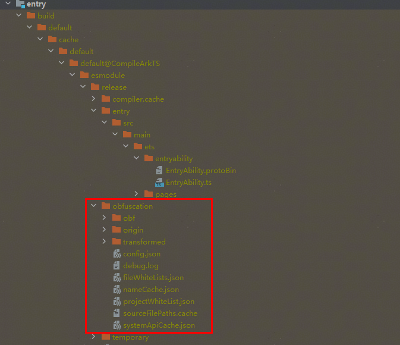
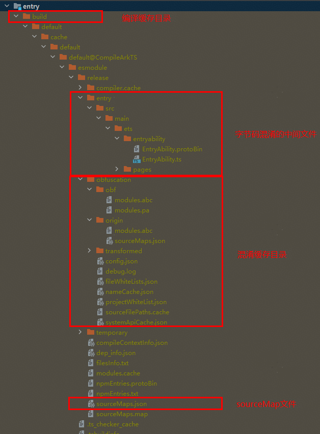

# ArkGuard字节码混淆开启指南
<!--Kit: ArkTS-->
<!--Subsystem: ArkCompiler-->
<!--Owner: @oatuwwutao-->
<!--Designer: @hufeng20-->
<!--Tester: @kirl75; @zsw_zhushiwei-->
<!--Adviser: @foryourself-->

> **注意**：
>
> 为了避免后续修改代码影响现网问题分析定位，建议开发者在版本发布时，本地备份build/default/cache/default/default@XXXCompileArkTS/esmodule/release/obfuscation 路径下的全部内容； 有条件的可以直接备份release目录。

## 字节码混淆开启步骤

### 开启混淆步骤

字节码混淆能力已在系统中集成，可通过以下方式在DevEco Studio开启使用。

* 开启混淆开关
    在本模块`build-profile.json5`配置文件中的`arkOptions.obfuscation.ruleOptions`字段中，通过`enable`字段配置是否开启混淆。

    ```txt
    "arkOptions": {
        "obfuscation": {
            "ruleOptions": {
                "enable": true,
                "files": ["./obfuscation-rules.txt"],
            }
        }
    }
    ```

    在files字段对应的混淆配置文件`obfuscation-rules.txt`中进行选项配置，需要手动修改，启用以下混淆项：

    ```txt
    -enable-bytecode-obfuscation  #开启后，字节码混淆才生效。
    -enable-bytecode-obfuscation-debugging  #控制是否输出调试信息，开启后会生成混淆日志，默认不开启。
    ```

    > **注**：字节码har被集成的时候，不会二次混淆。

* 配置混淆规则
    打开字节码混淆开关，仅开启默认混淆功能，默认混淆范围为非顶层作用域的函数、类。如需开启更多混淆功能，请在`files`字段指定的混淆配置文件`obfuscation-rules.txt`中进行选项配置。需要注意的是，不同版本的DevEco Studio，`obfuscation-rules.txt`文件中的默认值可能会有所不同。
    以DevEco Studio5.0.3.600及更高版本为例，混淆配置文件如下所示，该配置内容表示开启属性名称混淆、顶层作用域名称混淆、文件名混淆及导入导出名称混淆功能：

    ```txt
    -enable-property-obfuscation
    -enable-toplevel-obfuscation
    -enable-filename-obfuscation
    -enable-export-obfuscation
    ```

    开发者还可以使用#在混淆规则文件中进行注释，每行以`#`开头的文本会被当做是注释。使用方法如下，`#`后为注释内容：

    ```txt
    # options:
    -enable-property-obfuscation
    -enable-toplevel-obfuscation
    -enable-filename-obfuscation
    # -enable-export-obfuscation
    -keep-property-name # white list for dynamic property names
    ```

    混淆选项的配置推荐参考[混淆选项配置指导](#混淆选项配置指导)，混淆过程中涉及的所有配置文件的详情介绍请参考[三种混淆配置文件](#三种混淆配置文件)。

    > **说明：**
    >
    > 新建工程默认关闭混淆功能。如果开发者希望开启混淆，需要将模块的`build-profile.json5`文件中的`ruleOptions.enable`字段的值设置为`true`。同时需要将混淆规则配置文件`obfuscation-rules.txt`的`-enable-bytecode-obfuscation`、`-enable-bytecode-obfuscation-debugging`选项按需启用；此外，混淆规则配置文件中默认开启了四项推荐的混淆选项：`-enable-property-obfuscation`、`-enable-toplevel-obfuscation`、`-enable-filename-obfuscation`和`-enable-export-obfuscation`，开发者可以根据需要进一步修改混淆配置。

* 指定release编译
    字节码混淆当前仅支持release编译，不支持debug编译。即开启混淆开关后，若为release编译则会进行混淆，若为debug编译则不会进行混淆。开发者可参考[指定构建模式](https://developer.huawei.com/consumer/cn/doc/harmonyos-guides/ide-hvigor-compilation-options-customizing-guide#section192461528194916)查看和修改构建模式。

    > **注意**
    >
    > release编译与debug编译的区别并不只包含混淆，若需要明确应用行为差异是否由于混淆，应该通过开启或关闭混淆开关排查，而不是仅通过切换release或debug编译来区分。

### 三种混淆配置文件

* `obfuscation-rules.txt`
    不论是HAP、HAR还是HSP，在本模块的`build-profile.json5`配置文件中都有`arkOptions.obfuscation.ruleOptions.files`字段，用于指定在编译本模块时需要生效的混淆规则，新建工程时会创建默认文件`obfuscation-rules.txt`。

* `consumer-rules.txt`
    对于HAR和HSP模块，在`build-profile.json5`中包含`arkOptions.obfuscation.consumerFiles`字段，**用于指定当本包被依赖时，期望在其他模块生效的混淆规则**，新建HAR或HSP模块时会创建默认文件`consumer-rules.txt`。它与`obfuscation-rules.txt`字段的区别是：**`obfuscation-rules.txt`在编译本模块时生效，`consumer-rules.txt`在编译依赖本模块的其他模块时生效**。

    ```txt
    "arkOptions": {
        "obfuscation": {
            "ruleOptions": {
                "enable": true,
                "files": ["./obfuscation-rules.txt"],
        }
        "consumerFiles": ["./consumer-rules.txt"]
        }
    }
    ```

* `obfuscation.txt`
    不同于以上两种开发者可自行修改的配置文件，`obfuscation.txt`是在编译构建HAR或HSP时根据`consumer-rules.txt`和依赖模块的混淆规则文件自动生成的文件，它作为一种编译产物存在于发布的HAR或HSP包中，用于在其他应用使用该发布包时应用相应的混淆规则。`obfuscation.txt`内容的生成逻辑请参考[混淆规则合并策略](bytecode-obfuscation.md#混淆规则合并策略)。

    > **说明**
    >
    > 针对三方库中obfuscation.txt文件，只有在模块的oh-package.json5文件中依赖三方库时，三方库中的obfuscation.txt文件才会生效；如果在工程的oh-package.json5文件中进行依赖，则三方库的obfuscation.txt文件不会生效。

下表简要总结了三种配置文件的差异：

| 配置文件（示例） | 配置类型 |  是否可修改配置  |  是否影响本模块的混淆  |  是否影响其他模块的混淆  |
| --- | --- | --- | --- | --- |
| obfuscation-rules.txt | 自定义  | 是 | 是 | 否 |
| consumer-rules.txt    | 自定义  | 是 | 否 | 是 |
| obfuscation.txt       | 编译产物 | 不涉及，构建HAR或HSP时自动生成。 | 不涉及 | 是 |

### 混淆选项配置指导

1. 开启`-enable-toplevel-obfuscation`选项，如果代码中有globalThis访问全局变量，会出现访问失败的情况，需要使用`-keep-global-name`来保留此全局变量名称。
2. 待上述选项开启成功后，开启`-enable-property-obfuscation`
    1. 若代码中存在静态定义、动态访问的情况或者动态定义、静态访问的情况，需要使用`-keep-property-name`保留属性名称。示例：

        ```ts
        // 静态定义，动态访问：属性名在对象定义时是静态的，但访问时通过动态构建属性名（通常使用字符串拼接）来访问
       const obj = {
  	 		staticName: 5  // 静态定义属性
	   };
		const fieldName = 'static' + 'Name';  // 动态构建属性名
		console.info(obj[fieldName]);  // 使用方括号语法动态访问属性
        ```

        ```ts
        // 动态定义，静态访问：属性名通过动态表达式在对象定义时确定，但访问时直接使用点语法（假设你知道属性名的结果）
        const obj1 = {
 			['static' + 'Name1']: 5  // 动态定义属性
		};
		console.info(obj1.staticName1 + '');// 使用点语法静态访问属性
        ```

    2. 若代码中使用点语法访问未在ArkTS/TS/JS代码中定义的字段，比如访问native实现的so库，字段固定的json文件与数据库等场景：
        1. 若在代码中引用so库的api，如`import testNapi from 'library.so'`; `testNapi.foo()`;需要使用`-keep-property-name`，foo保留属性名称。
        2. 若在代码中使用json文件中的字段，需要使用`-keep-property-name`保留json文件中的字段名称。
        3. 若在代码中使用数据库相关的字段，需要使用`-keep-property-name`保留数据库中的字段名称。
    3. 若构建HAR模块并发布给其他模块使用的情况，要在HAR模块中的consumer-rules.txt文件中将不能被二次混淆的属性使用`-keep-property-name`保留。consumer-rules.txt文件在构建HAR时会生成obfuscation.txt文件。此HAR被其它模块依赖时，DevEco Studio会解析obfuscation.txt文件，读取文件中的白名单。
    4. 验证应用功能，排查遗漏的场景。若应用出现功能异常，依据混淆后的报错栈从对应的[中间产物](#查看混淆效果)中找到报错行的代码，排查需要配置的白名单并使用`-keep-property-name`进行保留。

3. 待上述选项应用适配成功后，开启`-enable-export-obfuscation`选项。此选项开启后以下场景需要适配：
    1. 若构建HSP模块，它会提供接口及其属性给其它模块调用，因此需要将对外接口使用`-keep-global-name`来保留、将对外暴露的class/interface等语法中的属性使用`-keep-property-name`保留。
    2. 若构建HAR模块并发布给其他模块使用的场景，要在HAR模块中的obfuscation-rules.txt文件中将对外接口使用`-keep-global-name`来保留、将对外暴露的class/interface等语法中的属性使用`-keep-property-name`保留。
    3. 若在代码中引用so库的api，如`import { napiA } from 'library.so'`；需要使用`-keep-global-name` napiA保留so接口名称。
    4. 验证应用功能以及模块被依赖时的接口调用功能，排查遗漏的场景。若应用出现功能异常，依据混淆后的报错栈从对应的[中间产物](#查看混淆效果)中找到报错行的代码，排查需要配置的白名单并进行保留。
4. 待上述选项应用适配成功后，开启`-enable-filename-obfuscation`选项。此选项开启后以下场景需要适配：
    1. 若代码中有动态import语句，如`const path = './filePath';  import (path)`，会出现文件引用失败的情况，需要使用`-keep-file-name`，filePath来保留这个文件名。
    2. 若应用中有描述路由表信息的[routerMap配置](https://developer.huawei.com/consumer/cn/doc/harmonyos-guides/module-configuration-file#routermap%E6%A0%87%E7%AD%BE)，其中的pageSourceFile字段标记页面在模块的路径，需要使用`-keep-file-name`来保留这个路径。
    3. 若代码中有传入ohmUrl进行页面跳转，如`router.pushUrl({url: '@bundle:com.example.routerPage/Library/Index'})`，使用`-keep-file-name`来保留这个路径。
    4. 验证应用功能，排查遗漏的场景。若应用出现功能异常，且报错栈中的路径为混淆后的路径，可以在模块中的`build/default/[...]/release/obfuscation/nameCache.json`文件中查询到原始路径，进而找到源码文件。另外，[插件hstack](https://developer.huawei.com/consumer/cn/doc/harmonyos-guides/ide-command-line-hstack)支持自动还原混淆后的报错堆栈。在定位到需要保留的路径后，使用`-keep-file-name`来保留此路径。

## 说明

* 目前不支持在hvigor构建流程中插入自定义混淆插件。

## 查看混淆效果

在混淆结束后会生成中间产物，因此可以在编译产物build目录中找到混淆后的中间产物以查看混淆效果，同时可以找到混淆生成的名称映射表及系统API白名单文件。

* 混淆名称映射表及系统API白名单目录：`build/default/[...]/release/obfuscation`。
* 名称映射表文件：`nameCache.json`，该文件记录了字节码名称混淆的映射关系。
* 系统API白名单文件：`systemApiCache.json`，该文件记录了SDK中的接口与属性名称，工程源码中与其重名的元素不会被混淆。
* obf目录：混淆后的modules.abc文件和modules.pa文件（开启`-enable-bytecode-obfuscation-debugging`后生成pa文件）。
* origin目录：混淆前的modules.abc文件。
* 配置信息文件：`config.json`，该文件记录了混淆的配置项和白名单列表。



## 报错栈还原

经过混淆的应用程序中代码名称会发生更改，crash时打印的报错栈更难以理解，因为报错栈与源码不完全一致。开发人员可使用DevEco Studio命令工具Command Line Tools中的[hstack插件](https://developer.huawei.com/consumer/cn/doc/harmonyos-guides/ide-command-line-hstack)来还原源码堆栈，进而分析问题。
反混淆工具需要使用应用编译过程中生成的sourceMaps.json文件以及混淆名称映射文件nameCache.json文件，因此请本地备份它们；为方便问题定位，建议备份release目录。


