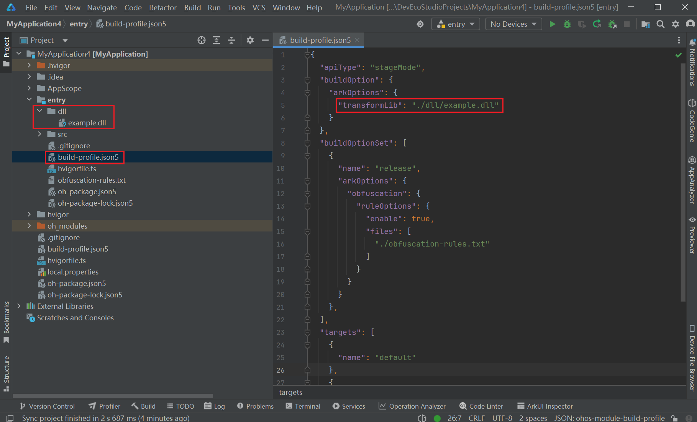

# 编译期自定义修改方舟字节码
<!--Kit: ArkTS-->
<!--Subsystem: arkcompiler-->
<!--Owner: @oatuwwutao-->
<!--SE: @hufeng20-->
<!--TSE: @kirl75; @zsw_zhushiwei-->

如果开发者希望自定义修改方舟字节码文件的内容，可以使用ArkTS编译工具链提供的方法自定义修改方舟字节码文件。

## 能力配置说明

准备一个操作方舟字节码文件的动态库文件，在工程的配置文件build-profile.json5中[配置编译选项transformLib](arkoptions-guide.md#transformlib)，选项值为这个动态库的路径，编译器会在指定的时机加载这个动态库，并且执行其中特定的Transform方法。

## 能力执行机制

如果配置了transformLib且对应的动态库文件能正确加载，编译器将先生成方舟字节码文件到默认目标位置，然后调用动态库中的Transform方法，并将方舟字节码文件的路径作为参数传入。Transform方法包含开发者自定义的修改逻辑，用于重新生成方舟字节码文件，同时更新字节码文件的落盘操作是由用户执行。

下面是一个动态库的模板，开发者可根据需求实现Transform的具体逻辑。

## 开发示例

1. 创建自定义修改动态库的源码。

   example.cpp：

   ```c++
   /**
    * @brief 方舟字节码文件修改的入口方法
    * @param abc_path 待处理的方舟字节码文件的存储路径
    */
   extern "C" int Transform(const char *abc_path)
   {
       // 开发者可以在这里读取abc_path对应的方舟字节码文件，然后根据方舟字节码的格式去修改相关数据，然后再重新生成方舟字节码文件
       return 0;
   }
   ```

2. 使用c语言编译工具（这里使用g++）编译动态库。

   Windows平台：

   ```
   g++ --shared -o example.dll example.cpp
   ```

   Linux平台：

   ```
   g++ --shared -o example.so example.cpp
   ```

   Mac平台：

   ```
   g++ --shared -o example.so example.cpp
   ```

3. 在DevEco Studio中配置build-profile.json5的transformLib选项（以windows环境为例）。

   选项中配置的路径为步骤2生成的链接库文件在项目中的路径（这里是dll目录下）。

   

4. 重新编译项目，即可完成自定义修改方舟字节码。
