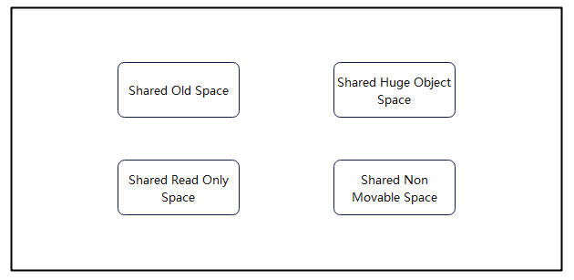

# GC垃圾回收

GC（全称 Garbage Collection），即垃圾回收。在计算机领域，GC就是找到内存中的垃圾，释放和回收内存空间。当前主流编程语言实现的GC算法主要分为两大类：引用计数和对象追踪（即Tracing GC）。ArkTS运行时基于分代模型（年轻代/老年代），混合使用引用计数和对象追踪算法，并行并发化执行GC任务，从而实现不同场景下的高性能内存回收表现。

在ArkTS中，数据类型分为两类，简单类型和引用类型。简单类型内容直接保存在栈（Stack）中，由操作系统自动分配和释放。引用类型保存在堆（heap）中，需要引擎进行手动释放。GC就是针对堆空间的内存自动回收的管理机制。

## Heap结构及其配置参数

### Heap结构


- SemiSpace：年轻代（Young Generation），存放新创建出来的对象，存活率低，主要使用copying算法进行内存回收。
- OldSpace：老年代（Old Generation），存放年轻代多次回收仍存活的对象会被复制到该空间，根据场景混合多种算法进行内存回收。
- HugeObjectSpace：大对象空间，使用单独的region存放一个大对象的空间。
- ReadOnlySpace：只读空间，存放运行期间的只读数据。
- NonMovableSpace：不可移动空间，存放不可移动的对象。
- SnapshotSpace：快照空间，转储堆快照时使用的空间。
- MachineCodeSpace：机器码空间，存放程序机器码。

注：每个空间会有一个或多个region进行分区域管理，region是空间向内存分配器申请的单位。

### 相关参数

> **注意：**
> 
> 以下参数未提示可配置的均为不可配置项，由系统自行设定。

以下参数值有多个阶段划分的对应heap总大小64MB-128MB/128MB-256MB/大于256MB三个阶段的范围情况，剩余内存空间充足的情况下默认均为第三段大于256MB情况。

#### Semi Space

heap中会生成两个Semi Space供copying使用。

| 参数名称 | 范围 | 作用 |
| --- | --- | :--- |
| semiSpaceSize | 2MB-4MB/2MB-8MB/2MB-16MB | semispace空间大小，会根据堆总大小有不同的范围限制 |
| semiSpaceTriggerConcurrentMark | 1M/1.5M/1.5M| 首次单独触发Semi Space的并发mark的界限值，超过该值则触发 |
| semiSpaceStepOvershootSize| 2MB | 允许过冲最大大小 |

#### 其他空间

| 参数名称 | 范围 | 作用 |
| --- | --- | :--- |
| defaultReadOnlySpaceSize | 256 KB | ReadOnlySpace默认空间大小 |
| defaultNonMovableSpaceSize | 2 MB/6 MB/64 MB | NonMovableSpace默认空间大小|
| defaultSnapshotSpaceSize | 512 KB/512 KB/ 4 MB | SnapshotSpace默认空间大小|
| defaultMachineCodeSpaceSize | 2 MB/2 MB/8 MB | MachineCodeSpace默认空间大小|

#### Old Space 和 Huge Object Space

初始化时都设定为Heap剩余未分配空间的大小。

| 参数名称 | 范围 | 作用 |
| --- | --- | :--- |
| oldSpaceOvershootSize | 4MB/8MB/8MB | oldSpace允许过冲最大大小 |

#### 堆大小相关参数

| 参数名称 | 范围 | 作用 |
| --- | --- | :--- |
| HeapSize | 448MB-1024MB | 堆总大小，实际系统分配大小根据堆类型不同分配不同，或内存池不够会降低下限 |
| SemispaceSize | 2MB-4MB/2MB-8MB/2MB-16MB | semispace空间大小 |
| NonmovableSpaceSize | 2MB/6MB/64MB | nonmovableSpace空间大小 |
| SnapshotSpaceSize | 512KB | 快照空间大小 |
| MachineCodeSpaceSize | 2MB | 机器码空间大小 |

#### worker线程堆上限

| 参数名称 | 范围 | 作用 |
| --- | --- | --- |
| heapSize  | 768 MB | work类型heap空间大小 |

#### 解释器栈大小

| 参数名称 | 范围 | 作用 |
| --- | --- | --- |
| maxStackSize | 128KB | 控制解释器栈帧大小 |

#### 并发参数

| 参数名称 | 值 | 作用 |
| --- | ---: | --- |
| gcThreadNum | 7 | gc线程数量，默认为7，可通过`gc-thread-num`参数自行设定该参数值 |
| MIN_TASKPOOL_THREAD_NUM | 3 | 线程池最小线程数 |
| MAX_TASKPOOL_THREAD_NUM | 7 | 线程池最大线程数 |

注：该线程池主要用于执行GC流程中的并发任务，实际线程池初始化综合参考gcThreadNum以及线程上下限，gcThreadNum为负值时初始化线程池线程数 = CPU核心数/2

#### 其他参数

| 参数名称 | 值 | 作用 |
| --- | --- | --- |
| minAllocLimitGrowingStep | 2M/4M/8M | heap整体重新计算空间大小限制时，控制oldSpace、heapObject和globalNative的最小增长步长 |
| minGrowingStep | 4M/8M/16M | 调整oldSpace的最小增长步长 |
| longPauseTime | 40ms | 判断是否为超长GC界限，超长GC会触发完整GC日志信息打印，方便开发者定位分析。可通过`gc-long-paused-time`进行配置 |

### 其他：新增单VM内ArrayBuffer的native总内存上限为4GB

## GC流程


### HPP GC

HPP GC（High Performance Partial Garbage Collection）,即高性能部分垃圾回收，其中“High Performance”主要三方面，包含分代模型、混合算法和GC流程优化，以下主要是对HPP GC的流程中的一些具体策略的介绍。

#### Young GC

- **触发机制：** 年轻代GC触发阈值在2MB-16MB变化,根据分配速度和存活率等会变化。
- **说明：** 主要回收semi space新分配的年轻代对象。
- **场景：** 前台场景
- **日志关键词：** [ HPP YoungGC ]

#### Old GC

- **触发机制：** 老年代GC触发阈值在20MB-300多MB变化，大部分情况，第一次Old GC的阈值在20M左右，之后会根据对象存活率，内存占用大小进行阈值调整。
- **说明：** 对年轻代和部分老年代空间做整理压缩，其他空间做sweep清理。触发频率比年轻代GC低很多，由于会做全量mark，因此GC时间会比年轻代GC长，单次耗时约5ms~10ms。
- **场景：** 前台场景
- **日志关键词：**[ HPP OldGC ]

#### Full GC

- **触发机制：** 不会由内存阈值触发。应用切换后台之后，如果预测能回收的对象尺寸大于2M会触发一次Full GC。DumpHeapSnapshot 和 AllocationTracker 工具默认会触发Full GC。Native 接口和JS/TS 也有接口可以触发。
- **说明：** 会对年轻代和老年代做全量压缩，主要用于性能不敏感场景，最大限度回收内存空间。
- **场景：** 后台场景
- **日志关键词：**[ CompressGC ]

此后的Smart GC或者 IDLE GC 都是在上述三种GC中做选择。

### 触发策略

#### 空间阈值触发GC

- 函数方法：`AllocateYoungOrHugeObject`，`AllocateHugeObject`等分配函数
- 限制参数：对应的空间阈值
- 说明：对象申请空间到达对应空间阈值时触发GC
- 典型日志：日志可区分GCReason::ALLOCATION_LIMIT

#### native绑定大小达到阈值触发GC

- 函数方法：`GlobalNativeSizeLargerThanLimit`
- 限制参数：`globalSpaceNativeLimit`
- 说明：影响是否进行全量mark，以及是否开始并发mark

#### 切换后台触发GC

- 函数方法：`ChangeGCParams`
- 说明：切换后台主动触发一次Full GC
- 典型日志：`app is inBackground`，`app is not inBackground`
  GC 日志中可区分GCReason::SWITCH_BACKGROUND

### 执行策略

#### ConcurrentMark

- 函数方法：`TryTriggerConcurrentMarking`
- 说明：尝试触发并发mark，将遍历对象进行标记的任务交由线程池中并发运行，减少主线程挂起时间。
- 典型日志：`fullMarkRequested`,`trigger full mark`,`Trigger the first full mark`,`Trigger full mark`,`Trigger the first semi mark`,`Trigger semi mark`

#### new space GC前后的阈值调整

- 函数方法：`AdjustCapacity`
- 说明： 在GC后调整SemiSpace触发水线，优化空间结构。
- 典型日志：无直接日志，可以通过GC统计日志看出，GC前 young space 的阈值有动态调整。

#### 第一次OldGC后阈值的调整

- 函数方法：`AdjustOldSpaceLimit`
- 说明：根据最小增长步长以及平均存活率调整OldSpace阈值限制
- 典型日志：`"AdjustOldSpaceLimit oldSpaceAllocLimit_: " << oldSpaceAllocLimit << " globalSpaceAllocLimit_: " << globalSpaceAllocLimit_;`

#### 第二次及以后的OldGC对old Space/global space阈值调整，以及增长因子的调整

- 函数方法：`RecomputeLimits`
- 说明：根据当前GC统计的数据变化重新计算调整`newOldSpaceLimit`，`newGlobalSpaceLimit`，`globalSpaceNativeLimit`和增长因子
- 典型日志：`"RecomputeLimits oldSpaceAllocLimit_: " << newOldSpaceLimit_ << " globalSpaceAllocLimit_: " << globalSpaceAllocLimit_ << " globalSpaceNativeLimit_:" << globalSpaceNativeLimit_;`

#### PartialGC的Cset 选择策略

- 函数方法：`OldSpace::SelectCSet()`
- 说明：PartialGC执行时采用该策略选择存活对象数量少，回收代价小的Region优先进行GC。
- 典型日志：`Select CSet failure: number is too few`,
  `"Max evacuation size is 6_MB. The CSet region number: " << selectedRegionNumber;`,
  `"Select CSet success: number is " << collectRegionSet_.size();`

## SharedHeap

### SharedHeap结构



- SharedOldSpace：共享老年代空间（这里并不区分年轻代老年代），存放一般的共享对象。
- SharedHugeObjectSpace：共享大对象空间，使用单独的region存放一个大对象的空间。
- SharedReadOnlySpace：共享只读空间，存放运行期间的只读数据。
- SharedNonMovableSpace：共享不可移动空间，存放不可移动的对象。

注：SharedHeap主要用于线程间共享使用的对象，提高效率并节省内存的产物。共享堆并不单独属于某个线程，保存具有共享价值的对象，存活率会更高，去除了SemiSpace的类型。

## 特性

### Smart GC

#### 特性介绍

在应用性能敏感场景，通过将js线程(SmartGC对worker线程和taskpool线程不生效)GC触发水线临时调整到js堆最大值（js线程默认448MB），尽量避免触发GC导致应用掉帧。如果敏感场景持续时间过久，对象分配已经达到了堆最大值，则还是会触发GC，且这次GC由于积累的对象太多，GC时间会相对较久。

#### 支持敏感场景

- 应用冷启动（默认支持）
- 应用滑动
- 应用点击页面跳转
- 超长帧

当前该特性使能由系统侧进行管控，三方应用暂无接口直接调用。

日志关键词: “SmartGC”

#### 交互流程


标记性能敏感场景，在进入和退出性能敏感场景时，在堆上标记，避免不必要的GC，维持高性能表现。

## 日志解释

### 典型日志

```
// GC前对象实际占用大小（region实际占用大小）->GC后对象实际占用大小（region实际占用大小），总耗时（+concurrentMark耗时），GC触发原因。
C03F00/ArkCompiler: [gc]  [ CompressGC ] 26.1164 (35) -> 7.10049 (10.5) MB, 160.626(+0)ms, Switch to background
// GC运行时的各种状态以及应用名称
C03F00/ArkCompiler: [gc] IsInBackground: 1; SensitiveStatus: 0; OnStartupEvent: 0; BundleName: com.huawei.hmos.filemanager;
// GC运行时的各阶段耗时统计
C03F00/ArkCompiler: [gc] /***************** GC Duration statistic: ****************/
C03F00/ArkCompiler: [gc] TotalGC:                 160.626 ms
C03F00/ArkCompiler: Initialize:              0.179   ms
C03F00/ArkCompiler: Mark:                    159.204 ms
C03F00/ArkCompiler: MarkRoots:               6.925   ms
C03F00/ArkCompiler: ProcessMarkStack:        158.99  ms
C03F00/ArkCompiler: Sweep:                   0.957   ms
C03F00/ArkCompiler: Finish:                  0.277   ms
// GC后各个部分占用的内存大小
C03F00/ArkCompiler: [gc] /****************** GC Memory statistic: *****************/
C03F00/ArkCompiler: [gc] AllSpaces        used:  7270.9KB     committed:   10752KB
C03F00/ArkCompiler: ActiveSemiSpace  used:       0KB     committed:     256KB
C03F00/ArkCompiler: OldSpace         used:  4966.9KB     committed:    5888KB
C03F00/ArkCompiler: HugeObjectSpace  used:    2304KB     committed:    2304KB
C03F00/ArkCompiler: NonMovableSpace  used:       0KB     committed:    2304KB
C03F00/ArkCompiler: MachineCodeSpace used:       0KB     committed:       0KB
C03F00/ArkCompiler: HugeMachineCodeSpace used:       0KB     committed:       0KB
C03F00/ArkCompiler: SnapshotSpace    used:       0KB     committed:       0KB
C03F00/ArkCompiler: AppSpawnSpace    used: 4736.34KB     committed:    4864KB
C03F00/ArkCompiler: [gc] Anno memory usage size:  45      MB
C03F00/ArkCompiler: Native memory usage size:2.99652 MB
C03F00/ArkCompiler: NativeBindingSize:       0.577148KB
C03F00/ArkCompiler: ArrayBufferNativeSize:   0.0117188KB
C03F00/ArkCompiler: RegExpByteCodeNativeSize:0.280273KB
C03F00/ArkCompiler: ChunkNativeSize:         19096   KB
C03F00/ArkCompiler: [gc] Heap alive rate:         0.202871
// 该虚拟机的此类型GC的整体统计
C03F00/ArkCompiler: [gc] /***************** GC summary statistic: *****************/
C03F00/ArkCompiler: [gc] CompressGC occurs count  6
C03F00/ArkCompiler: CompressGC max pause:    2672.33 ms
C03F00/ArkCompiler: CompressGC min pause:    160.626 ms
C03F00/ArkCompiler: CompressGC average pause:1076.06 ms
C03F00/ArkCompiler: Heap average alive rate: 0.635325
```

- gc类型：[HPP YoungGC]、[HPP OldGC]、[CompressGC]、[SharedGC]。
- TotalGC: 总耗时。其下相应为各个阶段对应的耗时，基本的包括`Initialize`、`Mark`、`MarkRoots`、`ProcessMarkStack`、`Sweep`、`Finish`，实际根据不同的GC流程不同会有不同的阶段。
- IsInBackground：是否在后台场景，1：为后台场景，0：非后台场景。
- SensitiveStatus：是否为敏感场景，1：为敏感场景，0：非敏感场景。
- OnStartupEvent：是否为冷启动场景，1：为冷启动场景，0：非冷启动场景。
- used：当前已分配的对象实际占用的内存空间大小。
- committed：当前实际分配给heap内存空间大小。因为各个空间是按region进行分配的，而region一般也不会被对象完全占满，因此committedSize大于等于usedSize，hugeSpace是会完全相等，因为其一个对象单独占一个region。
- Anno memory usage size：当前进程所有堆申请的内存大小，包括heap与sharedHeap。
- Native memory usage size：当前进程所申请的Native内存大小。
- NativeBindingSize：当前进程堆内对象绑定的Native内存大小。
- ArrayBufferNativeSize：当前进程申请的数组缓存Native内存大小。
- RegExpByteCodeNativeSize：当前进程申请的正则表达式字节码Native内存大小。
- ChunkNativeSize：当前进程申请的ChunkNative内存大小。
- Heap alive rate：堆内对象的存活率。

## GC开发者调试接口

> **注意：**
> 以下接口仅供调试使用，非正式对外SDK接口，不应在应用正式版本中使用。

### ArkTools.hintGC()

- 调用方式：`ArkTools.hintGC()`
- 接口类型：js接口
- 作用：调用后由VM主动触发判断当前是否适合进行一次full GC。后台场景、内存预期存活率低于设定值，则会触发，判断为敏感状态则不会触发。
- 使用场景：开发者提示系统进行GC
- 典型日志：无直接日志，仅可区分外部触发（`GCReason::TRIGGER_BY_JS`）


使用参考

```
// 首先需要声明接口
declare class ArkTools {
     static hintGC(): void;
}

@Entry
@Component
struct Index {
  @State message: string = 'Hello World';
  build() {
  Row() {
    Column() {
      Text(this.message)
        .fontSize(50)
        .fontWeight(FontWeight.Bold)
      Button("触发HintGC").onClick((event: ClickEvent) => {
          ArkTools.hintGC();  //方法内直接调用
      })
    }
    .width('100%')
  }
  .height('100%')
}
}
```


