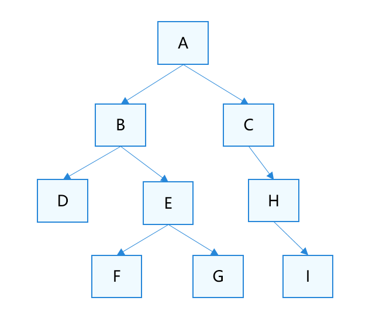

# 模块化运行简介

为了解决大型、复杂应用开发过程中，部分代码编译时被多次拷贝导致包体积增大、文件依赖、代码与资源共享困难以及单例和全局变量污染等问题，同时为了方便开发者代码编写与功能维护，ArkTS支持应用模块化编译打包运行。

模块化是指将 ArkTS/TS/JS拆分为多个模块（文件或片段），并通过编译工具或运行时机制将这些[模块加载](#模块化运行加载流程)、解析、组合并执行的过程。

其中ArtTS支持的模块类型有ets/ts/js文件、 json文件、Native模块，ArkTS中支持[ECMAScript模块规范](#ecmascript模块)及[CommonJS模块规范](#commonjs模块)，此外ArkTS也对加载方式进行了拓展，包含[动态加载](arkts-dynamic-import.md)、[延时加载](arkts-lazy-import.md)、[同步动态加载Native模块](js-apis-load-native-module.md)、[Node-API接口加载文件](load-module-base-nodeapi.md)。

## 模块化运行加载流程

ArkTS模块化运行根据ECMA规范实现，以后序遍历的方式执行模块：从模块图的最左侧子树开始，执行模块，然后执行它们的同级，然后执行它们的父级。此算法递归运行，直至执行到模块图的根。

以下图为例，每个父节点加载了对应子节点，并按照代码中的import顺序执行同级。下面的模块图文件执行顺序为：D-&gt;F-&gt;G-&gt;E-&gt;B-&gt;I-&gt;H-&gt;C-&gt;A。



其中A文件称为入口文件，即这个文件是一个执行起点。一些内置的加载接口如[windowStage.loadContent](../reference/apis-arkui/js-apis-window.md#loadcontent9)、[路由跳转](../ui/arkts-navigation-navigation.md)等页面拉起接口（即不是通过import写法拉起的文件），入参文件都会作为入口文件执行。

以A文件为入口，会加载一整套文件，包含A文件，A文件依赖的文件，这些文件后面依赖的文件，直到各分支叶节点。

## ArkTS支持的模块化规范

### ECMAScript模块

ECMAScript模块（ECMAScript Modules，后文称ES Module）是JavaScript自ECMAScript6.0之后，从标准层面（ECMAScript® 2025 Language Specification (tc39.es)）实现的模块功能。其模块功能由两个命令组成：export和import。

ArkTS中export和import用法详见[ArkTS语言介绍](../quick-start/introduction-to-arkts.md#模块)。

### CommonJS模块

CommonJS模块是JavaScript社区2009年提出的标准，首先在Node.js采用部分标准并实现。CommonJS将每个文件视为一个模块，通过module变量代表当前模块，module.exports即为该模块对外导出的变量，每个模块还拥有exports变量（exports === module.exports）。

导入导出写法参考下表：

| 加载类型 | 模块导入 | 模块导出（不能把module.exports与exports混用） |
| -------- | -------- | -------- |
| 变量 | const ohos = require('ohos') | exports.add = add<br/>module.exports.name = name |
| const ohos = require('ohos') | module.exports = add |
| 函数 | const ohos = require('ohos')<br/>ohos.fun(); | exports.fun = function foo () {}<br/>module.exports.fun = function foo () {} |

> **说明：**
>
> CommonJS模块只适用于第三方包导出，不支持开发者在工程中创建使用。


### CommonJS与ES Module支持规格

CommonJS与ES Module互相引用支持规格如下表所示，导入导出语法遵循各自模块的规范写法。
| 互相引用关系 | ES Module 导出 | CommonJS导出 |
| -------- | -------- | -------- |
| **ES Module 导入** | 支持 | 支持 |
| **CommonJS导入** | 不支持 | 支持 |

## ArkTS支持加载的模块类型

### ets/ts/js

针对ets/ts/js模块类型的加载遵循[ECMAScript模块规范](#ecmascript模块)及[CommonJS模块规范](#commonjs模块)。

### JSON文件

JSON（JavaScript Object Notation），是一种轻量级的数据交互格式，采用完全独立于编程语言的文本格式来存储和表示数据。

JSON文件只能使用default方式导入，如下所示：

```
import data from './example.json'
```

### Native模块

Native模块（so）的导入导出与加载ets/ts/js语法规格一致。

> **说明：**
>
> Native模块不支持在CommonJS模块中导入。

示例：

```
// libentry.so对应的index.d.ts
export const add: (a: number, b: number) => number;
```

```
// test.ets
import { add } from 'libentry.so'
add(2, 3)
```

**ArkTS当前限制**：不支持native模块导出和导入同时使用命名空间。

反例：

```
// test1.ets
export * from 'libentry.so'  // 使用命名空间导出
```

```
// test2.ets
import('./test1').then((ns:ESObject) => {
  // 动态加载无法获取ns对象
  // 如希望使用该方式加载Native模块，需将test1.ets中的导出变更为具名导出或默认导出
})
```

> **说明：**
>
> 不建议通过 import \* as xxx from 'xxx' 方式进行导入。该方式导入会产生运行时异常，建议使用默认导入。
