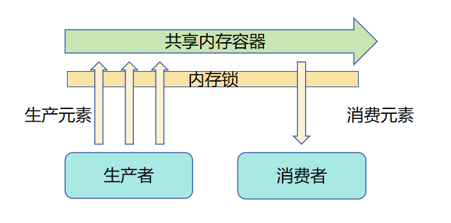
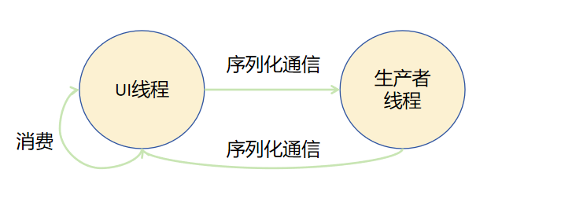

# 多线程并发概述

并发模型用于实现不同应用场景中的并发任务。常见的并发模型有基于内存共享的模型和基于消息通信的模型。

Actor并发模型是基于消息通信的并发模型的典型代表。它使开发者无需处理锁带来的复杂问题，并且具有较高的并发度，因此得到了广泛的应用。

当前ArkTS提供了TaskPool和Worker两种并发能力，两者均基于Actor并发模型实现。

Actor并发模型和内存共享并发模型的具体对比请见[多线程并发模型](#多线程并发模型)。

## 多线程并发模型

内存共享并发模型指多线程同时执行任务，这些线程依赖同一内存并且都有权限访问，线程访问内存前需要抢占并锁定内存的使用权，没有抢占到内存的线程需要等待其他线程释放使用权再执行。

Actor并发模型每一个线程都是一个独立Actor，每个Actor有自己独立的内存，Actor之间通过消息传递机制触发对方Actor的行为，不同Actor之间不能直接访问对方的内存空间。

Actor并发模型相较于内存共享并发模型，不同线程间的内存是隔离的，因此不会出现线程竞争同一内存资源的情况。开发者无需处理内存上锁相关的问题，从而提高开发效率。

Actor并发模型中，线程不共享内存，需通过线程间通信机制传递任务和结果。

本文以经典的生产者消费者问题为例，对比呈现这两种模型在解决具体问题时的差异。

### 内存共享模型

以下示例伪代码和示意图展示了如何使用内存共享模型解决生产者消费者问题。



为了避免不同生产者或消费者同时访问一块共享内存的容器时产生的脏读、脏写现象，同一时间只能有一个生产者或消费者访问该容器，也就是不同生产者和消费者争夺使用容器的锁。当一个角色获取锁之后其他角色需要等待该角色释放锁之后才能重新尝试获取锁以访问该容器。

```ts
// 此段示例为伪代码仅作为逻辑示意，便于开发者理解使用内存共享模型和Actor模型的区别
class Queue {
  // ...
  push(value: number) {}
 
  empty(): boolean {
    // ...
    return true
  }
 
  pop(value: number) :number {
    // ...
    return value;
  }
}
 
class Mutex {
  // ...
  lock(): boolean {
    // ...
    return true;
  }
 
  unlock() {
 
  }
}
class BufferQueue {
  queue: Queue = new Queue()
  mutex: Mutex = new Mutex()
  add(value: number) {
    // 尝试获取锁
    if (this.mutex.lock()) {
      this.queue.push(value)
      this.mutex.unlock()
    }
  }
 
  take(value: number): number {
    let res: number = 0;
    // 尝试获取锁
    if (this.mutex.lock()) {
      if (this.queue.empty()) {
        res = 1;
      }
      let num: number = this.queue.pop(value)
      this.mutex.unlock()
      res = num;
    }
    return res;
  }
}
 
// 构造一段全局共享的内存
let g_bufferQueue = new BufferQueue()
 
class Producer {
  constructor() {
  }
  run() {
    let value = Math.random()
    // 跨线程访问bufferQueue对象
    g_bufferQueue.add(value)
  }
}
 
class ConsumerTest {
  constructor() {
  }
  run() {
    // 跨线程访问bufferQueue对象
    let num = 123;
    let res = g_bufferQueue.take(num)
    if (res != null) {
      // 添加消费逻辑
    }
  }
}
 
function Main(): void {
  let consumer: ConsumerTest = new ConsumerTest()
  let producer1: Producer = new Producer()
  for (let i = 0;i < 0;i++) {
    // 模拟启动多线程执行生产任务
    // let thread = new Thread()
    // thread.run(producer.run())
    // consumer.run()
  }
}
```


### Actor模型

以下示例简单展示了如何使用基于Actor模型的TaskPool并发能力来解决生产者消费者问题。



Actor模型中，不同角色之间并不共享内存，生产者线程和UI线程都有自己的虚拟机实例，两个虚拟机实例之间拥有独占的内存，相互隔离。生产者生产出结果后，通过序列化通信将结果发送给UI线程，UI线程消费结果后再发送新的生产任务给生产者线程。

```ts
import { taskpool } from '@kit.ArkTS';

// 跨线程并发任务
@Concurrent
async function produce(): Promise<number> {
  // 添加生产相关逻辑
  console.info("producing...");
  return Math.random();
}

class Consumer {
  public consume(value: Object) {
    // 添加消费相关逻辑
    console.info("consuming value: " + value);
  }
}

@Entry
@Component
struct Index {
  @State message: string = 'Hello World'

  build() {
    Row() {
      Column() {
        Text(this.message)
          .fontSize(50)
          .fontWeight(FontWeight.Bold)
        Button() {
          Text("start")
        }.onClick(() => {
          let produceTask: taskpool.Task = new taskpool.Task(produce);
          let consumer: Consumer = new Consumer();
          for (let index: number = 0; index < 10; index++) {
            // 执行生产异步并发任务
            taskpool.execute(produceTask).then((res: Object) => {
              consumer.consume(res);
            }).catch((e: Error) => {
              console.error(e.message);
            })
          }
        })
        .width('20%')
        .height('20%')
      }
      .width('100%')
    }
    .height('100%')
  }
}
```

也可以等待生产者完成所有生产任务，通过序列化通信将结果发送给UI线程。UI线程接收完毕后，由消费者统一消费结果。

```ts
import { taskpool } from '@kit.ArkTS';

// 跨线程并发任务
@Concurrent
async function produce(): Promise<number> {
  // 添加生产相关逻辑
  console.info("producing...");
  return Math.random();
}

class Consumer {
  public consume(value: Object) {
    // 添加消费相关逻辑
    console.info("consuming value: " + value);
  }
}

@Entry
@Component
struct Index {
  @State message: string = 'Hello World'

  build() {
    Row() {
      Column() {
        Text(this.message)
          .fontSize(50)
          .fontWeight(FontWeight.Bold)
        Button() {
          Text("start")
        }.onClick(async () => {
          let dataArray = new Array<number>();
          let produceTask: taskpool.Task = new taskpool.Task(produce);
          let consumer: Consumer = new Consumer();
          for (let index: number = 0; index < 10; index++) {
            // 执行生产异步并发任务
            let result = await taskpool.execute(produceTask) as number;
            dataArray.push(result);
          }
          for (let index: number = 0; index < dataArray.length; index++) {
            consumer.consume(dataArray[index]);
          }
        })
        .width('20%')
        .height('20%')
      }
      .width('100%')
    }
    .height('100%')
  }
}
```

## TaskPool和Worker

ArkTS提供了TaskPool和Worker两种并发能力供开发者选择，各自的运作机制和注意事项请见[TaskPool简介](taskpool-introduction.md)和[Worker简介](worker-introduction.md)，两者之间实现的特点和适用场景也存在差异，请见[TaskPool和Worker的对比](taskpool-vs-worker.md)。