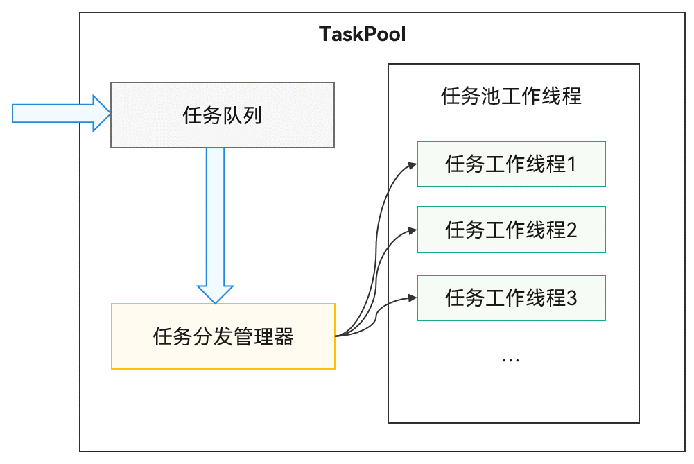

# TaskPool简介

任务池（TaskPool）作用是为应用程序提供一个多线程的运行环境，降低整体资源的消耗、提高系统的整体性能，且您无需关心线程实例的生命周期。具体接口信息及使用方法详情请见[TaskPool](../reference/apis-arkts/js-apis-taskpool.md)。

## TaskPool运作机制

**图1** TaskPool运作机制示意图

TaskPool支持开发者在主线程封装任务抛给任务队列，系统选择合适的工作线程，进行任务的分发及执行，再将结果返回给主线程。接口直观易用，支持任务的执行、取消，以及指定优先级的能力，同时通过系统统一线程管理，结合动态调度及负载均衡算法，可以节约系统资源。系统默认会启动一个任务工作线程，当任务较多时会扩容，工作线程数量上限跟当前设备的物理核数相关，具体数量内部管理，保证最优的调度及执行效率，长时间没有任务分发时会缩容，减少工作线程数量。

## TaskPool注意事项

- 实现任务的函数需要使用装饰器[\@Concurrent](arkts-concurrent.md)标注，且仅支持在.ets文件中使用。

- 从API version 11开始，实现任务的函数需要使用类方法时，该类必须使用装饰器[\@Sendable](arkts-sendable.md)标注，且仅支持在.ets文件中使用。

- 任务函数在TaskPool工作线程的执行耗时不能超过3分钟（不包含Promise和async/await异步调用的耗时，例如网络下载、文件读写等I/O任务的耗时），否则会被强制退出。

- 实现任务的函数入参需满足序列化支持的类型，详情请参见[TaskPool和Worker支持的序列化类型](serialization-support-types.md#TaskPool和Worker支持的序列化类型)。

- ArrayBuffer参数在TaskPool中默认转移，需要设置转移列表的话可通过接口[setTransferList()](../reference/apis-arkts/js-apis-taskpool.md#settransferlist10)设置。

- 由于不同线程中上下文对象是不同的，因此TaskPool工作线程只能使用线程安全的库，例如UI相关的非线程安全库不能使用，具体请见[多线程安全注意事项](multi-thread-safety.md)。

- 序列化传输的数据量大小限制为16MB。
- [Priority](../reference/apis-arkts/js-apis-taskpool.md#priority)的IDLE优先级是用来标记需要在后台运行的耗时任务（例如数据同步、备份。），它的优先级别是最低的。这种优先级标记的任务只会在所有线程都空闲的情况下触发执行，并且只会占用一个线程来执行。
