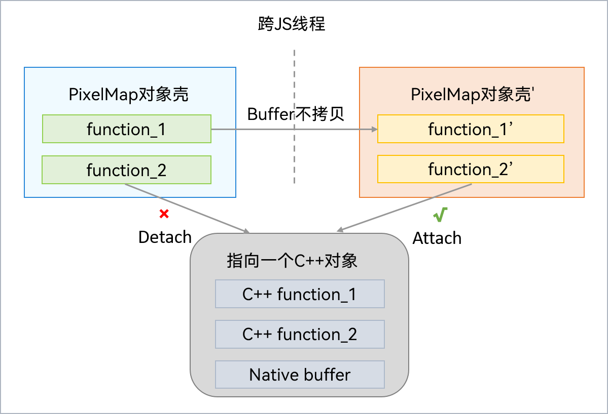

# Transferable对象（NativeBinding对象）


Transferable对象（也称为NativeBinding对象）指的是一个JS对象，绑定了一个C++对象，且主体功能由C++提供。跨线程传输时可以直接复用同一个C++对象，相比于JS对象的拷贝模式，传输效率较高。因此，可共享或转移的NativeBinding对象也被称为Transferable对象。


## 共享模式

如果C++实现能够保证线程安全性，则这个NativeBinding对象的C++部分可以支持共享传输。此时，NativeBinding对象跨线程传输后，只需要重新创建JS壳，就可以桥接到相同的C++对象上。通信过程如下图所示：


常见的共享模式NativeBinding对象包括Context，Context对象包含应用程序组件的上下文信息，它提供了一种访问系统服务和资源的方式，使得应用程序组件可以与系统进行交互。获取Context信息的方法可以参考[获取上下文信息](../application-models/application-context-stage.md)。

示例可参考[使用TaskPool进行频繁数据库操作](./batch-database-operations-guide.md#使用taskpool进行频繁数据库操作)。


## 转移模式

如果C++实现包含了数据，且无法保证线程安全性，则这个NativeBinding对象的C++部分需要采用转移方式传输。此时，NativeBinding对象跨线程传输后，只需要重新创建JS壳，就可以桥接到C++对象上，不过原对象需要移除对此对象的绑定关系。通信过程如下图所示：



常见的转移模式NativeBinding对象包括PixelMap，[PixelMap对象](../reference/apis-image-kit/js-apis-image.md#imagecreatepixelmap8)可以读取或写入图像数据以及获取图像信息，常用于在应用或系统中显示图片。

### 使用示例

这里提供了一个跨线程传递PixelMap对象的示例以帮助更好理解。首先获取rawfile文件夹中的图片资源，然后在子线程中创建PixelMap对象传递给主线程，具体实现如下：

```ts
// Index.ets
import { taskpool } from '@kit.ArkTS';
import { loadPixelMap } from './pixelMapTest';
import { BusinessError } from '@kit.BasicServicesKit';

@Entry
@Component
struct Index {
  @State message: string = 'Hello World';
  @State pixelMap: PixelMap | undefined = undefined;

  private loadImageFromThread(): void {
    const resourceMgr = getContext(this).resourceManager;
    // 此处‘startIcon.png’为media下复制到rawfile文件夹中，请开发者自行替换，否则imageSource创建失败会导致后续无法正常执行。
    resourceMgr.getRawFd('startIcon.png').then(rawFileDescriptor => {
      taskpool.execute(loadPixelMap, rawFileDescriptor).then(pixelMap => {
        if (pixelMap) {
          this.pixelMap = pixelMap as PixelMap;
          console.log('Succeeded in creating pixelMap.');
          // 主线程释放pixelMap。由于子线程返回pixelMap时已调用setTransferDetached，所以此处能够立即释放pixelMap。
          this.pixelMap.release();
        } else {
          console.error('Failed to create pixelMap.');
        }
      }).catch((e: BusinessError) => {
        console.error('taskpool execute loadPixelMap failed. Code: ' + e.code + ', message: ' + e.message);
      });
    });
  }

  build() {
    RelativeContainer() {
      Text(this.message)
        .id('HelloWorld')
        .fontSize(50)
        .fontWeight(FontWeight.Bold)
        .alignRules({
          center: { anchor: 'container', align: VerticalAlign.Center },
          middle: { anchor: 'container', align: HorizontalAlign.Center }
        })
        .onClick(() => {
          this.loadImageFromThread();
        })
    }
    .height('100%')
    .width('100%')
  }
}
```

```ts
// pixelMapTest.ets
import { image } from '@kit.ImageKit';

@Concurrent
export async function loadPixelMap(rawFileDescriptor: number): Promise<PixelMap> {
  // 创建imageSource。
  const imageSource = image.createImageSource(rawFileDescriptor);
  // 创建pixelMap。
  const pixelMap = imageSource.createPixelMapSync();
  // 释放imageSource。
  imageSource.release();
  // 使pixelMap在跨线程传输完成后，断开原线程的引用。
  pixelMap.setTransferDetached(true);
  // 返回pixelMap给主线程。
  return pixelMap;
}
```
