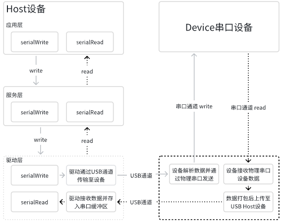

# USB串口通信服务开发概述

<!--Kit: USB Kit-->
<!--Subsystem: USB-->
<!--Owner: @hwymlgitcode-->
<!--Designer: @w00373942-->
<!--Tester: @dong-dongzhen-->
<!--Adviser: @w_Machine_cc-->

## 简介

USB串口通信服务主要提供USB Host设备转串口协议通信的功能，它提供获取遵循USB Host转串口标准协议的已连接的端口列表，同时提供打开端口、关闭端口、设置参数、获取参数、读取数据、写入数据和设备权限管理这些基本功能。

USB串口通信服务，配置管理请参考[USB串口配置管理](usbSerial-configuration.md)，通信管理请参考[USB串口通信管理](usbSerial-communication.md)。

### 基本概念

在进行USB串口通信服务开发时，开发者应了解以下基本概念：

- 串口
  
  即串行接口或串行通讯接口，是采用串行通信方式的扩展接口。串行接口中数据是一位一位地顺序传送。串口特点是通信线路简单，只要一对传输线就可以实现双向通信，适用于远距离通信。

### 实现原理

USB串口服务主要包括两个阶段：

- 识别设备并加载驱动。

  插入USB转串口设备后，USB Host设备通过USB总线发起枚举过程，获取设备描述符（如厂商ID、设备ID、USB通信设备类标识）。操作系统根据描述符匹配驱动，完成设备初始化和虚拟串口注册。

- 收发数据。 

  发送方向：
  应用层发送数据 → 驱动通过USB通道传输至设备 → 设备解析数据并通过物理串口发送给串口设备。 
  
  接收方向：
  设备接收物理串口数据 → 数据打包后上传至USB Host设备 → 驱动接收数据并存入串口缓冲区 → 应用层读取数据。

 
**图1** USB串口收发数据流程

### 约束和限制

- Host设备与串口设备进行数据传输前，需先申请访问设备的权限，用户授权之后才可以传输数据。

- 数据传输时若开发者未主动设置配置参数，则使用默认配置参数（波特率：9600bps，数据位：8，校验位：0，停止位：1）。

## 环境准备

### 环境要求

- 开发工具及配置：

  DevEco Studio作为开发工具，是进行USB串口通信服务开发必备条件之一，开发者可以使用该工具进行开发、调试、打包等操作。请[下载安装](https://developer.huawei.com/consumer/cn/download/)该工具，并参考[DevEco Studio使用指南](https://developer.huawei.com/consumer/cn/doc/harmonyos-guides-V14/ide-tools-overview-V14)中的[创建工程及运行](https://developer.huawei.com/consumer/cn/doc/harmonyos-guides-V14/ide-create-new-project-V14)进行基本的操作验证，保证DevEco Studio可正常运行。

- SDK版本配置：

  本模块提供的ArkTs接口，所需SDK版本为API19及以上才可使用。

### 搭建环境

- 在PC上安装[DevEco Studio](https://developer.huawei.com/consumer/cn/download/deveco-studio)，要求版本在4.1及以上。
- 将public-SDK更新到API 19或以上<!--Del-->，更新SDK的具体操作可参见[更新指南](../../../tools/openharmony_sdk_upgrade_assistant.md)<!--DelEnd-->。
- 准备一根USB转串口线缆，线缆的USB接口连接到OpenHarmony设备USB端口（该端口需支持USB转串口），线缆的串口接口连接到目标设备的串口上。