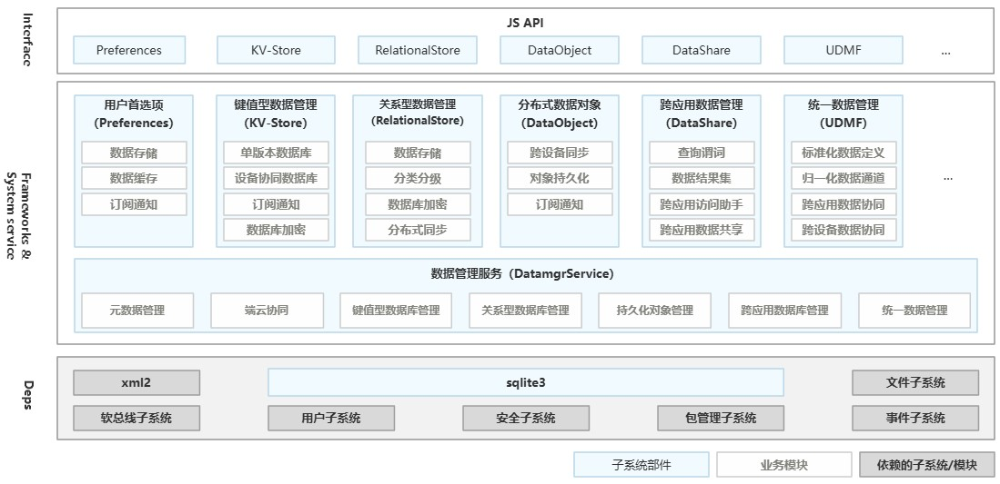

# 数据管理概述

## 功能介绍

数据管理为开发者提供数据存储、数据管理和数据同步能力，比如联系人应用数据可以保存到数据库中，提供数据库的安全、可靠以及共享访问等管理机制，也支持与手表同步联系人信息。

- 数据存储：提供通用数据持久化能力，根据数据特点，分为用户首选项、键值型数据库和关系型数据库。

- 数据管理：提供高效的数据管理能力，包括权限管理、数据备份恢复、数据共享框架等。

- 数据同步：提供跨设备数据同步能力，比如分布式对象支持内存对象跨设备共享能力，分布式数据库支持跨设备数据库访问能力。

应用创建的数据库，都保存到应用沙盒，当应用卸载时，数据库也会自动删除。

## 运作机制

数据管理模块包括用户首选项、键值型数据管理、关系型数据管理、分布式数据对象、跨应用数据管理和统一数据管理框架。Interface接口层提供标准JS API接口，定义这些部件接口描述，供开发者参考。Frameworks&amp;System service层负责实现部件数据存储、同步功能，还有一些SQLite和其他子系统的依赖。

  **图1** 数据管理架构图  

- 用户首选项（Preferences）：提供了轻量级配置数据的持久化能力，并支持订阅数据变化的通知能力。不支持分布式同步，常用于保存应用配置信息、用户偏好设置等。

- 键值型数据管理（KV-Store）：提供了键值型数据库的读写、加密、手动备份以及订阅通知能力。应用需要使用键值型数据库的分布式能力时，KV-Store会将同步请求发送给DatamgrService由其完成跨设备数据同步。常用于分布式场景中正常的文件创建、读写删除修改、锁等。

- 关系型数据管理（RelationalStore）：提供了关系型数据库的增删改查、加密、手动备份以及订阅通知能力。应用需要使用关系型数据库的分布式能力时，RelationalStore部件会将同步请求发送给DatamgrService由其完成跨设备数据同步。

- 分布式数据对象（DataObject）：独立提供对象型结构数据的分布式能力。如果应用需要重启后仍获取之前的对象数据（包含跨设备应用和本设备应用），则使用数据管理服务（DatamgrService）的对象持久化能力，做暂时保存。

- 跨应用数据管理（DataShare）：提供了数据提供者provider、数据消费者consumer以及同设备跨应用数据交互的增、删、改、查以及订阅通知等能力。DataShare不与任何数据库绑定，可以对接关系型数据库、键值型数据库。如果开发C/C++应用甚至可以自行封装数据库。在提供标准的provider-consumer模式基础上，同时提供了静默数据访问能力，即不再拉起provider而是直接通过DatamgrService代理访问provider的数据（目前仅关系型数据库支持静默数据访问方式）。

- 统一数据管理框架（UDMF）：提供了数据跨应用、跨设备交互标准，定义了跨应用、跨设备数据交互过程中的数据语言，提升数据交互效率。提供安全、标准化数据流通通路，支持不同级别的数据访问权限与生命周期管理策略，实现高效的数据跨应用、跨设备共享。

- 数据管理服务（DatamgrService）：提供其它部件的同步及跨应用共享能力，包括RelationalStore和KV-Store跨设备同步，DataShare静默访问provider数据，暂存DataObject同步对象数据等。
