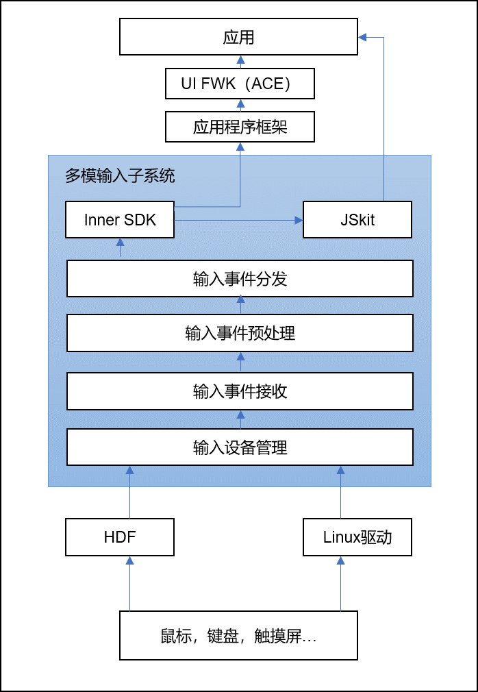

# Input Kit简介

## 功能介绍

Input Kit（多模输入Kit）为多种输入设备提供服务，如触控板、触摸屏、鼠标、键盘等。通过对这些输入设备上报驱动事件的归一化处理，确保不同输入设备与用户交互体验统一和流畅。

Input Kit除了提供基础的输入事件服务之外，还提供了获取输入设备列表、改变鼠标光标样式等功能和接口。

## 运作机制
多模输入能力作为系统为应用提供的一种基础服务，通过处理上报的输入设备驱动事件，完成输入事件管理、接收、预处理、分发，并通过inner SDK与JSkit上报应用，具体运行机制如下。

<!--Del-->
## 约束与限制

1. 在使用下列函数时，开发者需要请求相应的权限。

  | 接口名称  | 描述 | 权限 |
  | ------------------------------------------------------------ | -------------------------- |-----|
  | setShieldStatus(shieldMode: ShieldMode, isShield: boolean): void | 设置屏蔽按键拦截状态。 |ohos.permission.INPUT_CONTROL_DISPATCHING|
  | getShieldStatus(shieldMode: ShieldMode): boolean | 获取屏蔽按键拦截是否生效。 |ohos.permission.INPUT_CONTROL_DISPATCHING|
    
2. [组合按键](inputconsumer-guidelines.md)、[注入事件](inputeventclient-guidelines.md)、[输入监听](inputmonitor-guidelines.md)、[快捷键](shortkey-guidelines.md)模块接口为系统接口，其中[输入监听](inputmonitor-guidelines.md)模块接口接口需要 ohos.permission.INPUT_MONITORING权限。

<!--DelEnd-->