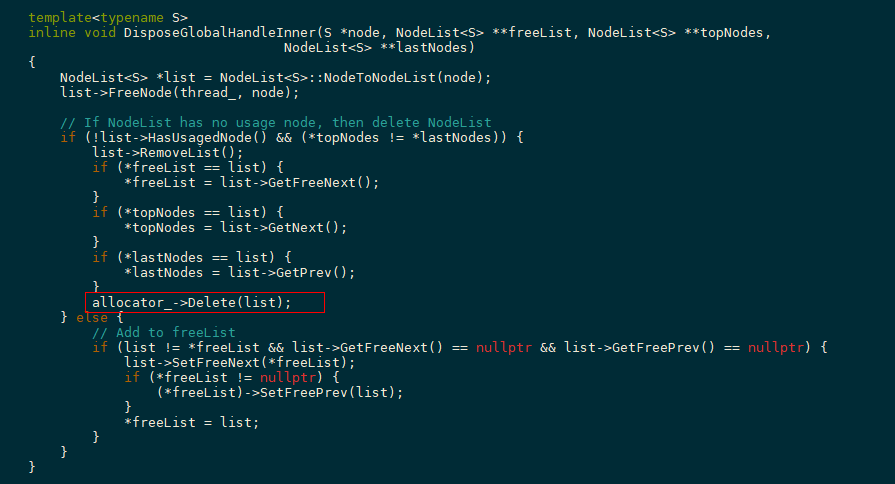
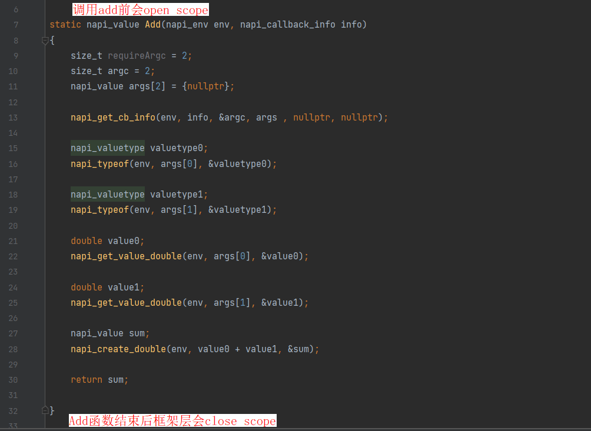
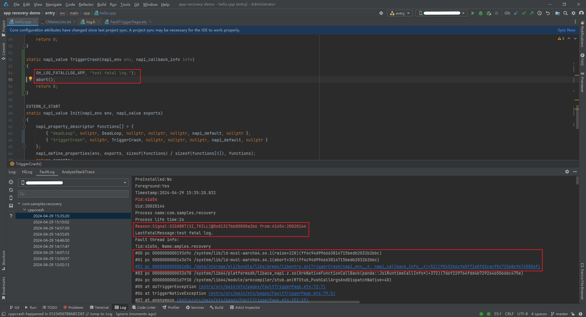

# 分析CppCrash（进程崩溃）

广义的进程崩溃是指应用或者系统进程非预期的退出。以下场景会发生崩溃：

1. Native代码未处理[崩溃异常信号](#哪些信号会生成cppcrash日志)会生成CppCrash日志。
2. js/ArkTS代码未处理异常会生成jscrash日志，详见[JSCrash分析指南](jscrash-guidelines.md)。
3. 应用卡死后生成AppFreeze日志并被kill退出，详见[AppFreeze分析指南](appfreeze-guidelines.md)。
4. 系统其他机制导致进程非预期退出。

本文专注于第1种场景的进程崩溃，开发者如何借助系统提供的详细日志信息分析、定位并修复崩溃问题。主要内容如下：

- 介绍[分析CppCrash问题的一般步骤](#cppcrash问题分析步骤)，给出了获取日志-分析问题-验证问题是否修复一套完整的处理流程；
- 结合具体的[案例分析](#案例分析)介绍几种常见的崩溃问题如何定位分析和修复；
- 在[附录](#附录)里补充了一些详细的辅助定位的说明信息。

## CppCrash问题分析步骤

### 获取崩溃日志

进程崩溃日志是一种故障日志，与AppFreeze应用无响应日志、JS应用崩溃等都由FaultLogger模块进行管理，可通过以下方式获取：

#### 方式一：通过DevEco Studio获取日志

DevEco Studio会收集设备`/data/log/faultlog/faultlogger/`路径下的进程崩溃故障日志到FaultLog下，根据进程名和故障和时间分类显示。获取日志的方法参见：[DevEco Studio使用指南-FaultLog](https://developer.huawei.com/consumer/cn/doc/harmonyos-guides/ide-fault-log)。

#### 方式二：通过HiAppEvent接口订阅

HiAppEvent给开发者提供了故障订阅接口，详见[HiAppEvent介绍](hiappevent-intro.md)。参考[订阅崩溃事件（ArkTS）](hiappevent-watcher-crash-events-arkts.md)或[订阅崩溃事件（C/C++）](hiappevent-watcher-crash-events-ndk.md)完成崩溃事件订阅，并通过事件的[external_log](hiappevent-watcher-crash-events.md#params字段说明)字段读取崩溃日志内容。

#### 方式三：通过hdc获取日志，需打开开发者选项

在开发者选项打开的情况下，开发者可以通过`hdc file recv /data/log/faultlog/faultlogger D:\`命令导出故障日志到本地，故障日志文件名格式为`cppcrash-进程名-进程UID-毫秒级时间.log`。

<!--Del-->
#### 方式四：设备ROOT模式下通过shell获取日志

(1) 进程崩溃后，系统会在设备`/data/log/faultlog/temp/`路径下的故障日志，其文件名格式为`cppcrash-进程PID-系统毫秒级时间戳`，日志内容包含进程崩溃调用栈，进程崩溃现场寄存器、栈内存、maps和进程文件句柄列表等信息。


(2) CppCrash故障会同步在`/data/log/faultlog/faultlogger/`路径下生成一份完善日志，故障日志文件名格式为`cppcrash-进程名-进程UID-毫秒级时间.log`，日志内容比`/data/log/faultlog/temp`下日志更加完善，增加有设备名、系统版本和进程流水日志等信息。


<!--DelEnd-->

### 分析CppCrash日志内容

本节重点介绍获取到CppCrash日志后如何查看日志以及如何分析问题，崩溃日志的详细内容介绍请参考附录[崩溃日志内容说明](#崩溃日志内容说明)。

#### 基于信号值确定崩溃类型

本节只介绍常见信号值对应的崩溃类型，其他信号请参考附录中[哪些信号会生成cppcrash日志](#哪些信号会生成cppcrash日志)。

```text
Reason:Signal:SIGSEGV(SI_TKILL)@0x000027e0 from:10208:0
字段解释如下：
Reason:Signal:信号值(tkill()函数信号)@崩溃地址 from:发送信号的Pid:发送信号的Uid
```

常见的崩溃：

- SIGSEGV、SIGILL以及SIGBUS，需要结合Register寄存器进行分析，案例分析参考[内存访问类问题](#案例3内存访问类崩溃问题)。
- SIGABRT进程主动中止，查看调用栈中调用abort的代码，案例分析参考[SIGABRT类崩溃问题分析](#案例5sigabrt类崩溃问题)。

#### 查看崩溃地址

CppCrash日志中Signal会携带崩溃时访问的地址，如非法访问地址会触发SIGSEGV、访问合法地址但地址指向的不是代码段会触发SIGILL，上例中崩溃时正在访问000027e0。

#### 查看寄存器和栈地址范围

```text
Registers:  <- 故障现场寄存器
r0:00000000 r1:ffc09854 r2:00000000 r3:00000008
r4:00000000 r5:fffff000 r6:0000000a r7:000000af
r8:ffc09919 r9:ffc09930 r10:00000000
fp:ffc098e8 ip:005b76e4 sp:ffbe8daa lr:005ade99 pc:f7bb0400
cpsr:20870010  <- 状态寄存器（arm32架构为cpsr，aarch64架构为pstate和esr）
...
Maps:
...
ffbe9000-ffc0a000 rw-p 00000000 [stack] <- 栈地址范围，sp小于栈的低地址ffbe9000
```

检查堆栈指针寄存器（sp）保存的地址，如果超出栈地址范围或接近栈的低地址，考虑可能发生了栈溢出。目前对于大多数栈溢出问题，CppCrash日志里也会给出提示，开发者也可将此作为参考，详见[崩溃日志内容说明](#崩溃日志内容说明)中栈溢出故障场景。

#### 基于崩溃栈定位行号

方式一：DevEco Studio开发调试环境下，支持调用栈直接跳转到对应行号。

在应用开发场景，对于应用自身的动态库，生成的cppcrash调用栈可直接跳转到代码行处，支持Native栈帧和JS栈帧，无需开发者自行进行解行号操作。对于部分未能解析跳转到对应行号的栈帧，可参考方式二解析。


方式二：通过SDK llvm-addr2line 工具定位行号。

(1) 获取符号表。
获取崩溃栈中so文件对应的带符号版本，保证与应用/系统内运行时的so文件版本一致。  
对于应用自身的动态库，经DevEco编译构建，生成在工程的`/build/default/intermediates/libs`目录下，默认是带符号的版本。可通过Linux file命令查询二进制文件的BuildID以核对是否匹配。其中，BuildID是用于标识二进制文件的唯一标识符，通常由编译器在编译时生成，not stripped表示该动态库是包含符号表的。

```text
$ file libbabel.so
libbabel.so: ELF 64-bit LSB shared object, ARM aarch64, version 1 (SYSV), dynamically linked, BuildID[sha1]=fdb1b5432b9ea4e2a3d29780c3abf30e2a22da9d, with debug_info, not stripped
```

上述fdb1b5432b9ea4e2a3d29780c3abf30e2a22da9d即为libbabel.so的BuildID，对比cppcrash日志中打印的二进制BuildID是否相同。

```text
#00     pc 000072e6       /system/lib/libbabel.so(xxxxxxx(void*)+30)(fdb1b5432b9ea4e2a3d29780c3abf30e2a22da9d)
#序号   pc pc在段内的偏移   pc属于的段名称(函数名+函数内偏移的字节数)(BuidldID)
```

> **pc（Program Counter）**：程序计数器表示程序执行指令的地址。

对比可知，有符号的libbabel.so是与版本相匹配的so，必须匹配才能继续下面的分析流程，否则会误导开发者。

(2) 通过 llvm-addr2line 工具定位行号。
llvm-addr2line工具归档在：`[SDK DIR PATH]/default/openharmony/native/llvm/bin` 路径下。根据实际的SDK版本路径略有不同，开发者请自行识别或在路径下搜索。  
例如有核心调用栈如下：

```text
# 00 pc 00003510 /data/storage/el1/bundle/libs/arm/libentry.so(TriggerCrash(napi_env__*, napi_callback_info__*)+24)(446ff75d3f6a518172cc52e8f8055650b02b0e54)
# 01 pc 0002b0c5 /system/lib/platformsdk/libace_napi.z.so(panda::JSValueRef ArkNativeFunctionCallBack<true>(panda::JsiRuntimeCallInfo*)+448)(a84fbb767fd826946623779c608395bf)
# 02 pc 001e7597 /system/lib/platformsdk/libark_jsruntime.so(panda::ecmascript::EcmaInterpreter::RunInternal(panda::ecmascript::JSThread*, unsigned char const*, unsigned long long*)+14710)(106c552f6ce4420b9feac95e8b21b792)
# 03 pc 001e0439 /system/lib/platformsdk/libark_jsruntime.so(panda::ecmascript::EcmaInterpreter::Execute(panda::ecmascript::EcmaRuntimeCallInfo*)+984)(106c552f6ce4420b9feac95e8b21b792)
...
# 39 pc 00072998 /system/lib/ld-musl-arm.so.1(libc_start_main_stage2+56)(5b1e036c4f1369ecfdbb7a96aec31155)
# 40 pc 00005b48 /system/bin/appspawn(_start_c+84)(cb0631260fa74df0bc9b0323e30ca03d)
# 41 pc 00005aec /system/bin/appspawn(cb0631260fa74df0bc9b0323e30ca03d)
```

基于SDK llvm-addr2line解析行号如下所示：

```text
[SDK DIR PATH]\OpenHarmony\11\native\llvm\bin> .\llvm-addr2line.exe -Cfie libentry.so 3150
TrggerCrash(napi_env__*, napi_callback_info__*)
D:/code/apprecovery-demo/entry/src/main/cpp/hello.cpp:48
```

llvm-addr2line 逐行解析的命令为：`llvm-addr2line.exe -fCpie libutils.z.so pc在段内的偏移`，可以多个偏移一起解析：`llvm-addr2line.exe -fCpie libxxx.so 0x1bc868 0x1be28c`。使用llvm-addr2line后，如果得出的行号结合源码分析不正确，可以考虑对地址进行微调（如减1），或者考虑关闭一些编译优化。

方式三：通过DevEco Studio hstack工具解析调用栈信息。

hstack是DevEco Studio为开发人员提供的用于将release应用混淆后的crash调用栈还原为源码对应调用栈的工具，支持Windows、Mac、Linux三个平台。使用说明请参考[DevEco Studio hstack使用指南](https://developer.huawei.com/consumer/cn/doc/harmonyos-guides/ide-command-line-hstack)。

### 结合业务检视代码

在分析CppCrash日志内容和定位行号后，回到代码中检视上下文，分析具体是什么业务逻辑导致崩溃。借助hilog提供的崩溃现场日志分析业务场景，找出代码中的可疑点。如下图所示，hello.cpp中的48行是一个空指针解引用的代码问题。


本场景是一个故障构造的应用，实际的场景往往不会这么简单，需要结合实际业务进行分析。

### 反汇编（可选）

如果开发人员对自己的业务流程非常熟悉并且要解决的是一个crash在出错代码附近的简单问题，结合业务代码分析能够定位清楚问题。但在一些较为复杂的场景，如定位到某一行里面调用的方法有多个参数等，只看代码无法直接得出分析结论，则需要借助[反汇编](#如何阅读汇编指令)来进一步分析。

### 分析踩内存问题（可选）

**踩内存是指业务代码运行时使用有效的野指针（指向随机内存区域的指针）并将其指向的内存修改为非法值，改写了原来内存保存的正常值，当再次访问该数据时产生崩溃。**

这种问题通常会产生随机的崩溃调用栈，仅根据崩溃调用栈很难分析到问题根因。

分析踩内存问题通常需要以下几个步骤：

#### 找到问题发生时的场景

通过hilog提供的崩溃现场日志，分析问题的场景例如用户点击从App的页面1切换到页面2。

分析清楚场景有助于明确这个过程中使用了哪些代码，并进行针对性的测试。任何崩溃问题都需要首先分析问题发生时的场景，这对于复现、分析问题和验证问题是否修复都至关重要。

#### 分析内存的特征，分析内存是否被改写

系统使用的内存分配器是线程亲和的（本线程前一个释放的内存会优先分配给本线程下一个申请者），因此如果大多数出现问题的线程是同一个，说明踩内存的业务是和崩溃线程上跑的业务相关，开发者可以借此缩小排查范围。

进程在访问该内存时已经被写入了信息，可能存在以下两种内存写入情况：

- 信息是踩内存的业务写入的，信息内容可以帮助找到踩内存的业务所在的模块。
- 内存被踩内存的业务释放，但是被第三者写入了信息，无法直接找出踩内存的业务。

通用分析步骤：

- 结合业务代码[分析汇编指令](#如何阅读汇编指令)找出具体被踩内存以及对应内存大小。
- 通过CppCrash日志中MemoryNearRegister找被踩内存的特征。
- 如果内存特征很明显，比如是字符串的ASCII码值（内存中连续有一段值在0x20-0x7e之间）或者有规律的值，到此可能很快找到踩内存的业务，如果没有还需要继续往下分析。

#### 部署测试环境，使用HWASan工具分析问题

(1) 使能[HWASan检测内存错误](https://developer.huawei.com/consumer/cn/doc/harmonyos-guides/ide-hwasan)能够帮助找到踩内存的业务将内存修改为非法值的第一现场，这对于问题分析至关重要，但需要复现问题现场。

(2) 根据前面分析出的问题发生时的场景，部署测试环境，根据出现概率评估压测时长。

如果长时间问题没复现，说明测试的场景不对，就需要根据现场的hilog等日志再分析出高效的场景。

(3) 分析是否会有外部影响项，外部模块也可能导致问题概率性出现。

例如应用播放视频过程中发生踩内存问题，结合hilog信息发现发生问题的时间段，总是有外部模块报告wifi信号差，因此猜测踩内存问题与网络延迟有关，部署测试环境后复现问题，结果验证了猜测是正确的。

(4) 去掉与问题无关的功能，采用排除法逐步缩小故障模块范围。

在已经可以稳定复现的场景下，逐个关闭功能，如果还能复现说明问题在留下的功能中，同时排除功能也可以把怀疑范围缩小，最终找到问题点。
由于剥离干扰功能极大考验开发者对整体模块的熟悉度，可能投入巨大，因此在问题分析遇到瓶颈时，可以考虑通过二分法排查。

### 验证问题是否修复

根据已有分析结论尝试修复问题后，部署测试环境模拟问题发生时的场景，按照问题出现概率评估压测时长，如果压测时长内问题未复现说明问题已经修复，如果压测时长内问题复现则需要继续排查其他可疑点，直到压测时长内问题不再复现才能认为问题被修复。

## 案例分析

### 案例1：空指针解引用问题

**问题背景**

智能指针使用之前未判空，造成进程运行时发生空指针解引用崩溃问题。

**问题影响**

进程发生崩溃，影响稳定运行，导致非预期退出。

**定位思路**


空指针类型崩溃可以从故障原因得到提示信息。通过llvm-addr2line解行号发现业务代码中在使用智能指针之前未对智能指针判空，对空地址进行访问导致崩溃产生。

**修复方法**

对所有使用该指针的地方进行保护性判空。

**建议与总结**

指针在使用之前应该要进行判空处理，防止访问空指针造成进程崩溃退出。

### 案例2：多线程竞争问题

**问题背景**

napi_env释放后仍被使用。

**问题场景**
核心崩溃栈如下：


napi接口的env（JavaScript环境）指向非法内存，崩溃栈直接挂在NativeEngineInterface::ClearLastError()中，增加维测打印后结合hilog梳理崩溃前的业务流程，根据打印的env地址定位，发现是env被释放后仍然被使用。


由于JavaScript本身是单线程执行的，对env的任何操作都必须在创建该JS线程的原始线程上进行，如果违反该规则可能会出现意想不到的问题。

**修改方法**

一个线程创建的env，不要传递给其他线程使用。

**建议与总结**

对于栈顶崩溃在libace_napi.z.so、libark_jsruntime.so等库操作env的问题，并且出现概率相对较高，在CppCrash日志的调用栈难以直接分析出崩溃原因情况下，可以考虑开启[多线程检测](https://developer.huawei.com/consumer/cn/doc/harmonyos-guides/ide-multi-thread-check)帮助开发者快速定位问题。此外，在多线程操作STL容器（如vector、map、set等）的场景中，由于STL容器是非线程安全的，如果多线程进行添加和删除操作，容易出现SIGSEGV类崩溃，如果崩溃现场代码与STL容器相关，也可以考虑是多线程竞争问题。

### 案例3：内存访问类崩溃问题

**问题背景**

每次崩溃地址都在libace_napi_ark.z.so的可读可执行段上。崩溃原因是需要对地址进行写操作，而对应的maps段只有可读、可执行权限没有写权限，当进程试图访问不被允许访问的内存区域时，进程发生内存访问类崩溃。

```text
7f82740000-7f8275c000 r--p 00000000 /system/lib64/libace_napi_ark.z.so
7f8275c000-7f8276e000 r-xp 0001b000 /system/lib64/libace_napi_ark.z.so <-崩溃地址落在该地址区间
7f8276e000-7f82773000 r--p 0002c000 /system/lib64/libace_napi_ark.z.so
7f82773000-7f82774000 rw-p 00030000 /system/lib64/libace_napi_ark.z.so
```

崩溃调用栈如下图。


**定位思路**

根据业务逻辑分析，node应该保存在堆上，node地址不可能落在libace_napi_ark.z.so的代码段。从问题的现象分析，大概率是踩内存问题。踩内存问题可使用[HWASan工具](https://developer.huawei.com/consumer/cn/doc/harmonyos-guides/ide-hwasan)排查问题。于是后续使用ASan版本进行压测复现，也找到了稳定必现的场景。ASan版本检测出来的问题也和上面崩溃栈反映的问题一致。ASan日志显示的踩内存类型是heap-use-after-free，根据日志信息弄清从内存申请、内存释放到使用已被释放的内存整个过程。经过分析后发现业务代码对同一个地址（0x003a375eb724）进行重复释放，在重复释放内存操作时，使用该地址去访问了其对象成员，因此报出了use-after-free（使用已经释放的内存）问题。
ASan核心日志如下：

```text
=================================================================
==appspawn==2029==ERROR: AddressSanitizer: heap-use-after-free on address 0x003a375eb724 at pc 0x002029ba8514 bp 0x007fd8175710 sp 0x007fd8175708
READ of size 1 at 0x003a375eb724 thread T0 (thread name) <- 使用已被释放的内存现场
    # 0 0x2029ba8510  (/system/asan/lib64/platformsdk/libark_jsruntime.so+0xca8510) panda::ecmascript::Node::IsUsing() const at arkcompiler/ets_runtime/ecmascript/ecma_global_storage.h:82:16
(inlined by) panda::JSNApi::DisposeGlobalHandleAddr(panda::ecmascript::EcmaVM const*, unsigned long) at arkcompiler/ets_runtime/ecmascript/napi/jsnapi.cpp:749:67 BuildID[md5/uuid]=9a18e2ec0dc8a83216800b2f0dd7b76a
    # 1 0x403ee94d30  (/system/asan/lib64/libace.z.so+0x6194d30) panda::CopyableGlobal<panda::ObjectRef>::Free() at arkcompiler/ets_runtime/ecmascript/napi/include/jsnapi.h:1520:9
(inlined by) panda::CopyableGlobal<panda::ObjectRef>::Reset() at arkcompiler/ets_runtime/ecmascript/napi/include/jsnapi.h:189:9
(inlined by) OHOS::Ace::Framework::JsiType<panda::ObjectRef>::Reset() at foundation/arkui/ace_engine/frameworks/bridge/declarative_frontend/engine/jsi/jsi_types.inl:112:13
(inlined by) OHOS::Ace::Framework::JsiWeak<OHOS::Ace::Framework::JsiObject>::~JsiWeak() at foundation/arkui/ace_engine/frameworks/bridge/declarative_frontend/engine/jsi/jsi_ref.h:167:16
(inlined by) OHOS::Ace::Framework::ViewFunctions::~ViewFunctions() at foundation/arkui/ace_engine/frameworks/bridge/declarative_frontend/jsview/js_view_functions.h:44:5 BuildID[md5/uuid]=1330f8b9be73bdb76ae18107c2a60ca1
    # 2 0x403ee9296c  (/system/asan/lib64/libace.z.so+0x619296c) OHOS::Ace::Framework::ViewFunctions::~ViewFunctions() at foundation/arkui/ace_engine/frameworks/bridge/declarative_frontend/jsview/js_view_functions.h:42:5
(inlined by) OHOS::Ace::Framework::ViewFunctions::~ViewFunctions() at foundation/arkui/ace_engine/frameworks/bridge/declarative_frontend/jsview/js_view_functions.h:42:5 BuildID[md5/uuid]=1330f8b9be73bdb76ae18107c2a60ca1
    # 3 0x403ed9b130  (/system/asan/lib64/libace.z.so+0x609b130) OHOS::Ace::Referenced::DecRefCount() at foundation/arkui/ace_engine/frameworks/base/memory/referenced.h:76:13
(inlined by) OHOS::Ace::RefPtr<OHOS::Ace::Framework::ViewFunctions>::~RefPtr() at foundation/arkui/ace_engine/frameworks/base/memory/referenced.h:148:22 BuildID[md5/uuid]=1330f8b9be73bdb76ae18107c2a60ca1
    # 4 0x403ed9b838  (/system/asan/lib64/libace.z.so+0x609b838) OHOS::Ace::RefPtr<OHOS::Ace::Framework::ViewFunctions>::Reset() at foundation/arkui/ace_engine/frameworks/base/memory/referenced.h:163:9
(inlined by) OHOS::Ace::Framework::JSViewFullUpdate::~JSViewFullUpdate() at foundation/arkui/ace_engine/frameworks/bridge/declarative_frontend/jsview/js_view.cpp:159:21 BuildID[md5/uuid]=1330f8b9be73bdb76ae18107c2a60ca1
    # 5 0x403ed9bf24  (/system/asan/lib64/libace.z.so+0x609bf24) OHOS::Ace::Framework::JSViewFullUpdate::~JSViewFullUpdate() at foundation/arkui/ace_engine/frameworks/bridge/declarative_frontend/jsview/js_view.cpp:157:1
(inlined by) OHOS::Ace::Framework::JSViewFullUpdate::~JSViewFullUpdate() at foundation/arkui/ace_engine/frameworks/bridge/declarative_frontend/jsview/js_view.cpp:157:1 BuildID[md5/uuid]=1330f8b9be73bdb76ae18107c2a60ca1
...
freed by thread T0 (thread name) here: <- 内存释放的现场
    # 0 0x2024ed3abc  (/system/asan/lib64/libclang_rt.asan.so+0xd3abc)
    # 1 0x2029ba8424  (/system/asan/lib64/platformsdk/libark_jsruntime.so+0xca8424) std::__h::__function::__value_func<void (unsigned long)>::operator()[abi:v15004](unsigned long&&) const at prebuilts/clang/ohos/linux-x86_64/llvm/bin/../include/libcxx-ohos/include/c++/v1/__functional/function.h:512:16
(inlined by) std::__h::function<void (unsigned long)>::operator()(unsigned long) const at prebuilts/clang/ohos/linux-x86_64/llvm/bin/../include/libcxx-ohos/include/c++/v1/__functional/function.h:1197:12
(inlined by) panda::ecmascript::JSThread::DisposeGlobalHandle(unsigned long) at arkcompiler/ets_runtime/ecmascript/js_thread.h:604:9
(inlined by) panda::JSNApi::DisposeGlobalHandleAddr(panda::ecmascript::EcmaVM const*, unsigned long) at arkcompiler/ets_runtime/ecmascript/napi/jsnapi.cpp:752:24 BuildID[md5/uuid]=9a18e2ec0dc8a83216800b2f0dd7b76a
    # 2 0x403ee94b68  (/system/asan/lib64/libace.z.so+0x6194b68) panda::CopyableGlobal<panda::FunctionRef>::Free() at arkcompiler/ets_runtime/ecmascript/napi/include/jsnapi.h:1520:9
(inlined by) panda::CopyableGlobal<panda::FunctionRef>::Reset() at arkcompiler/ets_runtime/ecmascript/napi/include/jsnapi.h:189:9
(inlined by) OHOS::Ace::Framework::JsiType<panda::FunctionRef>::Reset() at foundation/arkui/ace_engine/frameworks/bridge/declarative_frontend/engine/jsi/jsi_types.inl:112:13
(inlined by) OHOS::Ace::Framework::JsiWeak<OHOS::Ace::Framework::JsiFunction>::~JsiWeak() at foundation/arkui/ace_engine/frameworks/bridge/declarative_frontend/engine/jsi/jsi_ref.h:167:16
(inlined by) OHOS::Ace::Framework::ViewFunctions::~ViewFunctions() at foundation/arkui/ace_engine/frameworks/bridge/declarative_frontend/jsview/js_view_functions.h:44:5 BuildID[md5/uuid]=1330f8b9be73bdb76ae18107c2a60ca1
    # 3 0x403ee9296c  (/system/asan/lib64/libace.z.so+0x619296c) OHOS::Ace::Framework::ViewFunctions::~ViewFunctions() at foundation/arkui/ace_engine/frameworks/bridge/declarative_frontend/jsview/js_view_functions.h:42:5
(inlined by) OHOS::Ace::Framework::ViewFunctions::~ViewFunctions() at foundation/arkui/ace_engine/frameworks/bridge/declarative_frontend/jsview/js_view_functions.h:42:5 BuildID[md5/uuid]=1330f8b9be73bdb76ae18107c2a60ca1
    # 4 0x403ed9b130  (/system/asan/lib64/libace.z.so+0x609b130) OHOS::Ace::Referenced::DecRefCount() at foundation/arkui/ace_engine/frameworks/base/memory/referenced.h:76:13
(inlined by) OHOS::Ace::RefPtr<OHOS::Ace::Framework::ViewFunctions>::~RefPtr() at foundation/arkui/ace_engine/frameworks/base/memory/referenced.h:148:22 BuildID[md5/uuid]=1330f8b9be73bdb76ae18107c2a60ca1
...
previously allocated by thread T0 (thread name) here: <- 内存申请的现场
    # 0 0x2024ed3be4  (/system/asan/lib64/libclang_rt.asan.so+0xd3be4)
    # 1 0x2029ade778  (/system/asan/lib64/platformsdk/libark_jsruntime.so+0xbde778) panda::ecmascript::NativeAreaAllocator::AllocateBuffer(unsigned long) at arkcompiler/ets_runtime/ecmascript/mem/native_area_allocator.cpp:98:17 BuildID[md5/uuid]=9a18e2ec0dc8a83216800b2f0dd7b76a
    # 2 0x2029a39064  (/system/asan/lib64/platformsdk/libark_jsruntime.so+0xb39064) std::__h::enable_if<!std::is_array_v<panda::ecmascript::NodeList<panda::ecmascript::WeakNode>>, panda::ecmascript::NodeList<panda::ecmascript::WeakNode>*>::type panda::ecmascript::NativeAreaAllocator::New<panda::ecmascript::NodeList<panda::ecmascript::WeakNode>>() at arkcompiler/ets_runtime/ecmascript/mem/native_area_allocator.h:61:19
(inlined by) unsigned long panda::ecmascript::EcmaGlobalStorage<panda::ecmascript::Node>::NewGlobalHandleImplement<panda::ecmascript::WeakNode>(panda::ecmascript::NodeList<panda::ecmascript::WeakNode>**, panda::ecmascript::NodeList<panda::ecmascript::WeakNode>**, unsigned long) at arkcompiler/ets_runtime/ecmascript/ecma_global_storage.h:565:34
(inlined by) panda::ecmascript::EcmaGlobalStorage<panda::ecmascript::Node>::SetWeak(unsigned long, void*, void (*)(void*), void (*)(void*)) at arkcompiler/ets_runtime/ecmascript/ecma_global_storage.h:455:26 BuildID[md5/uuid]=9a18e2ec0dc8a83216800b2f0dd7b76a
    # 3 0x2029ba5620  (/system/asan/lib64/platformsdk/libark_jsruntime.so+0xca5620) std::__h::__function::__value_func<unsigned long (unsigned long, void*, void (*)(void*), void (*)(void*))>::operator()[abi:v15004](unsigned long&&, void*&&, void (*&&)(void*), void (*&&)(void*)) const at prebuilts/clang/ohos/linux-x86_64/llvm/bin/../include/libcxx-ohos/include/c++/v1/__functional/function.h:512:16
(inlined by) std::__h::function<unsigned long (unsigned long, void*, void (*)(void*), void (*)(void*))>::operator()(unsigned long, void*, void (*)(void*), void (*)(void*)) const at prebuilts/clang/ohos/linux-x86_64/llvm/bin/../include/libcxx-ohos/include/c++/v1/__functional/function.h:1197:12
(inlined by) panda::ecmascript::JSThread::SetWeak(unsigned long, void*, void (*)(void*), void (*)(void*)) at arkcompiler/ets_runtime/ecmascript/js_thread.h:610:16
(inlined by) panda::JSNApi::SetWeak(panda::ecmascript::EcmaVM const*, unsigned long) at arkcompiler/ets_runtime/ecmascript/napi/jsnapi.cpp:711:31 BuildID[md5/uuid]=9a18e2ec0dc8a83216800b2f0dd7b76a
...
```

根据调用栈继续分析，JsiWeak析构或重置的时候会触发其成员（类型为JsiObject/JsiValue/JsiFunction）父类JsiType中CopyableGlobal被释放，如下图。


运行时在GC过程中IterateWeakEcmaGlobalStorage，会对无callback的WeakNode调用DisposeGlobalHandle操作，也对其进行释放，如下图。


对于同一个WeakNode，可能会存在两个入口释放。如果是GC过程中IterateWeakEcmaGlobalStorage先释放，因为无callback回调通知到JsiWeak进行清理，JsiWeak那边仍保存一个对已释放的WeakNode引用，即CopyableGlobal；当前面讲的WeakNode所在的NodeList被整体释放，JsiWeak处保留的CopyableGlobal再释放，就会存在重复释放内存问题。



**修改方法**

JsiWeak调用SetWeakCallback，传入callback，在GC过程中IterateWeakEcmaGlobalStorage释放WeakNode时，通知JsiWeak对其保存的CopyableGlobal进行重置，确保同一个地址不被重复释放。

**建议与总结**

使用内存时应考虑是否存在重复释放或者未释放的可能，另外定位内存访问类崩溃问题（一般是SIGSEGV类型问题）时，如果根据调用栈继续分析问题无头绪时，应优先考虑使能HWASan版本复现问题。

### 案例4：生命周期类问题

生命周期类问题是指在对象生命周期外访问其内存产生崩溃的问题，通常是由于不恰当使用裸指针造成。裸指针是指不具有封装或自动内存管理特性的指针。它只是一个简单的指针，指向内存地址，没有保护或管理指针指向的内存。裸指针可以直接访问内存，但容易导致内存泄漏和空指针引用等问题。使用裸指针时需要特别小心，以避免潜在的安全问题。推荐使用智能指针来管理内存。

**问题背景**

开发者在写native代码创建napi_value时，需要配合napi_handle_scope一起使用。napi_handle_scope的作用是管理napi_value的生命周期，napi_value只能在napi_handle_scope的作用域范围内进行使用，离开napi_handle_scope作用域范围后，napi_value及它所持有的js对象的生命周期不再得到保护，一旦引用计数为0，就会被GC回收掉，此时再去使用napi_value就会访问已释放的内存，产生问题。

**问题场景**

napi_value其实是个裸指针（结构体指针），其作用是持有js对象，用于保持js对象的生命周期，保证js对象不被GC当成垃圾对象回收。离开napi_handle_scope作用域之后，napi_value由GC回收，napi_value不再持有js对象（不再保护js对象生命周期）。

**定位思路**

根据调用栈定位到行号找到出现问题的napi接口的上层接口，在上层接口内找到出问题的napi_value，检查napi_value的使用范围是否超出了napi_handle_scope的作用域范围。

**案例**

napi_value超出napi_handle_scope的作用域范围，如下：



js侧通过Add接口添加数据，native侧以napi_value保存到vector，js侧通过get接口获取添加的数据，native侧将保存的napi_value以数组形式返回回去，然后js侧读取数据的属性。出现报错：Can not get Prototype on non ECMA Object。跨napi的native_value未使用napi_ref保存，导致native_value失效。
> **说明**
>
> 开发者可以通过napi_handle_scope来管理napi_value的生命周期，进入native方法前开始作用域，从native方法出来后结束作用域，详细使用请参考[使用Node-API接口进行生命周期相关开发](https://developer.huawei.com/consumer/cn/doc/harmonyos-guides/use-napi-life-cycle)。

### 案例5：SIGABRT类崩溃问题

SIGABRT进程异常终止，通常为进程自身调用标准函数库的abort函数，崩溃原因在调用abort函数的代码。由程序检测到异常时触发，如线程创建失败，文件描述符使用异常等，大多数情况是各基础库（C库等）进行校验操作，校验失败会主动终止进程。

```c++
static napi_value TriggerCrash(napi_env env, napi_callback_info info)
{
    OH_LOG_FATAL(LOG_APP, "test fatal log.");
    abort();
    return 0;
}
```



构造主动调用abort函数场景举例说明SIGABRT类崩溃问题如何分析。上图所示，LastFatalMessage是进程退出前的最后一条fatal级别日志，对于SIGABRT类崩溃问题其一般能提供程序主动异常终止的原因，对定位该类问题有很大帮助。从上往下跳过C库的调用栈，找到调用abort函数的调用栈（图中#02层调用栈），从这里结合LastFatalMessage进行分析。

除了调用abort函数外，C++中的另一个异常处理机制还包括assert函数，assert用于校验当前函数执行流程中的一些数据，校验失败进程会主动终止，分析问题的方法都是一样的。

```c++
static napi_value TriggerCrash(napi_env env, napi_callback_info info)
{
    void *pc = malloc(1024);
    assert(pc != nullptr);
    return 0;
}
```


## 附录

### 哪些信号会生成CppCrash日志

进程崩溃基于posix信号机制，主要支持对以下崩溃异常信号的处理：

| 信号值(signo) | 信号 | 解释 | 触发原因 |
| -------- | -------- | -------- | -------- |
| 4 | SIGILL | 非法指令。 | 进程执行了非法、格式错误、未知或特权指令。 |
| 5 | SIGTRAP | 断点或陷阱异常。 | 异常或trap指令发生。 |
| 6 | SIGABRT | 进程终止。 | 进程异常终止，通常为进程自身调用标准函数库的abort()函数。 |
| 7 | SIGBUS | 非法内存访问。 | 进程访问了对齐或者不存在的物理地址。 |
| 8 | SIGFPE | 浮点异常。 | 进程执行了错误的算术运算，如除数为0、浮点溢出、整数溢出等。 |
| 11 | SIGSEGV | 无效内存访问。 | 进程访问了无效内存引用。 |
| 16 | SIGSTKFLT | 栈错误。 | 处理器执行了错误的栈操作，如栈空时弹出、栈满时压入。 |
| 31 | SIGSYS | 错误的系统调用。 | 系统调用时使用了错误或非法参数。 |

以上部分故障信号，根据具体的场景还有二级分类（code）：  
SIGILL是一个在Unix和类Unix操作系统中的信号，它表示非法指令异常。SIGILL信号通常由以下几种类型的问题场景引起：

| 二级分类 | 信号字符串 | 解释 | 触发原因 |
| -------- | -------- | -------- | -------- |
| 1 | ILL_ILLOPC | 非法操作码异常。 | 发生在执行不被CPU支持的指令时，或者在尝试执行特权指令时。 |
| 2 | ILL_ILLOPN | 非法操作数异常。 | 发生在指令使用了不正确的操作数，或者是操作数的类型不正确时。|
| 3 | ILL_ILLADR | 非法地址异常。 | 发生在程序尝试访问无效的内存地址时，或者是在尝试执行未对齐的内存访问时。|
| 4 | ILL_ILLTRP | 非法陷阱异常。 | 发生在程序尝试执行一个非法的陷阱指令时，或者是在尝试执行一个未定义的操作时。|
| 5 | ILL_PRVOPC | 特权操作码异常。 | 发生在普通用户尝试执行特权指令时。|
| 6 | ILL_PRVREG | 特权寄存器异常。 | 发生在普通用户尝试访问特权寄存器时。|
| 7 | ILL_COPROC | 协处理器异常。 | 发生在程序尝试使用未定义的协处理器指令时。|
| 8 | ILL_BADSTK | 无效的堆栈异常。 | 发生在程序尝试在无效的堆栈地址上执行操作时，或者是在堆栈溢出时。|

SIGTRAP信号通常用于调试和跟踪程序的执行。下面是SIGTRAP信号类别的问题场景介绍：

| 二级分类 | 信号字符串 | 解释 | 触发原因 |
| -------- | -------- | -------- | -------- |
| 1 | TRAP_BRKPT | 软件断点。 | 由软件断点引起的，当程序执行到设置的断点时会触发该信号。软件断点通常用于调试程序，可以在程序的关键位置设置断点，以便在调试时暂停程序的执行并检查变量值等信息。|
| 2 | TRAP_TRACE | 单步调试。 | 由单步执行引起的，当程序执行单个指令时会触发该信号。单步执行通常用于调试程序，可以逐步执行程序并检查每个指令的执行结果。|
| 3 | TRAP_BRANCH | 分支跟踪。 | 由分支指令引起的，当程序执行分支指令时会触发该信号。分支指令通常用于控制程序的执行流程，例如if语句和循环语句等。|
| 4 | TRAP_HWBKPT | 硬件断点。 | 由硬件断点引起的，当程序执行到设置的硬件断点时会触发该信号。硬件断点通常用于调试程序，可以在程序的关键位置设置断点，以便在调试时暂停程序的执行并检查变量值等信息。与软件断点不同的是，硬件断点是由CPU硬件实现的，因此可以在程序执行过程中实时检测断点是否被触发。|

SIGBUS是一种由操作系统向进程发送的信号，通常表示内存访问错误。其中，不同的信号类别表示不同的错误场景：

| 二级分类 | 信号字符串 | 解释 | 触发原因 |
| -------- | -------- | -------- | -------- |
| 1 | BUS_ADRALN | 内存地址对齐错误。 | 发生在尝试访问未对齐的内存地址时，例如尝试访问一个4字节整数的非偶数地址。|
| 2 | BUS_ADRERR | 非法内存地址错误。 | 发生在尝试访问不属于进程地址空间的内存地址时，例如尝试访问一个空指针。|
| 3 | BUS_OBJERR | 对象访问错误。 | 发生在尝试访问一个已经被删除或未初始化的对象时。|
| 4 | BUS_MCEERR_AR | 硬件内存校验错误。 | 发生在访问内存时检测到校验和错误。|
| 5 | BUS_MCEERR_AO | 硬件内存校验错误。 | 发生在访问内存时检测到地址和校验和错误。|

SIGFPE是一个信号，它表示浮点异常或算术异常。下面是这些SIGFPE信号类别的问题场景：

| 二级分类 | 信号字符串 | 解释 | 触发原因 |
| -------- | -------- | -------- | -------- |
| 1 | FPE_INTDIV | 整数除法错误。 | 表示整数除法中的除数为零的情况。当一个程序尝试进行整数除法，但除数为零时，会发出这个信号。|
| 2 | FPE_INTOVF | 整数溢出错误。 | 表示整数溢出错误。当一个程序尝试进行整数运算，结果超出整数范围时，会发出这个信号。|
| 3 | FPE_FLTDIV | 浮点除法错误。 | 表示浮点数除法中的除数为零的情况。当一个程序尝试进行浮点数除法，但除数为零时，会发出这个信号。|
| 4 | FPE_FLTOVF | 浮点上溢错误。 | 表示浮点溢出错误。当一个程序尝试进行浮点数运算，结果超出浮点数上限范围时，会发出这个信号。|
| 5 | FPE_FLTUND | 浮点下溢错误。 | 表示浮点下溢错误。当一个程序尝试进行浮点数运算，结果小于浮点数下限范围时，会发出这个信号。|
| 6 | FPE_FLTRES | 浮点结果未定义错误。 | 表示浮点结果未定义错误。当一个程序尝试进行浮点数运算，结果未定义时，会发出这个信号。|
| 7 | FPE_FLTINV | 无效浮点操作错误。 | 表示无效浮点操作错误。当一个程序尝试进行无效的浮点数运算时，会发出这个信号。|
| 8 | FPE_FLTSUB | 浮点运算结果越界错误。 | 表示浮点运算结果越界错误。当一个程序尝试进行浮点数运算，浮点数结果越界，会发出这个信号。|

SIGSEGV是一种信号，它表示进程试图访问一个不属于它的内存地址，或者试图访问一个已被操作系统标记为不可访问的内存地址。SIGSEGV信号通常是由以下两种情况引起的：

| 二级分类 | 信号字符串 | 解释 | 触发原因 |
| -------- | -------- | -------- | -------- |
| 1 | SEGV_MAPERR | 不存在的内存地址。 | 进程试图访问一个不存在的内存地址，或者试图访问一个没有映射到进程地址空间的内存地址。这种情况通常是由于程序中的指针错误或内存泄漏引起的。|
| 2 | SEGV_ACCERR | 不可访问的内存地址。 | 进程试图访问一个已被操作系统标记为不可访问的内存地址，例如只读内存或没有执行权限的内存。这种情况通常是由于程序中的缓冲区溢出或者试图修改只读内存等错误引起的。|

二级分类（code）除了以上根据信号值维度分类，还可以根据信号产生的原因维度分类。所有信号值都可以按照信号产生的原因分类，当前已有信号产生原因分类的code值如下：

| 二级分类 | 信号字符串 | 解释 | 触发原因 |
| -------- | -------- | -------- | -------- |
| 0 | SI_USER | 用户空间信号。 | 由用户空间的进程发送给进程的，通常是通过kill()系统调用发送的。例如，当用户在终端中按下Ctrl+C时，会发送一个SIGINT信号给前台进程组中的所有进程。|
| 0x80 | SI_KERNEL | 内核信号。 | 由内核发送给进程的，通常是由内核检测到某些错误或异常情况时发出的。例如，当进程访问无效的内存地址或者执行非法指令时，内核会发送一个SIGSEGV信号给进程。|
| -1 | SI_QUEUE | sigqueue()函数信号。 | 由sigqueue()系统调用发送的，可以携带一个附加的整数值和一个指针。通常用于进程间高级通信，例如传递数据或者通知进程某个事件已经发生。|
| -2 | SI_TIMER | 定时器信号。 | 由定时器发送的，通常用于定时任务或者周期性任务的执行。例如，当一个定时器到期时，内核会向进程发送一个SIGALRM信号。|
| -3 | SI_MESGQ | 消息队列信号。 | 由消息队列发送的，通常用于进程间通信。例如，当一个进程向一个消息队列发送消息时，内核会向接收进程发送一个SIGIO信号。|
| -4 | SI_ASYNCIO | 异步I/O信号。 | 由异步I/O操作发送的，通常用于非阻塞I/O操作。例如，当一个文件描述符上的I/O操作完成时，内核会向进程发送一个SIGIO信号。|
| -5 | SI_SIGIO | 同步I/O信号。 | 由异步I/O操作发送的，通常用于非阻塞I/O操作。例如，当一个文件描述符上的I/O操作完成时，内核会向进程发送一个SIGIO信号。|
| -6 | SI_TKILL | tkill()函数信号。 | 由tkill()系统调用发送的，与kill()系统调用类似，但是可以指定发送信号的线程ID。通常用于多线程程序中，向指定线程发送信号。|

### 崩溃日志内容说明

介绍崩溃日志内容之前先声明，`<-`右边的文字不是崩溃日志内容，是用来解释日志格式的说明文字。

#### 通常故障场景

```text
Generated by HiviewDFX@OpenHarmony
================================================================
Device info:OpenHarmony 3.2   <- 设备信息
Build info:OpenHarmony 5.1.0.101 <- 版本信息
Fingerprint:a27608aa3ce72b14c242ff04332a122b7bb629b85771a051f25fb1af8c90b613 <- 标识故障特征
Module name:crasher_cpp <- 模块名
Timestamp:2017-08-06 21:52:51.000 <- 故障发生时间戳
Pid:10208 <- 进程号
Uid:0     <- 用户ID
Process name:./crasher_cpp <- 进程名称
Process life time:1s  <- 进程存活时间
Process Memory(kB): 11902(Rss)     <- 进程占用内存
Device Memory(kB): Total 1935820, Free 516244, Available 1205608 <- 整机内存状态（非必选）
Reason:Signal:SIGSEGV(SI_TKILL)@0x000027e0 from:10208:0 <- 故障原因，详见信号值说明
Fault thread info:
Tid:10208, Name:crasher_cpp  <- 故障线程号，线程名
#00 pc 000e8400 /system/lib/ld-musl-arm.so.1(raise+176)(a40044d0acb68107cfc4adb5049c0725) <- 调用栈，调用顺序#06->#05->...->#00，最终在#00的函数中发生崩溃
#01 pc 00006e95 /data/crasher_cpp(DfxCrasher::RaiseSegmentFaultException()+92)(d6cead5be17c9bb7eee2a9b4df4b7626)
#02 pc 00008909 /data/crasher_cpp(DfxCrasher::ParseAndDoCrash(char const*) const+612)(d6cead5be17c9bb7eee2a9b4df4b7626)
#03 pc 00008bed /data/crasher_cpp(main+104)(d6cead5be17c9bb7eee2a9b4df4b7626)
#04 pc 00073370 /system/lib/ld-musl-arm.so.1(libc_start_main_stage2+72)(a40044d0acb68107cfc4adb5049c0725)
#05 pc 00005ad8 /data/crasher_cpp(_start_c+84)(d6cead5be17c9bb7eee2a9b4df4b7626)
#06 pc 00005a7c /data/crasher_cpp(d6cead5be17c9bb7eee2a9b4df4b7626)
Registers:  <- 故障现场寄存器
r0:00000000 r1:ffc09854 r2:00000000 r3:00000008
r4:00000000 r5:fffff000 r6:0000000a r7:000000af
r8:ffc09919 r9:ffc09930 r10:00000000
fp:ffc098e8 ip:005b76e4 sp:ffc09850 lr:005ade99 pc:f7bb0400
cpsr:20870010           <-  状态寄存器值（arm32架构为cpsr，aarch64架构为pstate和esr）
Memory near registers:  <-  故障现场寄存器的地址（地址必须在有效内存中）附近内存值，括号表示寄存器里的地址是在哪一段内存中
r1([stack]):          <- 故障现场r1寄存器的地址附近内存值
    ffc0984c f7bd8348
    ffc09850 7467a186
    ffc09854 00000000
    ffc09858 00000000
    ...
r8([stack]):
    ffc09910 005b51b8
    ffc09914 ffc09964
    ffc09918 4749530e
    ffc0991c 56474553
    ffc09920 00000000
    ...
r9([stack]):
    ffc09928 005b51a4
    ffc0992c 00000000
    ffc09930 005b51f0
    ffc09934 f7756e08
    ...
fp([stack]):
    ffc098e0 0000000a
    ffc098e4 ffc09919
    ffc098e8 005b51a4
    ffc098ec 005ade99
    ...
r12(/data/crasher_cpp):
    005b76dc f76ee7f4
    005b76e0 f76ee7dc
    005b76e4 f7bb0350
    005b76e8 f75c83e5
    ...
sp([stack]):
    ffc09848 ffc09870
    ffc0984c f7bd8348
    ffc09850 7467a186
    ffc09854 00000000
    ...
lr(/data/crasher_cpp):
    005ade90 200befc0
    005ade94 ed8cf005
    005ade98 49099801
    005ade9c 68094479
    ...
pc(/system/lib/ld-musl-arm.so.1):
    f7bb03f8 e3a03008
    f7bb03fc ef000000
    f7bb0400 e51b0014
    f7bb0404 e59f1024
    ...
FaultStack: <- 崩溃线程的栈地址空间
    ffc09810 00000001 
    ffc09814 00000001
    ...
sp0:ffc09850 7467a186 <- #00层栈帧顶部位置
    ffc09854 00000000
    ...
sp1:ffc098f0 f7756e08
    ffc098f4 7467a186
    ...
sp2:ffc09908 00000000
    ffc0990c 005b51f0
    ...
sp3:ffc099f0 ffc09a44
    ffc099f4 7467a186
    ...
    ffc09a00 005afb85
    ffc09a04 f7b3b374
    ffc09a08 ffc09a44
    ffc09a0c 00000000
    ffc09a10 00000000
    ffc09a14 f7aeec24
    ffc09a18 ffc09a38
    ffc09a1c 005acadc
    ffc09a20 005b38d0
    ffc09a24 00000000
    ffc09a28 00000000
    ffc09a2c ffc09a44
    ffc09a30 00000002
    ffc09a34 ffc09a40
    ffc09a38 00000000
    ffc09a3c 005aca80
sp5:ffc09a40 00000002
    ffc09a44 ffc09e25
    ...

Maps: <- 故障时进程的内存空间
5a7000-5ac000 r--p 00000000 /data/crasher_cpp
5ac000-5b5000 r-xp 00004000 /data/crasher_cpp
5b5000-5b8000 r--p 0000c000 /data/crasher_cpp
5b8000-5b9000 rw-p 0000e000 /data/crasher_cpp
2290000-2291000 ---p 00000000 [heap]
2291000-2293000 rw-p 00000000 [heap]
...
f7ac4000-f7ac5000 r-xp 00000000 [sigpage]
f7ac5000-f7ac7000 r--p 00000000 [vvar]
f7ac7000-f7ac8000 r-xp 00000000 [vdso]
f7ac8000-f7b22000 r--p 00000000 /system/lib/ld-musl-arm.so.1
f7b22000-f7bec000 r-xp 00059000 /system/lib/ld-musl-arm.so.1
f7bec000-f7bee000 r--p 00122000 /system/lib/ld-musl-arm.so.1
f7bee000-f7bf0000 rw-p 00123000 /system/lib/ld-musl-arm.so.1
f7bf0000-f7c00000 rw-p 00000000 [anon:ld-musl-arm.so.1.bss]
ffbe9000-ffc0a000 rw-p 00000000 [stack]
ffff0000-ffff1000 r-xp 00000000 [vectors]
OpenFiles: <- 故障时进程持有文件句柄信息
0->/dev/pts/0 native object of unknown type 0
1->/dev/pts/0 native object of unknown type 0
2->/dev/pts/0 native object of unknown type 0
3->socket:[102975] native object of unknown type 0
9->socket:[13080] native object of unknown type 0
14->/dev/console native object of unknown type 0

HiLog: <- 故障之前进程打印的流水日志
08-06 21:52:51.212 10208 10208 E C03f00/MUSL-SIGCHAIN: signal_chain_handler call 2 rd sigchain action for signal: 11 sca_sigaction=f7b3e638 noreturn=0 FREEZE_signo_11 thread_list_lock_status:-1 tl_lock_count=0 tl_lock_waiters=0 tl_lock_tid_fail=-1 tl_lock_count_tid=-1 tl_lock_count_fail=-10000 tl_lock_count_tid_sub=-1 thread_list_lock_after_lock=-1 thread_list_lock_pre_unlock=-1 thread_list_lock_pthread_exit=-1 thread_list_lock_tid_overlimit=-1 tl_lock_unlock_count=0 __pthread_gettid_np_tl_lock=0 __pthread_exit_tl_lock=0 __pthread_create_tl_lock=0 __pthread_key_delete_tl_lock=0 __synccall_tl_lock=0 __membarrier_tl_lock=0 install_new_tls_tl_lock=0 set_syscall_hooks_tl_lock=0 set_syscall_hooks_linux_tl_lock=0 fork_tl_lock=0
08-06 21:52:51.212 10208 10208 I C02d11/DfxSignalHandler: DFX_SigchainHandler :: signo(11), si_code(-6), pid(10208), tid(10208).
08-06 21:52:51.212 10208 10208 I C02d11/DfxSignalHandler: DFX_SigchainHandler :: signo(11), pid(10208), processName(./crasher_cpp),         threadName(crasher_cpp).
```

以三层调用栈为例，详细解释调用栈帧内容：

```text
#00 pc 000e8400 /system/lib/ld-musl-arm.so.1(raise+176)(a40044d0acb68107cfc4adb5049c0725)
#01 pc 00006e95 /data/crasher_cpp(DfxCrasher::RaiseSegmentFaultException()+92)(d6cead5be17c9bb7eee2a9b4df4b7626)
#02 pc 00008909 /data/crasher_cpp(DfxCrasher::ParseAndDoCrash(char const*) const+612)(d6cead5be17c9bb7eee2a9b4df4b7626)
```

| 序号 | pc在文件内的偏移字节数 | pc属于内存段的文件名 | 函数名 | 函数内偏移的字节数 | BuildID |
| -------- | -------- | -------- | -------- | -------- | -------- |
| #00 | 000e8400 | /system/lib/ld-musl-arm.so.1 | raise | 176 |a40044d0acb68107cfc4adb5049c0725 |
| #01 | 00006e95 | /data/crasher_cpp | DfxCrasher::RaiseSegmentFaultException() | 92 | d6cead5be17c9bb7eee2a9b4df4b7626 |
| #02 | 00008909 | /data/crasher_cpp | DfxCrasher::ParseAndDoCrash(char const*) const | 612 | d6cead5be17c9bb7eee2a9b4df4b7626 |

> **说明：**
>
> - 文件名也有可能是匿名内存映射，比如[heap]、[stack]等。
> - 日志没有打印函数名可能是由于以下两种原因：
>
> 1. 二进制文件中没有保存该函数名信息。
>
> 2. 二进制文件中保存的函数名长度超过256字节。
>
> - 如果没打印BuildID，可以通过readelf -n xxx.so确认二进制是否有BuildID，如果没有则尝试增加编译参数--enable-linker-build-id，同时注意LDFLAGS‌里不要加--build-id=none。

ARM 64位系统支持抓取CPP和JS之间跨语言的调用栈，因此如果在函数调用链上有JS代码，崩溃日志还会打印如下格式的JS代码调用栈：

```text
#00 at onPageShow (entry|har1|1.0.0|src/main/ets/pages/Index.ts:7:13)
```

详细说明见[JS异常代码调用栈格式规范](jscrash-guidelines.md#异常代码调用栈格式规范)。

#### 空指针故障场景

空指针解引用通常有以下两个常见的场景：

1. 形如SIGSEGV(SEGV_MAPERR)@0x00000000或cppcrash日志的Register中打印的r0，r1等传参寄存器的值为0，应首先考虑调用时是否传入了空指针。  

2. 形如SIGSEGV(SEGV_MAPERR)@0x0000000c（小于一个内存页大小）或cppcrash日志Register中打印的r1等传参寄存器的值为一个很小的值时应考虑调用入参的结构体成员是否包含空指针。

该场景会在日志中打印出提示信息，表明故障很有可能是因为空指针解引用导致。以下是一份DevEco Studio归档在FaultLog的进程崩溃日志的核心内容。

```text
Generated by HiviewDFX@OpenHarmony
================================================================
Device info:OpenHarmony 3.2        <- 设备信息
Build info:OpenHarmony 5.0.0.23    <- 版本信息
Fingerprint:cdf52fd0cc328fc432459928f3ed8edfe8a72a92ee7316445143bed179138073 <- 标识故障特征
Module name:crasher_cpp            <- 模块名
Timestamp:2024-05-06 20:10:51.000  <- 故障发生时间戳
Pid:9623   <- 进程号
Uid:0         <- 用户ID
Process name:./crasher_cpp         <- 进程名称
Process life time:1s               <- 进程存活时间
Process Memory(kB): 11902(Rss)     <- 进程占用内存
Device Memory(kB): Total 1935820, Free 516244, Available 1205608 <- 整机内存状态（非必选）
Reason:Signal:SIGSEGV(SEGV_MAPERR)@0x00000004  probably caused by NULL pointer dereference   <- 故障原因和空指针提示
Fault thread info:
Tid:9623, Name:crasher_cpp         <- 故障线程号，线程名
#00 pc 00008d22 /system/bin/crasher_cpp(TestNullPointerDereferenceCrash0()+22)(adfc673300571d2da1e47d1d12f48b44)  <- 调用栈
#01 pc 000064d1 /system/bin/crasher_cpp(DfxCrasher::ParseAndDoCrash(char const*) const+160)(adfc673300571d2da1e47d1d12f48b44)
#02 pc 00006569 /system/bin/crasher_cpp(main+92)(adfc673300571d2da1e47d1d12f48b44)
#03 pc 00072b98 /system/lib/ld-musl-arm.so.1(libc_start_main_stage2+56)(d820b1827e57855d4f9ed03ba5dfea83)
#04 pc 00004e28 /system/bin/crasher_cpp(_start_c+84)(adfc673300571d2da1e47d1d12f48b44)
#05 pc 00004dcc /system/bin/crasher_cpp(adfc673300571d2da1e47d1d12f48b44)
Registers:   <- 故障现场寄存器
r0:ffffafd2 r1:00000004 r2:00000001 r3:00000000
r4:ffd27e39 r5:0096e000 r6:00000a40 r7:0096fdfc
r8:f7ba58d5 r9:f7baea86 r10:f7cadd38
fp:ffd27308 ip:f7cb2078 sp:ffd272a0 lr:f7c7ab98 pc:0096ad22
cpsr:20870010           <-  状态寄存器值（arm32架构为cpsr，aarch64架构为pstate和esr）
...
```

#### 栈溢出故障场景

以下三种场景容易出现栈溢出：

- 递归调用时未设置递归终止条件导致栈内存耗尽。
- 局部变量占用过多栈内存导致栈内存耗尽。
- 在信号栈中使用超过系统限制的栈内存。

```c++
static void *DoStackOverflow(void * inputArg)
{
    int b[10] = {1};
    int *c = nullptr;
    (void)memcpy_s(c, sizeof(int), b, sizeof(int));
    if (b[0] == 0) {
        return static_cast<void*>(b + 9); // 9: last element of array
    }
    DoStackOverflow(inputArg);
    return static_cast<void*>(b + 9); // 9: last element of array
}
```

DoStackOverflow多次递归调用，导致栈内存耗尽后在栈的范围外进行内存的读写，产生崩溃。

该场景会在日志中打印出提示信息，表明故障很有可能是由于栈溢出导致。以下是一份DevEco Studio归档在FaultLog的进程崩溃日志的核心内容。

```text
Generated by HiviewDFX@OpenHarmony
================================================================
Device info:OpenHarmony 3.2            <- 设备信息
Build info:OpenHarmony 5.0.0.23        <- 版本信息
Fingerprint:8bc3343f50024204e258b8dce86f41f8fcc50c4d25d56b24e71fe26c0a23e321  <- 标识故障特征
Module name:crasher_cpp                <- 模块名
Timestamp:2024-05-06 20:18:24.000      <- 故障发生时间戳
Pid:9838                               <- 进程号
Uid:0                                  <- 用户ID
Process name:./crasher_cpp             <- 进程名称
Process life time:2s                   <- 进程存活时间
Process Memory(kB): 11902(Rss)     <- 进程占用内存
Device Memory(kB): Total 1935820, Free 516244, Available 1205608 <- 整机内存状态（非必选）
Reason:Signal:SIGSEGV(SEGV_ACCERR)@0xf76b7ffc  current thread stack low address = 0xf76b8000, probably caused by stack-buffer-overflow    <- 故障原因和栈溢出提示
Tid:10343, Name:crasher_cpp
#00 pc 000072e6 /data/crasher_cpp(DoStackOverflow(void*)+30)(d6cead5be17c9bb7eee2a9b4df4b7626)
#01 pc 00007305 /data/crasher_cpp(DoStackOverflow(void*)+60)(d6cead5be17c9bb7eee2a9b4df4b7626)
#02 pc 00007305 /data/crasher_cpp(DoStackOverflow(void*)+60)(d6cead5be17c9bb7eee2a9b4df4b7626)
#03 pc 00007305 /data/crasher_cpp(DoStackOverflow(void*)+60)(d6cead5be17c9bb7eee2a9b4df4b7626)
#04 pc 00007305 /data/crasher_cpp(DoStackOverflow(void*)+60)(d6cead5be17c9bb7eee2a9b4df4b7626)
#05 pc 00007305 /data/crasher_cpp(DoStackOverflow(void*)+60)(d6cead5be17c9bb7eee2a9b4df4b7626)
...
```

#### 栈覆盖故障场景

栈覆盖故障场景是指业务代码运行时改写了原本保存函数调用信息的栈内存，导致无法成功回溯调用栈。系统在回栈失败后尽可能提供开发者信息以分析问题，该场景会在日志中打印信息提示从#xx开始尝试从线程栈内存里解析不可靠的调用栈。为什么说是不可靠的调用栈呢？

因为调用栈可能不是一个完整的函数调用链路，从#xx层往下的调用栈是不可靠的意味着从#xx层开始相邻两层栈之间可能不存在调用关系，需要开发者结合业务代码分析其中的调用链路，比如下例中正确的调用关系是#05->#04->#03->#01。以下是一份DevEco Studio归档在FaultLog的进程崩溃日志的核心内容。

```text
Generated by HiviewDFX@OpenHarmony
================================================================
Device info:OpenHarmony 3.2               <- 设备信息
Build info:OpenHarmony 5.0.0.23           <- 版本信息
Fingerprint:79b6d47b87495edf27135a83dda8b1b4f9b13d37bda2560d43f2cf65358cd528    <- 标识故障特征
Module name:crasher_cpp                   <- 模块名
Timestamp:2024-05-06 20:27:23.2035266415  <- 故障发生时间戳
Pid:10026                                 <- 进程号
Uid:0                                     <- 用户ID
Process name:./crasher_cpp                <- 进程名称
Process life time:1s                      <- 进程存活时间
Process Memory(kB): 11902(Rss)            <- 进程占用内存
Device Memory(kB): Total 1935820, Free 516244, Available 1205608 <- 整机内存状态（非必选）
Reason:Signal:SIGSEGV(SEGV_MAPERR)@0000000000  probably caused by NULL pointer dereference      <- 故障原因
LastFatalMessage:Failed to unwind stack, try to get unreliable call stack from #02 by reparsing thread stack <- #00和#01一般认为是可信的，从#02开始尝试从线程栈内存里解析不可靠的调用栈
Fault thread info:
Tid:10026, Name:crasher_cpp               <- 故障线程号，线程名
#00 pc 00000000 Not mapped
#01 pc 0002bcdb /system/lib/chipset-pub-sdk/libutils.z.so(memset_s+24)(15f72d32d228b22e72a13b438c75599d)
#02 pc 000f14a8 /system/lib/ld-musl-arm.so.1(printf+72)(a40044d0acb68107cfc4adb5049c0725)
#03 pc 00006d3b /data/crasher_cpp(RecursiveHelperFunction(int, int, int)+54)(d6cead5be17c9bb7eee2a9b4df4b7626)
#04 pc 00006d5b /data/crasher_cpp(RecursiveHelperFunction(int, int, int)+86)(d6cead5be17c9bb7eee2a9b4df4b7626)
#05 pc 00006d5b /data/crasher_cpp(RecursiveHelperFunction(int, int, int)+86)(d6cead5be17c9bb7eee2a9b4df4b7626)
...
Registers:
r0:00000000 r1:c2085db0 r2:00000000 r3:ff8970c8
r4:0000003f r5:00000000 r6:f755c0e0 r7:00000000
r8:ff8975c9 r9:ff8975e0 r10:00000001
fp:008de1a4 ip:f76b5c48 sp:ff896fd0 lr:f76abcdf pc:00000000
cpsr:20870010
...
```

#### 异步线程调用栈追踪故障场景

（目前支持ARM64架构，且在调试应用（HAP_DEBUGGABLE）下开启）当异步线程发生崩溃后，把提交该异步任务的线程的栈也打印出来，帮助定位由于异步任务提交者造成的崩溃问题。崩溃线程的调用栈和其提交线程的调用栈通过`SubmitterStacktrace`字符串分隔。以下是一份DevEco Studio归档在FaultLog的进程崩溃日志的核心内容。

```text
Generated by HiviewDFX@OpenHarmony
================================================================
Device info:OpenHarmony 3.2                 <- 设备信息
Build info:OpenHarmony 5.0.0.23             <- 版本信息
Fingerprint:8bc3343f50024204e258b8dce86f41f8fcc50c4d25d56b24e71fe26c0a23e321  <- 标识故障特征
Module name:crasher_cpp                     <- 模块名
Timestamp:2024-05-06 20:28:24.000           <- 故障发生时间戳
Pid:9838                                    <- 进程号
Uid:0                                       <- 用户ID
Process name:./crasher_cpp                  <- 进程名称
Process life time:2s                        <- 进程存活时间
Process Memory(kB): 11902(Rss)            <- 进程占用内存
Device Memory(kB): Total 1935820, Free 516244, Available 1205608 <- 整机内存状态（非必选）
Reason:Signal:SIGSEGV(SI_TKILL)@0x000000000004750  from:18256:0  <- 故障原因
Fault thread info:
Tid:18257, Name:crasher_cpp                 <- 故障线程号，线程名
#00 pc 000054e6 /system/bin/ld-musl-aarch64.so.l(raise+228)(adfc673300571d2da1e47d1d12f48b44)  <- 调用栈
#01 pc 000054f9 /system/bin/crasher_cpp(CrashInSubThread(void*)+56)(adfc673300571d2da1e47d1d12f48b50)
#02 pc 000054f9 /system/bin/ld-musl-aarch64.so.l(start+236)(adfc673300571d2da1e47d1d12f48b44)
========SubmitterStacktrace========       <- 任务异常时打印任务提交者调用栈
#00 pc 000094dc /system/bin/crasher_cpp(DfxCrasher::AsyncStacktrace()+36)(adfc673300571d2da1e47d1d12f48b50)
#01 pc 00009a58 /system/bin/crasher_cpp(DfxCrasher::ParseAndDoCrash(char const*) const+232)(adfc673300571d2da1e47d1d12f48b50)
#02 pc 00009b40 /system/bin/crasher_cpp(main+140)(adfc673300571d2da1e47d1d12f48b50)
#03 pc 0000a4e1c /system/bin/ld-musl-aarch64.so.l(libc_start_main_stage2+68)(adfc673300571d2da1e47d1d12f48b44)
...
```

#### 应用通过HiAppEvent设置崩溃日志配置参数场景

系统提供了通用的崩溃日志生成功能，但一些应用对崩溃日志打印内容有个性化的需求，因此从**API version 20**开始HiAppEvent的[setEventConfig](hiappevent-watcher-crash-events-arkts.md#崩溃日志配置参数设置接口描述)接口支持设置崩溃日志配置参数。以下是一份DevEco Studio归档在FaultLog的32位系统崩溃日志的核心内容：

``` text
...
Build info:OpenHarmony 6.0.0.33
Enabled app log configs:    <- 使能的配置参数列表，只打印不是默认值的配置参数
Extend pc lr printing:true  <- extend_pc_lr_printing参数设置为true
Log cut off size:102400B    <- 崩溃日志大小截断到100KB（仅通过HiAppEvent接口订阅获取的崩溃日志生效）
Simplify maps printing:true <- simplify_vma_printing参数设置为true
Timestamp:2025-05-17 19:17:07.000
...
Registers: <- 故障现场寄存器
r0:00000000 r1:ff87d48c r2:00000000 r3:00000008
r4:00000000 r5:fffff000 r6:00000000 r7:000000af
r8:00c0b4f0 r9:00c0bdc0 r10:00c0bdc0
fp:ff87d520 ip:00c0a6e4 sp:ff87d488 lr:f7ecc044 pc:f7f19940
cpsr:00800010
Memory near registers:
...
lr(/system/lib/ld-musl-arm.so.1): <- lr寄存器地址附近的内存值
    f7ecbfc8 e0824000 <- extend_pc_lr_printing设置为true时，向前打印内存值到此
    ...
    f7ecc03c e3a00006 <- extend_pc_lr_printing设置为false时，向前打印内存值到此
    f7ecc040 eb013612
    f7ecc044 e59f10b0 <- lr寄存器地址（f7ecc044）的内存值（e59f10b0）
    ...
    f7ecc0b8 e58d4004 <- extend_pc_lr_printing设置为false时，向后打印内存值到此
    f7ecc0bc e1a0100d
    f7ecc0c0 e3a00020
    f7ecc0c4 e3a070af <- extend_pc_lr_printing设置为true时，向后打印内存值到此
pc(/system/lib/ld-musl-arm.so.1): <- pc寄存器地址附近的内存值
    f7f198c4 e5900000 <- extend_pc_lr_printing设置为true时，向前打印内存值到此
    ...
    f7f19938 e3a03008 <- extend_pc_lr_printing设置为false时，向前打印内存值到此
    f7f1993c ef000000
    f7f19940 e51b0014 <- pc寄存器地址（f7f19940）的内存值（e51b0014）
    ... 
    f7f199b4 e2b52000 <- extend_pc_lr_printing设置为false时，向后打印内存值到此
    f7f199b8 03530000
    f7f199bc 0a000003
    f7f199c0 ebfec957 <- extend_pc_lr_printing设置为true时，向后打印内存值到此
...
Maps:       <- simplify_vma_printing设置为true，打印Maps数量减少，只保留崩溃日志中出现的地址所属的Maps
ba0000-ba9000 r--p 00000000 /data/test/test_signalhandler
ba9000-bd8000 r-xp 00008000 /data/test/test_signalhandler
bd8000-bdb000 r--p 00036000 /data/test/test_signalhandler
bdb000-bdc000 rw-p 00038000 /data/test/test_signalhandler
... <- 继续打印崩溃日志中出现的地址所属的Maps，此处省略不展示
OpenFiles:
...
[truncated]  <- 日志截断的标志符，如果有打印说明日志被截断了
```

### 如何阅读汇编指令

#### llvm-objdump工具使用方法

llvm-objdump是系统侧提供的反汇编工具，归档路径`[SDK DIR PATH]/default/openharmony/native/llvm/bin/llvm-objdump.exe`，使用命令如下：

```text
llvm-objdump.exe -d -l libark_jsruntime.so > dump.txt
```

进行以上操作可以导出libark_jsruntime.so的全量汇编指令到dump.txt文件。

#### 结合具体案例解答

CppCrash日志核心内容如下：

```text
Process name:com.ohos.medialibrary.medialibrarydata
Process life time:13402s
Process Memory(kB): 11902(Rss)
Device Memory(kB): Total 1935820, Free 516244, Available 1205608
Reason:SIGSEGV(SEGV_MAPERR)@0x0000005b3b46c000
Fault thread info:
Tid:48552, Name:UpradeTask
#00 pc 00000000000a87e4 /system/lib/ld-musl-aarch64.so.1(memcpy+356)(3c3e7fb27680dc2ee99aa08dd0f81e85)
...
```

分析步骤：

1. 根据pc寄存器地址找到对应的汇编指令，确定在哪条指令执行时发生崩溃。

    在CppCrash日志文件中找到栈顶的PC地址，并反汇编对应的二进制。
    例如在执行00000000000a87e4地址对应的指令时发生崩溃，反汇编查看ld-musl-aarch64.so.1文件0xa87e4偏移地址显示的信息：

    ```text
    xxx/../../third_party/optimized-routines/string/aarch64/memcpy.S:175 <- 源码行号
    a87e4：a94371aa         ldp x10, x11, [x1, #48]
    地址：    值                   汇编指令
    ```

    ldr指令是加载多数据指令（LDP-Load Pair），用于从内存中同时加载两个64位的数据到两个不同的寄存器中。

    ```text
    ldp    x10,        x11,    [x1, #48]
    ldp 目标寄存器1, 目标寄存器2, <源地址>
    ```

    从内存中指定位置（由寄存器x1中地址加上48字节偏移量确定）读取两个连续的64位数据，并将它们分别存储到寄存器x10和x11中。

    根据反汇编显示的源码文件位置175行，查看对应memcpy.S源文件代码：

    ```text
    L(loop64):
    line 170   stp A_l, A_h, [dst, 16]
    line 171   ldp A_l, A_h, [src, 16]
    line 172   stp B_l, B_h, [dst, 32]
    line 173   ldp B_l, B_h, [src, 32]
    line 174   stp C_l, C_h, [dst, 48]
    line 175   ldp C_l, C_h, [src, 48]      <-  崩溃处指令
    line 176   stp D_l, D_h, [dst, 64]
    line 177   ldp D_l, D_h, [src, 64]
    line 178   subs count, count, 64
    line 179   b.hi L(loop64)
    ```

2. 根据寄存器值，结合上下文确定哪个对象导致了问题。

    非类成员函数x0寄存器加载的是函数第1个参数，x1加载的是第2个参数，x2加载的第3个参数，依次类推；类成员函数，x0加载的是类实例对象的指针，其后x1、x2、x3为参数，注意函数参数超过5个会压入栈中。栈顶函数`void* memcpy(void* restrict dest, void* restrict src, size_t n)`参数，x0是dest（目的地址）, x1是src（源地址），x2是n（拷贝字节数）。

    ```text
    Register:
    x0:000005b50c3e3c4 x1:000005b3b46bfcc x2:0000000000007e88 x3:000005b50c42380
    ...
    ```

    根据在CppCrash日志中找到对应的三个寄存器值，结合崩溃地址0x0000005b3b46c000，确定出问题的参数是memcpy函数第2个参数（源地址）。

3. 结合崩溃地址附近的内存特征确定问题类型。

    通过CppCrash日志中Memory near registers查看寄存器附近内存地址值：

    ```text
    x1(xxxx):
        0000005b3b46bf84 8067d0f2e727f00a
        0000005b3b46bf8c 1b10e1e9a1079f7a
        0000005b3b46bf94 83906d9c18cdb9c1
        0000005b3b46bf9c 627dd75ab9335eb0
        0000005b3b46bfa4 aabe2bb1b00f2c03
        0000005b3b46bfac f981e4acb716cbc1
        0000005b3b46bfb4 806b3d5730d281ee
        0000005b3b46bfbc 3e99fedbc0a9b5e9
        0000005b3b46bfc4 a91ab9d327969682
        0000005b3b46bfcc ffffffffffffffff       -----> 读取越界
        0000005b21bb2008 ffffffffffffffff
        0000005b21bb2010 ffffffffffffffff
        0000005b21bb2018 ffffffffffffffff
        0000005b21bb2020 ffffffffffffffff
        0000005b21bb2028 ffffffffffffffff
        0000005b21bb2030 ffffffffffffffff
    ```

    以上确定是一个读取越界的问题，只需分析代码中调用memcpy时传入的src（源内存的指针）和n（拷贝的字节数）两个参数即可。

4. 跟踪出问题对象的参数来源，结合代码与流水日志确定问题。

    - 排查参数对象的有效性、范围是否合法，例如源内存的实际大小是否与传入的n一致。

    - 排查参数对象的生命周期是否合法，例如源内存是否已被释放，是否存在多线程操作对象。

    - 根据函数的上下文，排查参数的不合理操作逻辑，例如跟踪buf和bufsize的操作逻辑，增加调试信息，锁定不合理操作逻辑，上下文片段如下。

    ```c++
    static StatusInter xxxFunc(const uint8_t *buf, uint32_t bufSize)
    {
    // ...
    uint32_t srcSize = bufSize;
    uint32_t srcOffset = cache->appendOffset - bufSize;
    errno_t ret = memcpy_s(cache->buffer + srcOffset, srcSize, buf, bufSize); 
    if (ret != EOK) {
        return MEMORY_OPERATE_FAILED_INTER;
    }
    // ...
    }
    ```

    通过持续追踪buf和bufSize的来源，最终确定buf实际大小与bufSize在连续拷贝后不匹配，bufSize大于实际buf大小导致越界读取。
