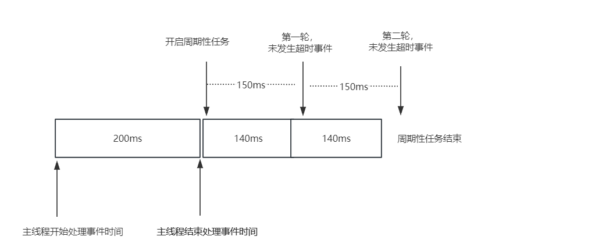
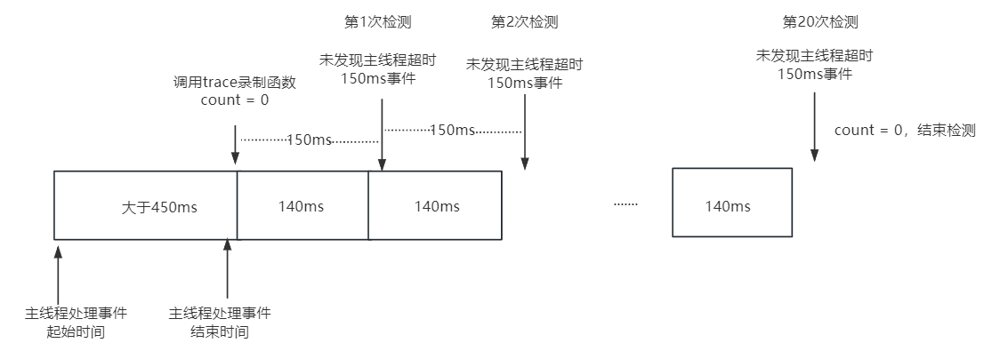

# 主线程超时事件介绍

## 简介

当应用主线程执行耗时任务时, 用户感知到应用卡顿, 但没有达到卡死时间限制, 没有生成故障日志, 不方便开发者定位问题。 因此提供了主线程执行任务超时检测机制, 生成采样调用栈文件或者trace文件, 支撑开发者定位分析主线程任务执行情况。

开发者可以通过hiappevent接口订阅主线程超时事件, 获取维测信息。

- [订阅主线程超时事件(ArkTS)](hiappevent-watcher-mainthreadjank-events-arkts.md)；
- [订阅主线程超时事件(C/C++)](hiappevent-watcher-mainthreadjank-events-ndk.md)。

## 主线程超时事件默认时间规格

主线程超时150ms~450ms, 触发采样调用栈流程；主线程超时450ms, 触发采集trace流程。

1. 启动时间

    主线程超时采样栈(150ms < 主线程处理时长 < 450ms)。**同一个应用的PID一个生命周期仅会触发一次主线程超时事件采样栈。开发者选项打开, 一小时一次。应用启动10s内不进行检测。**

    主线程超时采样Trace（主线程处理时长 > 450ms）。**同一个应用的UID一天仅会触发一次主线程超时事件采样trace。**

    > **注意：**
    >
    > 启动主线程超时检测抓取trace的功能的前提：**开发者使用nolog版本，开发者模式处于关闭状态**；
    >
    > log和nolog版本：在手机中，点击设置——搜索关键字“关于本机”——软件版本进行查看。log版本会以log结尾；
    >
    > 关闭开发者模式后，可能无法使用DevEco Studio。因此，可以提前安装应用，再关闭。

2. 抓栈时间

    主线程处理事件超时后, 开始执行周期性任务检测, 每隔150ms检测主线程是否再次发生超时事件(1 <= 检测次数 <= 2), 共三种情况：

    (1) 第一次检测发现超时事件, 开始执行堆栈采样, 每隔150ms采样一次, 共采样10次堆栈, 第11次收集堆栈并上报事件, 结束检测。

    

    (2) 第一次检测未发生超时事件, 第二次检测发现超时事件, 开始执行堆栈采样, 每隔150ms采样一次, 共采样10次堆栈, 第11次收集堆栈并上报事件, 结束检测。

    

    (3) 两次检测均未发现超时事件, 结束检测。

    

3. 抓trace时间  

   主线程超时抓Trace调用录制函数后, 每隔150ms检测主线程是否再次发生超时事件(检测次数 = 20), 其中, 只要在20个间隔检测时, 有一次主线程事件超时150ms, 3s检测结束后落盘trace。

   (1) 20次检测均未发生主线程超时150ms事件。

   

   (2) 20次检测至少有一次发生主线程超时150ms事件。

   

## 自定义采样栈参数介绍

系统提供了基础的主线程超时检测功能，一些应用主线程对检测事件的检测间隔、采集次数等有更高的要求，因此开放可配置参数的接口提供给开发者使用。

API接口的具体使用说明（参数使用限制、具体取值范围等）请参考[应用事件打点seteventconfig接口说明](../reference/apis-performance-analysis-kit/js-apis-hiviewdfx-hiappevent.md#hiappeventseteventconfig15)。

### 接口说明

| 接口名                                                                                | 描述                                         |
| -------------------------------------------------------------------------------------| -------------------------------------------- |
| setEventConfig(name: string, config: Record<string, ParamType>): Promise\<void>       | 设置主线程采样栈参数接口。 **现阶段仅提供MAIN_THREAD_JANK事件参数自定义, 因此name为MAIN_THREAD_JANK。** |

### 参数设置说明

开发者可以使用上述hiappevent提供的接口, 在Record<string, ParamType>中自定义配置采集MAIN_THREAD_JANK事件的参数。

开发者通过设置log_type(采集MAIN_THREAD_JANK事件日志类型)的值，定制不同的MAIN_THREAD_JANK事件的规格, 具体规格如下：

1. log_type设置0: 默认值, 采集调用栈150ms~450ms, 采集trace阈值450ms。如果之前使用log_type=1设置过抓采样栈参数，自定义参数无效。参数配置示例如下：

    ```text
        let params: Record<string, hiAppEvent.ParamType> = {
        "log_type": "0"
        };
    ```

2. log_type设置1: 采集调用栈, 触发检测的阈值用户自定义。需要配置采样栈相关的参数, 具体参数如下：

    (1) sample_interval: 主线程超时采样检测间隔。系统根据开发者设置的interval进行超时检测判断, 并使用该interval作为周期性任务检测的间隔。范围: `[50, 500](单位: ms)`。默认值: 150ms。

    (2) ignore_startup_time: 线程启动一定时间内, 不进行超时检测。一些进程启动时间较长, 此时抓全的超时采样栈, 分析意义不大。因此, 在开发者定义启动时间间隔内, 不进行超时检测。最小值：3s。默认值: 10s。

    (3)  sample_count: 主线程超时采样次数。系统检测到当前主线程执行任务超过采样限制后, 开始周期性采集堆栈, 每个间隔采集一次堆栈, 共采集sample_count次。最小值：1次，最大值需要结合自定义的sample_interval进行动态计算, 计算公式：**sample_count <= (2500 / sample_interval - 4)**。开发者要结合需求场景, 进行合理的设置。

    > **说明：**
    >
    > 2500的含义: 根据系统规定, 主线程超时事件从检测到上报的时间不可以超过2.5s(2500ms)。因此sample_count的设置值不能超过系统按计算公式得出的最大值。
    >
    > 4的含义: 第一次超时间隔检测时间 + 第二次超时间隔（系统提供两次再次发生超时事件的检测机会）时间 + 收集并上报堆栈信息的时间。

    (4)  report_times_per_app: 同一个应用的PID一个生命周期内, 主线程超时采样上报次数。一个生命周期内只能设置一次。

    > **说明：**
    >
    > 开发者选项打开, 每小时范围: [1, 3](单位: 次), 默认值: 1次；
    >
    > 开发者选项关闭, 每天上报次数范围: [1, 3](单位: 次), 默认值: 1次。

    参数配置示例如下:

    ```text
        let params: Record<string, hiAppEvent.ParamType> = {
        "log_type": "1",
        "sample_interval": "100",
        "ignore_startup_time": "11",
        "sample_count": "21",
        "report_times_per_app": "3",
        };
    ```

3. log_type设置2: 收集trace, 触发检测的阈值450ms。参数配置示例如下:

    ```text
        let params: Record<string, hiAppEvent.ParamType> = {
        "log_type": "2"
        };
    ```

## 主线程超时事件规格

1. 日志老化规格

    一般情况, 栈文件的大小为7-10KB, trace大小为1-5M。应用沙箱内的watchdog目录最大保存10M内容, 超出后, 需要用户手动清理文件。目录地址: /data/app/el2/100/log/应用bundle name/watchdog。

2. 事件里如何获取日志

    从external_logs中获取日志路径。

3. 抓栈功能目前只支持ARM64架构, 抓栈结果为解析后的混合栈信息, 包含native帧和JS帧。

   抓栈结果部分示例如下：

    ```text
    9 #00 pc 0000757c /system/bin/appspawn(55679d09bcdea35bb1e0d4e1d9a3e58f)
        9 #01 pc 000731c0 /system/lib/ld-musl-aarch64.so.1(add9e521e4eaf5cb009d4260f3b69ccd)
            9 #02 pc 000090a9 /system/bin/appspawn(main+396)(55679d09bcdea35bb1e0d4e1d9a3e58f)
                9 #03 pc 0000ab5d /system/bin/appspawn(AppSpawnRun+100)(55679d09bcdea35bb1e0d4e1d9a3e58f)
                    9 #04 pc 0000e7f1 /system/lib/chipset-pub-sdk/libbegetutil.z.so(RunLoop_+200)(52ace27d827ad482439bf32cc75bb17b)
                    ......
                                            9 #21 pc 00107aec /system/lib/ld-musl-aarch64.so.1(__pthread_cond_timedwait+628)(add9e521e4eaf5cb009d4260f3b69ccd)
    1 #00 pc 00032e67 /system/lib/platformsdk/libmmi-util.z.so(OHOS::MMI::UDSSocket::OnReadPackets(OHOS::MMI::CircleStreamBuffer&, std::__h::function<void (OHOS::MMI::NetPacket&)>)+158)(99e56bc765f9208f7b7ba8b268886a59)
        1 #01 pc 0000312e5 /system/lib/platformsdk/libmmi-client.z.so(OHOS::MMI::ClientMsgHandler::OnMsgHandler(OHOS::MMI::UDSClient const&, OHOS::MMI::NetPacket&)+340)(66ac85e964777ae89f0c26c339093cd1)
            1 #02 pc 0003016b /system/lib/platformsdk/libmmi-client.z.so(OHOS::MMI::ClientMsgHandler::OnPointerEvent(OHOS::MMI::UDSClient const&, OHOS::MMI::NetPacket&)+1222)(66ac85e964777ae89f0c26c339093cd1)
                1 #03 pc 0003b96b /system/lib/platformsdk/libmmi-client.z.so(OHOS::MMI::InputManagerImpl::OnPointerEvent(std::__h::shared_ptr<OHOS::MMI::PointerEvent>)+1370)(66ac85e964777ae89f0c26c339093cd1)
                    1 #04 pc 00095903 /system/lib/platformsdk/libwm.z.so(OHOS::Rosen::InputEventListener::OnInputEvent(std::__h::shared_ptr<OHOS::MMI::PointerEvent>) const+478)(9c40c5f416d6f830435126998fbcad42)
                    ......
                                            1 #21 pc 003f5c55 /system/lib/platformsdk/libark_jsruntime.so(4e6a2651ec80a7f639233f414d6486fe)
                                                1 #22 at anonymous (/entry/build/default/cache/default/default@CompileArkTS/esmodule/debug/entry/src/main/ets/pages/Index.js:67:17)
                                                    1 #23 at wait2 (/entry/build/default/cache/default/default@CompileArkTS/esmodule/debug/entry/src/main/ets/pages/Index.js:16:12)
                                                    ......
    ```

   每次抓栈拷贝16KB主线程调用栈信息进行回栈解析, 所以每一次抓栈结果最多可以展示进程16KB调用信息, 共进行10次, 重复栈帧会聚合在一起, 不同调用层次通过行缩进进行区分, 最终以树型方式进行展示。当抓栈失败（如主线程阻塞在内核或信号被屏蔽等情况）时, 将会输出"/proc/self/wchan"文件内容。

   展示结果中每一行表示一个栈信息, 每一行栈帧信息所表示的意义可以按如下方式解读：

   native帧格式如下：

    ```text
    9 #02 pc 000090a9 /system/bin/appspawn(main+396)(55679d09bcdea35bb1e0d4e1d9a3e58f)
    ^  ^       ^               ^              ^                   ^ 
    1  2       3               4              5                   6

    1 表示采样到此帧的次数
    2 表示帧的调用层级, 行缩进大小与该层级对应, 所有同一层级帧采样到的次数和不大于10次, #00采样次数和为10(设置采样的次数)
    3 为native帧PC值
    4 表示调用的文件路径
    5 调用的函数名及代码行偏移(unstripped版本, stripped版本可能没有)
    6 so文件md5值
    ```

   JS帧格式如下：

    ```text
    1 #23 at wait2 (/entry/build/default/cache/default/XXX/entry/src/main/ets/pages/Index.js:16:12)
    ^  ^    ^               ^
    1  2    3               4

    1 表示采样到此帧的次数, 同样最大为采样次数
    2 表示帧的调用层级, 与native帧意义相同
    3 表示调用函数名wait2
    4 表示调用函数所在的路径, 文件及行列号
    ```

4. trace规格简介

    trace大小为1-5M, 对于trace文件的解析可以使用[smpartperf在线工具](https://www.smartperf.host)进行解读。

    导入trace文件后页面解读: 从上往下主要展示时间轴、cpu使用率、cpu使用情况、进程间通讯数据的方法调用情况、进程、线程和方法调用情况, 由此可以在事件维度上对这些数据进行直观展示。

    更多对trace文件使用的介绍可以参考: [web端加载trace说明](https://gitee.com/openharmony/developtools_smartperf_host/blob/master/ide/src/doc/md/quickstart_systemtrace.md)。

## 事件params属性描述

| 名称    | 类型   | 说明                       |
| ------- | ------ | ------------------------- |
| time     | number | 事件触发时间, 单位为毫秒。 |
| bundle_version | string | 应用版本。 |
| bundle_name | string | 应用名称。 |
| pid | number | 应用的进程id。|
| uid | number | 应用的用户id。 |
| begin_time | number | 主线程任务开始时间。 |
| end_time | number | 主线程任务结束时间。 |
| external_log| string[] | 主线程超时日志文件路径。**为避免目录空间超限（限制参考log_over_limit）, 导致新生成的日志文件写入失败, 日志文件处理完后请及时删除。** |
| log_over_limit| boolean | 生成的主线程超时日志文件与已存在的日志文件总大小是否超过10M上限。true表示超过上限, 日志写入失败；false表示未超过上限。|
| app_start_jiffies_time| number | 开发者可以获取主线程超时事件时，任务执行的开始时间。**触发采样栈, 打印开始时间信息。**|
| heaviest_stack| string | 生成的主线程超时日志文件中, 打印多次的调用栈。**触发采样栈, 打印多次的调用栈信息。**|
