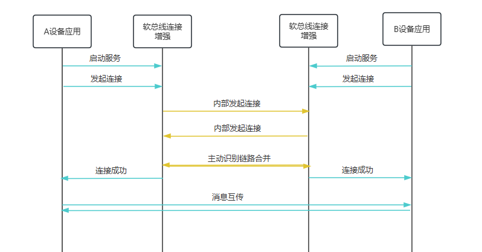

# 增强连接开发指导
<!--Kit: Distributed Service Kit-->
<!--Subsystem: DistributedSched-->
<!--Owner: @wangJE-->
<!--SE: @lee_jet520-->
<!--TSE: @Ytt-test-->
## 简介

随着技术的发展，各种应用层出不穷，设备间的互联关系也成为一种常态，此时对于网络环境的依赖也不可避免。然而，在某些特殊场景下（如航空、远洋航行等），网络受限，蓝牙成为少数可行的连接方式。但是传统蓝牙连接存在着连接数量有限、连接成功率低、连接不稳定等缺点，影响了用户体验。

OpenHarmony提供了分布式增强连接能力，实现跨设备互联，完成与对端设备的连接，交换应用业务数据。相比传统蓝牙连接，使用多通道合并算法，增加设备连接数量，增强连接稳定性，提升跨端互通体验。

### 实现原理

在设备互联过程中，发现对端的蓝牙地址并建立物理链路；在多设备互联场景下，通过特有的多通道合并算法，在保证设备间交互能力的前提下，减少实际物理链路的个数，达到设备间可用连接数增大、降低干扰提升通信的稳定性的效果。

两个设备的交互实现如下，在使用linkEnhance能力后，当两端同时发起连接时，会自动识别合并底层多余物理链路，减少实际物理链路的个数，减少蓝牙链路资源的消耗，增加可用连接数量。



### 约束与限制

- 设备互联时需要开启蓝牙功能。

- 通过蓝牙广播/扫描接口获取对端设备BLE MAC。[蓝牙ble接口参见](../connectivity/bluetooth/ble-development-guide.md)

- 不同设备间只有相同bundleName的应用才能进行互联。

- 需要配置ohos.permission.DISTRIBUTED_DATASYNC权限。

- 该接口提供连接能力，链路安全略与蓝牙配对策略保持一致，例如Numeric Comparion、Passkey Entry、Just Works、Out of Band四种安全配对方式。

## 环境准备

### 环境要求

打开客户端和服务端设备的蓝牙开关。

### 搭建环境

1. 在PC上安装[DevEco Studio](https://developer.huawei.com/consumer/cn/download/deveco-studio)，版本要求在4.1及以上。
2. 将public-SDK更新到API 20或以上<!--Del-->，具体操作参见[更新指南](../tools/openharmony_sdk_upgrade_assistant.md)<!--DelEnd-->。
3. 用USB线缆将两台调测设备（设备A和设备B）连接到PC。
4. 打开设备A和设备B的蓝牙开关。

## 接口说明

常用接口说明如下表。更多接口的详细介绍参考@ohos.distributedsched.linkEnhance[增强连接](../reference/apis-distributedservice-kit/js-apis-link-enhance.md)。

| 接口名                                      | 功能描述                                                                                               |
| ------------------------------------------ | ------------------------------------------------------------------------------------------------------ |
| connect()                                  | Client端发起连接远端设备。                                                                               |
| disconnect()                               | 断开与远端设备的连接。                                                                          |
| close()                                    | 销毁Connection对象，注销所有注册的事件，调用该接口后Connection对象将不能再使用。                                 |
| getPeerDeviceId()                          | 获取远端设备的deviceId。                                                                           |
| sendData(data:ArrayBuffer)                 | 向远端设备发送数据。                                                                                     |
| on(type: 'connectResult')                  | 订阅连接结果通知变化的事件。                                                                              |
| on(type: 'disconnected')                   | 订阅连接状态断开的事件。                                                                                  |
| on(type: 'dataReceived')                   | 注册收数据的通知事件。                                                                                    |
| createConnection(deviceId：string,name:string)| 创建一个connection对象。                                                                              |
| start()                                    | 服务端开启服务。                                                                                         |   
| stop()                                     | 服务端停止服务。                                                                                           |
| close()                                    | 销毁Server对象，注销已注册的服务并取消已订阅的所有事件，调用该接口后Server对象将不能再使用。                    |
| on(type: 'acceptConnected')                | Server端订阅收到对端连接的事件。                                                                           |
| on(type: 'serverStopped')                  | Server端订阅服务状态停止的事件。                                                                           |
| createServer(name: string)                 | 创建一个server对象。                                                                                      |

## 增强连接开发指导

- 服务端开启蓝牙后，创建Server对象，并调用start()接口开启服务，让服务端处于可连接状态，通过注册的事件监听，监听事件的变化通知。
- 客户端开启蓝牙后，创建Connection对象，并调用connect()接口发起连接，通过注册的事件监听，监听事件的变化通知。
- 连接成功后，可以使用sendData接口发送数据。

### 服务端开发指导
1. 导入所需的模块。
    ```ts
    import {linkEnhance} from '@kit.DistributedServiceKit';
    import { BusinessError } from '@kit.BasicServicesKit';
    ```
2. 在module.json5配置文件中配置分布式数据同步权限ohos.permission.DISTRIBUTED_DATASYNC。

   ```ts
   {
     "module" : {
       "requestPermissions":[
         {
           "name" : "ohos.permission.DISTRIBUTED_DATASYNC",
           "reason": "$string:distributed_permission",
           "usedScene": {
             "abilities": [
               "MainAbility"
             ],
             "when": "inuse"
           }
         }
       ]
     }
   }
   ```
3. 创建server对象，并开启服务，注册监听。
    ```ts
    const TAG = 'TEST';
    // server端注册服务
    linkEnhanceStart(name: string) {
      console.info(TAG + 'start server deviceId = ' + name);
      try {
      // 使用服务名构造Server
      let server: linkEnhance.Server = linkEnhance.createServer(name);

        // 订阅服务接收事件和服务停止事件
        server.on('connectionAccepted', (connection: linkEnhance.Connection): void => {
          console.info(TAG + 'serverOnCallback');
        });
        server.on('serverStopped', (reason: number): void => {
          console.info(TAG, 'serverStopped， reason= ' + reason);
        });
        // 启动服务
        server.start();
      } catch (err) {
        console.error(TAG + 'start server errCode: ' + (err as BusinessError).code + ', errMessage: ' +
        (err as BusinessError).message);
      }
    }
    ```
5. 当连接被连上时，需要保存connection对象。
    ```ts
    serverAcceptOnCallback = (connection: linkEnhance.Connection): void => {
      console.info(TAG + 'serverOnCallback');
      try {

        // 收到连接请求后，订阅connection的断连事件。
        connection.on('disconnected', (reason: number)=> {
          console.info(TAG + 'disconnected, reason = ' + reason);
        });
        // 收到连接请求后，订阅connection的数据接收事件。
        connection.on('dataReceived', (data: ArrayBuffer)=> {
          console.info(TAG + 'dataReceived, dataLen=' + data.byteLength);
        });

        let len = 1;
        let arraybuffer = new ArrayBuffer(len);
        // 向远端发送数据。
        connection.sendData(arraybuffer);
      } catch (err) {
        console.error(TAG + 'server on callback errCode: ' + (err as BusinessError).code + ', errMessage: ' +
        (err as BusinessError).message);
      }
    }
    ```
6. 断开连接并销毁Connection对象。
    ```ts
    // 断连接。
    linkEnhanceDisconnect(connection: linkEnhance.Connection) {
      console.info(TAG + 'disconnect deviceId = ' + connection.getPeerDeviceId());
      try {
        connection.disconnect();
        connection.close();
      } catch (err) {
        console.error(TAG + 'disconnect errCode: ' + (err as BusinessError).code + ', errMessage: ' +
        (err as BusinessError).message);
      }
    }
    ```
7. 停止服务并销毁server对象。
    ```ts
    // Server端停止服务
    linkEnhanceStop(server: linkEnhance.Server) {
      console.info(TAG + 'stop server');
      try {
        server.stop();
      } catch (err) {
        console.info(TAG + 'stop server errCode: ' + (err as BusinessError).code + ', errMessage: ' +
        (err as BusinessError).message);
      }
    }
    // Server端停止服务并取消所有的订阅事件
    linkEnhanceClose(server: linkEnhance.Server) {
      console.info(TAG + 'close server' );
      try {
        server.close();
      } catch (err) {
        console.error(TAG + 'close server errCode: ' + (err as BusinessError).code + ', errMessage: ' +
        (err as BusinessError).message);
      }
    }
    ```

### 客户端开发指导

1. 导入所需的模块。
    ```ts
    import linkEnhance from '@kit.DistributedServiceKit';
    import { BusinessError } from '@kit.BasicServicesKit';
    ```
2. 在module.json5配置文件中配置分布式数据同步权限ohos.permission.DISTRIBUTED_DATASYNC。
   ```ts
   {
     "module" : {
       "requestPermissions":[
         {
           "name" : "ohos.permission.DISTRIBUTED_DATASYNC",
           "reason": "$string:distributed_permission",
           "usedScene": {
             "abilities": [
               "MainAbility"
             ],
             "when": "inuse"
           }
         }
       ]
     }
   }
   ```
3. 创建connection对象，订阅连接结果通知变化的事件，连接服务端。
    ```ts
    const TAG = "testDemo";
    // client端主动连接时调用
    linkEnhanceConnect(peerDeviceId: string) {
      console.info(TAG + 'connection server deviceId = ' + peerDeviceId);
      try {
        // 使用peerDeviceId构造Connection后续的交互都需要使用该对象
        let connection: linkEnhance.Connection = linkEnhance.createConnection(peerDeviceId, "demo");
        // 订阅连接结果
        connection.on('connectResult', (data: linkEnhance.ConnectResult): void => {
          console.info(TAG + 'clientConnectResultCallback result = ' + data.success);
          if (data.success) {
            // 向服务端发送数据
            let len = 1;
            let arraybuffer = new ArrayBuffer(len);
            connection.sendData(arraybuffer);
          }
        });
        connection.on('disconnected', (reason: number)=> {
          console.info(TAG + 'disconnected reason = ' + reason);
        });
        connection.on('dataReceived', (data: ArrayBuffer)=> {
        console.info(TAG + 'dataReceived, dataLen=' + data.byteLength);
        });
        // 发起连接
        connection.connect();
      } catch (err) {
        console.error(TAG + 'connect errCode: ' + (err as BusinessError).code + ', errMessage: ' +
        (err as BusinessError).message);
      }
    }
    ```
4. 断开连接，销毁Connection对象。
    ```ts
    disconnect(connection: linkEnhance.Connection) {
      console.info(TAG + 'disconnect deviceId = ' + connection.getPeerDeviceId());
      try {
        connection.disconnect();
        connection.close();
      } catch (err) {
        console.error(TAG + 'disconnect errCode: ' + (err as BusinessError).code + ', errMessage: ' +
        (err as BusinessError).message);
      }
    }
    ```


