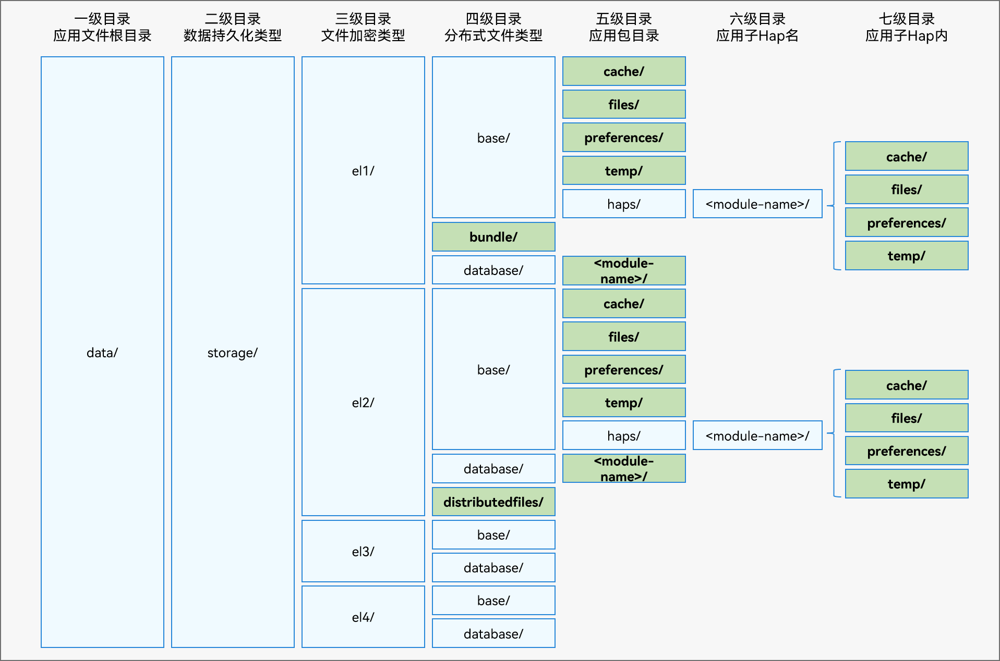

# 应用沙箱目录

应用沙箱是一种以安全防护为目的的隔离机制，避免数据受到恶意路径穿越访问。在这种沙箱的保护机制下，应用可见的目录范围即为“应用沙箱目录”。

- 对于每个应用，系统会在内部存储空间映射出一个专属的“应用沙箱目录”，它是“[应用文件目录](#应用文件目录与应用文件路径)”与一部分系统文件（应用运行必需的少量系统文件）所在的目录组成的集合。

- 应用沙箱限制了应用可见的数据的最小范围。在“应用沙箱目录”中，应用仅能看到自己的应用文件以及少量的系统文件（应用运行必需的少量系统文件）。因此，本应用的文件也不为其他应用可见，从而保护了应用文件的安全。

- 应用可以在“应用文件目录”下保存和处理自己的应用文件；系统文件及其目录对于应用是只读的；而应用若需访问[用户文件](user-file-overview.md)，则需要通过特定API同时经过用户的相应授权才能进行。

下图展示了应用沙箱下，应用可访问的文件范围和方式。

**图1** 应用沙箱文件访问关系图  

## 应用沙箱目录与应用沙箱路径

在应用沙箱保护机制下，应用无法获知除自身应用文件目录之外的其他应用或用户的数据目录位置及存在。同时，所有应用的目录可见范围均经过权限隔离与文件路径挂载隔离，形成了独立的路径视图，屏蔽了实际物理路径：

- 如下图所示，在普通应用（也称三方应用）视角下，不仅可见的目录与文件数量限制到了最小范围，并且可见的目录与文件路径也与系统进程等其他进程看到的不同。我们将普通应用视角下看到的“应用沙箱目录”下某个文件或某个具体目录的路径，称为“应用沙箱路径”。

<!--RP1-->
- 一般情况下，开发者的hdc shell环境等效于系统进程视角，因此“应用沙箱路径”与开发者使用hdc工具调试时看到的真实物理路径不同，其对应关系详见[应用沙箱路径和真实物理路径的对应关系](#应用沙箱路径和真实物理路径的对应关系)。
<!--RP1End-->

- 实际物理路径与沙箱路径并非1:1的映射关系，沙箱路径总是少于系统进程视角可见的物理路径。部分调试进程视角下的物理路径在对应的应用沙箱目录下没有对应路径。

**图2** 应用沙箱路径（不同权限与角色的进程下可见的文件路径不同）  

## 应用文件目录与应用文件路径

如前文所述，“应用沙箱目录”内分为两类：应用文件目录和系统文件目录。

系统文件目录对应用的可见范围由OpenHarmony系统预置，开发者无需关注。

在此主要介绍应用文件目录，如下图所示。应用文件目录下某个文件或某个具体目录的路径称为应用文件路径。应用文件目录下的各个文件路径，具备不同的属性和特征。

**图3** 应用文件目录结构图  

> **说明：**
>
> - 禁止直接使用上图中四级目录之前的目录名组成的路径字符串，否则可能导致后续应用版本因应用文件路径变化导致不兼容问题。
> - 应通过Context属性获取应用文件路径，包括但不限于上图中绿色背景的路径。 Context上下文获取及上述应用文件路径的获取，详见[应用上下文Context](../application-models/application-context-stage.md)。

1. 一级目录data/：代表应用文件目录。

2. 二级目录storage/：代表本应用持久化文件目录。

3. 三级目录el1/、el2/：代表不同文件加密类型。
   - el1，设备级加密区：设备开机后即可访问的数据区。
   - el2，用户级加密区：设备开机后，需要至少一次解锁对应用户的锁屏界面（密码、指纹、人脸等方式或无密码状态）后，才能够访问的加密数据区。 
   应用如无特殊需要，应将数据存放在el2加密目录下，以尽可能保证数据安全。但是对于某些场景，一些应用文件需要在用户解锁前就可被访问，例如时钟、闹铃、壁纸等，此时应用需要将这些文件存放到设备级加密区（el1）。切换应用文件加密类型目录的方法请参见[获取和修改加密分区](../application-models/application-context-stage.md#获取和修改加密分区)。

4. 四级、五级目录：
   通过ApplicationContext可以获取distributedfiles目录或base下的files、cache、preferences、temp等目录的应用文件路径，应用全局信息可以存放在这些目录下。

   通过UIAbilityContext、AbilityStageContext、ExtensionContext可以获取HAP级别应用文件路径。HAP信息可以存放在这些目录下，存放在此目录的文件会跟随HAP的卸载而删除，不会影响App级别目录下的文件。在开发态，一个应用包含一个或者多个HAP，详见[Stage模型应用程序包结构](../quick-start/application-package-structure-stage.md)。

   应用文件路径具体说明及生命周期如下表所示。

   **表1** 应用文件路径详细说明

   | 目录名 | Context属性名称 | 类型 | 说明 |
   | -------- | -------- | -------- | -------- |
   | bundle | bundleCodeDir | 安装文件路径 | 应用安装后的App的HAP资源包所在目录；随应用卸载而清理。 不能拼接路径访问资源文件，请使用[资源管理接口](../reference/apis-localization-kit/js-apis-resource-manager.md)访问资源。 可以用于存储应用的代码资源数据，主要包括应用安装的HAP资源包、可重复使用的库文件以及插件资源等。此路径下存储的代码资源数据可以被用于动态加载。|
   | base | NA | 本设备文件路径 | 应用在本设备上存放持久化数据的目录，子目录包含files/、cache/、temp/和haps/；随应用卸载而清理。 |
   | database | databaseDir | 数据库路径 | 应用在el2加密条件下存放通过分布式数据库服务操作的文件目录；随应用卸载而清理。 仅用于保存应用的私有数据库数据，主要包括数据库文件等。此路径下仅适用于存储分布式数据库相关文件数据。 |
   | distributedfiles | distributedFilesDir | 分布式文件路径 | 应用在el2加密条件下存放分布式文件的目录，应用将文件放入该目录可分布式跨设备直接访问；随应用卸载而清理。 可以用于保存应用分布式场景下的数据，主要包括应用多设备共享文件、应用多设备备份文件、应用多设备群组协助文件。此路径下存储这些数据，使得应用更加适合多设备使用场景。 |
   | files | filesDir | 应用通用文件路径 | 应用在本设备内部存储上通用的存放默认长期保存的文件路径；随应用卸载而清理。 可以用于保存应用的任何私有数据，主要包括用户持久性文件、图片、媒体文件以及日志文件等。此路径下存储这些数据，使得数据保持私有、安全且持久有效。 |
   | cache | cacheDir | 应用缓存文件路径 | 应用在本设备内部存储上用于缓存下载的文件或可重新生成的缓存文件的路径，应用cache目录大小超过配额或者系统空间达到一定条件，自动触发清理该目录下文件；用户通过系统空间管理类应用也可能触发清理该目录。应用需判断文件是否仍存在，决策是否需重新缓存该文件。 可以用于保存应用的缓存数据，主要包括离线数据、图片缓存、数据库备份以及临时文件等。此路径下存储的数据可能会被系统自动清理，因此不要存储重要数据。 |
   | preferences | preferencesDir | 应用首选项文件路径 | 应用在本设备内部存储上通过数据库API存储配置类或首选项的目录；应用在本设备内部存储上通过数据库API存储配置类或首选项的目录；随应用卸载而清理。详见[通过用户首选项实现数据持久化](../database/data-persistence-by-preferences.md)。  可以用于保存应用的首选项数据，主要包括应用首选项文件以及配置文件等。此路径下仅适用于存储小量数据。|
   | temp | tempDir | 应用临时文件路径 | 应用在本设备内部存储上仅在应用运行期间产生和需要的文件，应用退出后即清理。 可以用于保存应用的临时生成的数据，主要包括数据库缓存、图片缓存、临时日志文件、以及下载的应用安装包文件等。此路径下存储使用后即可删除的数据。 |

## 应用沙箱路径和真实物理路径的对应关系

在应用沙箱路径下读写文件，经过映射转换，实际读写的是真实物理路径中的应用文件，应用沙箱路径与真实物理路径对应关系如下表所示。

其中&lt;USERID&gt;当前固定为100,&lt;EXTENSIONPATH&gt;为moduleName-extensionName。应用是否以Extension独立沙箱运行可参考[ExtensionAbility组件](../application-models/extensionability-overview.md)。

| 应用沙箱路径 | 物理路径 | 说明 |
| -------- | -------- | -------- |
| /data/storage/el1/bundle | /data/app/el1/bundle/public/&lt;PACKAGENAME&gt; | 应用安装包目录 |
| /data/storage/el1/base | /data/app/el1/&lt;USERID&gt;/base/&lt;PACKAGENAME&gt; /data/app/el1/&lt;USERID&gt;/base/+extension-&lt;EXTENSIONPATH&gt;+&lt;PACKAGENAME&gt; | 应用el1级别加密数据目录; 以独立沙箱运行的Extension应用el1级别加密数据目录 |
| /data/storage/el2/base | /data/app/el2/&lt;USERID&gt;/base/&lt;PACKAGENAME&gt; /data/app/el2/&lt;USERID&gt;/base/+extension-&lt;EXTENSIONPATH&gt;+&lt;PACKAGENAME&gt; | 应用el2级别加密数据目录; 以独立沙箱运行的Extension应用el2级别加密数据目录 |
| /data/storage/el1/database | /data/app/el1/&lt;USERID&gt;/database/&lt;PACKAGENAME&gt; /data/app/el1/&lt;USERID&gt;/database/+extension-&lt;EXTENSIONPATH&gt;+&lt;PACKAGENAME&gt; | 应用el1级别加密数据库目录; 以独立沙箱运行的Extension应用el1级别加密数据库目录 |
| /data/storage/el2/database | /data/app/el2/&lt;USERID&gt;/database/&lt;PACKAGENAME&gt; /data/app/el2/&lt;USERID&gt;/database/+extension-&lt;EXTENSIONPATH&gt;+&lt;PACKAGENAME&gt; | 应用el2级别加密数据库目录; 以独立沙箱运行的Extension应用el2级别加密数据库目录 |
| /data/storage/el2/distributedfiles | /mnt/hmdfs/&lt;USERID&gt;/account/merge_view/data/&lt;PACKAGENAME&gt; | 应用el2加密级别有帐号分布式数据融合目录 |
