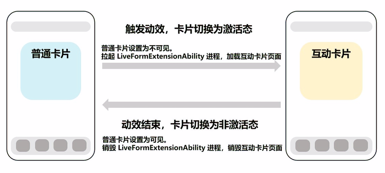
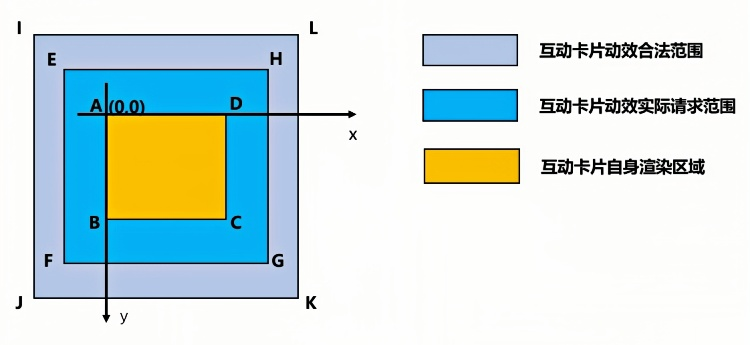

# 场景动效类型互动卡片概述

场景动效类型互动卡片，支持卡片在特定场景下触发互动卡片特有动效，例如开发者可以选择将动效渲染区域超出卡片边框。本文档针对场景其基本概念、原理以及约束进行阐述。

## 基本概念

场景动效类型互动卡片主要包含两个状态：激活态和非激活态。卡片首次加桌、卡片数据定时或定点刷新，或者用户点击等用户主动与卡片交互的场景下，可以触发卡片动效，卡片切换至激活态，卡片动效结束，切回非激活态。

**非激活态**：在此状态下，卡片与普通卡片行为无异，遵循既有的卡片开发规范，卡片 UI 由卡片提供方 widgetCard.ets 中的内容所承载。。

**激活态**： 表示互动卡片动效渲染状态，在此状态下，卡片 UI 由卡片提供方所开发的 LiveFormExtensionAbility 对应 page 页面完成渲染。详细可参考[场景动效类型互动卡片开发指导](arkts-ui-liveform-sceneanimation-development.md)。

图1 互动卡片状态切换说明

图2 互动卡片动效触发流程

## 实现原理

开发者可以通过 [formProvider.requestOverflow](../reference/apis-form-kit/js-apis-app-form-formProvider.md#formproviderrequestoverflow20) 接口触发互动卡片动效，例如在用户点击时触发，典型时序图如下。

图3 点击触发互动卡片动效时序图

在卡片定时定点刷新场景下，典型时序图如下。

图4 定时定点触发互动卡片动效时序图

## 约束和限制

### 请求参数约束
1. 最大合法动效时长： 3500ms <!--Del-->（系统应用不做限制）<!--DelEnd-->。
2. 由卡片定时定点刷新触发的互动卡片动效，一天内单张卡片最多触发 50 次。
3. 最大可申请动效区域：如下图，矩形 ABCD 是卡片自身大小，矩形 IJKL 是卡片最大可申请动效区域。两个矩形中心对齐。尺寸满足以下表格描述。

| 卡片样式 | JK 边长 | IJ 边长 | 
| ------ | ------ | ---- |
| 1 * 2 | 不超过 AD 边长的 150% | 不超过 AB 边长的 200% |
| 2 * 2 | 不超过 AD 边长的 150% | 不超过 AB 边长的 150% |
| 2 * 4 | 不超过 AD 边长的 125% | 不超过 AB 边长的 150% |
| 4 * 4 | 不超过 AD 边长的 125% | 不超过 AB 边长的 125% |
| 6 * 4 | 不超过 AD 边长的 125% | 不超过 AB 边长的 110% |

图5 互动卡片动效区域申请规则说明

卡片加桌过程时，[onUpdateForm](../reference/apis-form-kit/js-apis-app-form-formExtensionAbility.md#formextensionabilityonupdateform) 生命周期回调中，通过 wantParams 中返回卡片实际尺寸，并以此计算动效申请范围，坐标计算时，以 A 点为（0,0）点，计算矩形 EFGH 对应参数，单位为 vp。

调用 formProvider.requestOverflow 接口时，[overflowInfo](../reference/apis-form-kit/js-apis-app-form-formInfo.md#overflowinfo20) 中描述的互动卡片动效渲染区域（矩形 EFGH）需要满足：
1. 完整包含了卡片（矩形 ABCD）。
2. 不超过矩形 IJKL（矩形 IJKL 完整包含矩形 EFGH）<!--Del-->（系统应用不做该限制）<!--DelEnd-->。

具体可参考[场景动效类型互动卡片开发指导](arkts-ui-liveform-sceneanimation-development.md#动效申请与业务编排)。

### 多卡片动效竞争管理

1. 同一时刻，全局只有一个卡片执行互动卡片动效。
2. 最高优先级响应用户点击触发动效。用户点击时，当前卡片切换到激活态，执行动效；其他卡片动效打断，回到非激活态。
3. 其他触发方式，遵循先到先得原则。系统只处理第一合法动效请求。其他请求返回失败，同时不做缓存。
4. 用户在桌面的其他有效操作（点击应用、卡片等，滑动翻页，下拉进入全搜、双中心、拖动卡片等）均会打断当前动效，卡片重新变成非激活态。
<!--Del-->5. 系统应用可以通过禁用手势配置项方式禁用用户在桌面的某些操作，可参考[场景类型互动卡片开发指导（系统应用）](arkts-ui-liveform-sceneanimation-development-system.md)。<!--DelEnd-->