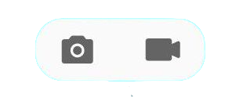

# 使用router事件跳转到指定UIAbility

在卡片中使用**postCardAction**接口的router能力，能够快速拉起卡片提供方应用的指定UIAbility，因此UIAbility较多的应用往往会通过卡片提供不同的跳转按钮，实现一键直达的效果。例如相机卡片，卡片上提供拍照、录像等按钮，点击不同按钮将拉起相机应用的不同UIAbility，从而提高用户的体验。



> **说明：**
>
> 本文主要介绍动态卡片的事件开发。对于静态卡片，请参见[FormLink](../reference/apis-arkui/arkui-ts/ts-container-formlink.md)。


通常使用按钮控件来实现页面拉起，示例代码如下:


- 在卡片页面中布局两个按钮，点击其中一个按钮时调用postCardAction向指定UIAbility发送router事件，并在事件内定义需要传递的内容。
  
  ```ts
  @Entry
  @Component
  struct WidgetEventRouterCard {
    build() {
      Column() {
        Text($r('app.string.JumpLabel'))
          .fontColor('#FFFFFF')
          .opacity(0.9)
          .fontSize(14)
          .margin({ top: '8%', left: '10%' })
        Row() {
          Column() {
            Button() {
              Text($r('app.string.ButtonA_label'))
                .fontColor('#45A6F4')
                .fontSize(12)
            }
            .width(120)
            .height(32)
            .margin({ top: '20%' })
            .backgroundColor('#FFFFFF')
            .borderRadius(16)
            .onClick(() => {
              postCardAction(this, {
                action: 'router',
                abilityName: 'EntryAbility',
                params: { targetPage: 'funA' }
              });
            })
  
            Button() {
              Text($r('app.string.ButtonB_label'))
                .fontColor('#45A6F4')
                .fontSize(12)
            }
            .width(120)
            .height(32)
            .margin({ top: '8%', bottom: '15vp' })
            .backgroundColor('#FFFFFF')
            .borderRadius(16)
            .onClick(() => {
              postCardAction(this, {
                action: 'router',
                abilityName: 'EntryAbility',
                params: { targetPage: 'funB' }
              });
            })
          }
        }.width('100%').height('80%')
        .justifyContent(FlexAlign.Center)
      }
      .width('100%')
      .height('100%')
      .alignItems(HorizontalAlign.Start)
      .backgroundImage($r('app.media.CardEvent'))
      .backgroundImageSize(ImageSize.Cover)
    }
  }
  ```
  
- 在UIAbility中接收router事件并获取参数，根据传递的params不同，选择拉起不同的页面。
  
  ```ts
  import type AbilityConstant from '@ohos.app.ability.AbilityConstant';
  import hilog from '@ohos.hilog';
  import UIAbility from '@ohos.app.ability.UIAbility';
  import type Want from '@ohos.app.ability.Want';
  import type window from '@ohos.window';
  
  const TAG: string = 'EntryAbility';
  const DOMAIN_NUMBER: number = 0xFF00;

  export default class EntryAbility extends UIAbility {
    private selectPage: string = '';
    private currentWindowStage: window.WindowStage | null = null;
  
    onCreate(want: Want, launchParam: AbilityConstant.LaunchParam): void {
      // 获取router事件中传递的targetPage参数
      hilog.info(DOMAIN_NUMBER, TAG, `Ability onCreate, ${JSON.stringify(want)}`);
      if (want.parameters !== undefined) {
        let params: Record<string, string> = JSON.parse(JSON.stringify(want.parameters));
        this.selectPage = params.targetPage;
      }
    }
  
    // 如果UIAbility已在后台运行，在收到Router事件后会触发onNewWant生命周期回调
    onNewWant(want: Want, launchParam: AbilityConstant.LaunchParam): void {
      hilog.info(DOMAIN_NUMBER, TAG, `onNewWant Want: ${JSON.stringify(want)}`);
      if (want.parameters?.params !== undefined) {
        let params: Record<string, string> = JSON.parse(JSON.stringify(want.parameters));
        this.selectPage = params.targetPage;
      }
      if (this.currentWindowStage !== null) {
        this.onWindowStageCreate(this.currentWindowStage);
      }
    }
  
    onWindowStageCreate(windowStage: window.WindowStage): void {
      // Main window is created, set main page for this ability
      let targetPage: string;
      // 根据传递的targetPage不同，选择拉起不同的页面
      switch (this.selectPage) {
        case 'funA':
          targetPage = 'pages/FunA';
          break;
        case 'funB':
          targetPage = 'pages/FunB';
          break;
        default:
          targetPage = 'pages/Index';
      }
      if (this.currentWindowStage === null) {
        this.currentWindowStage = windowStage;
      }
      windowStage.loadContent(targetPage, (err, data) => {
        if (err.code) {
          hilog.error(DOMAIN_NUMBER, TAG, 'Failed to load the content. Cause: %{public}s', JSON.stringify(err) ?? '');
          return;
        }
        hilog.info(DOMAIN_NUMBER, TAG, 'Succeeded in loading the content. Data: %{public}s', JSON.stringify(data) ?? '');
      });
    }
  }
  ```
