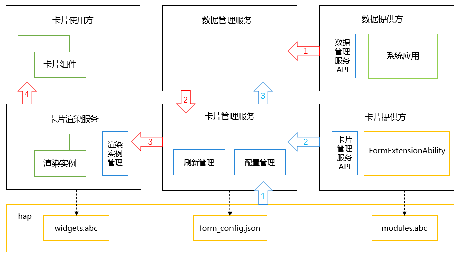

# 卡片代理刷新

卡片代理刷新是一种通过系统应用刷新卡片的机制。卡片提供方不在运行时，仍然可以通过开启了数据共享能力的系统应用完成卡片数据的更新。

## 实现原理

**图1** 代理刷新运行原理


如图1，与[ArkTS卡片实现原理图](arkts-ui-widget-working-principles.md#实现原理)相比，卡片代理刷新原理新增了数据管理服务和数据提供方。

- 数据管理服务：该场景下主要提供了多应用间的数据共享的机制。
- 数据提供方（仅支持系统应用）：系统应用作为数据提供方，需要开启数据共享能力，同时需要自定义`key + subscriberId`作为共享数据的标识。

> **说明：**
>
> 只有系统提供了作为数据提供方的应用，同时提供公开可获得的共享数据标识，才能正常使用该特性。

卡片提供方处理流程（图中蓝色箭头）：

1. 卡片提供方在卡片提供方的配置文件`form_config.json`中配置`dataProxyEnabled`字段为`true`，以开启卡片代理刷新功能。
> **说明：**
>
> 卡片代理刷新开启后，[定时刷新](arkts-ui-widget-update-by-time.md)和[下次刷新](arkts-ui-widget-update-by-time.md)失效。

2. 卡片提供方在[onAddForm](../reference/apis-form-kit/js-apis-app-form-formExtensionAbility.md#onaddform)回调中，把数据提供方定义的`key + subscriberId`返回给卡片管理服务。

3. 卡片管理服务解析卡片提供方的订阅信息，并向数据管理服务注册订阅实例。

卡片代理刷新运行流程（图中红色箭头）：

1. 数据提供方以`key + subscriberId`作为数据的标识，将数据存储到数据库。
2. 数据管理服务感知到数据库变化，将新的数据发布给当前注册的所有订阅实例。
3. 卡片管理服务从订阅实例中解析出数据，发送给卡片渲染服务。
4. 卡片渲染服务运行卡片页面代码widgets.abc，widgets.abc按新数据进行渲染，并将渲染后的数据发送至卡片使用方对应的<!--Del-->[<!--DelEnd-->卡片组件<!--Del-->](../reference/apis-arkui/arkui-ts/ts-basic-components-formcomponent-sys.md)<!--DelEnd-->。

数据提供方提供的共享数据有两种类型：

- 过程数据，不会一直存储，有老化期，所有应用都可以订阅。

- 持久化数据，仅系统应用可以订阅。

相应的卡片代理刷新配置有所不同，下面分别介绍具体开发方式。
<!--Del-->
## 数据提供方开发步骤

参考[数据管理](../database/share-data-by-silent-access.md)开发指南。
<!--DelEnd-->
## 卡片提供方开发步骤（过程数据）

- 配置form_config.json文件中的`dataProxyEnabled`字段为`true`，以启用卡片代理刷新功能，当订阅的过程数据更新时，系统会自动更新卡片数据。
  ```json
  {
    "forms": [
      {
        "name": "WidgetProcessData",
        "description": "$string:ProcessDataEntryAbility_desc",
        "src": "./ets/widgetprocessdata/pages/WidgetProcessDataCard.ets",
        "uiSyntax": "arkts",
        "window": {
          "designWidth": 720,
          "autoDesignWidth": true
        },
        "colorMode": "auto",
        "isDefault": true,
        "updateEnabled": true,
        "scheduledUpdateTime": "10:30",
        "defaultDimension": "2*2",
        "supportDimensions": [
          "2*2"
        ],
        "dataProxyEnabled": true
      }
    ]
  }
  ```
  
- 在[onAddForm](../reference/apis-form-kit/js-apis-app-form-formExtensionAbility.md#onaddform)回调中配置订阅信息[proxyData](../reference/apis-form-kit/js-apis-app-form-formBindingData.md#proxydata10)，并通过[formBinding](../reference/apis-form-kit/js-apis-app-form-formBindingData.md#formbindingdata)返回给卡片管理服务。示例中将key设置为"datashareproxy://com.samples.widgetupdatebyproxy/weather"，subscriberId设置为"11"。
  > **说明：**
  >
  > key可以是uri也可以是简单字符串，subscriberId默认值为当前formId，实际取值都依赖于数据发布方的定义。
  ```ts
  import { formBindingData, FormExtensionAbility } from '@kit.FormKit';
  import { Want } from '@kit.AbilityKit';
  import { hilog } from '@kit.PerformanceAnalysisKit';
  
  const TAG: string = 'ProcessDataFormAbility';
  const DOMAIN_NUMBER: number = 0xFF00;
  
  export default class ProcessDataFormAbility extends FormExtensionAbility {
    onAddForm(want: Want): formBindingData.FormBindingData {
      let formData: Record<string, Object> = {};
      let proxies: formBindingData.ProxyData[] = [
        {
          key: 'datashareproxy://com.samples.widgetupdatebyproxy/weather',
          subscriberId: '11'
        }
      ];
      let formBinding = formBindingData.createFormBindingData(formData);
      formBinding.proxies = proxies;
      hilog.info(DOMAIN_NUMBER, TAG, 'onAddForm');
      return formBinding;
    }
  }
  ```
  
- 在[卡片页面文件](arkts-ui-widget-creation.md)中，通过LocalStorage变量获取订阅到的数据，LocalStorage绑定了一个字符串，以key:value的键值对格式来刷新卡片订阅数据，其中key必须与卡片提供方订阅的key保持一致。示例中，通过'city'获取订阅的数据，并在Text组件显示。
  ```ts
  let storageProcess = new LocalStorage();
  
  @Entry(storageProcess)
  @Component
  struct WidgetProcessDataCard {
    @LocalStorageProp('datashareproxy://com.samples.widgetupdatebyproxy/weather') city: ResourceStr = $r('app.string.loading');
  
    build() {
      Column() {
        Column() {
          Text(this.city)
            .fontColor('#FFFFFF')
            .opacity(0.9)
            .fontSize(14)
            .margin({ top: '8%', left: '10%' })
        }.width('100%')
        .alignItems(HorizontalAlign.Start)
      }.width('100%').height('100%')
      .backgroundImage($r('app.media.CardEvent'))
      .backgroundImageSize(ImageSize.Cover)
    }
  }
  ```

## 卡片提供方开发步骤（持久化数据，仅对系统应用开放）
- 配置form_config.json文件中的`dataProxyEnabled`字段为`true`，以启用卡片代理刷新功能。
  ```json
  {
    "forms": [
      {
        "name": "WidgetPersistentData",
        "description": "This is a service widget update by proxy using persistent data.",
        "src": "./ets/widgetpersistentdata/pages/WidgetPersistentDataCard.ets",
        "uiSyntax": "arkts",
        "window": {
          "designWidth": 720,
          "autoDesignWidth": true
        },
        "colorMode": "auto",
        "isDefault": true,
        "updateEnabled": true,
        "scheduledUpdateTime": "10:30",
        "updateDuration": 1,
        "defaultDimension": "2*2",
        "supportDimensions": [
          "2*2"
        ],
        "dataProxyEnabled": true
      }
  ]
  }
  ```

- 在[onAddForm](../reference/apis-form-kit/js-apis-app-form-formExtensionAbility.md#onaddform)回调中添加订阅模板<!--Del-->[<!--DelEnd-->addTemplate<!--Del-->](../reference/apis-arkdata/js-apis-data-dataShare-sys.md#addtemplate10)<!--DelEnd-->，通过模板谓词告诉数据库订阅的数据条件。然后配置订阅信息[proxyData](../reference/apis-form-kit/js-apis-app-form-formBindingData.md#proxydata10)，并通过[formBinding](../reference/apis-form-kit/js-apis-app-form-formBindingData.md#formbindingdata)返回给卡片管理服务。示例中将谓词设置为`"list" : "select type from TBL00 limit 0,1"`，表示从TBL00数据库中获取type列的第一条数据，数据将会以`{"list":[{"type":"value0"}]}`格式返回到卡片页面代码widgets.abc中。当订阅的持久化数据更新时，系统会自动更新卡片数据。

  > **说明：**
  >
  > - key的取值是uri，依赖于数据发布方定义。
  > - subscriberId可自定义，addTemplate中的subscriberId参数与proxies.subscriberId保持一致即可。
  ```ts
  import { formBindingData, FormExtensionAbility } from '@kit.FormKit';
  import { Want } from '@kit.AbilityKit';
  import { dataShare } from '@kit.ArkData';

  export default class PersistentDataFormAbility extends FormExtensionAbility {
    onAddForm(want: Want): formBindingData.FormBindingData {
      let subscriberId = '111';
      let template: dataShare.Template = {
        predicates: {
          'list': `select type from TBL00 where cityId = ${subscriberId}`
        },
        scheduler: ''
      };
      dataShare.createDataShareHelper(this.context, 'datashareproxy://com.samples.widgetupdatebyproxy', {
        isProxy: true
      }).then((data) => {
        let dataShareHelper = data;
        dataShareHelper.addTemplate('datashareproxy://com.samples.widgetupdatebyproxy/test', subscriberId, template);
      });
      let formData: Record<string, Object> = {};
      let proxies: formBindingData.ProxyData[] = [
        {
          key: 'datashareproxy://com.samples.widgetupdatebyproxy/test',
          subscriberId: subscriberId
        }
      ];

      let formBinding: formBindingData.FormBindingData = {
        data: JSON.stringify(formData),
        proxies: proxies
      };
      return formBinding;
    }
  }
  ```

- 在[卡片页面文件](arkts-ui-widget-creation.md)中，通过LocalStorage变量获取订阅到的数据，LocalStorage绑定了一个字符串，以key:value的键值对格式来刷新卡片订阅数据，其中key必须与卡片提供方订阅的key保持一致。示例中，通过'list'获取订阅的数据，并把第一个元素的值显示在Text组件上。
  ```ts
  let storagePersis = new LocalStorage();
  
  @Entry(storagePersis)
  @Component
  struct WidgetPersistentDataCard {
    readonly FULL_WIDTH_PERCENT: string = '100%';
    readonly FULL_HEIGHT_PERCENT: string = '100%';
    @LocalStorageProp('list') list: Record<string, string>[] = [{ 'type': 'a' }];
  
    build() {
      Column() {
        Column() {
          Text((this.list[0]['type']))
            .fontColor('#FFFFFF')
            .opacity(0.9)
            .fontSize(14)
            .margin({ top: '8%', left: '10%' })
        }.width('100%')
        .alignItems(HorizontalAlign.Start)
      }.width(this.FULL_WIDTH_PERCENT).height(this.FULL_HEIGHT_PERCENT)
      .backgroundImage($r('app.media.CardEvent'))
      .backgroundImageSize(ImageSize.Cover)
    }
  }
  ```
<!--Del-->
## 相关实例

针对卡片代理开发，有以下相关实例可供参考：

- [应用主动添加数据代理卡片到桌面（ArkTS）（Full SDK）（API10）](https://gitee.com/openharmony/applications_app_samples/tree/master/code/SuperFeature/Widget/RequestAddForm)
<!--DelEnd-->
