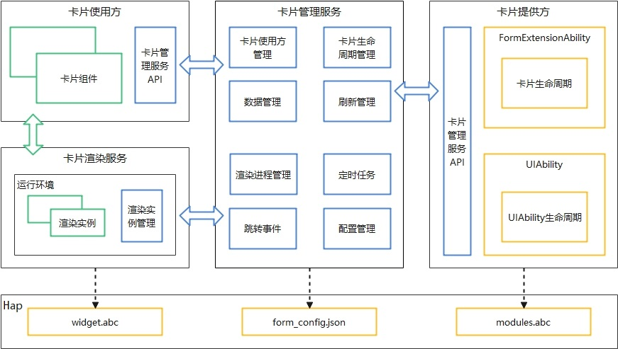
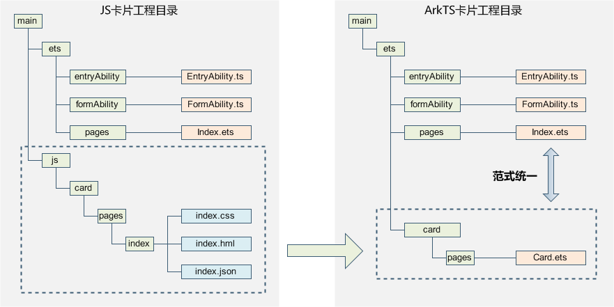

# ArkTS卡片运行机制

## 实现原理

**图1** ArkTS卡片实现原理  

- 卡片使用方：显示卡片内容的宿主应用，控制卡片在宿主中展示的位置，当前仅系统应用可以作为卡片使用方。

- 卡片提供方：提供卡片显示内容的应用，控制卡片的显示内容、控件布局以及控件点击事件。

- 卡片管理服务：用于管理系统中所添加卡片的常驻代理服务，提供[formProvider](../reference/apis-form-kit/js-apis-app-form-formProvider.md)<!--Del-->和[formHost](../reference/apis-form-kit/js-apis-app-form-formHost-sys.md)<!--DelEnd-->的接口能力，同时提供卡片对象的管理与使用以及卡片周期性刷新等能力。

- 卡片渲染服务：用于管理卡片渲染实例，渲染实例与卡片使用方上的<!--Del-->[<!--DelEnd-->卡片组件<!--Del-->](../reference/apis-arkui/arkui-ts/ts-basic-components-formcomponent-sys.md)<!--DelEnd-->一一绑定。卡片渲染服务运行卡片页面代码widgets.abc进行渲染，并将渲染后的数据发送至卡片使用方对应的<!--Del-->[<!--DelEnd-->卡片组件<!--Del-->](../reference/apis-arkui/arkui-ts/ts-basic-components-formcomponent-sys.md)<!--DelEnd-->。

  **图2** ArkTS卡片渲染服务运行原理  

&nbsp;&nbsp;&nbsp;&nbsp;与动态卡片相比，静态卡片整体的运行框架和渲染流程是一致的，主要区别在于，卡片渲染服务将卡片内容渲染完毕后，卡片使用方会使用最后一帧渲染的数据作为静态图片显示，其次卡片渲染服务中的卡片实例会释放该卡片的所有运行资源以节省内存。因此频繁的刷新会导致静态卡片运行时资源不断的创建和销毁，增加卡片功耗。 
&nbsp;&nbsp;&nbsp;&nbsp;与JS卡片相比，ArkTS卡片支持在卡片中运行逻辑代码，为确保ArkTS卡片发生问题后不影响卡片使用方应用的使用，ArkTS卡片新增了卡片渲染服务用于运行卡片页面代码widgets.abc，卡片渲染服务由卡片管理服务管理。卡片使用方的每个卡片组件都对应了卡片渲染服务里的一个渲染实例，同一应用提供方的渲染实例运行在同一个ArkTS虚拟机运行环境中，不同应用提供方的渲染实例运行在不同的ArkTS虚拟机运行环境中，通过ArkTS虚拟机运行环境隔离不同应用提供方卡片之间的资源与状态。开发过程中需要注意的是globalThis对象的使用，相同应用提供方的卡片globalThis对象是同一个，不同应用提供方的卡片globalThis对象是不同的。

## ArkTS卡片的优势

卡片作为应用的一个快捷入口，ArkTS卡片相较于JS卡片具备如下几点优势：

- 统一开发范式，提升开发体验和开发效率。
  
  提供ArkTS卡片能力后，统一了卡片和页面的开发范式，页面的布局可以直接复用到卡片布局中，提升开发体验和开发效率。
  
  **图3** 卡片工程结构对比  
  
  
- 增强了卡片的能力，使卡片更加万能。
  - 新增了动效的能力：ArkTS卡片开放了[属性动画](../reference/apis-arkui/arkui-ts/ts-animatorproperty.md)和[显式动画](../reference/apis-arkui/arkui-ts/ts-explicit-animation.md)的能力，使卡片的交互更加友好。
  - 新增了自定义绘制的能力：ArkTS卡片开放了[Canvas](../reference/apis-arkui/arkui-ts/ts-components-canvas-canvas.md)画布组件的能力，卡片可以使用自定义绘制的能力构建更多样的显示和交互效果。
  - 允许卡片中运行逻辑代码：开放逻辑代码运行后很多业务逻辑可以在卡片内部自闭环，拓宽了卡片的业务适用场景。

## ArkTS卡片的约束

ArkTS卡片相较于JS卡片具备了更加丰富的能力，但也增加了使用卡片进行恶意行为的风险。由于ArkTS卡片显示在使用方应用中，使用方应用一般为桌面应用，为确保桌面的使用体验以及功耗相关考虑，对ArkTS卡片的能力做了以下约束：

- 当导入模块时，仅支持导入标识“支持在ArkTS卡片中使用”的模块。

- 支持导入[HAR](../quick-start/har-package.md)静态共享包，不支持导入[HSP](../quick-start/in-app-hsp.md)动态共享包。

- 不支持使用native语言开发。

- 仅支持[声明式范式](../ui/arkts-ui-development-overview.md)的部分组件、事件、动效、数据管理、状态管理和API能力。

- 卡片的事件处理和使用方的事件处理是独立的，建议在使用方支持左右滑动的场景下卡片内容不要使用左右滑动功能的组件，以防手势冲突影响交互体验。

除此之外，当前ArkTS卡片还存在如下约束：

- 暂不支持极速预览。

- 暂不支持断点调试能力。

- 暂不支持Hot Reload热重载。

- 暂不支持setTimeOut。

## 相关实例

针对ArkTS卡片开发，有以下相关实例可供参考：

- [Stage模型卡片JS与C++通信（ArkTS）（API10）](https://gitee.com/openharmony/applications_app_samples/tree/OpenHarmony-5.0.0-Release/code/SuperFeature/Widget/FormGame)