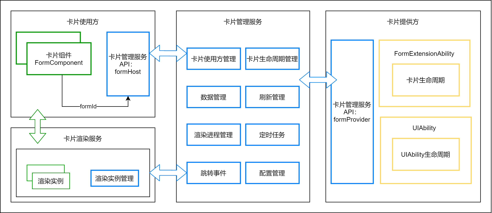
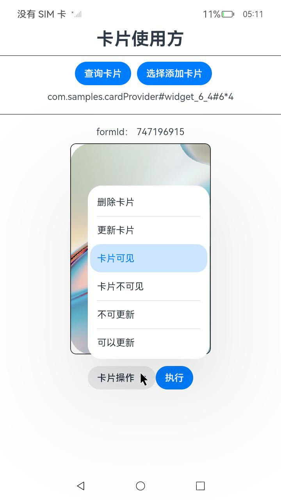

# 卡片使用方开发指导（仅对系统应用开放）

## 卡片概述

卡片是一种界面展示形式，可以将应用的重要信息或操作前置到卡片，以达到服务直达，减少体验层级的目的。

卡片常用于嵌入到其他应用（当前只支持系统应用）中作为其界面的一部分显示，并支持拉起页面，发送消息等基础的交互功能。卡片使用方负责显示卡片。

- 卡片的基本概念：

  - 卡片提供方：提供卡片显示内容原子化服务，控制卡片的显示内容、控件布局以及控件点击事件。
  
  - 卡片使用方：显示卡片内容的宿主应用，控制卡片在宿主中展示的位置。
  
  - 卡片管理服务：用于管理系统中所添加卡片的常驻代理服务，包括卡片对象的管理与使用，以及卡片周期性刷新等。
  
   

## 场景介绍

卡片使用方开发，即基于Stage模型的卡片使用方开发，主要指导如下：

- 卡片组件FormComponent的使用。
- 通过formHost模块提供的卡片使用方相关接口操作卡片的删除、更新等行为。

## 卡片组件

提供卡片组件，实现卡片的显示功能。详情见[FormComponent](../../application-dev/reference/apis-arkui/arkui-ts/ts-basic-components-formcomponent-sys.md)。

> **说明：**
>
> - 该组件从API Version 7开始支持。后续版本如有新增内容，则采用上角标单独标记该内容的起始版本。
>
> - 该组件为卡片组件的使用方。
>
> - 该组件使用需要具有系统签名。
>
> - 本模块为系统接口。

通过卡片组件成功添加卡片时，会调用到卡片提供方FormExtensionAbility中的[onAddForm](../../application-dev/reference/apis-form-kit/js-apis-app-form-formExtensionAbility.md#onaddform)方法。

### 临时卡片和常态卡片

在卡片组件中的temporary字段可以配置卡片是临时卡片还是常态卡片。true为临时卡片，false为常态卡片。

- 常态卡片：卡片使用方会持久化的卡片。如添加到桌面的卡片。

- 临时卡片：卡片使用方不会持久化的卡片。如上划卡片应用时显示的卡片。
  
由于临时卡片的数据具有非持久化的特殊性，某些场景例如卡片服务框架死亡重启，此时临时卡片数据在卡片管理服务中已经删除，且对应的卡片ID不会通知到提供方，所以卡片提供方需要自己负责清理长时间未删除的临时卡片数据。同时对应的卡片使用方可能会将之前请求的临时卡片转换为常态卡片。如果转换成功，卡片提供方也需要对对应的临时卡片ID进行处理，把卡片提供方记录的临时卡片数据转换为常态卡片数据，防止提供方在清理长时间未删除的临时卡片时，把已经转换为常态卡片的临时卡片信息删除，导致卡片信息丢失。  

## formHost接口

formHost提供一系列的卡片使用方接口，来操作卡片的更新、删除等行为，具体的API介绍详见[接口文档](../../application-dev/reference/apis-form-kit/js-apis-app-form-formHost-sys.md)。

## 卡片使用方示例

```ts
//Index.ets
import formHost from '@ohos.app.form.formHost';
import formInfo from '@ohos.app.form.formInfo';
import HashMap from '@ohos.util.HashMap';
import HashSet from '@ohos.util.HashSet';
import bundleMonitor from '@ohos.bundle.bundleMonitor';
import { BusinessError } from '@ohos.base';
import formObserver from '@ohos.app.form.formObserver';

@Entry
@Component
struct formHostSample {
  // 卡片尺寸枚举。
  static FORM_DIMENSIONS_MAP = [
    '1*2',
    '2*2',
    '2*4',
    '4*4',
    '2*1',
    '1*1',
    '6*4',
  ]

  // 模拟卡片尺寸。
  static FORM_SIZE = [
    [120, 60],    // 1*2
    [120, 120],   // 2*2
    [240, 120],   // 2*4
    [240, 240],   // 4*4
    [60, 120],    // 2*1
    [60, 60],     // 1*1
    [240, 360],   // 6*4
  ]

  @State message: Resource | string = $r('app.string.Host');
  formCardHashMap: HashMap<string, formInfo.FormInfo> = new HashMap();
  @State showFormPicker: boolean = false;
  @State operation: Resource | string = $r('app.string.formOperation');
  @State index: number = 2;
  @State space: number = 8;
  @State arrowPosition: ArrowPosition = ArrowPosition.END;
  formIds: HashSet<string> = new HashSet();
  currentFormKey: string = '';
  focusFormInfo: formInfo.FormInfo = {
    bundleName: '',
    moduleName: '',
    abilityName: '',
    name: '',
    displayName: '',
    displayNameId: 0,
    description: '',
    descriptionId: 0,
    type: formInfo.FormType.eTS,
    jsComponentName: '',
    colorMode: formInfo.ColorMode.MODE_AUTO,
    isDefault: false,
    updateEnabled: false,
    formVisibleNotify: true,
    scheduledUpdateTime: '',
    formConfigAbility: '',
    updateDuration: 0,
    defaultDimension: 6,
    supportDimensions: [],
    customizeData: {},
    isDynamic: false,
    transparencyEnabled: false
  }
  formInfoRecord: TextCascadePickerRangeContent[] = [];
  @State showForm: boolean = true;
  @State selectFormId: string = '0';
  @State pickerBtnMsg: Resource | string = $r('app.string.formType');
  @State pickDialogIndex: number = 0;

  aboutToAppear(): void {
    try {
      // 检查系统是否准备好。
      formHost.isSystemReady().then(() => {
        console.log('formHost isSystemReady success');

        // 订阅通知卡片不可见的事件和卡片可见通知事件。
        let notifyInvisibleCallback = (data: formInfo.RunningFormInfo[]) => {
          console.log(`form change invisibility, data: ${JSON.stringify(data)}`);
        }
        let notifyVisibleCallback = (data: formInfo.RunningFormInfo[]) => {
          console.log(`form change visibility, data: ${JSON.stringify(data)}`);
        }
        formObserver.on('notifyInvisible', notifyInvisibleCallback);
        formObserver.on('notifyVisible', notifyVisibleCallback);

        // 注册监听应用的安装事件。
        try {
          bundleMonitor.on('add', (bundleChangeInfo) => {
            console.info(`bundleName : ${bundleChangeInfo.bundleName} userId : ${bundleChangeInfo.userId}`);
            this.getAllBundleFormsInfo();
          })
        } catch (errData) {
          let message = (errData as BusinessError).message;
          let errCode = (errData as BusinessError).code;
          console.log(`errData is errCode:${errCode}  message:${message}`);
        }
        // 注册监听应用的更新事件。
        try {
          bundleMonitor.on('update', (bundleChangeInfo) => {
            console.info(`bundleName : ${bundleChangeInfo.bundleName} userId : ${bundleChangeInfo.userId}`);
            this.getAllBundleFormsInfo();
          })
        } catch (errData) {
          let message = (errData as BusinessError).message;
          let errCode = (errData as BusinessError).code;
          console.log(`errData is errCode:${errCode}  message:${message}`);
        }
        // 注册监听应用的卸载事件。
        try {
          bundleMonitor.on('remove', (bundleChangeInfo) => {
            console.info(`bundleName : ${bundleChangeInfo.bundleName} userId : ${bundleChangeInfo.userId}`);
            this.getAllBundleFormsInfo();
          })
        } catch (errData) {
          let message = (errData as BusinessError).message;
          let errCode = (errData as BusinessError).code;
          console.log(`errData is errCode:${errCode}  message:${message}`);
        }
      }).catch((error: BusinessError) => {
        console.error(`error, code: ${error.code}, message: ${error.message}`);
      });
    }
    catch (error) {
      console.error(`catch error, code: ${(error as BusinessError).code}, message: ${(error as BusinessError).message}`);
    }
  }

  aboutToDisappear(): void {
    // 删除所有卡片。
    this.formIds.forEach((id) => {
      console.log('delete all form')
      formHost.deleteForm(id);
    });
    // 注销监听应用的安装。
    try {
      bundleMonitor.off('add');
    } catch (errData) {
      let message = (errData as BusinessError).message;
      let errCode = (errData as BusinessError).code;
      console.log(`errData is errCode:${errCode}  message:${message}`);
    }
    // 注销监听应用的更新。
    try {
      bundleMonitor.off('update');
    } catch (errData) {
      let message = (errData as BusinessError).message;
      let errCode = (errData as BusinessError).code;
      console.log(`errData is errCode:${errCode}  message:${message}`);
    }
    // 注销监听应用的卸载。
    try {
      bundleMonitor.off('remove');
    } catch (errData) {
      let message = (errData as BusinessError).message;
      let errCode = (errData as BusinessError).code;
      console.log(`errData is errCode:${errCode}  message:${message}`);
    }
    // 取消订阅通知卡片不可见和通知卡片可见事件。
    formObserver.off('notifyInvisible');
    formObserver.off('notifyVisible');
  }

  // 将所有卡片信息存入formHapRecordMap中。
  getAllBundleFormsInfo() {
    this.formCardHashMap.clear();
    this.showFormPicker = false;
    let formHapRecordMap: HashMap<string, formInfo.FormInfo[]> = new HashMap();
    this.formInfoRecord = [];
    formHost.getAllFormsInfo().then((formList: Array<formInfo.FormInfo>) => {
      console.log('getALlFormsInfo size:' + formList.length)
      for (let formItemInfo of formList) {
        let formBundleName = formItemInfo.bundleName;
        if (formHapRecordMap.hasKey(formBundleName)) {
          formHapRecordMap.get(formBundleName).push(formItemInfo)
        } else {
          let formInfoList: formInfo.FormInfo[] = [formItemInfo];
          formHapRecordMap.set(formBundleName, formInfoList);
        }
      }
      for (let formBundle of formHapRecordMap.keys()) {
        let bundleFormInfo: TextCascadePickerRangeContent = {
          text: formBundle,
          children: []
        }
        let bundleFormList: formInfo.FormInfo[] = formHapRecordMap.get(formBundle);
        bundleFormList.forEach((formItemInfo) => {
          let dimensionName = formHostSample.FORM_DIMENSIONS_MAP[formItemInfo.defaultDimension - 1];
          bundleFormInfo.children?.push({ text: formItemInfo.name + '#' + dimensionName });
          this.formCardHashMap.set(formBundle + "#" + formItemInfo.name + '#' + dimensionName, formItemInfo);
        })
        this.formInfoRecord.push(bundleFormInfo);
      }
      this.formCardHashMap.forEach((formItem: formInfo.FormInfo) => {
        console.info(`formCardHashmap: ${JSON.stringify(formItem)}`);
      })
      this.showFormPicker = true;
    })
  }

  build() {
    Column() {
      Text(this.message)
        .fontSize(30)
        .fontWeight(FontWeight.Bold)

      Divider().vertical(false).color(Color.Black).lineCap(LineCapStyle.Butt).margin({ top: 10, bottom: 10 })

      Row() {
        // 点击查询所有卡片信息。
        Button($r('app.string.inquiryForm'))
          .onClick(() => {
            console.log('===> 点击查询卡片成功');
            this.getAllBundleFormsInfo();
          })

        // 点击按钮弹出选择界面，点击确定后，添加默认尺寸的所选卡片。
        Button($r('app.string.selectAddForm'))
          .enabled(this.showFormPicker)
          .onClick(() => {
            console.info("TextPickerDialog: show()")
            TextPickerDialog.show({
              range: this.formInfoRecord,
              selected: this.pickDialogIndex,
              canLoop: false,
              disappearTextStyle: { color: Color.Red, font: { size: 10, weight: FontWeight.Lighter } },
              textStyle: { color: Color.Black, font: { size: 12, weight: FontWeight.Normal } },
              selectedTextStyle: { color: Color.Blue, font: { size: 12, weight: FontWeight.Bolder } },
              onAccept: (result: TextPickerResult) => {
                this.currentFormKey = result.value[0] + "#" + result.value[1];
                this.pickDialogIndex = result.index[0]
                console.info(`TextPickerDialog onAccept： ${this.currentFormKey}, ${this.pickDialogIndex}`);
                if (!this.formCardHashMap.hasKey(this.currentFormKey)) {
                  console.error(`invalid formItemInfo by form key`)
                  return;
                }
                this.showForm = true;
                this.focusFormInfo = this.formCardHashMap.get(this.currentFormKey);
              },
              onCancel: () => {
                console.info("TextPickerDialog : onCancel()")
              },
              onChange: (result: TextPickerResult) => {
                this.pickerBtnMsg = result.value[0] + '#' + result.value[1];
                console.info("TextPickerDialog:onChange:" + this.pickerBtnMsg)
              }
            })
          })
          .margin({ left: 10 })
      }
      .margin({ left: 10 })

      Text(this.pickerBtnMsg)
        .margin({ top: 10, bottom: 10 })

      Divider().vertical(false).color(Color.Black).lineCap(LineCapStyle.Butt).margin({ top: 10, bottom: 10 })

      if (this.showForm) {
        Text('formId： ' + this.selectFormId)
          .margin({ top: 10, bottom: 10 })

        // 卡片组件。
        FormComponent({
          id: Number.parseInt(this.selectFormId),
          name: this.focusFormInfo.name,
          bundle: this.focusFormInfo.bundleName,
          ability: this.focusFormInfo.abilityName,
          module: this.focusFormInfo.moduleName,
          dimension: this.focusFormInfo.defaultDimension,
          temporary: false,
        })
          .size({
            width: formHostSample.FORM_SIZE[this.focusFormInfo.defaultDimension - 1][0],
            height: formHostSample.FORM_SIZE[this.focusFormInfo.defaultDimension - 1][1],
          })
          .borderColor(Color.Black)
          .borderRadius(10)
          .borderWidth(1)
          .onAcquired((form: FormCallbackInfo) => {
            console.log(`onAcquired: ${JSON.stringify(form)}`)
            this.selectFormId = form.id.toString();
            this.formIds.add(this.selectFormId);
          })
          .onRouter(() => {
            console.log(`onRouter`)
          })
          .onError((error) => {
            console.error(`onError: ${JSON.stringify(error)}`)
            this.showForm = false;
          })
          .onUninstall((info: FormCallbackInfo) => {
            this.showForm = false;
            console.error(`onUninstall: ${JSON.stringify(info)}`)
            this.formIds.remove(this.selectFormId);
          })

        // select列表，列出部分formHost接口功能。
        Row() {
          Select([{ value: $r('app.string.deleteForm') },
            { value: $r('app.string.updateForm') },
            { value: $r('app.string.visibleForms') },
            { value: $r('app.string.invisibleForms') },
            { value: $r('app.string.enableFormsUpdate') },
            { value: $r('app.string.disableFormsUpdate') },
          ])
            .selected(this.index)
            .value(this.operation)
            .font({ size: 16, weight: 500 })
            .fontColor('#182431')
            .selectedOptionFont({ size: 16, weight: 400 })
            .optionFont({ size: 16, weight: 400 })
            .space(this.space)
            .arrowPosition(this.arrowPosition)
            .menuAlign(MenuAlignType.START, { dx: 0, dy: 0 })
            .optionWidth(200)
            .optionHeight(300)
            .onSelect((index: number, text?: string | Resource) => {
              console.info('Select:' + index)
              this.index = index;
              if (text) {
                this.operation = text;
              }
            })

          // 根据select列表所选的功能，对当前卡片执行对应操作。
          Button($r('app.string.execute'), {
            type: ButtonType.Capsule
          })
            .fontSize(16)
            .onClick(() => {
              switch (this.index) {
                case 0:
                  try {
                    formHost.deleteForm(this.selectFormId, (error: BusinessError) => {
                      if (error) {
                        console.error(`deleteForm error, code: ${error.code}, message: ${error.message}`);
                      } else {
                        console.log('formHost deleteForm success');
                      }
                    });
                  } catch (error) {
                    console.error(`deleteForm catch error, code: ${(error as BusinessError).code}, message: ${(error as BusinessError).message}`);
                  }
                  this.showForm = false;
                  this.selectFormId = '';
                  break;
                case 1:
                  try {
                    formHost.requestForm(this.selectFormId, (error: BusinessError) => {
                      if (error) {
                        console.error(`requestForm error, code: ${error.code}, message: ${error.message}`);
                      }
                    });
                  } catch (error) {
                    console.error(`requestForm catch error, code: ${(error as BusinessError).code}, message: ${(error as BusinessError).message}`);
                  }
                  break;
                case 2:
                  try {
                    formHost.notifyVisibleForms([this.selectFormId], (error: BusinessError) => {
                      if (error) {
                        console.error(`notifyVisibleForms error, code: ${error.code}, message: ${error.message}`);
                      } else {
                        console.info('notifyVisibleForms success');
                      }
                    });
                  } catch (error) {
                    console.error(`notifyVisibleForms catch error, code: ${(error as BusinessError).code}, message: ${(error as BusinessError).message}`);
                  }
                  break;
                case 3:
                  try {
                    formHost.notifyInvisibleForms([this.selectFormId], (error: BusinessError) => {
                      if (error) {
                        console.error(`notifyInvisibleForms error, code: ${error.code}, message: ${error.message}`);
                      } else {
                        console.info('notifyInvisibleForms success');
                      }
                    });
                  } catch (error) {
                    console.error(`notifyInvisibleForms catch error, code: ${(error as BusinessError).code}, message: ${(error as BusinessError).message}`);
                  }
                  break;
                case 4:
                  try {
                    formHost.enableFormsUpdate([this.selectFormId], (error: BusinessError) => {
                      if (error) {
                        console.error(`enableFormsUpdate error, code: ${error.code}, message: ${error.message}`);
                      }
                    });
                  } catch (error) {
                    console.error(`enableFormsUpdate catch error, code: ${(error as BusinessError).code}, message: ${(error as BusinessError).message}`);
                  }
                  break;
                case 5:
                  try {
                    formHost.disableFormsUpdate([this.selectFormId], (error: BusinessError) => {
                      if (error) {
                        console.error(`disableFormsUpdate error, code: ${error.code}, message: ${error.message}`);
                      } else {
                        console.info('disableFormsUpdate success');
                      }
                    });
                  } catch (error) {
                    console.error(`disableFormsUpdate catch error, code: ${(error as BusinessError).code}, message: ${(error as BusinessError).message}`);
                  }
                  break;
              }
            })
        }
        .margin({
          top: 20,
          bottom: 10
        })
      }
    }
  }
}
```



## 相关实例

针对卡片使用方开发，有以下实例可供参考：

- [卡片使用方（Stage）（API12）](https://gitee.com/openharmony/applications_app_samples/tree/master/code/DocsSample/Form/FormHost)