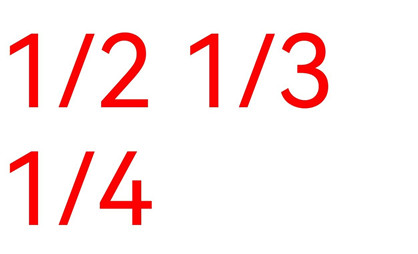
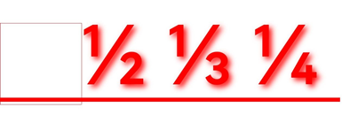

# 复杂文本绘制与显示（ArkTS）

在进行文本绘制时，可以通过选择合适的字体、大小和颜色完成简单文本的绘制与显示；此外，还支持通过设置其他丰富的样式、语言、段落等进行复杂文本的绘制。

复杂文本绘制主要包含以下几个场景：

- 多语言文本绘制与显示

- 多行文本绘制与显示

- 多类型文本绘制与显示


## 多语言文本绘制与显示

多语言支持是全球化应用的基础。多语言文本绘制需要支持不同语言的字符集及其独特的显示需求，例如右到左语言（如阿拉伯语）或竖排文本（如中文）。开发者需要理解不同语言的渲染特性，确保文本的正确显示。


在多语言文本使用的场景下，主要通过指定[TextStyle](../reference/apis-arkgraphics2d/js-apis-graphics-text.md#textstyle)文本样式中的**locale**字段来实现，可直接通过locale字段的值优先匹配对应字体，跳过遍历列表匹配字体的过程，从而降低匹配时间和内存使用。


### 开发步骤

1. 通过context获取到Canvas画布对象。

   ```ts
   let canvas = context.canvas;
   ```

2. 初始化文本样式。

   ```ts
   let myTextStyle: text.TextStyle = {
     color: {
       alpha: 255,
       red: 255,
       green: 0,
       blue: 0
     },
     fontSize: 50,
     // 设置语言偏好为简体中文
     locale: "zh-Hans"
   };
   ```

3. 初始化段落样式。

   ```ts
   let myParagraphStyle: text.ParagraphStyle = {
     textStyle: myTextStyle,
   };
   ```

4. 初始化段落对象，并添加文本。

   ```ts
   let fontCollection = text.FontCollection.getGlobalInstance();
   let ParagraphGraphBuilder = new text.ParagraphBuilder(myParagraphStyle, fontCollection);
   // 更新文本样式
   ParagraphGraphBuilder.pushStyle(myTextStyle);
   // 添加文本
   ParagraphGraphBuilder.addText("你好，世界");
   ```

5. 排版段落并进行文本绘制。

   ```ts
   // 生成段落
   let paragraph = ParagraphGraphBuilder.build();
   // 布局
   paragraph.layoutSync(1250);
   // 绘制文本
   paragraph.paint(canvas, 10, 0);
   ```


### 完整示例

此示例中，要绘制的文本为简体中文，将语言偏好设置为简体中文，在匹配文字字体时，会优先匹配简体，从而提高绘制的效率。

```ts
import { NodeController, FrameNode, RenderNode, DrawContext } from '@kit.ArkUI'
import { UIContext } from '@kit.ArkUI'
import { drawing } from '@kit.ArkGraphics2D'
import { text } from '@kit.ArkGraphics2D'
import { image } from '@kit.ImageKit'
import { common2D } from '@kit.ArkGraphics2D'

// 创建一个MyRenderNode类，并绘制文本。
class MyRenderNode extends RenderNode {
  async draw(context: DrawContext) {
    // 绘制代码逻辑写在这里
    let canvas = context.canvas;

    let myTextStyle: text.TextStyle = {
      color: {
        alpha: 255,
        red: 255,
        green: 0,
        blue: 0
      },
      fontSize: 50,
      // 设置语言偏好为简体中文
      locale: "zh-Hans"
    };
    
    let myParagraphStyle: text.ParagraphStyle = {
      textStyle: myTextStyle,
    };
    let fontCollection = text.FontCollection.getGlobalInstance();
    let ParagraphGraphBuilder = new text.ParagraphBuilder(myParagraphStyle, fontCollection);
    // 更新文本样式
    ParagraphGraphBuilder.pushStyle(myTextStyle);
    // 添加文本
    ParagraphGraphBuilder.addText("你好，世界");
    // 生成段落
    let paragraph = ParagraphGraphBuilder.build();
    // 布局
    paragraph.layoutSync(1250);
    // 绘制文本
    paragraph.paint(canvas, 10, 0);
  }
}

// 创建一个MyRenderNode对象
const textNode = new MyRenderNode()
// 定义newNode的像素格式
textNode.frame = {
  x: 0,
  y: 100,
  width: 1250,
  height: 800
}
textNode.pivot = { x: 0.2, y: 0.8 }
textNode.scale = { x: 1, y: 1 }

class MyNodeController extends NodeController {
  private rootNode: FrameNode | null = null;

  makeNode(uiContext: UIContext): FrameNode {
    this.rootNode = new FrameNode(uiContext)
    if (this.rootNode == null) {
      return this.rootNode
    }
    const renderNode = this.rootNode.getRenderNode()
    if (renderNode != null) {
      renderNode.frame = {
        x: 0,
        y: 0,
        width: 10,
        height: 500
      }
      renderNode.pivot = { x: 50, y: 50 }
    }
    return this.rootNode
  }

  addNode(node: RenderNode): void {
    if (this.rootNode == null) {
      return
    }
    const renderNode = this.rootNode.getRenderNode()
    if (renderNode != null) {
      renderNode.appendChild(node)
    }
  }

  clearNodes(): void {
    if (this.rootNode == null) {
      return
    }
    const renderNode = this.rootNode.getRenderNode()
    if (renderNode != null) {
      renderNode.clearChildren()
    }
  }
}

let myNodeController: MyNodeController = new MyNodeController()

async function performTask() {
  myNodeController.clearNodes()
  myNodeController.addNode(textNode)
}

@Entry
@Component
struct Font08 {
  @State src: Resource = $r('app.media.startIcon')
  build() {
    Column() {
      Row() {
        NodeContainer(myNodeController)
          .height('100%')
          .width('100%')
        Image(this.src)
          .width('0%').height('0%')
          .onComplete(
            () => {
              performTask();
            })
      }
      .width('100%')
    }
  }
}
```


### 效果展示


## 多行文本绘制与显示

多行文本相对于单行文本比较复杂，一般针对多行文本，需要进行文本排版、断词策略设置、文本对齐方式、最大行数限制等，主要通过设置段落样式实现。


### 实现说明

**段落样式**（[ParagraphStyle](../reference/apis-arkgraphics2d/js-apis-graphics-text.md#paragraphstyle)）是对多行文本中每段内容的样式设置，包括断词策略、文本对齐方式、最大行数限制等。开发者可以通过对不同段落进行样式化，以提高文本的可读性和美观性。


### 开发步骤

1. 通过context获取到Canvas画布对象。

   ```ts
   // 绘制代码逻辑写在这里
   let canvas = context.canvas;
   ```

2. 初始化文本样式。

   ```ts
   let myTextStyle: text.TextStyle = {
     color: {
       alpha: 255,
       red: 255,
       green: 0,
       blue: 0
     },
     fontSize: 50,
   };
   ```

3. 初始化段落样式。

   ```ts
   let myParagraphStyle: text.ParagraphStyle = {
     textStyle: myTextStyle,
     // 本文对齐方式
     align: text.TextAlign.LEFT,
     // 最大行数
     maxLines: 3,
     // 断词策略
     wordBreak: text.WordBreak.BREAK_WORD
   };
   ```

4. 初始化段落对象，并添加占位符和文本。

   ```ts
   let fontCollection = text.FontCollection.getGlobalInstance();
   let ParagraphGraphBuilder = new text.ParagraphBuilder(myParagraphStyle, fontCollection);
   // 更新文本样式
   ParagraphGraphBuilder.pushStyle(myTextStyle);
   // 添加文本
   ParagraphGraphBuilder.addText("Hello World Hello World Hello World Hello World Hello World Hello World " +
     "Hello World Hello World Hello World Hello World Hello World Hello World Hello World Hello World " +
     "Hello World Hello World Hello World Hello World Hello World ");
   ```

5. 排版段落并进行文本绘制。

   ```ts
   // 生成段落
   let paragraph = ParagraphGraphBuilder.build();
   // 布局
   paragraph.layoutSync(1250);
   // 绘制文本
   paragraph.paint(canvas, 10, 0);
   ```


### 完整示例

```ts
import { NodeController, FrameNode, RenderNode, DrawContext } from '@kit.ArkUI'
import { UIContext } from '@kit.ArkUI'
import { drawing } from '@kit.ArkGraphics2D'
import { text } from '@kit.ArkGraphics2D'
import { image } from '@kit.ImageKit'
import { common2D } from '@kit.ArkGraphics2D'

// 创建一个MyRenderNode类，并绘制文本。
class MyRenderNode extends RenderNode {
  async draw(context: DrawContext) {
    // 绘制代码逻辑写在这里
    let canvas = context.canvas;

    let myTextStyle: text.TextStyle = {
      color: {
        alpha: 255,
        red: 255,
        green: 0,
        blue: 0
      },
      fontSize: 50,
    };
    
    let myParagraphStyle: text.ParagraphStyle = {
      textStyle: myTextStyle,
      // 本文对齐方式
      align: text.TextAlign.LEFT,
      // 最大行数
      maxLines: 3,
      // 断词策略
      wordBreak: text.WordBreak.BREAK_WORD
    };
    let fontCollection = text.FontCollection.getGlobalInstance();
    let ParagraphGraphBuilder = new text.ParagraphBuilder(myParagraphStyle, fontCollection);
    // 更新文本样式
    ParagraphGraphBuilder.pushStyle(myTextStyle);
    // 添加文本
    ParagraphGraphBuilder.addText("Hello World Hello World Hello World Hello World Hello World Hello World " +
      "Hello World Hello World Hello World Hello World Hello World Hello World Hello World Hello World " +
      "Hello World Hello World Hello World Hello World Hello World ");
    // 生成段落
    let paragraph = ParagraphGraphBuilder.build();
    // 布局
    paragraph.layoutSync(1250);
    // 绘制文本
    paragraph.paint(canvas, 10, 0);
  }
}

// 创建一个MyRenderNode对象
const textNode = new MyRenderNode()
// 定义newNode的像素格式
textNode.frame = {
  x: 0,
  y: 100,
  width: 1250,
  height: 800
}
textNode.pivot = { x: 0.2, y: 0.8 }
textNode.scale = { x: 1, y: 1 }

class MyNodeController extends NodeController {
  private rootNode: FrameNode | null = null;

  makeNode(uiContext: UIContext): FrameNode {
    this.rootNode = new FrameNode(uiContext)
    if (this.rootNode == null) {
      return this.rootNode
    }
    const renderNode = this.rootNode.getRenderNode()
    if (renderNode != null) {
      renderNode.frame = {
        x: 0,
        y: 0,
        width: 10,
        height: 500
      }
      renderNode.pivot = { x: 50, y: 50 }
    }
    return this.rootNode
  }

  addNode(node: RenderNode): void {
    if (this.rootNode == null) {
      return
    }
    const renderNode = this.rootNode.getRenderNode()
    if (renderNode != null) {
      renderNode.appendChild(node)
    }
  }

  clearNodes(): void {
    if (this.rootNode == null) {
      return
    }
    const renderNode = this.rootNode.getRenderNode()
    if (renderNode != null) {
      renderNode.clearChildren()
    }
  }
}

let myNodeController: MyNodeController = new MyNodeController()

async function performTask() {
  myNodeController.clearNodes()
  myNodeController.addNode(textNode)
}

@Entry
@Component
struct Font08 {
  @State src: Resource = $r('app.media.startIcon')
  build() {
    Column() {
      Row() {
        NodeContainer(myNodeController)
          .height('100%')
          .width('100%')
        Image(this.src)
          .width('0%').height('0%')
          .onComplete(
            () => {
              performTask();
            })
      }
      .width('100%')
    }
  }
}
```


### 效果展示

| 段落样式设置（断词策略、文本对齐方式、最大行数限制） | 效果示意 | 
| -------- | -------- |
| 文本对齐方式为text.TextAlign.LEFT，最大行数为3，断词策略为text.WordBreak.BREAK_WORD。 |  | 
| 文本对齐方式为text.TextAlign.RIGHT，最大行数为3，断词策略为text.WordBreak.BREAK_WORD。 |  | 
| 文本对齐方式为text.TextAlign.LEFT，最大行数为3，断词策略为text.WordBreak.BREAK_ALL。 |  | 
| 文本对齐方式为text.TextAlign.LEFT ，最大行数为10 ，断词策略为text.WordBreak.BREAK_ALL。 |  | 


## 多样式文本绘制与显示

除基本文字、排版属性之外，针对应用中不同文本的设计，开发者可能需要设置使用不同的绘制样式或能力，以凸显对应文本的独特表现或风格，此时可以结合使用多种绘制样式进行文本的渲染。

当前支持的多样式绘制及各绘制样式侧重效果如下：

- **装饰线样式绘制：**主要通过不同的线条样式对文本进行装饰，可以使文本更加突出，富有表现力。

- **字体特性绘制**：主要通过字体的变化，包括粗细、斜体等特性来改变文本的外观，增强文本的可读性和美观性。

- **可变字体绘制：**对应提供文本在不同的显示环境和设备上灵活灵活调整的能力，可满足更为精细的视觉效果。

- **文本阴影绘制：**主要通过在文本周围添加阴影效果，以提升文本的层次感和立体感，从而使文本更具吸引力。

- **占位符绘制：**可以在不确定文本内容时保持文本布局的稳定性，使得文本显示更为流畅和自然。

### 装饰线

装饰线（[Decoration](../reference/apis-arkgraphics2d/js-apis-graphics-text.md#decoration)）是指在文本上方、下方或中间添加的装饰性线条，当前支持上划线、下划线、删除线。

可以通过添加文本装饰线，提升文本的视觉效果和可读性。

使用装饰线需要初始化装饰线样式对象，并添加到文本样式中，从而在文本绘制时生效。

### 字体特征

**字体特征**（[FontFeature](../reference/apis-arkgraphics2d/js-apis-graphics-text.md#fontfeature)）绘制专注于在文本渲染过程中对字体特性（如粗体、斜体、字体变种等）的处理，允许字体在不同的排版场景下表现出不同的效果，可用于增强文本的表现力，使其更符合设计和阅读需求。

常见的**FontFeature**包含有liga、frac、case等，需要对应的ttf文件支持才能正常使能。

### 可变字体

**可变字体**（[FontVariation](../reference/apis-arkgraphics2d/js-apis-graphics-text.md#fontvariation)）是一种在一个字体文件中包含多个字形变体的字体格式，允许在一个字体文件内灵活地调整字体的各种属性（如字重、字宽、斜体等）。

与传统字体文件（每种变体需要一个独立的文件）不同，可变字体在一个字体文件中包含多个变体轴，可通过使用可变字体实现文本渲染绘制时的平滑过渡。

### 文本阴影

**文本阴影**（[TextShadow](../reference/apis-arkgraphics2d/js-apis-graphics-text.md#textshadow)）为文本提供了深度感，使得文本在背景上更具立体感。通常用于提升文本的视觉吸引力或增强可读性，尤其是在色彩对比度较低的场景下。

其中，TesxtShadow有三个属性，分别为阴影颜色color、阴影基于当前文本的偏移位置point、阴影半径blurRadius。

使用阴影效果需要在文本样式中设置对应的阴影效果数组，从而在文本绘制时生效。

### 占位符

占位符绘制用于处理文本中占位符符号的渲染。

占位符也是用来实现图文混排的关键，是指在实际图像或内容注册之前，用来预先提供货替代某个位置的视觉元素。

### 开发步骤

1. 通过context获取到Canvas画布对象。

   ```ts
   // 绘制代码逻辑写在这里
   let canvas = context.canvas;
   ```

2. 初始化文本样式。

   ```ts
   // 初始化装饰线对象
   let decorations: text.Decoration =
     {
       // 装饰线类型，支持上划线、下划线、删除线
       textDecoration: text.TextDecorationType.UNDERLINE,
       // 装饰线颜色
       color: {
         alpha: 255,
         red: 255,
         green: 0,
         blue: 0
       },
       // 装饰线样式，支持波浪，虚线，直线等
       decorationStyle:text.TextDecorationStyle.SOLID,
       // 装饰线的高度
       decorationThicknessScale: 1
     };
   
   let myTextStyle: text.TextStyle = {
     color: {
       alpha: 255,
       red: 255,
       green: 0,
       blue: 0
     },
     fontSize: 300,
     // 设置装饰线
     decoration: decorations,
     // 可变字体
     fontVariations: [{axis: 'wght', value: 555}],
     // 文本阴影
     textShadows: [{color: { alpha: 0xFF, red: 0xFF, green: 0x00, blue: 0x00 }, point: {x:10,y:10}, blurRadius: 10}],
     // 开启字体特征
     fontFeatures: [{name: 'frac', value: 1}]
   };
   ```

3. 初始化段落样式。

   ```ts
   let myParagraphStyle: text.ParagraphStyle = {
     textStyle: myTextStyle
   };
   ```

4. 初始化段落对象，并添加占位符和文本。

   ```ts
   let fontCollection = text.FontCollection.getGlobalInstance();
   let ParagraphGraphBuilder = new text.ParagraphBuilder(myParagraphStyle, fontCollection);
   
   // 初始化占位符对象
   let myPlaceholderSpan: text.PlaceholderSpan = {
     width: 300,//宽度
     height: 300,//高度
     align: text.PlaceholderAlignment.BOTTOM_OF_ROW_BOX, //基线对齐策略
     baseline: text.TextBaseline.ALPHABETIC,//使用的文本基线类型
     baselineOffset: 100//相比基线的偏移量。只有对齐策略是OFFSET_AT_BASELINE时生效
   };
   // 添加占位符
   ParagraphGraphBuilder.addPlaceholder(myPlaceholderSpan)
   
   // 更新文本样式
   ParagraphGraphBuilder.pushStyle(myTextStyle);
   // 添加文本
   ParagraphGraphBuilder.addText("1/2 1/3 1/4 ");
   ```

5. 排版段落并进行文本绘制。

   ```ts
   //生成段落
   let paragraph = ParagraphGraphBuilder.build();
   // 布局
   paragraph.layoutSync(1250);
   // 绘制文本
   paragraph.paint(canvas, 0, 0);
   ```

6. 绘制占位符所在的内容。

   ```ts
   let placeholderRects = paragraph.getRectsForPlaceholders();//获取全部占位符的数组
   let left = placeholderRects[0].rect.left//获取第一个占位符的左边界
   let top = placeholderRects[0].rect.top//获取第一个占位符的上边界
   let right = placeholderRects[0].rect.right//获取第一个占位符的有边界
   let bottom = placeholderRects[0].rect.bottom//获取第一个占位符的下边界
   let pen: drawing.Pen =  new drawing.Pen()
   let pen_color : common2D.Color = { alpha: 0xFF, red: 0xFF, green: 0x00, blue: 0x00 }
   pen.setColor(pen_color)
   canvas.attachPen(pen)
   canvas.drawRect(left,top,right,bottom)//使用draw方法绘制占位符矩形框
   ```


### 完整示例

```ts
import { NodeController, FrameNode, RenderNode, DrawContext } from '@kit.ArkUI'
import { UIContext } from '@kit.ArkUI'
import { drawing } from '@kit.ArkGraphics2D'
import { text } from '@kit.ArkGraphics2D'
import { image } from '@kit.ImageKit'
import { common2D } from '@kit.ArkGraphics2D'

// 创建一个MyRenderNode类，并绘制文本。
class MyRenderNode extends RenderNode {
  async draw(context: DrawContext) {
    // 绘制代码逻辑写在这里
    let canvas = context.canvas;

    // 初始化装饰线对象
    let decorations: text.Decoration =
      {
        // 装饰线类型，支持上划线、下划线、删除线
        textDecoration: text.TextDecorationType.UNDERLINE,
        // 装饰线颜色
        color: {
          alpha: 255,
          red: 255,
          green: 0,
          blue: 0
        },
        // 装饰线样式，支持波浪，虚线，直线等
        decorationStyle:text.TextDecorationStyle.SOLID,
        // 装饰线的高度
        decorationThicknessScale: 1
      };

    let myTextStyle: text.TextStyle = {
      color: {
        alpha: 255,
        red: 255,
        green: 0,
        blue: 0
      },
      fontSize: 300,
      // 设置装饰线
      decoration: decorations,
      // 可变字体
      fontVariations: [{axis: 'wght', value: 555}],
      // 文本阴影
      textShadows: [{color: { alpha: 0xFF, red: 0xFF, green: 0x00, blue: 0x00 }, point: {x:10,y:10}, blurRadius: 10}],
      // 开启字体特征
      fontFeatures: [{name: 'frac', value: 1}]
    };

    let myParagraphStyle: text.ParagraphStyle = {
      textStyle: myTextStyle
    };

    let fontCollection = text.FontCollection.getGlobalInstance();
    let ParagraphGraphBuilder = new text.ParagraphBuilder(myParagraphStyle, fontCollection);

    // 初始化占位符对象
    let myPlaceholderSpan: text.PlaceholderSpan = {
      width: 300,//宽度
      height: 300,//高度
      align: text.PlaceholderAlignment.BOTTOM_OF_ROW_BOX, //基线对齐策略
      baseline: text.TextBaseline.ALPHABETIC,//使用的文本基线类型
      baselineOffset: 100//相比基线的偏移量。只有对齐策略是OFFSET_AT_BASELINE时生效
    };
    // 添加占位符
    ParagraphGraphBuilder.addPlaceholder(myPlaceholderSpan)

    // 更新文本样式
    ParagraphGraphBuilder.pushStyle(myTextStyle);
    // 添加文本
    ParagraphGraphBuilder.addText("1/2 1/3 1/4 ");

    // 生成段落
    let paragraph = ParagraphGraphBuilder.build();
    // 布局
    paragraph.layoutSync(1250);
    // 绘制文本
    paragraph.paint(canvas, 0, 0);

    let placeholderRects = paragraph.getRectsForPlaceholders();//获取全部占位符的数组
    let left = placeholderRects[0].rect.left// 获取第一个占位符的左边界
    let top = placeholderRects[0].rect.top// 获取第一个占位符的上边界
    let right = placeholderRects[0].rect.right// 获取第一个占位符的有边界
    let bottom = placeholderRects[0].rect.bottom// 获取第一个占位符的下边界
    let pen: drawing.Pen =  new drawing.Pen()
    let pen_color : common2D.Color = { alpha: 0xFF, red: 0xFF, green: 0x00, blue: 0x00 }
    pen.setColor(pen_color)
    canvas.attachPen(pen)
    canvas.drawRect(left,top,right,bottom)// 使用draw方法绘制占位符矩形框
  }
}

// 创建一个MyRenderNode对象
const textNode = new MyRenderNode()
// 定义newNode的像素格式
textNode.frame = {
  x: 0,
  y: 100,
  width: 1250,
  height: 800
}
textNode.pivot = { x: 0.2, y: 0.8 }
textNode.scale = { x: 1, y: 1 }

class MyNodeController extends NodeController {
  private rootNode: FrameNode | null = null;

  makeNode(uiContext: UIContext): FrameNode {
    this.rootNode = new FrameNode(uiContext)
    if (this.rootNode == null) {
      return this.rootNode
    }
    const renderNode = this.rootNode.getRenderNode()
    if (renderNode != null) {
      renderNode.frame = {
        x: 0,
        y: 0,
        width: 10,
        height: 500
      }
      renderNode.pivot = { x: 50, y: 50 }
    }
    return this.rootNode
  }

  addNode(node: RenderNode): void {
    if (this.rootNode == null) {
      return
    }
    const renderNode = this.rootNode.getRenderNode()
    if (renderNode != null) {
      renderNode.appendChild(node)
    }
  }

  clearNodes(): void {
    if (this.rootNode == null) {
      return
    }
    const renderNode = this.rootNode.getRenderNode()
    if (renderNode != null) {
      renderNode.clearChildren()
    }
  }
}

let myNodeController: MyNodeController = new MyNodeController()

async function performTask() {
  myNodeController.clearNodes()
  myNodeController.addNode(textNode)
}

@Entry
@Component
struct Font08 {
  @State src: Resource = $r('app.media.startIcon')
  build() {
    Column() {
      Row() {
        NodeContainer(myNodeController)
          .height('100%')
          .width('100%')
        Image(this.src)
          .width('0%').height('0%')
          .onComplete(
            () => {
              performTask();
            })
      }
      .width('100%')
    }
  }
}
```


### 效果展示

| 样式设置（装饰线样式、可变字体、文本阴影、字体特征、占位符） | 示意效果 | 
| -------- | -------- |
| 不开启装饰线、可变字体、文本阴影、字体特征，不添加占位符。 |  | 
| 开启装饰线、可变字体、文本阴影、字体特征，添加占位符。 |  | 
