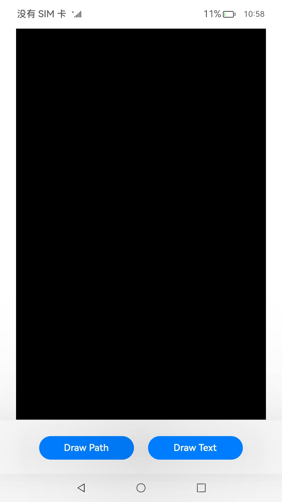
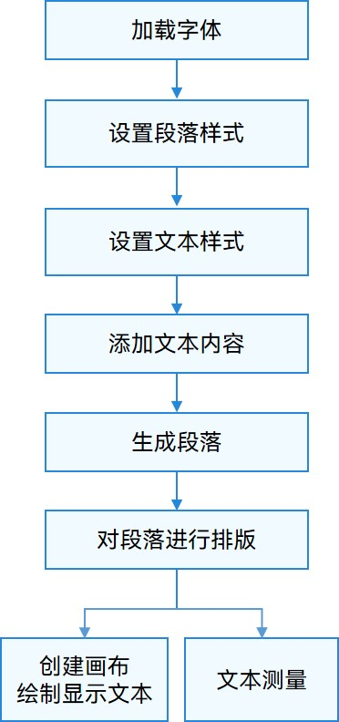

# 使用Drawing实现图形绘制与显示 (C/C++)

## 场景介绍

Native Drawing模块提供了一系列的接口用于基本图形和字体的绘制。

Drawing绘制的内容无法直接在屏幕上显示，需要借用XComponent以及Native Window的能力支持，将绘制的内容通过Native Window送显。

## 接口说明

Drawing常用接口如下表所示，详细的接口说明请参考[Drawing](../reference/apis-arkgraphics2d/_drawing.md)。

| 接口名 | 描述 |
| -------- | -------- |
| OH_Drawing_BitmapCreate (void) | 创建一个位图对象。 |
| OH_Drawing_BitmapBuild (OH_Drawing_Bitmap *, const uint32_t width, const uint32_t height, const OH_Drawing_BitmapFormat *) | 初始化位图对象的宽度和高度，并且为该位图设置像素格式。 |
| OH_Drawing_CanvasCreate (void) | 创建一个画布对象。 |
| OH_Drawing_CanvasBind (OH_Drawing_Canvas *, OH_Drawing_Bitmap *) | 将一个位图对象绑定到画布中，使得画布绘制的内容输出到位图中（即CPU渲染）。 |
| OH_Drawing_CanvasAttachBrush (OH_Drawing_Canvas *, const OH_Drawing_Brush *) | 设置画刷给画布，画布将会使用设置的画刷样式和颜色去填充绘制的图形形状。 |
| OH_Drawing_CanvasAttachPen (OH_Drawing_Canvas *, const OH_Drawing_Pen *) | 设置画笔给画布，画布将会使用设置画笔的样式和颜色去绘制图形形状的轮廓。 |
| OH_Drawing_CanvasDrawPath (OH_Drawing_Canvas *, const OH_Drawing_Path *) | 画一个自定义路径。 |
| OH_Drawing_PathCreate (void) | 创建一个路径对象。 |
| OH_Drawing_PathMoveTo (OH_Drawing_Path *, float x, float y) | 设置自定义路径的起始点位置。 |
| OH_Drawing_PathLineTo (OH_Drawing_Path *, float x, float y) | 添加一条到目标点的线段。 |
| OH_Drawing_PathClose (OH_Drawing_Path *) | 闭合路径，会添加一条到路径起点位置的线段。 |
| OH_Drawing_PenCreate (void) | 创建一个画笔对象。 |
| OH_Drawing_PenSetAntiAlias (OH_Drawing_Pen *, bool) | 设置抗锯齿属性，如果为真则说明画笔会启用抗锯齿功能，在绘制图形时会对图形的边缘像素进行半透明的模糊处理。 |
| OH_Drawing_PenSetWidth (OH_Drawing_Pen *, float width) | 设置画笔的厚度属性，厚度属性描述了画笔绘制图形轮廓的宽度。 |
| OH_Drawing_BrushCreate (void) | 创建一个画刷对象。 |
| OH_Drawing_BrushSetColor (OH_Drawing_Brush *, uint32_t color) | 设置画刷的颜色属性，颜色属性描述了画刷填充图形时使用的颜色，用一个32位（ARGB）的变量表示。 |
| OH_Drawing_CreateTypographyStyle (void) | 创建一个排版对象，用于定义排版样式。 |
| OH_Drawing_CreateTextStyle (void) | 创建一个文本对象，用于定义文本样式。 |
| OH_Drawing_TypographyHandlerAddText (OH_Drawing_TypographyCreate *, const char *) | 设置文本内容。 |
| OH_Drawing_TypographyPaint (OH_Drawing_Typography *, OH_Drawing_Canvas *, double, double) | 显示文本。 |

## 图形绘制与显示开发步骤

### 开发流程

使用Drawing进行图形绘制与显示时，需要使用Native Drawing模块的画布画笔绘制一个基本的2D图形；并将图形内容写入Native Window提供的图形Buffer，将Buffer提交到图形队列；再利用XComponent将C++代码层与ArkTS层对接，实现在ArkTS层调用绘制和显示的逻辑，最终在应用上显示图形。

本文以实现2D图形和文本的绘制与显示为例，给出具体的开发指导。
### 添加开发依赖

**添加动态链接库**

CMakeLists.txt中添加以下lib。

```txt
libace_napi.z.so
libace_ndk.z.so
libnative_window.so
libnative_drawing.so
```

**头文件**
```c++
#include <ace/xcomponent/native_interface_xcomponent.h>
#include "napi/native_api.h"
#include <native_window/external_window.h>
#include <native_drawing/drawing_bitmap.h>
#include <native_drawing/drawing_color.h>
#include <native_drawing/drawing_canvas.h>
#include <native_drawing/drawing_pen.h>
#include <native_drawing/drawing_brush.h>
#include <native_drawing/drawing_path.h>
#include <cmath>
#include <algorithm>
#include <stdint.h>
#include <sys/mman.h>
```

### 使用XComponent构建绘制环境

1. 在Index.ets文件中添加XComponent组件。
    ```ts
    import XComponentContext from "../interface/XComponentContext";

    const TAG = '[Sample_DrawingAPI]';

    @Entry
    @Component
    struct Index {
      private xComponentContext: XComponentContext | undefined = undefined;

      build() {
          Column() {
          Row() {
              XComponent({ id: 'xcomponentId', type: 'surface', libraryname: 'entry' })
              .onLoad((xComponentContext) => {
                  this.xComponentContext = xComponentContext as XComponentContext;
              }).width('640px') // 64的倍数
          }.height('88%')
        }
      }
    }
    ```
    若要改变XComponent的宽，值需为64的倍数，例如640px。
2. 在 Native C++层获取NativeXComponent。建议使用单例模式保存XComponent。此步骤需要在napi_init的过程中处理。

    创建一个PluginManger单例类，用于管理NativeXComponent。
    ```c++
    class PluginManager {
    public:
        ~PluginManager();

        static PluginManager *GetInstance();

        void SetNativeXComponent(std::string &id, OH_NativeXComponent *nativeXComponent);
        SampleBitMap *GetRender(std::string &id);
        void Export(napi_env env, napi_value exports);
    private:

        std::unordered_map<std::string, OH_NativeXComponent *> nativeXComponentMap_;
        std::unordered_map<std::string, SampleBitMap *> pluginRenderMap_;
    };
    ```
    SampleBitMap类会在后面的绘制2D图形步骤中创建。
    ```c++
    void PluginManager::Export(napi_env env, napi_value exports) {
        if ((env == nullptr) || (exports == nullptr)) {
            DRAWING_LOGE("Export: env or exports is null");
            return;
        }

        napi_value exportInstance = nullptr;
        if (napi_get_named_property(env, exports, OH_NATIVE_XCOMPONENT_OBJ, &exportInstance) != napi_ok) {
            DRAWING_LOGE("Export: napi_get_named_property fail");
            return;
        }

        OH_NativeXComponent *nativeXComponent = nullptr;
        if (napi_unwrap(env, exportInstance, reinterpret_cast<void **>(&nativeXComponent)) != napi_ok) {
            DRAWING_LOGE("Export: napi_unwrap fail");
            return;
        }

        char idStr[OH_XCOMPONENT_ID_LEN_MAX + 1] = {'\0'};
        uint64_t idSize = OH_XCOMPONENT_ID_LEN_MAX + 1;
        if (OH_NativeXComponent_GetXComponentId(nativeXComponent, idStr, &idSize) != OH_NATIVEXCOMPONENT_RESULT_SUCCESS) {
            DRAWING_LOGE("Export: OH_NativeXComponent_GetXComponentId fail");
            return;
        }

        std::string id(idStr);
        auto context = PluginManager::GetInstance();
        if ((context != nullptr) && (nativeXComponent != nullptr)) {
            context->SetNativeXComponent(id, nativeXComponent);
            auto render = context->GetRender(id);
            if (render != nullptr) {
                render->RegisterCallback(nativeXComponent);
                render->Export(env, exports);
            } else {
                DRAWING_LOGE("render is nullptr");
            }
        }
    }
    ```
3. 注册回调函数。通过``OnSurfaceCreated``回调函数获取Native Window，建议将Native Window同样存储在单例中。
    ```c++
    // 定义回调函数
    void OnSurfaceCreatedCB(OH_NativeXComponent* component, void* window)
    {
        // 可获取 OHNativeWindow 实例
        OHNativeWindow* nativeWindow = static_cast<OHNativeWindow*>(window);
        char idStr[OH_XCOMPONENT_ID_LEN_MAX + 1] = {'\0'};
        uint64_t idSize = OH_XCOMPONENT_ID_LEN_MAX + 1;
        if (OH_NativeXComponent_GetXComponentId(component, idStr, &idSize) != OH_NATIVEXCOMPONENT_RESULT_SUCCESS) {
            DRAWING_LOGE("OnSurfaceCreatedCB: Unable to get XComponent id");
            return;
        }
        std::string id(idStr);
        auto render = SampleBitMap::GetInstance(id);
        render->SetNativeWindow(nativeWindow);

        uint64_t width;
        uint64_t height;
        int32_t xSize = OH_NativeXComponent_GetXComponentSize(component, window, &width, &height);
        if ((xSize == OH_NATIVEXCOMPONENT_RESULT_SUCCESS) && (render != nullptr)) {
            render->SetHeight(height);
            render->SetWidth(width);
            DRAWING_LOGI("xComponent width = %{public}llu, height = %{public}llu", width, height);
        }
    }
    void OnSurfaceChangedCB(OH_NativeXComponent* component, void* window)
    {
        // 可获取 OHNativeWindow 实例
        OHNativeWindow* nativeWindow = static_cast<OHNativeWindow*>(window);
        char idStr[OH_XCOMPONENT_ID_LEN_MAX + 1] = {'\0'};
        uint64_t idSize = OH_XCOMPONENT_ID_LEN_MAX + 1;
        if (OH_NativeXComponent_GetXComponentId(component, idStr, &idSize) != OH_NATIVEXCOMPONENT_RESULT_SUCCESS) {
            DRAWING_LOGE("OnSurfaceChangedCB: Unable to get XComponent id");
            return;
        }
        std::string id(idStr);
        auto render = SampleBitMap::GetInstance(id);

        uint64_t width;
        uint64_t height;
        int32_t xSize = OH_NativeXComponent_GetXComponentSize(component, window, &width, &height);
        if ((xSize == OH_NATIVEXCOMPONENT_RESULT_SUCCESS) && (render != nullptr)) {
            render->SetHeight(height);
            render->SetWidth(width);
            DRAWING_LOGI("Surface Changed : xComponent width = %{public}llu, height = %{public}llu", width, height);
        }
    }
    void OnSurfaceDestroyedCB(OH_NativeXComponent* component, void* window)
    {
        // 可获取 OHNativeWindow 实例
        OHNativeWindow* nativeWindow = static_cast<OHNativeWindow*>(window);
        // ...
    }
    void DispatchTouchEventCB(OH_NativeXComponent* component, void* window)
    {
        // 可获取 OHNativeWindow 实例
        OHNativeWindow* nativeWindow = static_cast<OHNativeWindow*>(window);
        // ...
    }
    ```
    XComponent的所有Callback必须初始化，可以将不需要的Callback定义为空指针。
    ```c++
    // OH_NativeXComponent_Callback是个struct
    OH_NativeXComponent_Callback callback;
    callback.OnSurfaceCreated = OnSurfaceCreatedCB;
    callback.OnSurfaceChanged = OnSurfaceChangedCB;
    callback.OnSurfaceDestroyed = OnSurfaceDestroyedCB;
    callback.DispatchTouchEvent = DispatchTouchEventCB;
    ```
4. 将``OH_NativeXComponent_Callback``注册给NativeXComponent。
    ```c++
    // 注册回调函数
    OH_NativeXComponent_RegisterCallback(nativeXComponent, &callback);
    ```

经过以上步骤，绘制环境已搭建完成，接下来介绍如何使用Drawing接口进行内容绘制。

### 绘制2D图形

以下步骤描述了如何使用Native Drawing模块的画布画笔绘制一个基本的2D图形：

1. **创建Bitmap实例**。使用drawing_bitmap.h的``OH_Drawing_BitmapCreate``接口创建一个Bitmap实例cBitmap并使用``OH_Drawing_BitmapBuild``指定其长宽大小和像素格式。

    创建一个SampleBitMap类，并声明接下来需要的私有成员变量。
    ```c++
    class SampleBitMap {
    public:
        // member functions
    private:
        OH_NativeXComponent_Callback renderCallback_;

        uint64_t width_ = 0;
        uint64_t height_ = 0;
        OH_Drawing_Bitmap *cBitmap_ = nullptr;
        OH_Drawing_Canvas *cCanvas_ = nullptr;
        OH_Drawing_Path *cPath_ = nullptr;
        OH_Drawing_Brush *cBrush_ = nullptr;
        OH_Drawing_Pen *cPen_ = nullptr;
        OHNativeWindow *nativeWindow_ = nullptr;
        uint32_t *mappedAddr_ = nullptr;
        BufferHandle *bufferHandle_ = nullptr;
        struct NativeWindowBuffer *buffer_ = nullptr;
        int fenceFd_ = 0;
    };
    ```

    ```c++
    // 创建一个bitmap对象
    cBitmap_ = OH_Drawing_BitmapCreate();
    // 定义bitmap的像素格式
    OH_Drawing_BitmapFormat cFormat {COLOR_FORMAT_RGBA_8888, ALPHA_FORMAT_OPAQUE};
    // 构造对应格式的bitmap，width的值必须为 bufferHandle->stride / 4
    OH_Drawing_BitmapBuild(cBitmap_, width_, height_, &cFormat);
    ```

2. **创建画布实例**。使用drawing_canvas.h的 ``OH_Drawing_CanvasCreate`` 接口创建一个画布实例cCanvas，并使用 ``OH_Drawing_CanvasBind`` 接口将cBitmap实例绑定到cCanvas上，后续在画布上绘制的内容会输出到绑定的cBitmap实例中。

    ```c++
    // 创建一个canvas对象
    cCanvas_ = OH_Drawing_CanvasCreate();
    // 将画布与bitmap绑定，画布画的内容会输出到绑定的bitmap内存中
    OH_Drawing_CanvasBind(cCanvas_, cBitmap_);
    // 使用白色清除画布内容
    OH_Drawing_CanvasClear(cCanvas_, OH_Drawing_ColorSetArgb(0xFF, 0xFF, 0xFF, 0xFF));
    ```

3. **构造Path形状**。使用drawing_path.h提供的接口完成一个五角星形状的构造cPath。

    ```c++
    int len = height_ / 4;
    float aX = width_ / 2;
    float aY = height_ / 4;
    float dX = aX - len * std::sin(18.0f);
    float dY = aY + len * std::cos(18.0f);
    float cX = aX + len * std::sin(18.0f);
    float cY = dY;
    float bX = aX + (len / 2.0);
    float bY = aY + std::sqrt((cX - dX) * (cX - dX) + (len / 2.0) * (len / 2.0));
    float eX = aX - (len / 2.0);
    float eY = bY;

    // 创建一个path对象，然后使用接口连接成一个五角星形状
    cPath_ = OH_Drawing_PathCreate();
    // 指定path的起始位置
    OH_Drawing_PathMoveTo(cPath_, aX, aY);
    // 用直线连接到目标点
    OH_Drawing_PathLineTo(cPath_, bX, bY);
    OH_Drawing_PathLineTo(cPath_, cX, cY);
    OH_Drawing_PathLineTo(cPath_, dX, dY);
    OH_Drawing_PathLineTo(cPath_, eX, eY);
    // 闭合形状，path绘制完毕
    OH_Drawing_PathClose(cPath_);
    ```

4. **设置画笔和画刷样式**。使用drawing_pen.h的``OH_Drawing_PenCreate``接口创建一个画笔实例cPen, 并设置抗锯齿、颜色、线宽等属性，画笔用于形状边框线的绘制。使用drawing_brush.h的``OH_Drawing_BrushCreate``接口创建一个画刷实例cBrush，并设置填充颜色， 画刷用于形状内部的填充。使用drawing_canvas.h的``OH_Drawing_CanvasAttachPen``和``OH_Drawing_CanvasAttachBrush``接口将画笔画刷的实例设置到画布实例中。

    ```c++
    // 创建一个画笔Pen对象，Pen对象用于形状的边框线绘制
    cPen_ = OH_Drawing_PenCreate();
    OH_Drawing_PenSetAntiAlias(cPen_, true);
    OH_Drawing_PenSetColor(cPen_, OH_Drawing_ColorSetArgb(0xFF, 0xFF, 0x00, 0x00));
    OH_Drawing_PenSetWidth(cPen_, 10.0);
    OH_Drawing_PenSetJoin(cPen_, LINE_ROUND_JOIN);
    // 将Pen画笔设置到canvas中
    OH_Drawing_CanvasAttachPen(cCanvas_, cPen_);

    // 创建一个画刷Brush对象，Brush对象用于形状的填充
    cBrush_ = OH_Drawing_BrushCreate();
    OH_Drawing_BrushSetColor(cBrush_, OH_Drawing_ColorSetArgb(0xFF, 0x00, 0xFF, 0x00));

    // 将Brush画刷设置到canvas中
    OH_Drawing_CanvasAttachBrush(cCanvas_, cBrush_);
    ```

5. **绘制Path形状**。使用drawing_canvas.h的``OH_Drawing_CanvasDrawPath``接口将五角星绘制到画布上。

    ```c++
    // 在画布上画path的形状，五角星的边框样式为pen设置，颜色填充为Brush设置
    OH_Drawing_CanvasDrawPath(cCanvas_, cPath_);
    ```

### 文本绘制开发步骤

Native Drawing模块关于文本绘制提供两类API接口：

- 一类是具有定制排版能力的接口：如OH_Drawing_Typography，OH_Drawing_TypographyStyle，OH_Drawing_TextStyle等类型。支撑用户设置排版风格和文本风格，可调用OH_Drawing_TypographyHandlerAddText添加文本并调用OH_Drawing_TypographyLayout和OH_Drawing_TypographyPaint对文本进行排版和绘制。
- 另一类是不具有定制排版能力的接口：如OH_Drawing_Font，OH_Drawing_TextBlob，OH_Drawing_RunBuffer等类型。支撑具备自排版能力的用户将排版结果构造为OH_Drawing_TextBlob并调用OH_Drawing_CanvasDrawTextBlob绘制OH_Drawing_TextBlob描述的文本块。

以下分别提供了如何使用这两类API接口以实现文本绘制的具体步骤。

#### 使用定制排版能力实现文本绘制

1. **创建画布和bitmap实例**。

    ```c++
    // 创建bitmap
    cBitmap_ = OH_Drawing_BitmapCreate();
    OH_Drawing_BitmapFormat cFormat {COLOR_FORMAT_RGBA_8888, ALPHA_FORMAT_OPAQUE};
    // width的值必须为bufferHandle->stride / 4
    OH_Drawing_BitmapBuild(cBitmap_, width_, height_, &cFormat);
    // 创建canvas
    cCanvas_ = OH_Drawing_CanvasCreate();
    OH_Drawing_CanvasBind(cCanvas_, cBitmap_);
    OH_Drawing_CanvasClear(cCanvas_, OH_Drawing_ColorSetArgb(0xFF, 0xFF, 0xFF, 0xFF));
    ```
  
2. **设置排版风格**。

    ```c++
    // 选择从左到右/左对齐等排版属性
    OH_Drawing_TypographyStyle* typoStyle = OH_Drawing_CreateTypographyStyle();
    OH_Drawing_SetTypographyTextDirection(typoStyle, TEXT_DIRECTION_LTR);
    OH_Drawing_SetTypographyTextAlign(typoStyle, TEXT_ALIGN_LEFT);
    ```

3. **设置文本风格**。

    ```c++
    // 设置文字颜色，例如黑色
    OH_Drawing_TextStyle* txtStyle = OH_Drawing_CreateTextStyle();
    OH_Drawing_SetTextStyleColor(txtStyle, OH_Drawing_ColorSetArgb(0xFF, 0x00, 0x00, 0x00));
    // 设置文字大小、字重等属性
    double fontSize = width_ / 15;
    OH_Drawing_SetTextStyleFontSize(txtStyle, fontSize);
    OH_Drawing_SetTextStyleFontWeight(txtStyle, FONT_WEIGHT_400);
    OH_Drawing_SetTextStyleBaseLine(txtStyle, TEXT_BASELINE_ALPHABETIC);
    OH_Drawing_SetTextStyleFontHeight(txtStyle, 1);
    // 设置字体类型等
    const char* fontFamilies[] = {"Roboto"};
    OH_Drawing_SetTextStyleFontFamilies(txtStyle, 1, fontFamilies);
    OH_Drawing_SetTextStyleFontStyle(txtStyle, FONT_STYLE_NORMAL);
    OH_Drawing_SetTextStyleLocale(txtStyle, "en");
    ```

4. **生成最终文本显示效果**。

    ```c++
    OH_Drawing_TypographyCreate* handler = OH_Drawing_CreateTypographyHandler(typoStyle,
        OH_Drawing_CreateFontCollection());
    OH_Drawing_TypographyHandlerPushTextStyle(handler, txtStyle);
    // 设置文字内容
    const char* text = "Hello World Drawing\n";
    OH_Drawing_TypographyHandlerAddText(handler, text);
    OH_Drawing_TypographyHandlerPopTextStyle(handler);
    OH_Drawing_Typography* typography = OH_Drawing_CreateTypography(handler);
    // 设置页面最大宽度
    double maxWidth = width_;
    OH_Drawing_TypographyLayout(typography, maxWidth);
    // 设置文本在画布上绘制的起始位置
    double position[2] = {width_ / 5.0, height_ / 2.0};
    // 将文本绘制到画布上
    OH_Drawing_TypographyPaint(typography, cCanvas_, position[0], position[1]);
    ```

#### 使用非定制排版能力实现文本绘制

1. **创建画布和bitmap实例**。

    ```c++
    // 创建bitmap
    cBitmap_ = OH_Drawing_BitmapCreate();
    OH_Drawing_BitmapFormat cFormat {COLOR_FORMAT_RGBA_8888, ALPHA_FORMAT_OPAQUE};
    // width的值必须为bufferHandle->stride / 4
    OH_Drawing_BitmapBuild(cBitmap_, width_, height_, &cFormat);
    // 创建canvas
    cCanvas_ = OH_Drawing_CanvasCreate();
    OH_Drawing_CanvasBind(cCanvas_, cBitmap_);
    OH_Drawing_CanvasClear(cCanvas_, OH_Drawing_ColorSetArgb(0xFF, 0xFF, 0xFF, 0xFF));
    ```

2. **应用具备自排版能力的文本绘制**。

    ```c++
    // 创建字体，并设置文字大小
    OH_Drawing_Font* font = OH_Drawing_FontCreate();
    OH_Drawing_FontSetTextSize(font, 20);
    // 创建文本构造器
    OH_Drawing_TextBlobBuilder* builder = OH_Drawing_TextBlobBuilderCreate();
    // 申请一块内存
    const OH_Drawing_RunBuffer* runBuffer = OH_Drawing_TextBlobBuilderAllocRunPos(builder, font, count, nullptr);
    // glyphs、posX和posY是开发者自排版产生的数据，使用该数据填充内存
    for (int idx = 0; idx < count; idx++) {
        runBuffer->glyphs[idx] = glyphs[idx];
        runBuffer->pos[idx * 2] = posX[idx];
        runBuffer->pos[idx * 2 + 1] = posY[idx];
    }
    // 通过文本构造器创建文本
    OH_Drawing_TextBlob* textBlob = OH_Drawing_TextBlobBuilderMake(builder);
    // 释放内存
    OH_Drawing_TextBlobBuilderDestroy(builder);
    ```

3. **生成最终文本显示效果**。

    ```c++
    // 设置文本在画布上绘制的起始位置
    double position[2] = {width_ / 5.0, height_ / 2.0};
    // 将文本绘制到画布上
    OH_Drawing_CanvasDrawTextBlob(canvas_, textBlob, position[0], position[1]);
    // 释放内存
    OH_Drawing_TextBlobDestroy(textBlob);
    OH_Drawing_FontDestroy(font);
    ```

### 绘制内容送显

前面我们已经通过Drawing API实现了Path绘制以及文字绘制。现在需要将其呈现在Native Window上。

1. 通过前面``OnSurfaceCreatedCB``回调保存的Native Window指针，来申请Native Window Buffer。
    ```c++
    // 通过 OH_NativeWindow_NativeWindowRequestBuffer 获取 OHNativeWindowBuffer 实例
    int32_t ret = OH_NativeWindow_NativeWindowRequestBuffer(nativeWindow_, &buffer_, &fenceFd_);
    ```
2. 通过``OH_NativeWindow_GetBufferHandleFromNative``获取bufferHandle。
    ```c++
    bufferHandle_ = OH_NativeWindow_GetBufferHandleFromNative(buffer_);
    ```
3. 使用系统mmap接口拿到bufferHandle的内存虚拟地址。
    ```c++
    mappedAddr_ = static_cast<uint32_t *>(
        // 使用内存映射函数mmap将bufferHandle对应的共享内存映射到用户空间，可以通过映射出来的虚拟地址向bufferHandle中写入图像数据
        // bufferHandle->virAddr是bufferHandle在共享内存中的起始地址，bufferHandle->size是bufferHandle在共享内存中的内存占用大小
        mmap(bufferHandle_->virAddr, bufferHandle_->size, PROT_READ | PROT_WRITE, MAP_SHARED, bufferHandle_->fd, 0));
    if (mappedAddr_ == MAP_FAILED) {
        DRAWING_LOGE("mmap failed");
    }
    ```
4. 使用drawing_bitmap.h的``OH_Drawing_BitmapGetPixels``接口获取到画布绑定bitmap实例的像素地址，该地址指向的内存包含画布刚刚绘制的像素数据。将绘制内容填充到申请的Native Window Buffer中。
    ```c++
    // 画完后获取像素地址，地址指向的内存包含画布画的像素数据
    void *bitmapAddr = OH_Drawing_BitmapGetPixels(cBitmap_);
    uint32_t *value = static_cast<uint32_t *>(bitmapAddr);

    // 使用mmap获取到的地址来访问内存
    uint32_t *pixel = static_cast<uint32_t *>(mappedAddr_); 
    for (uint32_t x = 0; x < width_; x++) {
        for (uint32_t y = 0; y < height_; y++) {
            *pixel++ = *value++;
        }
    }
    ```
5. 设置刷新区域，并将其送显。
    ```c++
    // 如果Region中的Rect为nullptr,或者rectNumber为0，则认为OHNativeWindowBuffer全部有内容更改。
    Region region {nullptr, 0};
    // 通过OH_NativeWindow_NativeWindowFlushBuffer 提交给消费者使用，例如：显示在屏幕上。
    OH_NativeWindow_NativeWindowFlushBuffer(nativeWindow_, buffer_, fenceFd_, region);
    ```
6. 内存释放。

    Drawing内存释放。

    ```c++
    // 去掉内存映射
    int result = munmap(mappedAddr_, bufferHandle_->size);
    if (result == -1) {
        DRAWING_LOGE("munmap failed!");
    }
    // 销毁创建的对象
    OH_Drawing_BrushDestroy(cBrush_);
    cBrush_ = nullptr;
    OH_Drawing_PenDestroy(cPen_);
    cPen_ = nullptr;
    OH_Drawing_PathDestroy(cPath_);
    cPath_ = nullptr;
    OH_Drawing_CanvasDestroy(cCanvas_);
    cCanvas_ = nullptr;
    OH_Drawing_BitmapDestroy(cBitmap_);
    cBitmap_ = nullptr;
    ```
    Surface内存释放。

    ```c++
    void OnSurfaceDestroyedCB(OH_NativeXComponent *component, void *window) {
        DRAWING_LOGI("OnSurfaceDestroyedCB");
        if ((component == nullptr) || (window == nullptr)) {
            DRAWING_LOGE("OnSurfaceDestroyedCB: component or window is null");
            return;
        }
        char idStr[OH_XCOMPONENT_ID_LEN_MAX + 1] = {'\0'};
        uint64_t idSize = OH_XCOMPONENT_ID_LEN_MAX + 1;
        if (OH_NativeXComponent_GetXComponentId(component, idStr, &idSize) != OH_NATIVEXCOMPONENT_RESULT_SUCCESS) {
            DRAWING_LOGE("OnSurfaceDestroyedCB: Unable to get XComponent id");
            return;
        }
        std::string id(idStr);
        SampleBitMap::Release(id);
    }
    ```
### 用户调用

以上为Native层C++代码，用户想要调用还需要通过ArkTS层代码对接。
1. 定义ArkTS接口文件，命名XComponentContext.ts，用来对接Native代码。
    ```ts
    export default interface XComponentContext {
      drawPattern(): void;
      drawText(): void;
    };
    ```
    在SampleBitMap类中添加初始化函数以及代码。
    ```c++
    void SampleBitMap::Export(napi_env env, napi_value exports) {
        if ((env == nullptr) || (exports == nullptr)) {
            DRAWING_LOGE("Export: env or exports is null");
            return;
        }
        napi_property_descriptor desc[] = {
            {"drawPattern", nullptr, SampleBitMap::NapiDrawPattern, nullptr, nullptr, nullptr, napi_default, nullptr},
            {"drawText", nullptr, SampleBitMap::NapiDrawText, nullptr, nullptr, nullptr, napi_default, nullptr}};
        napi_define_properties(env, exports, sizeof(desc) / sizeof(desc[0]), desc);
        if (napi_define_properties(env, exports, sizeof(desc) / sizeof(desc[0]), desc) != napi_ok) {
            DRAWING_LOGE("Export: napi_define_properties failed");
        }
    }
    ```
2. 添加button控件供用户点击，并调用已定义的接口。
    ```ts
    build() {
      Column() {
        Row() {
          XComponent({ id: 'xcomponentId', type: 'surface', libraryname: 'entry' })
            .onLoad((xComponentContext) => {
              this.xComponentContext = xComponentContext as XComponentContext;
            }).width('640px') // Multiples of 64
          }.height('88%')
          Row() {
            Button('Draw Path')
              .fontSize('16fp')
              .fontWeight(500)
              .margin({ bottom: 24, right: 12 })
              .onClick(() => {
                console.log(TAG, "Draw Path click");
                if (this.xComponentContext) {
                  console.log(TAG, "Draw Path");
                  this.xComponentContext.drawPattern();
                  }
              })
              .width('33.6%')
              .height(40)
              .shadow(ShadowStyle.OUTER_DEFAULT_LG)
            Button('Draw Text')
              .fontSize('16fp')
              .fontWeight(500)
              .margin({ bottom: 24, left: 12 })
              .onClick(() => {
                  console.log(TAG, "draw text click");
                  if (this.xComponentContext) {
                    console.log(TAG, "draw text");
                    this.xComponentContext.drawText();
                  }
              })
              .width('33.6%')
              .height(40)
              .shadow(ShadowStyle.OUTER_DEFAULT_LG)
          }
          .width('100%')
          .justifyContent(FlexAlign.Center)
          .shadow(ShadowStyle.OUTER_DEFAULT_SM)
          .alignItems(VerticalAlign.Bottom)
          .layoutWeight(1)
        }
    }
    ```
3. 绘制与显示的效果图如下：

    | 主页                                 | 绘制五角星                                         | 绘制文字                                            |
    | ------------------------------------ |-----------------------------------------------| --------------------------------------------------- |
    |  |  |  |

##  相关实例
以上代码为Drawing绘制关键代码，完整代码请参考下面sample。

- [Native Drawing（API10）](https://gitee.com/openharmony/applications_app_samples/tree/master/code/BasicFeature/Native/NdkDrawing)
