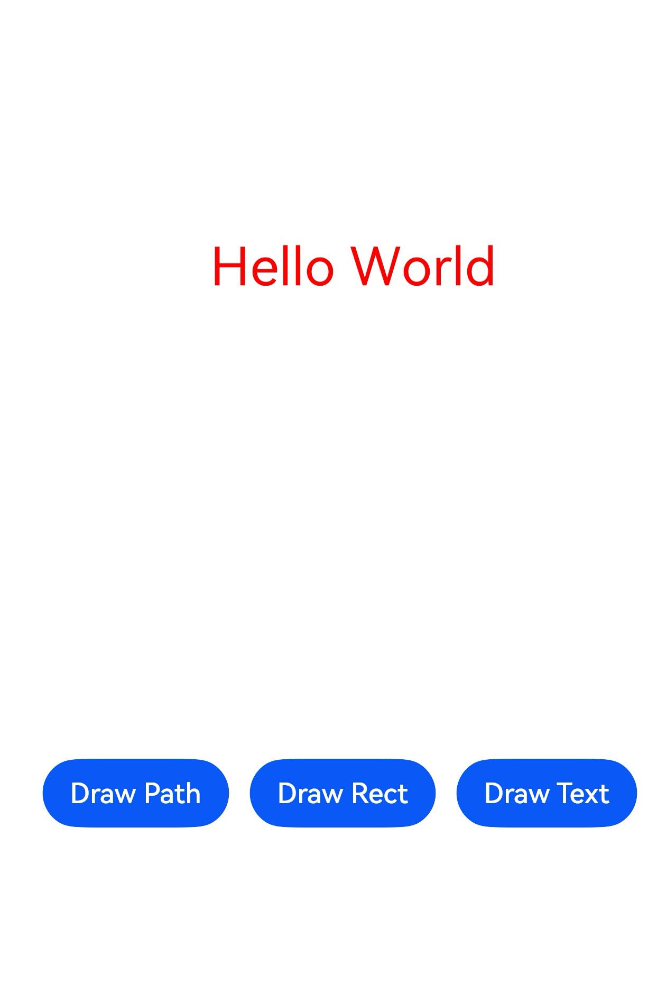

# 使用Drawing实现图形绘制与显示

## 场景介绍

@ohos.graphics.drawing模块提供了基本的绘制能力，如绘制矩形、圆形、点、直线、自定义Path、字体等等。

## 接口说明

@ohos.graphics.drawing常用接口如下表所示，详细的接口说明请参考[@ohos.graphics.drawing](../reference/apis-arkgraphics2d/js-apis-graphics-drawing.md)。

| 接口名 | 描述 | 
| -------- | -------- |
| drawPath(path: Path) : void | 画一个自定义路径。 |
| drawRect(rect: common2D.Rect): void | 用于绘制一个矩形，默认使用黑色填充。 |
| drawTextBlob(blob: TextBlob, x: number, y: number): void | 用于绘制一段文字。 |
| moveTo(x: number, y: number) : void | 设置自定义路径的起始点位置。 |
| lineTo(x: number, y: number) : void | 添加一条到目标点的线段。 |
| close(): void | 闭合路径，会添加一条到路径起点位置的线段。 |
| setAntiAlias(aa: boolean) : void | 用于设置画笔是否开启反走样。开启后，可以使得图形的边缘在显示时更平滑。|
| setColor(color: common2D.Color) : void | 用于设置画笔和画刷的颜色。|
| setStrokeWidth(width: number) : void | 用于设置画笔的线宽。|
| attachPen(pen: Pen): void | 绑定画笔给画布，画布将使用画笔的样式和颜色去绘制图形形状的轮廓。|
| attachBrush(brush: Brush): void | 绑定画刷给画布，画布将使用画刷的样式和颜色去绘制图形形状，并在其内部进行填充。|

## 开发步骤

使用Drawing进行图形绘制与显示时，需要使用@ohos.graphics.drawing模块的画布画笔绘制基本的2D图形和文字，调用绘制和显示的逻辑，最终在应用上显示图形和文字。

本文以实现2D图形和文字的绘制与显示为例，给出具体的开发指导。
### 添加开发依赖

**依赖文件**
```js
import { FrameNode, NodeController, RenderNode } from '@kit.ArkUI'
import { common2D, drawing } from '@kit.ArkGraphics2D'
```

接下来介绍如何使用Drawing接口进行内容绘制。

### 绘制2D图形

以下步骤描述了如何使用@ohos.graphics.drawing模块的画布画笔绘制基本的2D图形和文字：

1. **创建RenderNode子类**。创建`RenderNode`子类`MyRenderNode`，并在其中定义绘图函数。`RenderNode`中包含树结构的操作，以及对绘制属性的操作，其中`draw`方法会在`RenderNode`进行绘制时被调用，更多细节请参考[RenderNode](../reference/apis-arkui/js-apis-arkui-renderNode.md)。

    ```js
    // 创建一个MyRenderNode类，并构建Path形状。
    class MyRenderNode extends RenderNode {

        async draw(context: DrawContext) {
            // ...
        }
    }
    ```

2. **构建Path形状**。使用path的`moveTo`，`lineTo`和`close`接口构建五角星形状的Path。

    ```js
    const canvas = context.canvas
    let height_ = 1200
    let width_ = 600
    let len = height_ / 4
    let aX = width_ / 2
    let aY = height_ / 4
    let dX = aX - len * Math.sin(18.0)
    let dY = aY + len * Math.cos(18.0)
    let cX = aX + len * Math.sin(18.0)
    let cY = dY
    let bX = aX + (len / 2.0)
    let bY = aY + Math.sqrt((cX - dX) * (cX - dX) + (len / 2.0) * (len / 2.0))
    let eX = aX - (len / 2.0)
    let eY = bY;

    // 创建一个path对象，然后使用接口连接成一个五角星形状
    let path = new drawing.Path()
  
    // 指定path的起始位置
    path.moveTo(aX, aY)
  
    // 用直线连接到目标点
    path.lineTo(bX, bY)
    path.lineTo(cX, cY)
    path.lineTo(dX, dY)
    path.lineTo(eX, eY)
  
    // 闭合形状，path绘制完毕
    path.close()
    ```

3. **设置画笔和画刷样式**。使用`Pen`接口创建一个画笔实例pen，并设置抗锯齿、颜色、线宽等属性，画笔用于形状边框线的绘制。使用`Brush`接口创建一个画刷实例brush，并设置填充颜色，画刷用于形状内部的填充。使用canvas中的`attachPen`和`attachBrush`接口将画笔画刷的实例设置到画布实例中。

    ```js
    // 创建一个画笔Pen对象，Pen对象用于形状的边框线绘制
    let pen = new drawing.Pen()
    pen.setAntiAlias(true)
    let pen_color : common2D.Color = { alpha: 0xFF, red: 0xFF, green: 0x00, blue: 0x00 }
    pen.setColor(pen_color)
    pen.setStrokeWidth(10.0)
  
    // 将Pen画笔设置到canvas中
    canvas.attachPen(pen)

    // 创建一个画刷Brush对象，Brush对象用于形状的填充
    let brush = new drawing.Brush()
    let brush_color : common2D.Color = { alpha: 0xFF, red: 0x00, green: 0xFF, blue: 0x00 }
    brush.setColor(brush_color)

    // 将Brush画刷设置到canvas中
    canvas.attachBrush(brush)
    ```

4. **绘制Path形状**。使用canvas中的`drawPath`接口将五角星绘制到画布上。

    ```js
    // 绘制path
    canvas.drawPath(path)
    ```

5. **创建MyRenderNode对象**。以上1到4步构建出了MyRenderNode类并在其中定义了绘图的主要函数，接下来创建一个MyRenderNode对象，并设置它的像素格式。

    ```js
    // 创建一个MyRenderNode对象
    const newNode = new MyRenderNode()
    // 定义newNode的像素格式
    newNode.frame = { x: 100, y: 100, width: 200, height: 800 }
    newNode.pivot = { x: 0.2, y: 0.8 }
    newNode.scale = { x: 1, y: 1 }
    ```

6. **绘制矩形**。使用canvas中的`drawRect`接口绘制矩形。

    ```js
    class RectRenderNode extends RenderNode {
        async draw(context: DrawContext) {
            const canvas = context.canvas
            const pen = new drawing.Pen()
            pen.setStrokeWidth(5)
            pen.setColor({alpha: 255, red: 255, green: 0, blue: 0})
            canvas.attachPen(pen)
            canvas.drawRect({ left : 200, right : 500, top : 300, bottom : 900})
        }
    }
    // 创建一个RectRenderNode对象
    const rectNode = new RectRenderNode()
    // 定义rectNode的像素格式
    rectNode.frame = { x: 90, y: 100, width: 200, height: 800 }
    rectNode.pivot = { x: 0.2, y: 0.8 }
    rectNode.scale = { x: 1, y: 1 }
    ```

7. **绘制文字**。使用canvas中的`drawTextBlob`接口绘制文字。

    ```js
    class TextRenderNode extends RenderNode {
        async draw(context: DrawContext) {
            const canvas = context.canvas
            const brush = new drawing.Brush()
            brush.setColor({alpha: 255, red: 255, green: 0, blue: 0})
            const font = new drawing.Font()
            font.setSize(100)
            const textBlob = drawing.TextBlob.makeFromString("Hello World", font, drawing.TextEncoding.TEXT_ENCODING_UTF8)
            canvas.attachBrush(brush)
            canvas.drawTextBlob(textBlob, 90, 500)
        }
    }
    // 创建一个TextRenderNode对象
    const textNode = new TextRenderNode()
    // 定义textNode的像素格式
    textNode.frame = { x: 90, y: 100, width: 200, height: 800 }
    textNode.pivot = { x: 0.2, y: 0.8 }
    textNode.scale = { x: 1, y: 1 }
    ```

8. **创建NodeController子类**。创建`NodeController`的子类`MyNodeController`，并在其中定义创建`FrameNode`的函数。`NodeController`定义了节点容器的控制器，控制着容器里在生命周期中的节点。`FrameNode`定义了节点的基本类型，并包含一个`RenderNode`。

    ```js
    class MyNodeController extends NodeController {
        private rootNode: FrameNode | null = null;

        makeNode(uiContext: UIContext): FrameNode {
            this.rootNode = new FrameNode(uiContext)
            if (this.rootNode == null) {
                return this.rootNode
            }
            const renderNode = this.rootNode.getRenderNode()
            if (renderNode != null) {
                renderNode.frame = { x: 0, y: 0, width: 10, height: 500 }
                renderNode.pivot = { x: 50, y: 50 }
            }
            return this.rootNode
        }
    }
    ```

9. **创建添加节点的接口**。在第8步中创建的`MyNodeController`类中创建添加`RenderNode`的接口。

    ```js
    addNode(node: RenderNode): void {
        if (this.rootNode == null) {
            return
        }
        const renderNode = this.rootNode.getRenderNode()
        if (renderNode != null) {
            renderNode.appendChild(node)
        }
    }
    ```

10. **创建删除节点的接口**。在第8步中创建的`MyNodeController`类中创建删除`RenderNode`的接口。

    ```js
    clearNodes(): void {
        if (this.rootNode == null) {
            return
        }
        const renderNode = this.rootNode.getRenderNode()
        if (renderNode != null) {
            renderNode.clearChildren()
        }
    }
    ```

11. **绘制图形和文字**。创建`MyNodeController`实例并将其存入`NodeContainer`，添加button控件供用户点击，并调用已定义的接口。

    ```js
    @Entry
    @Component
    struct RenderTest {
        private myNodeController: MyNodeController = new MyNodeController()
        build() {
            Column() {
                Row() {
                    NodeContainer(this.myNodeController)
                        .height('100%')
                    Button("Draw Path")
                        .margin({ bottom: 200, right: 12 })
                        .onClick(() => {
                            this.myNodeController.clearNodes()
                            this.myNodeController.addNode(newNode)
                        })
                    Button("Draw Rect")
                        .margin({ bottom: 200, right: 12 })
                        .onClick(() => {
                            this.myNodeController.clearNodes()
                            this.myNodeController.addNode(rectNode)
                        })
                    Button("Draw Text")
                        .margin({ bottom: 200, right: 12 })
                        .onClick(() => {
                            this.myNodeController.clearNodes()
                            this.myNodeController.addNode(textNode)
                        })
                }
                .width('100%')
                .justifyContent(FlexAlign.Center)
                .shadow(ShadowStyle.OUTER_DEFAULT_SM)
                .alignItems(VerticalAlign.Bottom)
                .layoutWeight(1)
            }
        }
    }
    ```

12. 绘制与显示的效果图如下：

    | 主页                                 | 绘制五角星                                            | 绘制矩形                                            | 绘制文字                                            |
    | ------------------------------------ | ----------------------------------------------- | ------------------------------------ | ------------------------------------ |
    |  |  |  |  |


## 相关实例

针对Drawing图形绘制和显示的更多开发，可参考以下相关示例：

- [字体文本展开（ArkTS）（API12）](https://gitee.com/openharmony/applications_app_samples/tree/OpenHarmony-5.0.1-Release/code/BasicFeature/Graphics/Graphics2d/ExpandText)

- [字体绘制（ArkTS）（API12）](https://gitee.com/openharmony/applications_app_samples/tree/OpenHarmony-5.0.1-Release/code/BasicFeature/Graphics/Graphics2d/PaintVerbatim)

<!--RP1--><!--RP1End-->