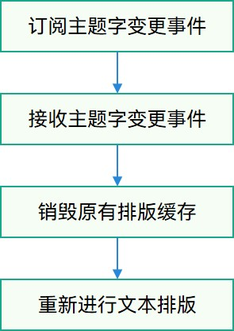
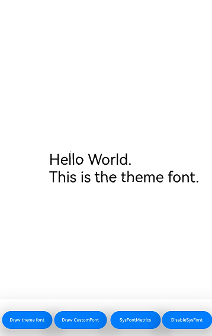
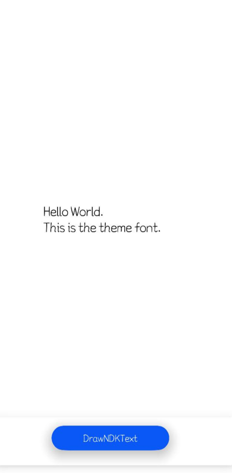

# 使用主题字体（C/C++）


## 场景介绍

主题字体，特指系统**主题应用**中能使用的字体，属于一种特殊的自定义字体。可以通过相关接口调用使能主题应用中的主题字体。


## 实现机制

**图1** 主题字体的切换和使用 



针对主题字的切换使用，应用方应确保订阅主题字变更事件，当接收字体变更事件后，由应用方主动调用页面刷新才能实现主题字的切换，否则主题字只能在重启应用后才生效；主题字的绘制需要使用OH_Drawing_GetFontCollectionGlobalInstance来获取全局字体集对象，仅该接口返回的对象拥有主题字体信息。

> **说明：**
>
> 由OH_Drawing_CreateSharedFontCollection创建的字体集对象不包含主题字信息，无法用于绘制主题字。


## 接口说明

注册使用主题字体的常用接口如下表所示，详细接口说明请参考[Drawing](../reference/apis-arkgraphics2d/capi-drawing.md)。

| 接口名 | 描述 |
| -------- | -------- |
| OH_Drawing_FontCollection\* OH_Drawing_GetFontCollectionGlobalInstance(void) | 获取全局的字体集对象OH_Drawing_FontCollection。 |
| [onConfigurationUpdate()](../reference/apis-ability-kit/js-apis-app-ability-ability.md#abilityonconfigurationupdate) | 系统配置更新时调用。<br/>主题应用当前仅提供ArkTS接口发布变更事件，需要应用自行处理进行跨语言调用。 |


## 开发步骤

1. 请确保在设备系统**主题应用**中，能成功应用一项主题字体。

2. 在应用入口文件（默认工程中为EntryAbility.ets）中复写onConfigurationUpdate函数，以响应fontId变更，适配主题字体的切换和页面刷新。

   ```c++
   // entry/src/main/ets/entryability/EntryAbility.ets
   export default class EntryAbility extends UIAbility {
       // ...  
       preFontId ="";
       onConfigurationUpdate(newConfig: Configuration):void{
           let fontId = newConfig.fontId;
           if(fontId && fontId !=this.preFontId){
               this.preFontId = fontId;
               // 调用C++代码
           }
       }
       // ...
   };
   ```

   系统配置信息（即示例中的newConfig）变化时，会自动触发onConfigurationUpdate函数。应用可从系统发送的配置信息获取fontId，通过判断是否与应用本地保存的fontId一致来识别主题字的切换。若不一致则刷新本地fontId，并调用C++代码刷新排版结果。

3. 本步骤及之后均为主题字体在C++侧的使用，从ArkTS到C++的调用通路需应用根据实际情况选取调用方式，本示例不作推荐。跨语言调用可参考[Node-API简介](../napi/napi-introduction.md)。

   在工程的`src/main/cpp/CMakeLists.txt`文件中添加以下lib。
   ```c++
   libnative_drawing.so
   ```

   导入头文件。

   ```c++
   #include <native_drawing/drawing_font_collection.h>
   #include <native_drawing/drawing_text_typography.h>
   #include <native_drawing/drawing_register_font.h>
   ```

4. 创建字体管理器。

   > **说明：**
   >
   > 注册主题字体作用于字体管理集全局对象，故必须使用OH_Drawing_GetFontCollectionGlobalInstance获取全局字体集对象进行绘制。如若使用OH_Drawing_CreateSharedFontCollection或OH_Drawing_CreateFontCollection创建字体集对象，无法使用主题字体。OH_Drawing_GetFontCollectionGlobalInstance获取的全局字体集不允许释放，释放会造成字体绘制紊乱问题。

   ```c++
   OH_Drawing_FontCollection *fontCollection = OH_Drawing_GetFontCollectionGlobalInstance();
   ```

5. OH_Drawing_SetTextStyleFontFamilies()接口可以用来指定字体家族名，从而实现使用指定字体。但使用主题字体，不需要使用OH_Drawing_SetTextStyleFontFamilies()接口指定字体，否则行为变更为优先使用指定字体，而不是主题字体。

   ```c++
   OH_Drawing_TextStyle textStyle = OH_Drawing_CreateTextStyle();
   // const char* myFontFamilies[] = {"otherFontFamilyName"};
   // 注意不要使用此接口来指定字体
   // OH_Drawing_SetTextStyleFontFamilies(textStyle, 1, myFontFamilies);
   ```

6. 设置段落文本内容为"Hello World. \nThis is the theme font."，此时该段落文本将应用主题字体。

   ```c++
   // 设置其他文本样式
   OH_Drawing_SetTextStyleColor(textStyle, OH_Drawing_ColorSetArgb(0xFF, 0x00, 0x00, 0x00));
   OH_Drawing_SetTextStyleFontSize(textStyle, 50.0);
   // 创建一个段落样式对象，以设置排版风格
   OH_Drawing_TypographyStyle *typographyStyle = OH_Drawing_CreateTypographyStyle();
   OH_Drawing_SetTypographyTextAlign(typographyStyle, TEXT_ALIGN_LEFT); // 设置段落样式为左对齐
   // 创建一个段落生成器
   OH_Drawing_TypographyCreate* handler = OH_Drawing_CreateTypographyHandler(typographyStyle, fontCollection);
   // 在段落生成器中设置文本样式
   OH_Drawing_TypographyHandlerPushTextStyle(handler, textStyle);
   // 在段落生成器中设置文本内容
   const char* text = "Hello World. \nThis is the theme font.";
   OH_Drawing_TypographyHandlerAddText(handler, text);
   // 通过段落生成器生成段落
   OH_Drawing_Typography* typography = OH_Drawing_CreateTypography(handler);
   ```

## 效果展示

以下展示了在系统**主题应用**中切换使用不同主题字体后，对应的文字渲染效果。

不同主题字体显示效果不同，此处仅示意。

**图2** 主题字体1的效果 



**图3** 主题字体2的效果 


