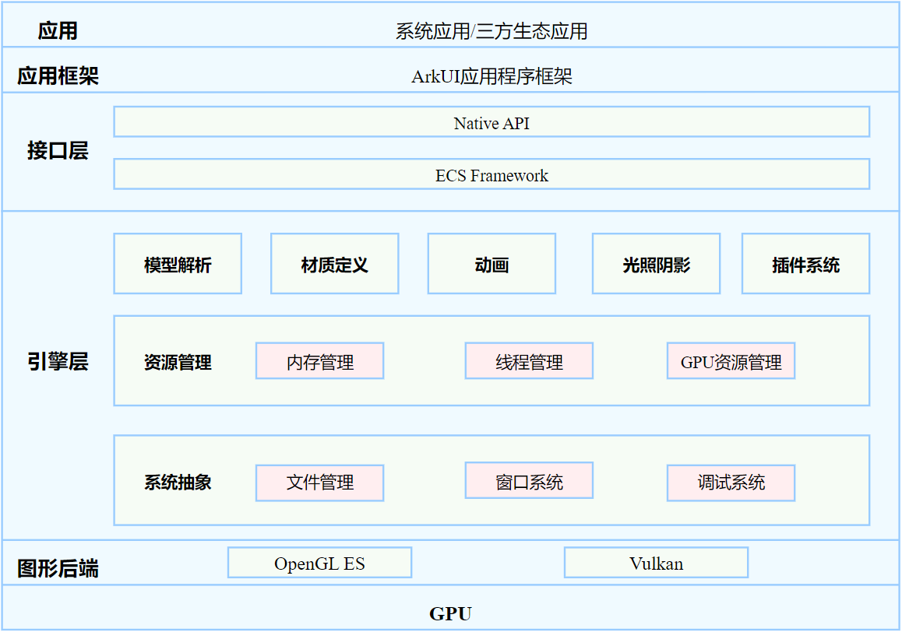

# ArkGraphics 3D简介

ArkGraphics 3D （方舟3D图形模块）基于轻量级的3D引擎以及渲染管线为开发者提供基础3D场景绘制能力，供开发者便捷、高效地构建3D场景并完成渲染。

## 功能介绍

- 提供加载并解析glTF模型的能力，支持开发者将glTF模型文件置于应用文件沙盒中，通过ArkGraphics 3D提供的异步接口完成模型的加载以及渲染。具体可见[@ohos.graphics.scene（场景管理）](../reference/apis-arkgraphics3d/js-apis-inner-scene.md)，glTF相关介绍请参见glTF-Specification。
- 提供自定义灯光（Light）、相机（Camera）节点以及通用节点（Node）的能力，支撑开发者自定义场景灯光、渲染视角等信息，同时支撑用户动态的调整场景树结构以及节点属性进而调整3D场景。具体可见[@ohos.graphics.scene（场景管理）](../reference/apis-arkgraphics3d/js-apis-inner-scene.md)以及[@ohos.graphics.sceneNode（节点管理）](../reference/apis-arkgraphics3d/js-apis-inner-scene-nodes.md)
- 提供创建图片（Image）、材质（Material）、环境（Environment）以及自定义着色器(Shader)的能力，支撑开发者调用ArkGraphics 3D提供的能力创建3D场景中使用的各种资源，支撑开发者自定义着色器，完成自定义3D材质渲染。具体参见[@ohos.graphics.scene（场景管理）](../reference/apis-arkgraphics3d/js-apis-inner-scene.md)以及[@ohos.graphics.sceneResource（资源管理）](../reference/apis-arkgraphics3d/js-apis-inner-scene-resources.md)
- 提供控制3D场景动画状态的能力，支撑开发者控制动画的开始、暂停、结束、播放到指定位置等操作，同时提供动画开始、结束时的回调函数支持开发者进行逻辑控制。具体可见[@ohos.graphics.sceneResource（资源管理）](../reference/apis-arkgraphics3d/js-apis-inner-scene-resources.md)
- 提供基础的3D渲染后处理能力，提供接口支撑开发者进行ToneMapping后处理相关控制。具体可见[@ohos.graphics.scenePostProcess（后处理管理）](../reference/apis-arkgraphics3d/js-apis-inner-scene-post-process-settings.md)

综上，ArkGraphics 3D提供基础的3D场景渲染能力，支撑开发者完成3D场景渲染以及逻辑控制开发工作。

## 框架原理

如上图 ArkGraphics 3D接口能力由图形后端、引擎层以及接口层三个关键部分共同组成。
- 图形后端：主要指GPU硬件提供的驱动接口类型，移动端业界通用的主要包含OpenGL ES以及Vulkan两类。引擎层通过下发GPU指令调用这些接口，实现场景的渲染。
- 引擎层：依托OpenHarmony Ark Graphics Platform 3D渲染引擎部件提供渲染能力，AGP引擎具有易用性、高画质、可扩展等特性。引擎使用先进的ECS（Entity-Component-System）架构设计，进行模块化封装（如材质定义、后处理特效等），为开发者提供了灵活易用的开发套件。引擎具体介绍请参见[AGP 3D引擎](https://gitee.com/openharmony/graphic_graphic_3d)。
- 接口层：基于引擎的ECS Framework，通过NAPI层对数据进行组织处理，向开发者暴露简单易用的3D渲染接口，支持开发者使用少量代码完成3D场景的开发。

## 约束限制

- 使用ArkGraphics 3D模块需要硬件设备支持OpenGL ES 3.2以上或者Vulkan 1.0以上的GPU驱动。
