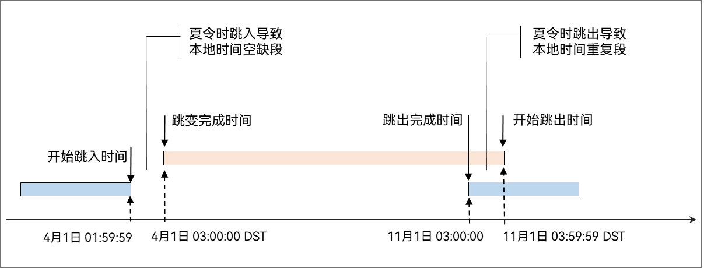

# 夏令时跳变


## 功能介绍

夏令时是一种为节约能源而人为规定地方时间的制度，即在天亮早的夏季人为将时间调快一小时，可以使人们早起早睡，减少照明时间，从而节约照明用电。


## 实现原理

系统会配置夏令时跳变规则，当本地时间到达跳变点时，会自动实现跳变。若应用通过一般的ts接口（例如 Date()）获取和显示时间，则到夏令时跳变时间点时，应用会同步显示夏令时时间。

**夏令时跳变规则如下：**

1. 计算一天的小时数。
   一整天的小时数在夏令时跳变的当天会发生变化，并非24小时。夏令时开始的当天，一整天时间为23小时；夏令时结束的当天，一整天时间为25小时。

   计算夏令时跳变前后同一个挂钟时间之间相差的小时数，示例代码如下：
   ```ts
   import { i18n } from '@kit.LocalizationKit';
   let calendar = i18n.getCalendar("zh-Hans");
   calendar.setTimeZone("Europe/London");
   calendar.set(2021, 2, 27, 16, 0, 0); //The day before daylight saving time start
   let time1 = calendar.getTimeInMillis();
   calendar.set(2021, 2, 28, 16, 0, 0); //The day daylight saving time start
   let time2 = calendar.getTimeInMillis();
   let hours = (time2 - time1)/(3600*1000) //The hours between the same wall clock time before and after DST. Should be 23
   ```

2. 存储和显示数据。
   按当地夏令时计时规则，存储和显示数据，需要处理夏令时跳变带来额时间空缺和重复。

   夏令时跳入将导致1小时空缺，例如1:59:59→3:00:00；夏令时跳出将导致1小时重复，例如3:59:59→3:00:00。

   夏令时内的本地时间显示，建议加上夏令时标识。

   

3. 存储和传输时间数据。
   建议使用0时区标准时间（UTC或者GMT）进行时间数据的存储和传输，避免夏令时跳变带来的信息丢失或异常。
