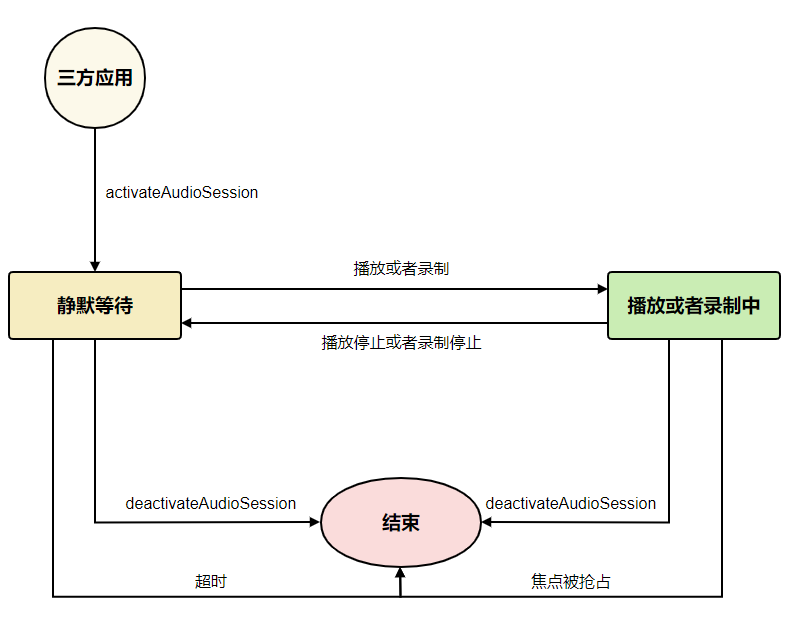

# 音频焦点和音频会话介绍

## 音频焦点

当应用播放或录制声音的时候，经常会发生与其他音频流的并发或打断现象，这对用户的体验影响很大。例如应用开始播放视频时，如果后台正在播放音乐，用户会希望音乐可以自动暂停，让视频优先播放，这就是音频焦点的作用。对于需要使用音频业务的应用，做好音频焦点管理是一项非常重要的工作，可以为用户提供良好的音频体验。

在应用启动播放或录制之前，需要首先[申请音频焦点](#如何申请和释放音频焦点)；在播放或录制完成后，需要[释放音频焦点](#如何申请和释放音频焦点)。在播放或录制的过程中，可能会因为其他音频流打断而失去焦点，此时需要应用[根据焦点变化做出相应的处理](#如何处理音频焦点变化)。

系统预设了默认的[音频焦点策略](#音频焦点策略)，会根据各个音频流的类型及启动先后顺序，对所有音频流（包含播放和录制）进行统一的焦点管理。同时，应用可以调用音频会话（AudioSession）相关的接口，主动管理自身音频流的音频焦点表现。

对应用而言，为确保带给用户良好的音频焦点体验，需要注意：
 - 应用在启动播放或录制之前，需要根据音频的用途，[使用合适的音频流类型](./using-right-streamusage-and-sourcetype.md)，即正确指定[StreamUsage](../../reference/apis-audio-kit/js-apis-audio.md#streamusage)或[SourceType](../../reference/apis-audio-kit/js-apis-audio.md#sourcetype8)；
 - 应用需要[监听音频焦点事件](#监听音频焦点事件的方法)，并在收到[音频焦点事件（InterruptEvent）](../../reference/apis-audio-kit/js-apis-audio.md#interruptevent9)时做出必要的响应。

 - 若应用希望对音频焦点做一些主动管理，可以使用[音频会话（AudioSession）](#如何使用audiosession管理音频焦点)相关接口。

## 如何申请和释放音频焦点

### 申请音频焦点

**当应用开始播放或录制音频时，系统会自动为相应的音频流申请音频焦点。**

例如：若应用[使用AudioRenderer开发音频播放功能](using-audiorenderer-for-playback.md)，当调用AudioRenderer的[start](../../reference/apis-audio-kit/js-apis-audio.md#start8)函数时，系统会为其申请音频焦点。

若音频焦点申请成功，则音频流可以正常开始；若音频焦点申请被拒绝，则音频流不能启动播放或录制。

推荐应用[监听音频焦点事件](#监听音频焦点事件的方法)，在音频焦点申请被拒绝时，应用会收到[音频焦点事件（InterruptEvent）](../../reference/apis-audio-kit/js-apis-audio.md#interruptevent9)。

特殊场景：

（1）若应用[使用SoundPool开发音频播放功能](../media/using-soundpool-for-playback.md)，且[StreamUsage](../../reference/apis-audio-kit/js-apis-audio.md#streamusage)指定为Music、Movie、AudioBook等类型，播放短音，则其申请焦点时默认为并发模式，不会影响其他音频。

（2）若应用以静音状态开始播放音频（或视频），并且希望静音阶段不影响其他音频，当后续解除静音的时候，再以正常策略申请音频焦点，则可以调用静音并发播放模式的相关接口。具体可参考：

 - 若[使用AVPlayer开发音频播放功能(ArkTS)](../media/using-avplayer-for-playback.md)，可以调用[setMediaMuted](../../reference/apis-media-kit/js-apis-media.md#setmediamuted12)函数。

 - 若[使用AudioRenderer开发音频播放功能](using-audiorenderer-for-playback.md)，可调用[setSilentModeAndMixWithOthers](../../reference/apis-audio-kit/js-apis-audio.md#setsilentmodeandmixwithothers12)函数。

 - 若[使用OHAudio开发音频播放功能(C/C++)](using-ohaudio-for-playback.md)，可调用[OH_AudioRenderer_SetSilentModeAndMixWithOthers](../../reference/apis-audio-kit/_o_h_audio.md#oh_audiorenderer_setsilentmodeandmixwithothers)函数。

### 释放音频焦点

**当应用结束播放或录制音频时，系统会自动为相应的音频流释放音频焦点。**

例如：若应用[使用AudioRenderer开发音频播放功能](using-audiorenderer-for-playback.md)，当调用AudioRenderer的[pause](../../reference/apis-audio-kit/js-apis-audio.md#pause8)、[stop](../../reference/apis-audio-kit/js-apis-audio.md#stop8)、[release](../../reference/apis-audio-kit/js-apis-audio.md#release8)等函数时，系统会为其释放音频焦点。

当音频流释放音频焦点时，若存在被它影响了焦点表现的音频流（如被它降低音量、被它暂停等），此时会触发恢复操作。

若应用不希望在音频流停止时立刻释放音频焦点，可以使用[音频会话（AudioSession）](#如何使用audiosession管理音频焦点)的相关接口，达到延迟释放音频焦点的效果。

### 音频焦点策略

当一个音频流申请或释放音频焦点时，系统会根据音频焦点策略，对所有音频流（包含播放和录制）进行焦点管理，决策哪些音频流可以正常运行，哪些音频流需要被打断或执行其他操作。

默认的音频焦点策略由系统预设，主要决策依据为音频流类型（即播放流的[StreamUsage](../../reference/apis-audio-kit/js-apis-audio.md#streamusage)和录制流的[SourceType](../../reference/apis-audio-kit/js-apis-audio.md#sourcetype8)）及音频流启动的先后顺序。

为避免出现不符合预期的焦点变化，应用在启动播放或录制之前，需要根据音频流的用途，正确指定StreamUsage或SourceType，关于各个类型的详细介绍，可参考[使用合适的音频流类型](./using-right-streamusage-and-sourcetype.md)。

常见的音频焦点场景举例：

- 开始播放Movie，会让正在播放的Music停止，后续Movie停止时，Music也不会收到恢复通知。

- 开始播放Navigation，会让正在播放的Music降低音量，后续Navigation停止时，Music会恢复音量。

- Music和Game可以并发混音播放，互不影响。

- 开始播放VoiceCommunication，会让正在播放的Music暂停，后续VoiceCommunication停止时，Music会收到恢复通知。

- 开始录制VoiceMessage，会让正在播放的Music暂停，后续VoiceMessage录制停止时，Music会收到恢复通知。

若默认的音频焦点策略无法满足某些场景的焦点诉求，应用可使用[音频会话（AudioSession）](#如何使用audiosession管理音频焦点)的相关接口，来修改本应用的音频流所使用的音频焦点策略。

### 焦点模式

针对同一应用创建的多个音频流，应用可通过设置[焦点模式（InterruptMode）](../../reference/apis-audio-kit/js-apis-audio.md#interruptmode9)，选择由应用自主管控，或由系统统一管控。

系统预设了2种焦点模式：

- 共享焦点模式（SHARE_MODE）：由同一应用创建的多个音频流，共享一个音频焦点。这些音频流之间的并发规则由应用自主决定，音频焦点策略不会介入。当其他应用创建的音频流与该应用的音频流并发播放时，才会触发音频焦点策略的管控。

- 独立焦点模式（INDEPENDENT_MODE）：应用创建的每一个音频流均会独立拥有一个音频焦点，当多个音频流并发播放时，会触发音频焦点策略的管控。

应用可以按需选择合适的焦点模式，在创建音频流时，系统默认采用共享焦点模式（SHARE_MODE），应用可主动设置所需的模式。

设置焦点模式的方法：

- 若[使用AVPlayer开发音频播放功能(ArkTS)](../media/using-avplayer-for-playback.md)，则可以通过修改AVPlayer的[audioInterruptMode](../../reference/apis-media-kit/js-apis-media.md#avplayer9)属性进行设置。

- 若[使用AVPlayer开发音频播放功能(C/C++)](../media/using-ndk-avplayer-for-playerback.md)，则可以调用[OH_AVPlayer_SetAudioInterruptMode](../../reference/apis-media-kit/_a_v_player.md#oh_avplayer_setaudiointerruptmode)函数进行设置。

- 若[使用AudioRenderer开发音频播放功能](using-audiorenderer-for-playback.md)，则可以调用[setInterruptMode](../../reference/apis-audio-kit/js-apis-audio.md#setinterruptmode9)函数进行设置。

- 若[使用OHAudio开发音频播放功能(C/C++)](using-ohaudio-for-playback.md)，则可以调用[OH_AudioStreamBuilder_SetRendererInterruptMode](../../reference/apis-audio-kit/_o_h_audio.md#oh_audiostreambuilder_setrendererinterruptmode)函数进行设置。


## 如何处理音频焦点变化

在应用播放或录制音频的过程中，若有其他音频流申请焦点，系统会根据[焦点策略](#音频焦点策略)进行焦点处理。若判定本音频流的焦点有变化，需要执行暂停、继续、降低音量、恢复音量等操作，则系统会自动执行一些必要的操作，并通过[音频焦点事件（InterruptEvent）](../../reference/apis-audio-kit/js-apis-audio.md#interruptevent9)通知应用。

因此，为了维持应用和系统的状态一致性，保证良好的用户体验，推荐应用[监听音频焦点事件](#监听音频焦点事件的方法)，并在焦点发生变化时，根据[InterruptEvent](../../reference/apis-audio-kit/js-apis-audio.md#interruptevent9)做出必要的响应。

### 监听音频焦点事件的方法：

- 若[使用AVPlayer开发音频播放功能(ArkTS)](../media/using-avplayer-for-playback.md)，可以调用[on('audioInterrupt')](../../reference/apis-media-kit/js-apis-media.md#onaudiointerrupt9)接口，监听音频焦点事件[InterruptEvent](../../reference/apis-audio-kit/js-apis-audio.md#interruptevent9)。

- 若[使用AVPlayer开发音频播放功能(C/C++)](../media/using-ndk-avplayer-for-playerback.md)，可以调用[OH_AVPlayer_SetOnInfoCallback()](../../reference/apis-media-kit/_a_v_player.md#oh_avplayer_setoninfocallback)接口，监听音频焦点事件[OH_AVPlayerOnInfoCallback](../../reference/apis-media-kit/_a_v_player.md#oh_avplayeroninfocallback)。

- 若[使用AudioRenderer开发音频播放功能](using-audiorenderer-for-playback.md)，可以调用[on('audioInterrupt')](../../reference/apis-audio-kit/js-apis-audio.md#onaudiointerrupt9)接口，监听音频焦点事件[InterruptEvent](../../reference/apis-audio-kit/js-apis-audio.md#interruptevent9)。

- 若[使用OHAudio开发音频播放功能(C/C++)](using-ohaudio-for-playback.md)，可以调用[OH_AudioStreamBuilder_SetRendererCallback](../../reference/apis-audio-kit/_o_h_audio.md#oh_audiostreambuilder_setrenderercallback)接口，监听音频焦点事件[OH_AudioRenderer_OnInterruptEvent](../../reference/apis-audio-kit/_o_h___audio_renderer___callbacks___struct.md#oh_audiorenderer_oninterruptevent)。

- 若[使用AudioCapturer开发音频录制功能](using-audiocapturer-for-recording.md)，可以调用[on('audioInterrupt')](../../reference/apis-audio-kit/js-apis-audio.md#onaudiointerrupt10)接口，监听音频焦点事件[InterruptEvent](../../reference/apis-audio-kit/js-apis-audio.md#interruptevent9)。

- 若[使用OHAudio开发音频录制功能(C/C++)](using-ohaudio-for-recording.md)，可以调用[OH_AudioStreamBuilder_SetCapturerCallback](../../reference/apis-audio-kit/_o_h_audio.md#oh_audiostreambuilder_setcapturercallback)接口，监听音频焦点事件[OH_AudioCapturer_OnInterruptEvent](../../reference/apis-audio-kit/_o_h___audio_capturer___callbacks___struct.md#oh_audiocapturer_oninterruptevent)。


### 处理音频焦点事件

应用在收到音频焦点事件时，需要根据其中信息，做出相应的处理，以保持应用与系统状态一致，带给用户良好的音频体验。

音频焦点事件中，有2个参数信息需要应用重点关注：[打断类型（InterruptForceType)](#打断类型interruptforcetype)）和[打断提示（InterruptHint）](#打断提示interrupthint)。

#### 打断类型（InterruptForceType）

InterruptForceType参数提示应用该焦点变化是否已由系统强制操作：

- 强制打断类型（INTERRUPT_FORCE）：由系统进行操作，强制执行。应用需要做一些必要的处理，例如更新状态、更新界面显示等。

- 共享打断类型（INTERRUPT_SHARE）：由应用进行操作，应用可以选择响应或忽略，系统不会干涉。

系统默认优先采用强制打断类型（INTERRUPT_FORCE），应用无法更改。

注意：对于一些系统无法强制执行的操作（例如INTERRUPT_HINT_RESUME），会采用共享打断类型（INTERRUPT_SHARE）。

#### 打断提示（InterruptHint）

InterruptHint参数提示应用需要对音频流进行何种操作：

 - 继续（INTERRUPT_HINT_RESUME）：音频可以继续播放或录制，仅在PAUSE之后收到。

    注意，此操作无法由系统强制执行，其对应的[InterruptForceType](#打断类型interruptforcetype)一定为INTERRUPT_SHARE类型。

 - 暂停（INTERRUPT_HINT_PAUSE）：音频暂停，暂时失去音频焦点。后续待焦点可用时，会再收到INTERRUPT_HINT_RESUME。
 - 停止（INTERRUPT_HINT_STOP）：音频停止，彻底失去音频焦点。
 - 降低音量（INTERRUPT_HINT_DUCK）：音频降低音量播放，而不会停止。默认降低至正常音量的20%。
 - 恢复音量（INTERRUPT_HINT_UNDUCK）：音频恢复正常音量。

#### 处理音频焦点示例

为了带给用户更好的音频体验，针对不同的音频焦点事件内容，应用需要做出相应的处理操作。此处以[使用AudioRenderer开发音频播放功能](using-audiorenderer-for-playback.md)为例，展示推荐应用采取的处理方法，提供伪代码供开发者参考。

若使用其他接口开发音频播放或音频录制功能，处理方法类似，具体的代码实现，开发者可结合实际情况编写，处理方法也可自行调整。

```ts
import { audio } from '@kit.AudioKit';  // 导入audio模块
import { BusinessError } from '@kit.BasicServicesKit'; // 导入BusinessError

let isPlay: boolean; // 是否正在播放，实际开发中，对应与音频播放状态相关的模块
let isDucked: boolean; //是否降低音量，实际开发中，对应与音频音量相关的模块
let started: boolean; // 标识符，记录“开始播放（start）”操作是否成功

async function onAudioInterrupt(): Promise<void> {
  // 此处以使用AudioRenderer开发音频播放功能举例，变量audioRenderer即为播放时创建的AudioRenderer实例。
  audioRenderer.on('audioInterrupt', async(interruptEvent: audio.InterruptEvent) => {
    // 在发生音频焦点变化时，audioRenderer收到interruptEvent回调，此处根据其内容做相应处理
    // 1. 可选：读取interruptEvent.forceType的类型，判断系统是否已强制执行相应操作。
    // 注：默认焦点策略下，INTERRUPT_HINT_RESUME为INTERRUPT_SHARE类型，其余hintType均为INTERRUPT_FORCE类型。因此对forceType可不做判断。
    // 2. 必选：读取interruptEvent.hintType的类型，做出相应的处理。
    if (interruptEvent.forceType === audio.InterruptForceType.INTERRUPT_FORCE) {
      // 强制打断类型（INTERRUPT_FORCE）：音频相关处理已由系统执行，应用需更新自身状态，做相应调整
       switch (interruptEvent.hintType) {
        case audio.InterruptHint.INTERRUPT_HINT_PAUSE:
          // 此分支表示系统已将音频流暂停（临时失去焦点），为保持状态一致，应用需切换至音频暂停状态
          // 临时失去焦点：待其他音频流释放音频焦点后，本音频流会收到resume对应的音频焦点事件，到时可自行继续播放
          isPlay = false; // 此句为简化处理，代表应用切换至音频暂停状态的若干操作
          break;
        case audio.InterruptHint.INTERRUPT_HINT_STOP:
          // 此分支表示系统已将音频流停止（永久失去焦点），为保持状态一致，应用需切换至音频暂停状态
          // 永久失去焦点：后续不会再收到任何音频焦点事件，若想恢复播放，需要用户主动触发。
          isPlay = false; // 此句为简化处理，代表应用切换至音频暂停状态的若干操作
          break;
        case audio.InterruptHint.INTERRUPT_HINT_DUCK:
          // 此分支表示系统已将音频音量降低（默认降到正常音量的20%）
          isDucked = true; // 此句为简化处理，代表应用切换至降低音量播放状态的若干操作
          break;
        case audio.InterruptHint.INTERRUPT_HINT_UNDUCK:
          // 此分支表示系统已将音频音量恢复正常
          isDucked = false; // 此句为简化处理，代表应用切换至正常音量播放状态的若干操作
          break;
        default:
          break;
      }
    } else if (interruptEvent.forceType === audio.InterruptForceType.INTERRUPT_SHARE) {
      // 共享打断类型（INTERRUPT_SHARE）：应用可自主选择执行相关操作或忽略音频焦点事件
      switch (interruptEvent.hintType) {
        case audio.InterruptHint.INTERRUPT_HINT_RESUME:
          // 此分支表示临时失去焦点后被暂停的音频流此时可以继续播放，建议应用继续播放，切换至音频播放状态
          // 若应用此时不想继续播放，可以忽略此音频焦点事件，不进行处理即可
          // 继续播放，此处主动执行start()，以标识符变量started记录start()的执行结果
          await audioRenderer.start().then(() => {
            started = true; // start()执行成功
          }).catch((err: BusinessError) => {
            started = false; // start()执行失败
          });
          // 若start()执行成功，则切换至音频播放状态
          if (started) {
            isPlay = true; // 此句为简化处理，代表应用切换至音频播放状态的若干操作
          } else {
            // 音频继续播放的操作执行失败
          }
          break;
        default:
          break;
      }
   }
  });
}
```

## 如何使用AudioSession管理音频焦点

应用可以使用音频会话（AudioSession）的相关接口，主动管理本应用音频流的焦点，定制本应用音频流的焦点策略，以满足应用特定的使用场景。

使用音频会话（AudioSession）相关接口，主要可以实现以下功能：

- 应用[激活音频会话（AudioSession）](#激活audiosession)并指定[音频会话策略（AudioSessionStrategy）](#音频会话策略audiosessionstrategy)后，本应用的所有音频流在参与焦点管理时，会优先使用该策略。

  典型场景：应用播放短视频时，会打断后台音乐，应用希望自身的音频流停止后，后台的音乐可以自动恢复。

- 音频会话（AudioSession）处于激活状态下，本应用的音频流全部停止时，不会立刻释放音频焦点，系统会保持音频焦点，直到音频会话停用时再释放音频焦点，或是直到该应用有新的音频流申请焦点。

  典型场景：应用连续播放多个音频时，在多个音频衔接的间隙，不希望后台被影响的其他音频自动恢复，希望整个播放过程保持音频焦点的连贯性。

### 音频会话（AudioSession）使用流程

AudioSession流程示意图：


1、音频业务开始之前，[获取AudioSessionManager](#获取audiosessionmanager)，[激活AudioSession](#激活audiosession)，指定[AudioSessionStrategy](#音频会话策略audiosessionstrategy)。

2、应用正常开始播放、录制等音频业务。系统会在音频流开始时，申请音频焦点。本应用的所有音频流在参与焦点处理时，会优先使用AudioSession指定的策略。

3、音频业务结束之后，[停用AudioSession](#停用audiosession)。系统会在音频流停止且AudioSession停用时，释放音频焦点。

在使用AudioSession的过程中，推荐应用[监听AudioSession停用事件](#监听audiosession停用事件)，当AudioSession被停用时，应用可以及时收到[AudioSession停用事件](../../reference/apis-audio-kit/js-apis-audio.md#audiosessiondeactivatedevent12)。


#### 获取AudioSessionManager

在使用AudioSession相关的接口前，均需要先获取AudioSessionManager实例。

具体方法可参考[音频会话管理(ArkTS)](./audio-session-management.md)或[音频会话管理(C/C++)](./using-ohaudio-for-session.md)。

#### 激活AudioSession

应用需要在音频业务开始前，激活当前应用的AudioSession，并根据实际需要指定AudioSessionStrategy。

具体方法可参考[音频会话管理(ArkTS)](./audio-session-management.md)或[音频会话管理(C/C++)](./using-ohaudio-for-session.md)。

需注意：
 - 激活AudioSession时传入的策略会被保存，在此之后，本应用的音频流参与焦点管理时（比如申请焦点、释放焦点等），会优先使用本策略。
 - 允许重复激活AudioSession，重复激活时系统保存的策略会被更新，焦点管理时会使用最新的策略。

AudioSession处于激活状态时，有以下特性：
 - 若应用一直没有音频流处于运行状态，则系统会在1分钟后自动停用AudioSession。
 - 应用的音频流停止时，若该应用无其他音频流运行，则不会立刻释放焦点，而是会保持焦点（进入静默等待状态），直到AudioSession停用或该应用有新的音频流申请焦点。

#### 停用AudioSession

应用需要在音频业务结束之后，主动停用AudioSession。

具体方法可参考[音频会话管理(ArkTS)](./audio-session-management.md)或[音频会话管理(C/C++)](./using-ohaudio-for-session.md)。

应用在停用AudioSession时，如果该应用的所有音频流已全部停止（即处于保持焦点的静默等待状态），则会立刻释放音频焦点；如果该应用仍有音频流在运行，则它的音频流仍然会持有焦点，直到音频流停止时才释放。

### 音频会话策略（AudioSessionStrategy）

应用在激活AudioSession时，需指定音频会话策略（AudioSessionStrategy），其中包含[音频并发模式（AudioConcurrencyMode）](../../reference/apis-audio-kit/js-apis-audio.md#audioconcurrencymode12)参数，用于声明不同的音频并发策略。

系统预设了以下四种音频并发模式：

- 默认模式（CONCURRENCY_DEFAULT）：即系统默认的[音频焦点策略](#音频焦点策略)。

- 并发模式（CONCURRENCY_MIX_WITH_OTHERS）：和其它音频流并发。

- 降低音量模式（CONCURRENCY_DUCK_OTHERS）：和其他音频流并发，并且降低其他音频流的音量。

- 暂停模式（CONCURRENCY_PAUSE_OTHERS）：暂停其他音频流，待释放焦点后通知其他音频流恢复。

注意：AudioSession使用以上各模式时，系统会最大程度满足其焦点策略，但并不一定能在所有场景都能满足。

例如：使用CONCURRENCY_PAUSE_OTHERS模式时，Movie流申请音频焦点，如果Music流正在播放，则Music流会被暂停。但是如果VoiceCommunication流正在播放，则VoiceCommunication流不会被暂停。

### 监听AudioSession停用事件

应用在使用AudioSession的过程中，推荐应用监听音频会话停用事件（AudioSessionDeactivatedEvent）。当AudioSession被停用（非主动停用）时，应用会收到此事件通知。应用可根据自身业务需求，做相应的处理，例如释放相应资源、重新激活AudioSession等。

具体方法可参考[音频会话管理(ArkTS)](./audio-session-management.md)或[音频会话管理(C/C++)](./using-ohaudio-for-session.md)。

音频会话停用事件（AudioSessionDeactivatedEvent）包含参数音频会话停用原因（AudioSessionDeactivatedReason），该参数表示AudioSession被停用的原因，主要有两种：

- 应用焦点被抢占（DEACTIVATED_LOWER_PRIORITY）：该应用所有的音频流全部被其他音频流打断，丢失焦点，AudioSession被同时停用。

- 超时（DEACTIVATED_TIMEOUT）：若AudioSession处于激活状态，但该应用没有音频流在运行状态，则AudioSession会在1分钟之后被超时停用。

  注意：当AudioSession因超时而停用时，被其压低音量（Duck）的音频会触发恢复音量（Unduck）操作，被其暂停（Pause）的音频流会触发停止（Stop）操作。

## 典型场景

以下列举一些典型的焦点适配场景。

| 先播音频类型       | 推荐流类型         | 后播音频类型 | 推荐流类型            | 推荐体验                                                     | 适配方案                                                     |
| ---------------- | ------------------ | ------------ | --------------------- | ------------------------------------------------------------ | ------------------------------------------------------------ |
| 音乐         | STREAM_USAGE_MUSIC | 音乐         | STREAM_USAGE_MUSIC    | 后播音乐正常播放，先播音乐停止播放，UI变成停止播放状态。 | 先播音乐应用注册焦点事件监听，接收到`INTERRUPT_HINT_STOP`事件时，停止音乐播放，并更新UI界面。 |
| 音乐         | STREAM_USAGE_MUSIC | 导航         | STREAM_USAGE_NAVIGATION    | 导航正常播放，音乐降低音量播放。当导航结束后，音乐恢复正常音量。 | 音乐应用注册焦点事件监听，接收到`INTERRUPT_HINT_DUCK`和`INTERRUPT_HINT_UNDUCK`事件时，可以选择更新UI界面。 |
| 视频           | STREAM_USAGE_MOVIE | 闹铃         | STREAM_USAGE_ALARM    | 闹铃响起后，视频暂停播放；闹钟结束后，视频继续播放。         | 视频应用注册焦点事件监听，接收到`INTERRUPT_HINT_PAUSE`事件时，直接暂停视频播放，并更新UI界面。当闹铃结束后，视频应用接收到`INTERRUPT_HINT_RESUME`事件，重新启动播放。 |
| 音乐         | STREAM_USAGE_MUSIC | 来电铃声     | STREAM_USAGE_RINGTONE | 开始响铃，音乐暂停播放；不接通或者接通再挂断后，音乐恢复播放。 | 音乐应用注册焦点事件监听，接收到`INTERRUPT_HINT_PAUSE`事件时，直接暂停音乐播放，并更新UI界面。当电话结束后，视频应用接收到`INTERRUPT_HINT_RESUME`事件，重新启动播放。 |
| 音乐         | STREAM_USAGE_MUSIC | VoIP通话     | STREAM_USAGE_VOICE_COMMUNICATION | 通话接通时，音乐暂停播放；通话挂断后，音乐恢复播放。 | 音乐应用注册焦点事件监听，接收到`INTERRUPT_HINT_PAUSE`事件时，直接暂停音乐播放，并更新UI界面。当通话结束后，音乐应用接收到`INTERRUPT_HINT_RESUME`事件，重新启动播放。 |
