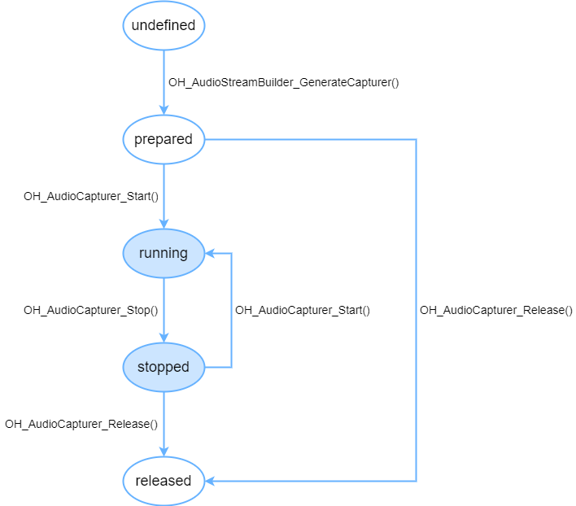

# 使用OHAudio开发音频录制功能(C/C++)

OHAudio是系统在API version 10中引入的一套C API，此API在设计上实现归一，同时支持普通音频通路和低时延通路。仅支持PCM格式，适用于依赖Native层实现音频输入功能的场景。

OHAudio音频频录状态变化示意图：


## 使用入门

开发者要使用OHAudio提供的录制能力，需要添加对应的头文件。

### 在 CMake 脚本中链接动态库

``` cmake
target_link_libraries(sample PUBLIC libohaudio.so)
```
### 添加头文件
开发者通过引入<[native_audiostreambuilder.h](../../reference/apis-audio-kit/native__audiostreambuilder_8h.md)>和<[native_audiocapturer.h](../../reference/apis-audio-kit/native__audiocapturer_8h.md)>头文件，使用音频录制相关API。

```cpp
#include <ohaudio/native_audiocapturer.h>
#include <ohaudio/native_audiostreambuilder.h>
```
## 音频流构造器

OHAudio提供OH_AudioStreamBuilder接口，遵循构造器设计模式，用于构建音频流。开发者需要根据业务场景，指定对应的[OH_AudioStream_Type](../../reference/apis-audio-kit/_o_h_audio.md#oh_audiostream_type) 。

`OH_AudioStream_Type`包含两种类型：

- AUDIOSTREAM_TYPE_RENDERER
- AUDIOSTREAM_TYPE_CAPTURER

使用[OH_AudioStreamBuilder_Create](../../reference/apis-audio-kit/_o_h_audio.md#oh_audiostreambuilder_create)创建构造器示例：

```
OH_AudioStreamBuilder* builder;
OH_AudioStreamBuilder_Create(&builder, streamType);
```

在音频业务结束之后，开发者应该执行[OH_AudioStreamBuilder_Destroy](../../reference/apis-audio-kit/_o_h_audio.md#oh_audiostreambuilder_destroy)接口来销毁构造器。

```
OH_AudioStreamBuilder_Destroy(builder);
```

## 开发步骤及注意事项

详细的API说明请参考[OHAudio API参考](../../reference/apis-audio-kit/_o_h_audio.md)。

开发者可以通过以下几个步骤来实现一个简单的录制功能。


1. 创建构造器

    ```c++
    OH_AudioStreamBuilder* builder;
    OH_AudioStreamBuilder_Create(&builder, AUDIOSTREAM_TYPE_CAPTURER);
    ```

2. 配置音频流参数

    创建音频录制构造器后，可以设置音频流所需要的参数，可以参考下面的案例。

    ```c++
    // 设置音频采样率
    OH_AudioStreamBuilder_SetSamplingRate(builder, 48000);
    // 设置音频声道
    OH_AudioStreamBuilder_SetChannelCount(builder, 2);
    // 设置音频采样格式
    OH_AudioStreamBuilder_SetSampleFormat(builder, AUDIOSTREAM_SAMPLE_S16LE);
    // 设置音频流的编码类型
    OH_AudioStreamBuilder_SetEncodingType(builder, AUDIOSTREAM_ENCODING_TYPE_RAW);
    // 设置输入音频流的工作场景
    OH_AudioStreamBuilder_SetCapturerInfo(builder, AUDIOSTREAM_SOURCE_TYPE_MIC);
    ```

    同样，音频录制的音频数据要通过回调接口写入，开发者要实现回调接口，使用`OH_AudioStreamBuilder_SetCapturerCallback`设置回调函数。回调函数的声明请查看[OH_AudioCapturer_Callbacks](../../reference/apis-audio-kit/_o_h_audio.md#oh_audiocapturer_callbacks) 。

3. 设置音频回调函数

    多音频并发处理可参考文档[处理音频焦点事件](audio-playback-concurrency.md)，仅接口语言差异。

    ```c++
    // 自定义写入数据函数
    int32_t MyOnReadData(
        OH_AudioCapturer* capturer,
        void* userData,
        void* buffer,
        int32_t length)
    {
        // 从buffer中取出length长度的录音数据
        return 0;
    }
    // 自定义音频流事件函数
    int32_t MyOnStreamEvent(
        OH_AudioCapturer* capturer,
        void* userData,
        OH_AudioStream_Event event)
    {
        // 根据event表示的音频流事件信息，更新播放器状态和界面
        return 0;
    }
    // 自定义音频中断事件函数
    int32_t MyOnInterruptEvent(
        OH_AudioCapturer* capturer,
        void* userData,
        OH_AudioInterrupt_ForceType type,
        OH_AudioInterrupt_Hint hint)
    {
        // 根据type和hint表示的音频中断信息，更新录制器状态和界面
        return 0;
    }
    // 自定义异常回调函数
    int32_t MyOnError(
        OH_AudioCapturer* capturer,
        void* userData,
        OH_AudioStream_Result error)
    {
        // 根据error表示的音频异常信息，做出相应的处理
        return 0;
    }

    OH_AudioCapturer_Callbacks callbacks;
    // 配置回调函数
    callbacks.OH_AudioCapturer_OnReadData = MyOnReadData;
    callbacks.OH_AudioCapturer_OnStreamEvent = MyOnStreamEvent;
    callbacks.OH_AudioCapturer_OnInterruptEvent = MyOnInterruptEvent;
    callbacks.OH_AudioCapturer_OnError = MyOnError;

    // 设置音频输入流的回调
    OH_AudioStreamBuilder_SetCapturerCallback(builder, callbacks, nullptr);
    ```

    为了避免不可预期的行为，在设置音频回调函数时，请确保[OH_AudioCapturer_Callbacks](../../reference/apis-audio-kit/_o_h_audio.md#oh_audiocapturer_callbacks)的每一个回调都被**自定义的回调方法**或**空指针**初始化。

    ```c++
    // 自定义写入数据函数
    int32_t MyOnReadData(
        OH_AudioCapturer* capturer,
        void* userData,
        void* buffer,
        int32_t length)
    {
        // 从buffer中取出length长度的录音数据
        return 0;
    }
    // 自定义音频中断事件函数
    int32_t MyOnInterruptEvent(
        OH_AudioCapturer* capturer,
        void* userData,
        OH_AudioInterrupt_ForceType type,
        OH_AudioInterrupt_Hint hint)
    {
        // 根据type和hint表示的音频中断信息，更新录制器状态和界面
        return 0;
    }
    OH_AudioCapturer_Callbacks callbacks;

    // 配置回调函数，如果需要监听，则赋值
    callbacks.OH_AudioCapturer_OnReadData = MyOnReadData;
    callbacks.OH_AudioCapturer_OnInterruptEvent = MyOnInterruptEvent;

    // （必选）如果不需要监听，使用空指针初始化
    callbacks.OH_AudioCapturer_OnStreamEvent = nullptr;
    callbacks.OH_AudioCapturer_OnError = nullptr;
    ```

4. 构造录制音频流

    ```c++
    OH_AudioCapturer* audioCapturer;
    OH_AudioStreamBuilder_GenerateCapturer(builder, &audioCapturer);
    ```

5. 使用音频流

    录制音频流包含下面接口，用来实现对音频流的控制。

    | 接口                                                         | 说明         |
    | ------------------------------------------------------------ | ------------ |
    | OH_AudioStream_Result OH_AudioCapturer_Start(OH_AudioCapturer* capturer) | 开始录制     |
    | OH_AudioStream_Result OH_AudioCapturer_Pause(OH_AudioCapturer* capturer) | 暂停录制     |
    | OH_AudioStream_Result OH_AudioCapturer_Stop(OH_AudioCapturer* capturer) | 停止录制     |
    | OH_AudioStream_Result OH_AudioCapturer_Flush(OH_AudioCapturer* capturer) | 释放缓存数据 |
    | OH_AudioStream_Result OH_AudioCapturer_Release(OH_AudioCapturer* capturer) | 释放录制实例 |

6. 释放构造器

    构造器不再使用时，需要释放相关资源。

    ```c++
    OH_AudioStreamBuilder_Destroy(builder);
    ```

## 设置低时延模式

当设备支持低时延通路时，开发者可以使用低时延模式创建音频录制构造器，获得更高质量的音频体验。

开发流程与普通录制场景一致，仅需要在创建音频录制构造器时，调用[OH_AudioStreamBuilder_SetLatencyMode()](../../reference/apis-audio-kit/_o_h_audio.md#oh_audiostreambuilder_setlatencymode)设置低时延模式。

开发示例

```C
OH_AudioStream_LatencyMode latencyMode = AUDIOSTREAM_LATENCY_MODE_FAST;
OH_AudioStreamBuilder_SetLatencyMode(builder, latencyMode);
```

## 相关实例

针对OHAudio开发音频录制，有以下相关实例可供参考：

- [OHAudio录制和播放](https://gitee.com/openharmony/applications_app_samples/tree/OpenHarmony-5.0.0-Release/code/DocsSample/Media/Audio/OHAudio)

<!--RP1-->
<!--RP1End-->