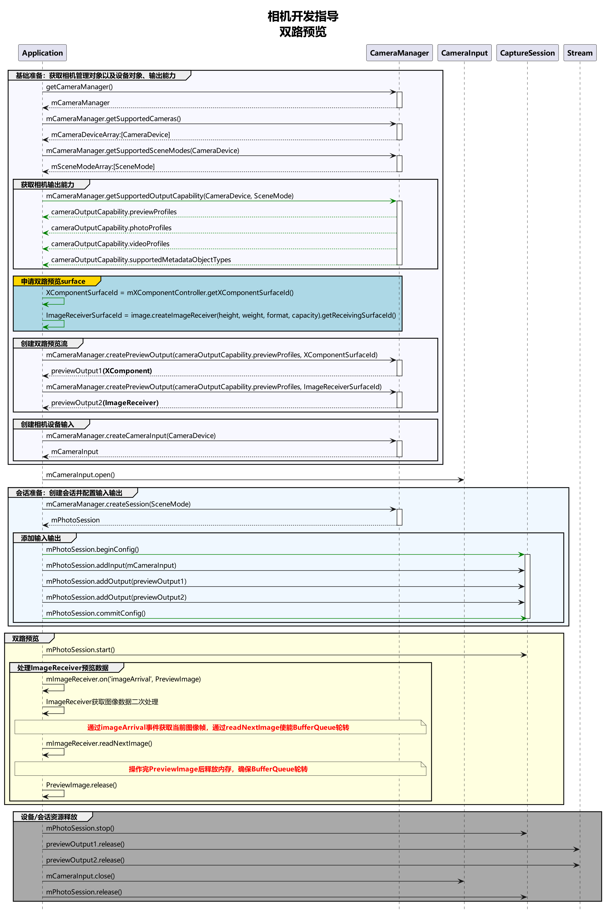

# 双路预览(ArkTS)

双路预览，即应用可同时使用两路预览流，一路用于在屏幕上显示，一路用于图像处理等其他操作，提升处理效率。

相机应用通过控制相机，实现图像显示（预览）、照片保存（拍照）、视频录制（录像）等基础操作。相机开发模型为Surface模型，即应用通过Surface进行数据传递，通过ImageReceiver的surface获取拍照流的数据、通过XComponent的surface获取预览流的数据。

如果要实现双路预览，即将拍照流改为预览流，将拍照流中的surface改为预览流的surface，通过ImageReceiver的surface创建previewOutput，其余流程与拍照流和预览流一致。

详细的API说明请参考[Camera API参考](../../reference/apis-camera-kit/js-apis-camera.md)。

## 约束与限制

- 暂不支持动态添加流，即不能在没有调用[session.stop](../../reference/apis-camera-kit/js-apis-camera.md#stop11)的情况下，调用[addOutput](../../reference/apis-camera-kit/js-apis-camera.md#addoutput11)添加流。
- 对ImageReceiver组件获取到的图像数据处理后，需要将对应的图像Buffer释放，确保Surface的BufferQueue正常轮转。

## 调用流程

双路方案调用流程图建议如下：



## 开发步骤

1. 导入image接口。

   创建双路预览流的SurfaceId，除XComponent组件的SurfaceId外，还需要使用ImageReceiver组件创建生成的SurfaceId，需要使用image模块提供的接口。

   ```ts
   import { image } from '@kit.ImageKit';
   ```
2. 创建ImageReceiver对象。
   ```ts
   let size: image.Size = {
       width: 640,
       height: 480
     }
   let receiver: image.ImageReceiver = image.createImageReceiver(size, image.ImageFormat.JPEG, 8);
   ```
3. 获取ImageReceiver组件的SurfaceId。

   ```ts
   async function getImageReceiverSurfaceId(receiver: image.ImageReceiver): Promise<string | undefined> {
     let ImageReceiverSurfaceId: string | undefined = undefined;
     if (receiver !== undefined) {
       console.info('receiver is not undefined');
       let ImageReceiverSurfaceId: string = await receiver.getReceivingSurfaceId();
       console.info(`ImageReceived id: ${ImageReceiverSurfaceId}`);
     } else {
       console.error('createImageReceiver failed');
     }
     return ImageReceiverSurfaceId;
   }
   ```

4. 创建XComponent组件Surface。

   XComponent组件为预览流提供的Surface（获取surfaceId请参考[getXcomponentSurfaceId](../../reference/apis-arkui/arkui-ts/ts-basic-components-xcomponent.md#getxcomponentsurfaceid9)方法），而XComponent的能力由UI提供，相关介绍可参考[XComponent组件参考](../../reference/apis-arkui/arkui-ts/ts-basic-components-xcomponent.md)。
   > **说明：**
   > 预览流与录像输出流的分辨率的宽高比要保持一致，如果设置XComponent组件中的Surface显示区域宽高比为1920:1080 = 16:9，则需要预览流中的分辨率的宽高比也为16:9，如分辨率选择640:360，或960:540，或1920:1080，以此类推。

5. 实现双路预览。

   将步骤2、3生成的两路SurfaceId通过[createPreviewOutput](../../reference/apis-camera-kit/js-apis-camera.md#createpreviewoutput)方法传递到相机服务，创建两路预览流，其余流程按照正常预览流程开发。

   ```ts
   import { camera } from '@kit.CameraKit';

   async function createDualChannelPreview(cameraManager: camera.CameraManager, XComponentSurfaceId: string, receiver: image.ImageReceiver): Promise<void> {
     // 获取支持的相机设备对象
     let camerasDevices: Array<camera.CameraDevice> = cameraManager.getSupportedCameras();

     // 获取支持的模式类型
     let sceneModes: Array<camera.SceneMode> = cameraManager.getSupportedSceneModes(camerasDevices[0]);
     let isSupportPhotoMode: boolean = sceneModes.indexOf(camera.SceneMode.NORMAL_PHOTO) >= 0;
     if (!isSupportPhotoMode) {
       console.error('photo mode not support');
       return;
     }

     // 获取profile对象
     let profiles: camera.CameraOutputCapability = cameraManager.getSupportedOutputCapability(camerasDevices[0], camera.SceneMode.NORMAL_PHOTO); // 获取对应相机设备profiles
     let previewProfiles: Array<camera.Profile> = profiles.previewProfiles;

     // 预览流1
     let previewProfilesObj: camera.Profile = previewProfiles[0];

     // 预览流2
     let previewProfilesObj2: camera.Profile = previewProfiles[0];

     // 创建 预览流1 输出对象
     let previewOutput: camera.PreviewOutput = cameraManager.createPreviewOutput(previewProfilesObj, XComponentSurfaceId);

     // 创建 预览流2 输出对象
     let imageReceiverSurfaceId: string = await receiver.getReceivingSurfaceId();
     let previewOutput2: camera.PreviewOutput = cameraManager.createPreviewOutput(previewProfilesObj2, imageReceiverSurfaceId);

     // 创建cameraInput对象
     let cameraInput: camera.CameraInput = cameraManager.createCameraInput(camerasDevices[0]);

     // 打开相机
     await cameraInput.open();

     // 会话流程
     let photoSession: camera.PhotoSession = cameraManager.createSession(camera.SceneMode.NORMAL_PHOTO) as camera.PhotoSession;

     // 开始配置会话
     photoSession.beginConfig();

     // 把CameraInput加入到会话
     photoSession.addInput(cameraInput);

     // 把 预览流1 加入到会话
     photoSession.addOutput(previewOutput);

     // 把 预览流2 加入到会话
     photoSession.addOutput(previewOutput2);

     // 提交配置信息
     await photoSession.commitConfig();

     // 会话开始
     await photoSession.start();

     // 停止当前会话
     await photoSession.stop();

     // 释放相机输入流
     await cameraInput.close();

     // 释放预览输出流
     await previewOutput.release();

     // 释放拍照输出流
     await previewOutput2.release();

     // 释放会话
     await photoSession.release();

     // 会话置空
     photoSession = undefined;
   }
   ```

6. 通过ImageReceiver实时获取预览图像。

   通过ImageReceiver组件中imageArrival事件监听获取底层返回的图像数据，详细的API说明请参考[Image API参考](../../reference/apis-image-kit/js-apis-image.md)。

   ```ts
   import { BusinessError } from '@kit.BasicServicesKit';

   function onImageArrival(receiver: image.ImageReceiver): void {
     receiver.on('imageArrival', () => {
       receiver.readNextImage((err: BusinessError, nextImage: image.Image) => {
         if (err || nextImage === undefined) {
           console.error('readNextImage failed');
           return;
         }
         nextImage.getComponent(image.ComponentType.JPEG, (err: BusinessError, imgComponent: image.Component) => {
           if (err || imgComponent === undefined) {
             console.error('getComponent failed');
           }
           if (imgComponent && imgComponent.byteBuffer as ArrayBuffer) {
             // do something...
             // 如果对buffer进行异步操作，需要在异步操作结束后再释放该资源（nextImage.release()）
           } else {
             console.error('byteBuffer is null');
           }
           // 确保当前buffer没有在使用的情况下，可进行资源释放
           nextImage.release();
         })
       })
     })
   }
   ```
