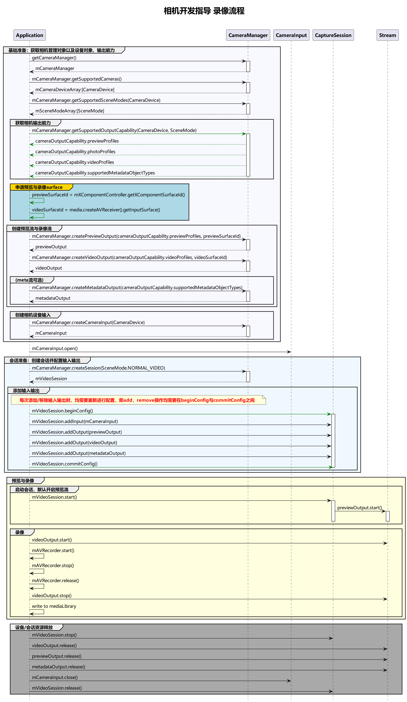

# 录像实现方案(ArkTS)

当前示例提供完整的录像流程介绍，方便开发者了解完整的接口调用顺序。

在参考以下示例前，建议开发者查看[相机开发指导(ArkTS)](camera-preparation.md)的具体章节，了解[设备输入](camera-device-input.md)、[会话管理](camera-session-management.md)、[录像](camera-recording.md)等单个流程。

## 开发流程

在获取到相机支持的输出流能力后，开始创建录像流，开发流程如下。




## 完整示例
Context获取方式请参考：[获取UIAbility的上下文信息](../../application-models/uiability-usage.md#获取uiability的上下文信息)。

```ts
import camera from '@ohos.multimedia.camera';
import { BusinessError } from '@ohos.base';
import media from '@ohos.multimedia.media';
import common from '@ohos.app.ability.common';
import PhotoAccessHelper from '@ohos.file.photoAccessHelper';
import fs from '@ohos.file.fs';

async function videoRecording(context: common.Context, surfaceId: string): Promise<void> {
  // 创建CameraManager对象
  let cameraManager: camera.CameraManager = camera.getCameraManager(context);
  if (!cameraManager) {
    console.error("camera.getCameraManager error");
    return;
  }

  // 监听相机状态变化
  cameraManager.on('cameraStatus', (err: BusinessError, cameraStatusInfo: camera.CameraStatusInfo) => {
    console.info(`camera : ${cameraStatusInfo.camera.cameraId}`);
    console.info(`status: ${cameraStatusInfo.status}`);
  });

  // 获取相机列表
  let cameraArray: Array<camera.CameraDevice> = [];
  try {
    cameraArray = cameraManager.getSupportedCameras();
  } catch (error) {
    let err = error as BusinessError;
    console.error(`getSupportedCameras call failed. error code: ${err.code}`);
  }

  if (cameraArray.length <= 0) {
    console.error("cameraManager.getSupportedCameras error");
    return;
  }

  // 获取支持的模式类型
  let sceneModes: Array<camera.SceneMode> = cameraManager.getSupportedSceneModes(cameraArray[0]);
  let isSupportVideoMode: boolean = sceneModes.indexOf(camera.SceneMode.NORMAL_VIDEO) >= 0;
  if (!isSupportVideoMode) {
    console.error('video mode not support');
    return;
  }

  // 获取相机设备支持的输出流能力
  let cameraOutputCap: camera.CameraOutputCapability = cameraManager.getSupportedOutputCapability(cameraArray[0], camera.SceneMode.NORMAL_VIDEO);
  if (!cameraOutputCap) {
    console.error("cameraManager.getSupportedOutputCapability error")
    return;
  }
  console.info("outputCapability: " + JSON.stringify(cameraOutputCap));

  let previewProfilesArray: Array<camera.Profile> = cameraOutputCap.previewProfiles;
  if (!previewProfilesArray) {
    console.error("createOutput previewProfilesArray == null || undefined");
  }

  let photoProfilesArray: Array<camera.Profile> = cameraOutputCap.photoProfiles;
  if (!photoProfilesArray) {
    console.error("createOutput photoProfilesArray == null || undefined");
  }

  let videoProfilesArray: Array<camera.VideoProfile> = cameraOutputCap.videoProfiles;
  if (!videoProfilesArray) {
    console.error("createOutput videoProfilesArray == null || undefined");
  }
  // videoProfile的宽高需要与AVRecorderProfile的宽高保持一致，并且需要使用AVRecorderProfile锁支持的宽高
  let videoSize: camera.Size = {
    width: 640,
    height: 480
  }
  let videoProfile: undefined | camera.VideoProfile = videoProfilesArray.find((profile: camera.VideoProfile) => {
    return profile.size.width === videoSize.width && profile.size.height === videoSize.height;
  });
  if (!videoProfile) {
    console.error('videoProfile is not found');
    return;
  }
  // 配置参数以实际硬件设备支持的范围为准
  let aVRecorderProfile: media.AVRecorderProfile = {
    audioBitrate: 48000,
    audioChannels: 2,
    audioCodec: media.CodecMimeType.AUDIO_AAC,
    audioSampleRate: 48000,
    fileFormat: media.ContainerFormatType.CFT_MPEG_4,
    videoBitrate: 2000000,
    videoCodec: media.CodecMimeType.VIDEO_AVC,
    videoFrameWidth: videoSize.width,
    videoFrameHeight: videoSize.height,
    videoFrameRate: 30
  };
  let options: PhotoAccessHelper.CreateOptions = {
    title: Date.now().toString()
  };
  let photoAccessHelper: PhotoAccessHelper.PhotoAccessHelper = PhotoAccessHelper.getPhotoAccessHelper(context);
  let videoUri: string = await photoAccessHelper.createAsset(PhotoAccessHelper.PhotoType.VIDEO, 'mp4', options);
  let file: fs.File = fs.openSync(videoUri, fs.OpenMode.READ_WRITE | fs.OpenMode.CREATE);
  let aVRecorderConfig: media.AVRecorderConfig = {
    audioSourceType: media.AudioSourceType.AUDIO_SOURCE_TYPE_MIC,
    videoSourceType: media.VideoSourceType.VIDEO_SOURCE_TYPE_SURFACE_YUV,
    profile: aVRecorderProfile,
    url: `fd://${file.fd.toString()}`, // 文件需先由调用者创建，赋予读写权限，将文件fd传给此参数，eg.fd://45--file:///data/media/01.mp4
    rotation: 0, // 合理值0、90、180、270，非合理值prepare接口将报错
    location: { latitude: 30, longitude: 130 }
  };

  let avRecorder: media.AVRecorder | undefined = undefined;
  try {
    avRecorder = await media.createAVRecorder();
  } catch (error) {
    let err = error as BusinessError;
    console.error(`createAVRecorder call failed. error code: ${err.code}`);
  }

  if (avRecorder === undefined) {
    return;
  }

  try {
    await avRecorder.prepare(aVRecorderConfig);
  } catch (error) {
    let err = error as BusinessError;
    console.error(`prepare call failed. error code: ${err.code}`);
  }

  let videoSurfaceId: string | undefined = undefined; // 该surfaceID用于传递给相机接口创造videoOutput
  try {
    videoSurfaceId = await avRecorder.getInputSurface();
  } catch (error) {
    let err = error as BusinessError;
    console.error(`getInputSurface call failed. error code: ${err.code}`);
  }
  if (videoSurfaceId === undefined) {
    return;
  }
  // 创建VideoOutput对象
  let videoOutput: camera.VideoOutput | undefined = undefined;
  try {
    videoOutput = cameraManager.createVideoOutput(videoProfile, videoSurfaceId);
  } catch (error) {
    let err = error as BusinessError;
    console.error(`Failed to create the videoOutput instance. error: ${JSON.stringify(err)}`);
  }
  if (videoOutput === undefined) {
    return;
  }
  // 监听视频输出错误信息
  videoOutput.on('error', (error: BusinessError) => {
    console.error(`Preview output error code: ${error.code}`);
  });

  //创建会话
  let videoSession: camera.CaptureSession | undefined = undefined;
  try {
    videoSession = cameraManager.createSession(camera.SceneMode.NORMAL_VIDEO) as camera.VideoSession;
  } catch (error) {
    let err = error as BusinessError;
    console.error(`Failed to create the session instance. error: ${JSON.stringify(err)}`);
  }
  if (videoSession === undefined) {
    return;
  }
  // 监听session错误信息
  videoSession.on('error', (error: BusinessError) => {
    console.error(`Video session error code: ${error.code}`);
  });

  // 开始配置会话
  try {
    videoSession.beginConfig();
  } catch (error) {
    let err = error as BusinessError;
    console.error(`Failed to beginConfig. error: ${JSON.stringify(err)}`);
  }

  // 创建相机输入流
  let cameraInput: camera.CameraInput | undefined = undefined;
  try {
    cameraInput = cameraManager.createCameraInput(cameraArray[0]);
  } catch (error) {
    let err = error as BusinessError;
    console.error(`Failed to createCameraInput. error: ${JSON.stringify(err)}`);
  }
  if (cameraInput === undefined) {
    return;
  }
  // 监听cameraInput错误信息
  let cameraDevice: camera.CameraDevice = cameraArray[0];
  cameraInput.on('error', cameraDevice, (error: BusinessError) => {
    console.error(`Camera input error code: ${error.code}`);
  });

  // 打开相机
  try {
    await cameraInput.open();
  } catch (error) {
    let err = error as BusinessError;
    console.error(`Failed to open cameraInput. error: ${JSON.stringify(err)}`);
  }

  // 向会话中添加相机输入流
  try {
    videoSession.addInput(cameraInput);
  } catch (error) {
    let err = error as BusinessError;
    console.error(`Failed to add cameraInput. error: ${JSON.stringify(err)}`);
  }

  // 创建预览输出流，其中参数 surfaceId 参考下面 XComponent 组件，预览流为XComponent组件提供的surface
  let previewOutput: camera.PreviewOutput | undefined = undefined;
  try {
    previewOutput = cameraManager.createPreviewOutput(previewProfilesArray[0], surfaceId);
  } catch (error) {
    let err = error as BusinessError;
    console.error(`Failed to create the PreviewOutput instance. error: ${JSON.stringify(err)}`);
  }

  if (previewOutput === undefined) {
    return;
  }
  // 向会话中添加预览输出流
  try {
    videoSession.addOutput(previewOutput);
  } catch (error) {
    let err = error as BusinessError;
    console.error(`Failed to add previewOutput. error: ${JSON.stringify(err)}`);
  }

  // 向会话中添加录像输出流
  try {
    videoSession.addOutput(videoOutput);
  } catch (error) {
    let err = error as BusinessError;
    console.error(`Failed to add videoOutput. error: ${JSON.stringify(err)}`);
  }

  // 提交会话配置
  try {
    await videoSession.commitConfig();
  } catch (error) {
    let err = error as BusinessError;
    console.error(`videoSession commitConfig error: ${JSON.stringify(err)}`);
  }

  // 启动会话
  try {
    await videoSession.start();
  } catch (error) {
    let err = error as BusinessError;
    console.error(`videoSession start error: ${JSON.stringify(err)}`);
  }

  // 启动录像输出流
  videoOutput.start((err: BusinessError) => {
    if (err) {
      console.error(`Failed to start the video output. error: ${JSON.stringify(err)}`);
      return;
    }
    console.info('Callback invoked to indicate the video output start success.');
  });

  // 开始录像
  try {
    await avRecorder.start();
  } catch (error) {
    let err = error as BusinessError;
    console.error(`avRecorder start error: ${JSON.stringify(err)}`);
  }

  // 停止录像输出流
  videoOutput.stop((err: BusinessError) => {
    if (err) {
      console.error(`Failed to stop the video output. error: ${JSON.stringify(err)}`);
      return;
    }
    console.info('Callback invoked to indicate the video output stop success.');
  });

  // 停止录像
  try {
    await avRecorder.stop();
  } catch (error) {
    let err = error as BusinessError;
    console.error(`avRecorder stop error: ${JSON.stringify(err)}`);
  }

  // 停止当前会话
  videoSession.stop();

  // 关闭文件
  fs.closeSync(file);

  // 释放相机输入流
  cameraInput.close();

  // 释放预览输出流
  previewOutput.release();

  // 释放录像输出流
  videoOutput.release();

  // 释放会话
  videoSession.release();

  // 会话置空
  videoSession = undefined;
}
```
