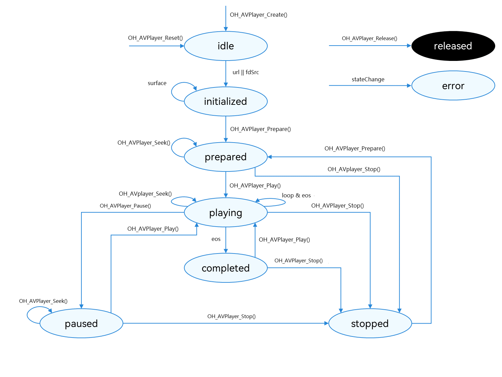

# 使用AVPlayer播放视频(C/C++)
<!--Kit: Media Kit-->
<!--Subsystem: Multimedia-->
<!--Owner: @xushubo; @chennotfound-->
<!--Designer: @dongyu_dy-->
<!--Tester: @xchaosioda-->
<!--Adviser: @zengyawen-->

使用[AVPlayer](../../reference/apis-media-kit/capi-avplayer.md)可以实现端到端播放原始媒体资源，本开发指导将以完整地播放一个视频作为示例，向开发者讲解AVPlayer视频播放相关功能。

播放的全流程包含：创建AVPlayer，设置回调监听函数，设置播放资源，设置播放参数（音量/倍速/焦点模式），设置播放窗口，播放控制（播放/暂停/跳转/停止），重置，销毁播放器实例。

在进行应用开发的过程中，开发者可以通过AVPlayer的信息监听回调函数[OH_AVPlayerOnInfoCallback](../../reference/apis-media-kit/capi-avplayer-base-h.md#oh_avplayeroninfocallback)和错误监听回调函数[OH_AVPlayerOnErrorCallback](../../reference/apis-media-kit/capi-avplayer-base-h.md#oh_avplayeronerrorcallback)主动获取播放过程信息。如果应用在视频播放器处于错误状态时执行操作，系统可能会抛出异常或生成其他未定义的行为。

**图1** 播放状态变化示意图  


状态的详细说明请参考[AVPlayerState](../../reference/apis-media-kit/capi-avplayer-base-h.md#avplayerstate)。当播放处于prepared / playing / paused / completed状态时，播放引擎处于工作状态，这需要占用系统较多的运行内存。当客户端暂时不使用播放器时，调用reset()或release()回收内存资源，做好资源利用。

## 开发建议

当前指导仅介绍如何实现媒体资源播放，在应用开发过程中可能会涉及后台播放、播放冲突等情况，请根据实际需要参考以下说明。

- 如果要实现后台播放或熄屏播放，需要接入[AVSession（媒体会话）](../avsession/avsession-access-scene.md)和[申请长时任务](../../task-management/continuous-task.md)，避免播放被系统强制中断。此功能仅提供ArkTS API。
- 应用在播放过程中，若播放的媒体数据涉及音频，根据系统音频管理策略（参考[处理音频焦点事件](../audio/audio-playback-concurrency.md)），可能会被其他应用打断，建议通过[OH_AVPlayer_SetOnInfoCallback()](../../reference/apis-media-kit/capi-avplayer-h.md#oh_avplayer_setoninfocallback)主动监听音频打断事件[AV_INFO_TYPE_INTERRUPT_EVENT](../../reference/apis-media-kit/capi-avplayer-base-h.md#avplayeroninfotype)，根据其内容提示，做出相应的处理，避免出现应用状态与预期效果不一致的问题。
- 面对设备同时连接多个音频输出设备的情况，建议通过[OH_AVPlayer_SetOnInfoCallback()](../../reference/apis-media-kit/capi-avplayer-h.md#oh_avplayer_setoninfocallback)主动监听音频输出设备改变事件[AV_INFO_TYPE_AUDIO_OUTPUT_DEVICE_CHANGE](../../reference/apis-media-kit/capi-avplayer-base-h.md#avplayeroninfotype)，从而做出相应处理。
- 应用在播放过程中，系统内部可能异常，如网络数据下载失败、媒体服务死亡不可用等，建议通过[OH_AVPlayer_SetOnErrorCallback()](../../reference/apis-media-kit/capi-avplayer-h.md#oh_avplayer_setonerrorcallback)接口设置错误监听回调函数，根据不同错误类型，做出相应处理，避免出现播放异常。
- 使用[OH_AVPlayer_SetOnInfoCallback()](../../reference/apis-media-kit/capi-avplayer-h.md#oh_avplayer_setoninfocallback)、[OH_AVPlayer_SetOnErrorCallback()](../../reference/apis-media-kit/capi-avplayer-h.md#oh_avplayer_setonerrorcallback)接口分别设置信息监听回调函数[OH_AVPlayerOnInfoCallback](../../reference/apis-media-kit/capi-avplayer-base-h.md#oh_avplayeroninfocallback)和错误监听回调函数[OH_AVPlayerOnErrorCallback](../../reference/apis-media-kit/capi-avplayer-base-h.md#oh_avplayeronerrorcallback)。当应用成功设置信息监听回调函数[OH_AVPlayerOnInfoCallback](../../reference/apis-media-kit/capi-avplayer-base-h.md#oh_avplayeroninfocallback)后，不再执行通过[OH_AVPlayer_SetPlayerCallback()](../../reference/apis-media-kit/capi-avplayer-h.md#oh_avplayer_setplayercallback)设置的信息监听回调函数[OH_AVPlayerOnInfo](../../reference/apis-media-kit/capi-avplayer-base-h.md#oh_avplayeroninfo)；当应用成功设置错误监听回调函数[OH_AVPlayerOnErrorCallback](../../reference/apis-media-kit/capi-avplayer-base-h.md#oh_avplayeronerrorcallback)后，不再执行通过[OH_AVPlayer_SetPlayerCallback()](../../reference/apis-media-kit/capi-avplayer-h.md#oh_avplayer_setplayercallback)设置的错误监听回调函数[OH_AVPlayerOnError](../../reference/apis-media-kit/capi-avplayer-base-h.md#oh_avplayeronerror)。

## 开发步骤及注意事项
在 CMake 脚本中链接动态库：
```
target_link_libraries(sample PUBLIC libavplayer.so)
```

使用[OH_AVPlayer_SetOnInfoCallback()](../../reference/apis-media-kit/capi-avplayer-h.md#oh_avplayer_setoninfocallback)、[OH_AVPlayer_SetOnErrorCallback()](../../reference/apis-media-kit/capi-avplayer-h.md#oh_avplayer_setonerrorcallback)接口设置信息监听回调函数和错误监听回调函数，需要在 CMake 脚本中链接如下动态库：
```
target_link_libraries(sample PUBLIC libnative_media_core.so)
```

开发者使用系统日志能力时，需引入如下头文件：
```
#include <hilog/log.h>
```

并需要在 CMake 脚本中链接如下动态库:
```
target_link_libraries(sample PUBLIC libhilog_ndk.z.so)
```

开发者通过引入[avplayer.h](../../reference/apis-media-kit/capi-avplayer-h.md)、[avplayer_base.h](../../reference/apis-media-kit/capi-avplayer-base-h.md)和[native_averrors.h](../../reference/apis-avcodec-kit/native__averrors_8h.md)头文件，使用视频播放相关API。
详细的API说明请参考[AVPlayer API](../../reference/apis-media-kit/capi-avplayer.md)。

1. 创建AVPlayer实例：调用[OH_AVPlayer_Create()](../../reference/apis-media-kit/capi-avplayer-h.md#oh_avplayer_create)，AVPlayer初始化为[AV_IDLE](../../reference/apis-media-kit/capi-avplayer-base-h.md#avplayerstate)状态。

2. 设置回调监听函数：使用[OH_AVPlayer_SetOnInfoCallback()](../../reference/apis-media-kit/capi-avplayer-h.md#oh_avplayer_setoninfocallback)、[OH_AVPlayer_SetOnErrorCallback()](../../reference/apis-media-kit/capi-avplayer-h.md#oh_avplayer_setonerrorcallback)接口设置信息监听回调函数和错误监听回调函数，搭配全流程场景使用。支持的监听事件包括：
   | 事件类型 | 说明 |
   | -------- | -------- |
   | OH_AVPlayerOnInfoCallback | 必要事件，监听播放器的过程信息。<br>需要播放器在AV_IDLE状态下、未调用设置资源接口前完成设置监听，若在调用设置资源接口后再设置监听，可能导致无法正常收到AV_INITIALIZED或AV_ERROR状态。 |
   | OH_AVPlayerOnErrorCallback | 必要事件，监听播放器的错误信息。<br>需要播放器在AV_IDLE状态下、未调用设置资源接口前完成设置监听，若在调用设置资源接口后再设置监听，可能导致无法正常收到错误信息。 |

    应用使用[OH_AVPlayer_SetOnInfoCallback()](../../reference/apis-media-kit/capi-avplayer-h.md#oh_avplayer_setoninfocallback)、[OH_AVPlayer_SetOnErrorCallback()](../../reference/apis-media-kit/capi-avplayer-h.md#oh_avplayer_setonerrorcallback)接口设置信息监听回调函数和错误监听回调函数，可以获取更多信息，还可以通过设置 userData 区分不同播放实例。

3. 设置资源：调用[OH_AVPlayer_SetURLSource()](../../reference/apis-media-kit/capi-avplayer-h.md#oh_avplayer_seturlsource)，设置属性url，AVPlayer进入[AV_INITIALIZED](../../reference/apis-media-kit/capi-avplayer-base-h.md#avplayerstate)状态。

4. （可选）设置音频流类型：调用[OH_AVPlayer_SetAudioRendererInfo()](../../reference/apis-media-kit/capi-avplayer-h.md#oh_avplayer_setaudiorendererinfo)，设置AVPlayer音频流类型。

5. （可选）设置音频打断模式：调用[OH_AVPlayer_SetAudioInterruptMode()](../../reference/apis-media-kit/capi-avplayer-h.md#oh_avplayer_setaudiointerruptmode)，设置AVPlayer音频流打断模式。

6. 设置播放画面窗口：调用[OH_AVPlayer_SetVideoSurface()](../../reference/apis-media-kit/capi-avplayer-h.md#oh_avplayer_setvideosurface)设置播放画面窗口。此函数必须在SetSource之后，Prepare之前调用。

7. 准备播放：调用[OH_AVPlayer_Prepare()](../../reference/apis-media-kit/capi-avplayer-h.md#oh_avplayer_prepare)，AVPlayer进入[AV_PREPARED](../../reference/apis-media-kit/capi-avplayer-base-h.md#avplayerstate)状态，此时可以获取时长，设置音量。

8. （可选）设置音频音效模式：调用[OH_AVPlayer_SetAudioEffectMode()](../../reference/apis-media-kit/capi-avplayer-h.md#oh_avplayer_setaudioeffectmode)，设置AVPlayer音频音效模式。

9. 视频播控：播放[OH_AVPlayer_Play()](../../reference/apis-media-kit/capi-avplayer-h.md#oh_avplayer_play)，暂停[OH_AVPlayer_Pause()](../../reference/apis-media-kit/capi-avplayer-h.md#oh_avplayer_pause)，跳转[OH_AVPlayer_Seek()](../../reference/apis-media-kit/capi-avplayer-h.md#oh_avplayer_seek)，停止[OH_AVPlayer_Stop()](../../reference/apis-media-kit/capi-avplayer-h.md#oh_avplayer_stop)等操作。

10. （可选）更换资源：调用[OH_AVPlayer_Reset()](../../reference/apis-media-kit/capi-avplayer-h.md#oh_avplayer_reset)重置资源，AVPlayer重新进入[AV_IDLE](../../reference/apis-media-kit/capi-avplayer-base-h.md#avplayerstate)状态，允许更换资源url。

11. 退出播放：调用[OH_AVPlayer_Release()](../../reference/apis-media-kit/capi-avplayer-h.md#oh_avplayer_release)销毁实例，AVPlayer进入[AV_RELEASED](../../reference/apis-media-kit/capi-avplayer-base-h.md#avplayerstate)状态，退出播放。之后再操作AVPlayer实例则行为未知，可能导致应用进程崩溃，应用闪退。

## 运行完整示例

1. 新建工程，下载[示例工程](https://gitcode.com/openharmony/applications_app_samples/tree/master/code/DocsSample/Media/AVPlayer/AVPlayerNDKVideo)，并将示例工程的以下资源复制到对应目录。
    ```
    AVPlayerNDKVideo
    entry/src/main/ets/
    └── pages
        └── Index.ets (播放界面)
    entry/src/main/
    ├── cpp
    │   ├── types
    │   │   └── libentry
    │   │       └── Index.d.ts (NDK函数对应的js映射)
    │   ├── CMakeLists.txt (CMake脚本)
    │   └── napi_init.cpp  (NDK函数)
    └── resources
        ├── base
        │   ├── element
        │   │   ├── color.json
        │   │   ├── float.json
        │   │   └── string.json
        │   └── media
        │       ├── ic_video_play.svg  (播放键图片资源)
        │       └── ic_video_pause.svg (暂停键图片资源)
        └── rawfile
            └── test1.mp4 （视频资源）
    ```
2. 编译新建工程并运行。
