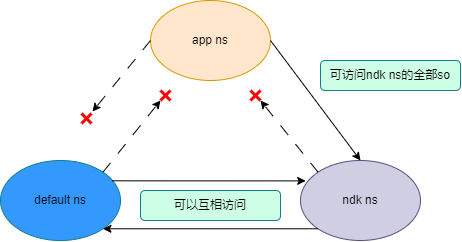

# C/C++标准库机制概述

OpenHarmony NDK提供业界标准库[libc标准库](../reference/native-lib/musl.md)、[标准C++库](../reference/native-lib/cpp.md)，本文用于介绍C/C++标准库在OpenHarmony中的机制，开发者了解这些机制有助于在NDK开发过程中避免相关问题。

## 1. C++兼容性

在OpenHarmony系统中，系统库与应用Native库都在使用C++标准库（参考[libc++版本](../reference/native-lib/cpp.md#libc版本)），系统库依赖的C++标准库随镜像版本升级，而应用Native库依赖的C++标准库随编译使用的SDK版本升级，两部分依赖的C++基础库会跨多个大版本，产生ABI兼容性问题。为了解决此问题，OpenHarmony上把两部分依赖的C++标准库进行了区分。

- 系统库：使用libc++.so， 随系统镜像发布。
- 应用Native库：使用libc++_shared.so，随应用发布。

两个库使用的C++命名空间不一样，libc++.so使用__h作为C++符号的命名空间，libc++_shared.so使用__n1作为C++符号的命名空间。

&gt;**注意**：  
&gt;系统和应用使用的C++标准库不能进行混用，Native API接口当前只能是C接口，可以通过这个接口隔离两边的C++运行环境。因此在使用共享库HAR包构建应用时，如果HAR包含的libc++_shared.so不同于应用使用的libc++_shared.so版本，那么只有其中一个版本会安装到应用里，可能会导致不兼容问题，可以使用相同的SDK版本更新HAR包解决此问题。

**已知C++兼容性问题：**

应用启动或者dlopen时hilog报错`symbol not found, s=__emutls_get_address`，原因是API9及之前版本SDK中的libc++_shared.so无此符号，而API11之后版本SDK的libc++_shared.so是有此符号的。解决此问题需要更新应用或者共享库HAR包的SDK版本。

## 2. musl libc动态链接器

### 动态库加载命名空间隔离
动态库加载命名空间（namespace，下面统称为ns）是动态链接器设计的一个概念（区别于C++语言中的命名空间），其设计的主要目的是为了在进程中做native库资源访问的管控，以达到安全隔离的目的。例如系统native库允许加载系统目录（/system/lib64;/vendor/lib64等）下的native库，但是普通应用native库仅允许加载普通应用native库和ndk库，而不允许直接加载系统native库。

动态链接器无论是在加载编译依赖（DT_NEEDED）中指定的共享库，还是调用`dlopen`加载指定的共享库，都需要关联到具体的ns。

OpenHarmony中动态库加载namespace配置的情况

- default ns：动态链接器启动时默认创建的ns，它可以搜索`/system/lib{abi};/vendor/lib{abi}`等系统目录路径下的so。

- ndk ns：动态链接器启动时默认创建的ns，它可以搜索`/system/lib{abi}/ndk`目录下的so，主要是暴露了NDK接口的so。

- app ns: 应用启动时创建的ns，它的搜索路径一般是应用的安装路径(可能为沙箱路径)，即可加载应用的so。

当前这一套命名空间机制主要限制了应用native库和系统native库之间的调用，如图所示，具体规则为

1. default ns和ndk ns可以互相访问全部so，不能访问app ns的so。
2. app ns能访问ndk ns的全部so，不能访问default ns的so。



### rpath机制
rpath（run-time path）是在运行时指定共享库搜索路径的机制。该机制允许在可执行文件或共享库中嵌入一个用于在运行时指定库的搜索路径的信息。

由于上文介绍的命名空间隔离机制，应用仅允许加载对应安装目录拼接native库路径下（例如arm64平台上为`libs/arm64`）的应用native库，当应用程序涉及加载较多的native库，期望创建多个native库加载路径方便管理，但是会导致无法加载新创建目录下的native库，这种情况可以通过rpath机制编译时指定搜索路径。

例如，应用安装目录`lib/arm64`下的`libhello.so`依赖新创建路径`lib/arm64/module`下的`libworld.so`，那么在应用的`CMakeList.txt`里设置上`rpath`编译选项后编译，使用`readelf`查看`libhello.so`的`rpath`配置如图所示，`$ORIGIN`为`libhello.so`所在路径，运行时即可正常加载module目录下的`libworld.so`。
```
SET(CMAKE_BUILD_WITH_INSTALL_RPATH TRUE)
SET(CMAKE_INSTALL_RPATH "\${ORIGIN}/module")
```


### 支持dlclose
支持使用dlclose真实卸载动态库的能力。

### 支持symbol-version机制
symbol-version是libc在**动态链接-符号重定位**阶段的符号检索机制，支持不同版本的符号重定位，也可以帮助解决重复符号的问题。可参考<a href="https://www.gnu.org/software/gnulib/manual/html_node/LD-Version-Scripts.html">LD Version Scripts (GNU Gnulib)</a>

### 网络接口select支持fd fortify检测
宏定义FD_SET/FD_CLR新增fd有效值检查，当传入的fd不在区间`[0, 1024)`中会触发abort crash。

宏定义FD_ISSET新增fd有效值检查，当传入的fd不在区间`[0, 1024)`中会返回false。

### 全球化支持
自API12起，newlocale及setlocale接口支持将locale设置C、C.UTF-8、en_US、en_US.UTF-8、zh_CN及zh_CN.UTF-8。新增在zh_CN及zh_CN.UTF-8的locale设置下对strtod_l、wcstod_l和localeconv的支持。注意strtod_l及wcstod_l不支持对十六进制及十六进制小数的转换。

### fdsan功能
[fdsan使用指导](./fdsan.md)可以帮助检测文件的重复关闭和关闭后使用问题。