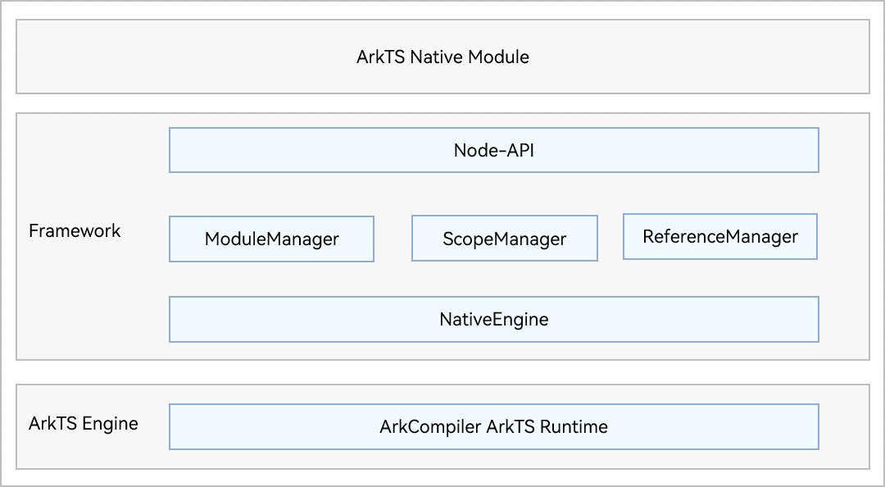
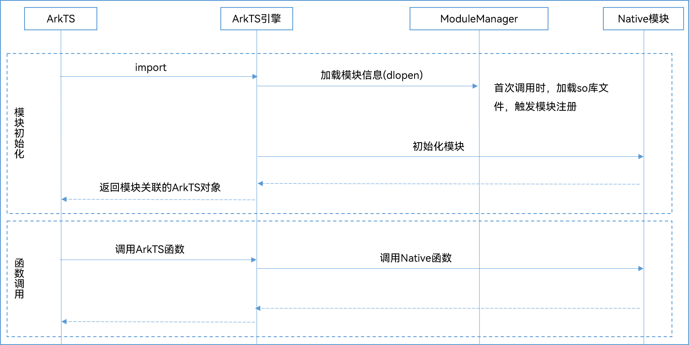

# OpenHarmony Node-API简介

## 场景介绍

OpenHarmony Node-API是基于Node.js的Node-API规范扩展开发的机制，为开发者提供了ArkTS/JS与C/C++模块之间的交互能力。它提供了一组稳定的、跨平台的API，可以在不同的操作系统上使用。

本文中如无特别说明，后续均使用Node-API指代OpenHarmony Node-API能力。

一般情况下OpenHarmony应用开发使用ArkTS/JS语言，但部分场景由于性能、效率等要求，比如游戏、物理模拟等，需要依赖使用现有的C/C++库。Node-API规范封装了I/O、CPU密集型、OS底层等能力并对外暴露ArkTS/JS接口，从而实现ArkTS/JS和C/C++的交互。主要场景如下：

- 系统可以将框架层丰富的模块功能通过ArkTS/JS接口开放给上层应用。

- 应用开发者也可以选择将一些对性能、底层系统调用有要求的核心功能用C/C++封装实现，再通过ArkTS/JS接口使用，提高应用本身的执行效率。

## Node-API的组成架构

**图1** Node-API的组成架构
  

- Native Module：开发者使用Node-API开发的模块，用于在ArkTS侧导入使用。

- Node-API：实现ArkTS与C/C++交互的逻辑。

- ModuleManager：Native模块管理，包括加载、查找等。

- ScopeManager：管理napi_value的生命周期。

- ReferenceManager：管理napi_ref的生命周期。

- NativeEngine：ArkTS引擎抽象层，统一ArkTS引擎在Node-API层的接口行为。

- ArkComiler ArkTS Runtime：ArkTS运行时。

## Node-API的关键交互流程

**图2** Node-API的关键交互流程
  

ArkTS和C++之间的交互流程，主要分为以下两步：

1. **初始化阶段**：当ArkTS侧在import一个Native模块时，ArkTS引擎会调用ModuleManager加载模块对应的so及其依赖。首次加载时会触发模块的注册，将模块定义的方法属性挂载到exports对象上并返回该对象。

2. **调用阶段**：当ArkTS侧通过上述import返回的对象调用方法时，ArkTS引擎会找到并调用对应的C/C++方法。
