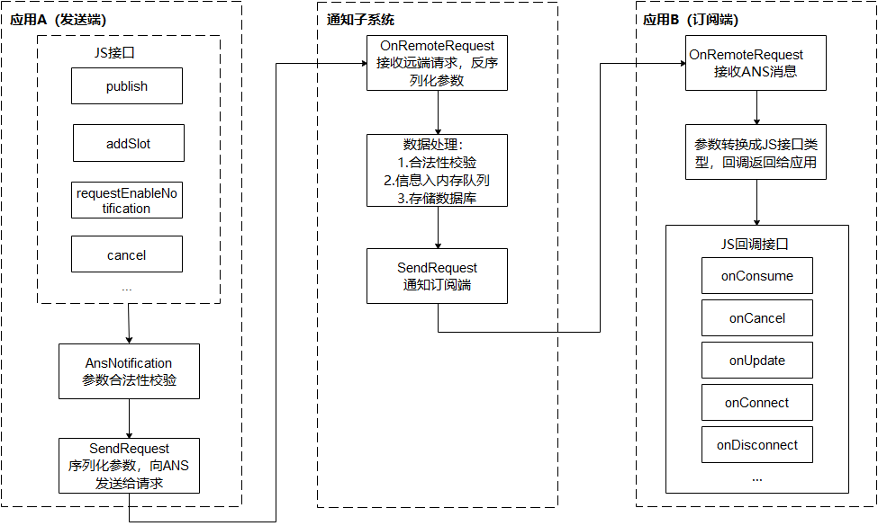

# 通知概述

## 通知简介

所有系统服务以及应用都可以通过通知接口发送通知消息，用户可以通过通知栏查看通知内容，也可以点击通知来打开应用。

通知常见的使用场景：

- 显示接收到的短消息、即时消息等。

- 显示应用的推送消息，如广告、版本更新等。

- 显示当前正在进行的事件，如下载等。

通过ANS（Advanced Notification Service，通知系统服务）对通知类型的消息进行管理，支持多种通知类型，例如[基础类型通知](../notification/text-notification.md)、[进度条类型通知](../notification/progress-bar-notification.md)。

## 通知业务流程

通知业务流程由通知子系统、通知发送端、通知订阅端组成。

一条通知从通知发送端产生，通过[IPC通信](../connectivity/ipc-rpc-overview.md)发送到通知子系统，再由通知子系统分发给通知订阅端。

系统应用还支持通知相关配置，如使能开关、配置参数由系统配置发起请求，发送到通知子系统存储到内存和数据库。

**图1** 通知业务流程  

## 相关实例

基于通知的开发，有以下相关实例可供参考：

- [公共事件的订阅和发布（ArkTS）（API10）](https://gitee.com/openharmony/applications_app_samples/tree/OpenHarmony-4.0-Release/code/BasicFeature/Notification/CustomCommonEvent)

- [自定义通知推送（ArkTS）（Full SDK）（API10）](https://gitee.com/openharmony/applications_app_samples/tree/OpenHarmony-4.0-Release/code/BasicFeature/Notification/CustomNotificationPush)

- [自定义通知角标（ArkTS）（API10）](https://gitee.com/openharmony/applications_app_samples/tree/OpenHarmony-4.0-Release/code/BasicFeature/Notification/CustomNotificationBadge)

- [自定义通知（ArkTS）（API10）](https://gitee.com/openharmony/applications_app_samples/tree/OpenHarmony-4.0-Release/code/BasicFeature/Notification/CustomNotification)

- [自定义Emitter（ArkTS）（API9）](https://gitee.com/openharmony/applications_app_samples/tree/OpenHarmony-4.0-Release/code/BasicFeature/Notification/CustomEmitter)