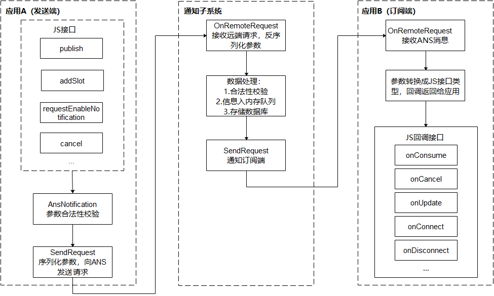

# 订阅通知（仅对系统应用开放）


应用需要接收通知，必须先发起订阅，通知子系统提供两种接口：订阅所有应用发布的通知和订阅某些应用发布的通知。


系统提供[NotificationSubscriber](../reference/apis-notification-kit/js-apis-inner-notification-notificationSubscriber-sys.md)对象，用于提供订阅成功、通知接收、通知取消、订阅取消等回调接口，将变化信息回调给订阅者。

## 通知订阅原理

通知业务流程由通知子系统、通知发送端、通知订阅端组成。一条通知从通知发送端产生，通过[IPC通信](../ipc/ipc-rpc-overview.md)发送到通知子系统，再由通知子系统分发给通知订阅端。

* 通知发送端：可以是三方应用或系统应用。开发者重点关注。

* 通知订阅端：只能为系统应用，比如通知中心。通知中心默认会订阅手机上所有应用对当前用户的通知。开发者无需关注。

**图1** 通知业务流程  




## 接口说明

通知订阅主要接口如下。详细接口介绍请参见[API参考](../reference/apis-notification-kit/js-apis-notificationSubscribe-sys.md)。

**表1** 通知订阅接口介绍

| **接口名** | **描述** |
| -------- | -------- |
| subscribe(subscriber:&nbsp;NotificationSubscriber,&nbsp;info:&nbsp;NotificationSubscribeInfo,&nbsp;callback:&nbsp;AsyncCallback&lt;void&gt;):&nbsp;void | 订阅指定应用通知。 |
| subscribe(subscriber:&nbsp;NotificationSubscriber,&nbsp;callback:&nbsp;AsyncCallback&lt;void&gt;):&nbsp;void | 订阅所有通知。     |

**表2** 通知订阅回调接口介绍

| **接口名** | **描述** |
| -------- | -------- |
| onConsume?:(data:&nbsp;SubscribeCallbackData)&nbsp;=&gt;&nbsp;void  | 通知回调。               |
| onCancel?:(data:&nbsp;SubscribeCallbackData)&nbsp;=&gt;&nbsp;void   | 通知取消回调。           |
| onUpdate?:(data:&nbsp;NotificationSortingMap)&nbsp;=&gt;&nbsp;void  | 通知排序更新回调。       |
| onConnect?:()&nbsp;=&gt;&nbsp;void;                                 | 订阅成功回调。           |
| onDisconnect?:()&nbsp;=&gt;&nbsp;void;                              | 取消订阅回调。           |
| onDestroy?:()&nbsp;=&gt;&nbsp;void                                  | 与通知子系统断开回调。   |
| onDoNotDisturbDateChange<sup>deprecated</sup>?:(mode:&nbsp;notification.DoNotDisturbDate<sup>deprecated</sup>)&nbsp;=&gt;&nbsp;void | 免打扰时间选项变更回调（从API11起已废弃）。 |
| onDoNotDisturbChanged?:(mode:&nbsp;notificationManager.DoNotDisturbDate)&nbsp;=&gt;&nbsp;void           | 免打扰时间选项变更回调。 |
| onEnabledNotificationChanged?:(callbackData:&nbsp;EnabledNotificationCallbackData)&nbsp;=&gt;&nbsp;void | 通知开关变更回调。       |
| onBadgeChanged?:(data:&nbsp;BadgeNumberCallbackData)&nbsp;=&gt;&nbsp;void                               | 应用角标个数变化回调。   |


## 开发步骤

1. 申请`ohos.permission.NOTIFICATION_CONTROLLER`权限，配置方式请参见[申请应用权限](../security/AccessToken/determine-application-mode.md#system_basic等级应用申请权限的方式)。

2. 导入通知订阅模块。
   
   ```ts
   import notificationSubscribe from '@ohos.notificationSubscribe';
   import Base from '@ohos.base';
   ```

3. 创建订阅者对象。
   
   ```ts
   let subscriber:notificationSubscribe.NotificationSubscriber = {
     onConsume: (data:notificationSubscribe.SubscribeCallbackData) => {
       let req = data.request;
       console.info(`onConsume callback. req.id: ${req.id}`);
     },
     onCancel: (data:notificationSubscribe.SubscribeCallbackData) => {
       let req = data.request;
       console.info(`onCancel callback. req.id: ${req.id}`);
     },
     onUpdate: (data) => {
       console.info(`onUpdate callback. req.id: ${data.sortedHashCode}`);
     },
     onConnect: () => {
       console.info(`onConnect callback.}`);
     },
     onDisconnect: () => {
       console.info(`onDisconnect callback.}`);
     },
     onDestroy: () => {
       console.info(`onDestroy callback.}`);
     },
   };
   ```
   
4. 发起通知订阅。
   
   ```ts
   notificationSubscribe.subscribe(subscriber, (err:Base.BusinessError) => { // callback形式调用异步接口
     if (err) {
       console.error(`Failed to subscribe notification. Code is ${err.code}, message is ${err.message}`);
       return;
     }
   });
   ```
