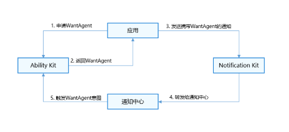

# 为通知添加行为意图

当发布通知时，如果期望用户可以通过点击通知栏拉起目标应用组件或发布公共事件，可以通过Ability Kit申请[WantAgent](../reference/apis-ability-kit/js-apis-app-ability-wantAgent.md)封装至通知消息中。

**图1** 携带行为意图的通知运行机制  
  

## 接口说明

具体接口描述，详见[WantAgent接口文档](../reference/apis-ability-kit/js-apis-app-ability-wantAgent.md)。

| **接口名** | **描述** |
| -------- | -------- |
| getWantAgent(info:&nbsp;WantAgentInfo,&nbsp;callback:&nbsp;AsyncCallback&lt;WantAgent&gt;):&nbsp;void | 创建WantAgent。 |

## 开发步骤

1. 导入模块。

   ```typescript
   import { notificationManager } from '@kit.NotificationKit';
   import { wantAgent, WantAgent } from '@kit.AbilityKit';
   import { BusinessError } from '@kit.BasicServicesKit';
   import { hilog } from '@kit.PerformanceAnalysisKit';
   
   const TAG: string = '[PublishOperation]';
   const DOMAIN_NUMBER: number = 0xFF00;
   ```

2. 创建WantAgentInfo信息。

   场景一：创建拉起UIAbility的WantAgent的[WantAgentInfo](../reference/apis-ability-kit/js-apis-inner-wantAgent-wantAgentInfo.md)信息。

   ```typescript
   let wantAgentObj:WantAgent; // 用于保存创建成功的wantAgent对象，后续使用其完成触发的动作。
   
   // 通过WantAgentInfo的operationType设置动作类型
   let wantAgentInfo:wantAgent.WantAgentInfo = {
     wants: [
       {
         deviceId: '',
         bundleName: 'com.samples.notification',
         abilityName: 'SecondAbility',
         action: '',
         entities: [],
         uri: '',
         parameters: {}
       }
     ],
     operationType: wantAgent.OperationType.START_ABILITY,
     requestCode: 0,
     wantAgentFlags:[wantAgent.WantAgentFlags.CONSTANT_FLAG]
   };
   ```

   场景二：创建发布[公共事件](../basic-services/common-event/common-event-overview.md)的WantAgent的[WantAgentInfo](../reference/apis-ability-kit/js-apis-inner-wantAgent-wantAgentInfo.md)信息。

   ```typescript
   let wantAgentObj:WantAgent; // 用于保存创建成功的WantAgent对象，后续使用其完成触发的动作。
   
   // 通过WantAgentInfo的operationType设置动作类型
   let wantAgentInfo:wantAgent.WantAgentInfo = {
     wants: [
       {
         action: 'event_name', // 设置事件名
         parameters: {},
       }
     ],
     operationType: wantAgent.OperationType.SEND_COMMON_EVENT,
     requestCode: 0,
     wantAgentFlags: [wantAgent.WantAgentFlags.CONSTANT_FLAG],
   };
   ```

3. 调用[getWantAgent()](../reference/apis-ability-kit/js-apis-app-ability-wantAgent.md#wantagentgetwantagent)方法进行创建WantAgent。

   ```typescript
   // 创建WantAgent
   wantAgent.getWantAgent(wantAgentInfo, (err: BusinessError, data:WantAgent) => {
     if (err) {
       console.error(`Failed to get want agent. Code is ${err.code}, message is ${err.message}`);
       return;
     }
     console.info('Succeeded in getting want agent.');
     wantAgentObj = data;
   });
   ```

4. 构造NotificationRequest对象，并发布WantAgent通知。

   ```typescript
   // 构造NotificationRequest对象
   let notificationRequest: notificationManager.NotificationRequest = {
     content: {
       notificationContentType: notificationManager.ContentType.NOTIFICATION_CONTENT_BASIC_TEXT,
       normal: {
         title: 'Test_Title',
         text: 'Test_Text',
         additionalText: 'Test_AdditionalText',
       },
     },
     id: 6,
     label: 'TEST',
     // wantAgentObj使用前需要保证已被赋值（即步骤3执行完成）
     wantAgent: wantAgentObj,
   }
   
   notificationManager.publish(notificationRequest, (err: BusinessError) => {
     if (err) {
       console.error(`Failed to publish notification. Code is ${err.code}, message is ${err.message}`);
       return;
     }
     console.info('Succeeded in publishing notification.');
   });
   ```

5. 用户通过点击通知栏上的通知，系统会自动触发WantAgent的动作。
