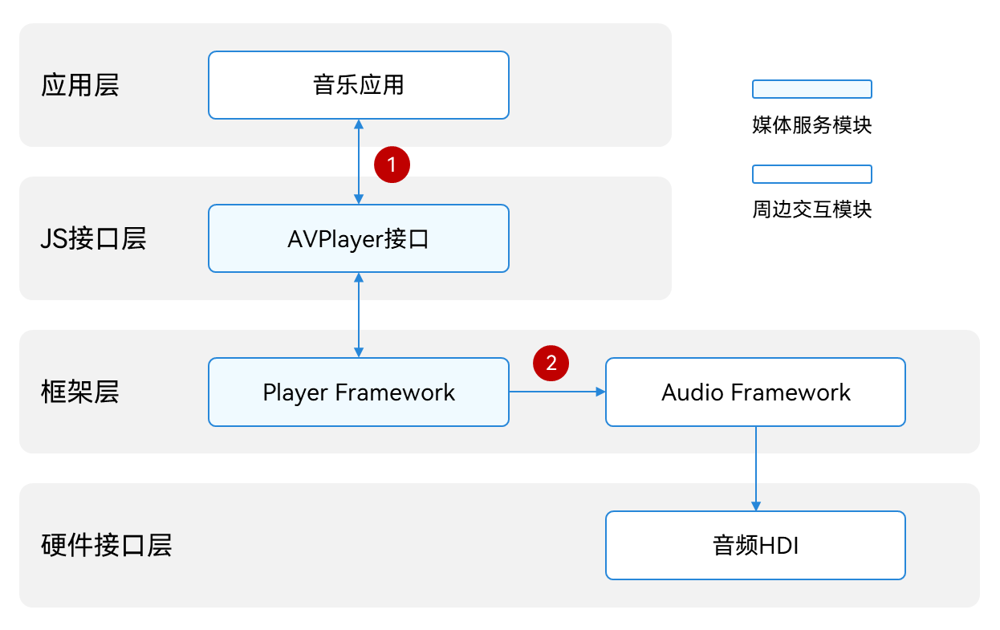

# Media Kit简介(替换标签)

 **1、一个链接替换** 

Media Kit（媒体服务）提供了<!--RP1-->[AVPlayer]和[AVRecorder]<!--RP1End-->用于播放、录制音视频。

 **2、一句话替换** 

第一种：
在Media Kit的开发指导中，将介绍各种涉及音频、视频播放或录制功能场景的开发方式，指导开发者如何使用系统提供的音视频API实现对应功能。<!--RP2-->比如使用SoundPool实现简单的提示音，当设备接收到新消息时，会发出短促的“滴滴”声；使用AVPlayer实现音乐播放器，循环播放一首音乐。<!--RP2End-->

第二种：列表【替换内容没写序号】
1. 通过[DocumentViewPicker接口选择或保存文件，返回选择或保存的文件uri。<!--RP3-->
2. 通过[AudioViewPicker接口选择或保存文件，返回选择或保存的文件uri。<!--RP3End-->
3. 通过[PhotoViewPicker.save接口保存文件，返回保存的文件uri。
4. 通过[fileAccess模块获取文档类目录下的文件得到对应文件的[FileInfo对象，此对象中就包含对应文件或者目录的uri属性，此模块中的接口为系统接口，使用此模块需要注意应用是否为系统应用。支持获取文件uri的目录有：   
   - 外部存储目录
   - Docs目录
   - Download目录
   - Desktop目录
   - Documents目录
   - Share共享盘目录

第二种：列表【替换内容写序号】
1. 通过[DocumentViewPicker接口选择或保存文件，返回选择或保存的文件uri。<!--RP3-->
2. 通过[AudioViewPicker接口选择或保存文件，返回选择或保存的文件uri。<!--RP3End-->
3. 通过[PhotoViewPicker.save接口保存文件，返回保存的文件uri。
4. 通过[fileAccess模块获取文档类目录下的文件得到对应文件的[FileInfo对象，此对象中就包含对应文件或者目录的uri属性，此模块中的接口为系统接口，使用此模块需要注意应用是否为系统应用。支持获取文件uri的目录有：   
   - 外部存储目录
   - Docs目录
   - Download目录
   - Desktop目录
   - Documents目录
   - Share共享盘目录

第三种：列表
- 卡片提供方：提供卡片显示内容的应用，控制卡片的显示内容、控件布局以及控件点击事件。
- 卡片管理服务：用于管理系统中所添加卡片的常驻代理服务，同时提供卡片对象的管理与使用以及卡片周期性刷新等能力。<!--RP4-->
- 卡片渲染服务：用于管理卡片渲染实例，渲染实例与卡片使用方上的卡片组件一一绑定。卡片渲染服务运行卡片页面代码widgets.abc进行渲染，并将渲染后的数据发送至卡片使用方对应的卡片组件。<!--RP4End-->

第四种：列表
- 卡片提供方：提供卡片显示内容的应用，控制卡片的显示内容、控件布局以及控件点击事件。
- 卡片管理服务：用于管理系统中所添加卡片的常驻代理服务，同时提供卡片对象的管理与使用以及卡片周期性刷新等能力。
<!--RP4-->
- 卡片渲染服务：用于管理卡片渲染实例，渲染实例与卡片使用方上的卡片组件一一绑定。卡片渲染服务运行卡片页面代码widgets.abc进行渲染，并将渲染后的数据发送至卡片使用方对应的卡片组件。<!--RP4End-->

**3、表格替换**
第一种：一行一列，第二种：一行二列，第三种：两行变一行

| 任务 | 简介 | 相关指导 |
| -------- | -------- | -------- |
| 应用组件开发 | <!--RP5-->本章节介绍了如何使用Stage模型的UIAbility组件和ExtensionAbility组件开发应用。<!--RP5End--> | -&nbsp;应用/组件级配置 -&nbsp;UIAbility组件 -&nbsp;ExtensionAbility组件 -&nbsp;AbilityStage组件容器 -&nbsp;应用上下文Context -&nbsp;组件启动规则 |
|  <!--RP6-->了解进程模型 | 本章节介绍了Stage模型的进程模型以及几种常用的进程间通信方式。 | 进程模型概述 <!--RP6End-->|
| 了解线程模型 | 本章节介绍了Stage模型的线程模型以及几种常用的线程间通信方式。 | 线程模型概述 |
| <!--RP6-->任务管理 | 本章节介绍了Stage模型中任务管理的基本概念和典型场景。 | -&nbsp;任务管理场景介绍 -&nbsp;任务管理与启动模式 -&nbsp;页面栈和任务链 |
| 应用配置文件 | 本章节介绍Stage模型中应用配置文件的开发要求。 | Stage模型应用配置文件 <!--RP6End-->|

**3、subsection和section替换**

## 亮点/特征

<!--RP7-->
### 音频播放

当使用AVPlayer开发音乐应用播放音频时，其交互关系如图所示。

**图1** 音频播放外部模块交互图  

音乐类应用通过调用JS接口层提供的AVPlayer接口实现相应功能时，框架层会通过播放服务（Player Framework）将资源解析成音频数据流（PCM），音频数据流经过软件解码后输出至音频服务（Audio Framework），由音频服务输出至音频驱动渲染，实现音频播放功能。完整的音频播放需要应用、Player Framework、Audio Framework、音频HDI共同实现。

图1中，数字标注表示需要数据与外部模块的传递。

1. 音乐应用将媒体资源传递给AVPlayer接口。

2. Player Framework将音频PCM数据流输出给Audio Framework，再由Audio Framework输出给音频HDI。
<!--RP7End-->

**4、多内容打同一标签**

<!--RP8-->应用任务管理模型定义任务（Mission）的创建和销毁方式，以及任务与组件间的关系。<!--RP8End-->
所谓任务，即用户使用一个应用组件实例的记录。每次用户启动一个新的应用组件实例，都会生成一个新的任务。
例如，用户启动一个视频应用，此时在“最近任务”界面，将会看到视频应用这个任务，当用户点击这个任务时，系统会把该任务切换到前台，如果这个视频应用中的视频编辑功能也是通过<!--RP8-->应用组件编写的，那么在用户启动视频编辑功能时，会创建视频编辑的应用组件实例，在“最近任务”界面中，将会展示视频应用、视频编辑两个任务。<!--RP8End-->

**5、图片替换**
