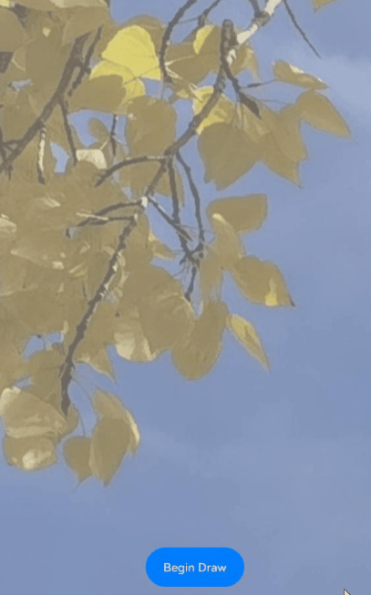
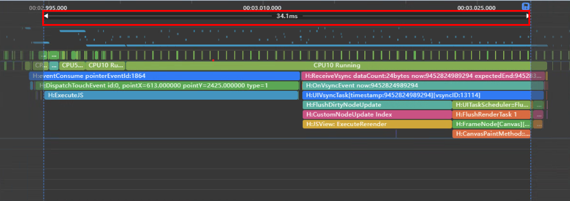
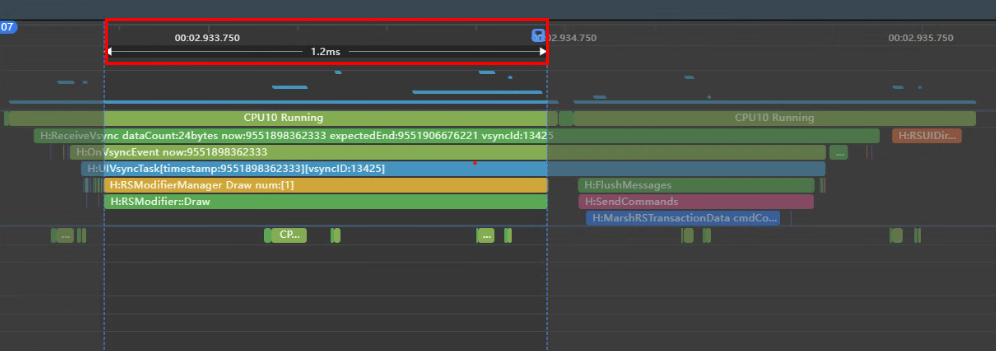

# 复杂绘制场景下使用Native Drawing自绘制能力替代Canvas提升性能

## 简介

[Canvas](../reference/apis-arkui/arkui-ts/ts-components-canvas-canvas.md) 画布组件是用来显示自绘内容的组件，它具有保留历史绘制内容、增量绘制的特点。Canvas 有 [CanvasRenderingContext2D](../reference/apis-arkui/arkui-ts/ts-canvasrenderingcontext2d.md)/[OffscreenCanvasRenderingContext2D](../reference/apis-arkui/arkui-ts/ts-offscreencanvasrenderingcontext2d.md) 和 [DrawingRenderingContext](../reference/apis-arkui/arkui-ts/ts-drawingrenderingcontext.md) 两套API，应用使用两套API绘制的内容都可以在绑定的 Canvas 组件上显示。其中 CanvasRenderingContext2D 按照W3C标准封装了 [Native Drawing](../reference/apis-arkgraphics2d/drawing__canvas_8h.md) 接口，可以方便快速复用web应用的绘制逻辑，因此非常适用于Web应用和游戏、快速原型设计、数据可视化、在线绘图板、教学工具或创意应用等场景。然而，由于它的性能依赖于浏览器的实现，不如原生API那样接近硬件，因此对于性能要求比较高绘制比较复杂或者硬件依赖性比较强的场景如高性能游戏开发、专业图形处理软件、桌面或移动应用等，使用 Canvas CanvasRenderingContext2D 绘制会存在一定的卡顿、掉帧等性能问题，此时可以直接使用 Native Drawing 接口自绘制替代 Canvas 绘制来提升绘制性能。  

| 方案                      | 适用场景 | 特点                                                       |
| ------------------------- | -------- | ------------------------------------------------------------ |
| 适用于Canvas CanvasRenderingContext2D绘制 | Web应用和游戏、快速原型设计、数据可视化、在线绘图板、教学工具或创意应用  | 场景简单、跨平台、快捷灵活、兼容性强、开发维护成本低、性能要求低 |
| 适用于Native Drawing绘制   | 高性能游戏开发、专业图形处理软件、桌面或移动应用   | 场景复杂、资源管理精细、硬件依赖强、与平台深度集成、性能要求高                                   |

## 原理机制
由于 Canvas 的 CanvasRenderingContext2D 绘制本质上是对 Native Drawing 接口的封装，相对于直接使用 Native Drawing 接口，使用 Canvas 的 CanvasRenderingContext2D 绘制多了一层接口的调用，并且它依赖于浏览器的具体实现。如果图片绘制比较复杂，执行的绘制指令可能会成倍数的增长，进而绘制性能下降的更加严重，导致卡顿、掉帧等问题。下面我们以实现在背景图上绘制1000个透明空心圆的玻璃效果来对比两者的性能差异。
 
## 场景示例



上图是一个绘制1000个透明空心圆与背景图融合的绘制场景，下面我们分别使用 Canvas 的 CanvasRenderingContext2D(反例) 和 Native 侧的 Drawing(正例) 来实现该场景，并分析两者的性能差异。  

- **反例(使用Canvas 的 CanvasRenderingContext2D绘制)**    

Canvas 的 CanvasRenderingContext2D 绘制使用 [globalCompositeOperation](../reference/apis-arkui/arkui-js/js-components-canvas-canvasrenderingcontext2d.md#globalcompositeoperation) 属性来实现各种图层混合模式。此处将该属性值设置为 destination-out 来实现透明空心圆的玻璃融合效果。具体实现步骤如下：  

1、使用自定义组件 GlassCoverView 来实现透明圆圈。 在首页点击"Begin Draw"按钮，随机生成1000个0-1的位置列表。

```ts
//  \entry\src\main\ets\pages\Index.ets
import GlassCoverView from '../view/GlassCoverView'

@Entry
@Component
struct Index {
  @State pointsToDraw: number[][] = [];

  build() {
    Stack() {
      Image($r('app.media.drawImage'))
        .width('100%')
        .height('100%')
      // 透明圆圈自定义组件，在此组件中绘制1000个透明空心圆
      GlassCoverView({ pointsToDraw: this.pointsToDraw })
        .width('100%')
        .height('100%')
      Button('Begin Draw')
        .width(100)
        .height(40)
        .margin({ bottom: 40 })
        .onClick(() => {
          this.startDraw();
        })
    }.alignContent(Alignment.Bottom)
    .width('100%')
    .height('100%')
  }
  // 随机生成1000个0-1的位置列表
  private startDraw() {
    this.pointsToDraw = [];
    for (let index = 0; index < 1000; index++) {
      this.pointsToDraw.push([Math.random(), Math.random()]);
    }
  }
}
```

2、GlassCoverView子页面使用@Watch装饰器，监控到母页面位置列表数据pointsToDraw更新后，在屏幕上绘制1000个透明空心圆圈（具体参见 onDraw() 方法）。

```ts
// \entry\src\main\ets\view\GlassCoverView.ets

/**
 * 玻璃蒙层效果
 */

@Preview
@Component
export default struct GlassCoverView {
  /**
   * 位置列表，x、y都在[0,1]之间
   */
  @Prop
  @Watch('onDraw')
  pointsToDraw: number[][] = [];
  private settings = new RenderingContextSettings(true);
  private renderContext = new CanvasRenderingContext2D(this.settings);
  private viewWidth: number = 0;
  private viewHeight: number = 0;

  build() {
    Stack() {
      Canvas(this.renderContext)
        .width('100%')
        .height('100%')
        .onAreaChange((_: Area, newValue: Area) => {
          this.handleAreaChange(newValue)
        })
    }
    .height('100%')
    .width('100%')
  }

  private handleAreaChange(area: Area) {
    this.viewWidth = parseInt(area.width.toString());
    this.viewHeight = parseInt(area.height.toString());
    this.onDraw();
  }

  private onDraw() {
    const canvas = this.renderContext;
    if (canvas === undefined) {
      return;
    }
    hiTraceMeter.startTrace('chisj slow', 1);
    console.warn('chisj debug: slow start');
    // 保存绘图上下文
    canvas.save();
    // 删除指定区域内的绘制内容
    canvas.clearRect(0, 0, this.viewWidth, this.viewHeight);
    // 指定绘制的填充色
    canvas.fillStyle = '#77CCCCCC';
    // 填充一个矩形
    canvas.fillRect(0, 0, this.viewWidth, this.viewHeight);
    // 绘制空心圆圈
    canvas.globalCompositeOperation = 'destination-out';
    canvas.fillStyle = '#CCCCCC';
    this.pointsToDraw.forEach((xy: number[]) => {
      this.drawOneCell(canvas, xy[0] * this.viewWidth, xy[1] * this.viewHeight, 5);
    })
    // 对保存的绘图上下文进行恢复
    canvas.restore();
    console.warn('chisj debug: slow end');
    hiTraceMeter.finishTrace('chisj slow', 1);
  }

  // 根据指定的位置及宽度绘制圆
  private drawOneCell(canvas: CanvasRenderer, x: number, y: number, width: number) {
    canvas.beginPath();
    // 绘制弧线路径
    canvas.arc(x, y, width, 0, Math.PI * 2);
    canvas.closePath();
    canvas.fill();
  }
}
```

使用Canvas 的 CanvasRenderingContext2D 绘制trace图  

从图可以看到绘制1000个圆圈耗时34.1毫秒。


- **正例(使用Native侧Drawing绘制)**  

[Native Drawing](../reference/apis-arkgraphics2d/drawing__canvas_8h.md) 主要使用分层接口 [OH_Drawing_CanvasSaveLayer](../reference/apis-arkgraphics2d/_drawing.md#oh_drawing_canvassavelayer) 和融合接口 [OH_Drawing_BrushSetBlendMode](../reference/apis-arkgraphics2d/_drawing.md#oh_drawing_brushsetblendmode) 来实现多图融合效果。通过在前端创建一个自绘制节点 [RenderNode](../reference/apis-arkui/js-apis-arkui-renderNode.md), 并将图形绘制上下文及背景图参数通过 Native 侧暴露的接口传入，由 Native 侧使用相应的 Drawing 接口进行绘制，具体实现步骤如下：
#### 前端实现
1、前端定义一个 [RenderNode](../reference/apis-arkui/js-apis-arkui-renderNode.md) 自绘制渲染节点，将背景图 this.pMap 和图形绘制上下文 context 传入 Native，调用 Native 侧的 nativeOnDraw 接口进行绘制。
```ts
// entry\src\main\ets\pages\Index.ets
enum DrawType { NONE, PATH, TEXT, IMAGE };

class MyRenderNode extends RenderNode {
  private drawType: DrawType = DrawType.NONE;
  private pMap: image.PixelMap | undefined = undefined;
  draw(context: DrawContext) {
    // 调用Native侧的nativeOnDraw接口进行绘制，将背景图 this.pMap 和图形绘制上下文 context 作为参数传入
    testNapi.nativeOnDraw(666, context, vp2px(this.size.width), vp2px(this.size.height), this.drawType, this.pMap);
  }
  // 设置绘制类型
  resetType(type: DrawType) {
    this.drawType = type;
  }
  // 设置背景图
  setPixelMap(p: PixelMap) {
    this.pMap = p;
  }
}
```

2、新建一个自绘制渲染节点，并定义一个 [NodeController](../reference/apis-arkui/js-apis-arkui-nodeController.md)，对该节点进行管理。
```ts
// entry\src\main\ets\pages\Index.ets
// 创建一个 MyRenderNode 对象
const newNode = new MyRenderNode();
// 定义 newNode 的大小和位置
newNode.frame = {
  x: 0,
  y: 0,
  width: 980,
  height: 1280
};

class MyNodeController extends NodeController {
  private rootNode: FrameNode | null = null;

  makeNode(uiContext: UIContext): FrameNode | null {
    this.rootNode = new FrameNode(uiContext);
    if (this.rootNode === null) {
      return null;
    }
    const renderNode = this.rootNode.getRenderNode();
    if (renderNode !== null) {
      renderNode.appendChild(newNode);
    }
    return this.rootNode;
  }
}
```

3、在页面中将自绘制节点挂载到 [NodeContainer](../reference/apis-arkui/arkui-ts/ts-basic-components-nodecontainer.md) 上。

```ts
@Entry
@Component
struct Index {
  private myNodeController: MyNodeController = new MyNodeController();

  aboutToAppear(): void {
    const context: Context = getContext(this);
    const resourceMgr: resourceManager.ResourceManager = context.resourceManager;
    resourceMgr.getRawFileContent('drawImage.png').then((fileData: Uint8Array) => {
      console.info('success in getRawFileContent');
      const buffer = fileData.buffer.slice(0);
      const imageSource: image.ImageSource = image.createImageSource(buffer);
      imageSource.createPixelMap().then((pMap: image.PixelMap) => {
        // 自绘制渲染节点背景图
        newNode.setPixelMap(pMap);

      }).catch((err: BusinessError) => {
        console.error('fail to create PixelMap');
      }).catch((err: BusinessError) => {
        console.error('fail to getRawFileContent');
      })
    })
  }

  build() {
    Column() {
      Row() {
        // 将自绘制渲染节点挂载到 NodeContainer
        NodeContainer(this.myNodeController)
          .height('100%')
      }
      .width('100%')
      .height('80%')

      Row() {
        Button('Draw Image')
          .margin({ bottom: 50, right: 12 })
          .onClick(() => {
            newNode.resetType(DrawType.IMAGE);
            newNode.invalidate();
          })
      }
      .width('100%')
      .justifyContent(FlexAlign.Center)
      .shadow(ShadowStyle.OUTER_DEFAULT_SM)
      .alignItems(VerticalAlign.Bottom)
      .layoutWeight(1)
    }
  }
}

```

#### Native侧实现
1、Native 侧暴露绘制接口 nativeOnDraw 供前端调用，该接口绑定 Native侧的 OnDraw 函数，ArkTs传入的参数在该函数中处理。
```C++
EXTERN_C_START
static napi_value Init(napi_env env, napi_value exports) {
    napi_property_descriptor desc[] = {
        {"nativeOnDraw", nullptr, OnDraw, nullptr, nullptr, nullptr, napi_default, nullptr}};
    napi_define_properties(env, exports, sizeof(desc) / sizeof(desc[0]), desc);
    return exports;
}
EXTERN_C_END
```

2、在 OnDraw 函数中接收前端传入的参数，此处主要是图形绘制上下文及背景图参数。
```C++
static napi_value OnDraw(napi_env env, napi_callback_info info) {
    size_t argc = 6;
    napi_value args[6] = {nullptr};

    napi_get_cb_info(env, info, &argc, args, nullptr, nullptr);

    int32_t id;
    napi_get_value_int32(env, args[0], &id);
    
    // 图形绘制上下文参数
    void *temp = nullptr;
    napi_unwrap(env, args[1], &temp);
    OH_Drawing_Canvas *canvas = reinterpret_cast<OH_Drawing_Canvas *>(temp);

    int32_t width;
    napi_get_value_int32(env, args[2], &width);

    int32_t height;
    napi_get_value_int32(env, args[3], &height);
    
    DRAWING_LOGI("OnDraw, width:%{public}d, helght:%{public}d", width, height);
    int32_t drawOption;
    napi_get_value_int32(env, args[4], &drawOption);
    // 背景图参数
    NativePixelMap *nativePixelMap = OH_PixelMap_InitNativePixelMap(env, args[5]);
    if (drawOption == IMAGE) {
        // 调用绘制图形融合接口进行绘制
        NativeOnDrawPixelMap(canvas, nativePixelMap, width, height);
    }
    return nullptr;
}
```

3、在 NativeOnDrawPixelMap 函数中实现透明圆圈绘制（主要使用分层接口 [OH_Drawing_CanvasSaveLayer](../reference/apis-arkgraphics2d/_drawing.md#oh_drawing_canvassavelayer) 和融合接口 [OH_Drawing_BrushSetBlendMode](../reference/apis-arkgraphics2d/_drawing.md#oh_drawing_brushsetblendmode) 来实现多图融合效果）。
```C++
// entry\src\main\cpp\native_bridge.cpp

enum DrawType { NONE, PATH, TEXT, IMAGE };
#define DRAW_MAX_NUM 1000   // 最大绘制圆圈数量

// 随机生成坐标位置
static int RangedRand(int range_min, int range_max) {
    int r = ((double)rand() / RAND_MAX) * (range_max - range_min) + range_min;
    return r;
}

static void NativeOnDrawPixelMap(OH_Drawing_Canvas *canvas, NativePixelMap *nativeMap) {
    // 画背景图
    OH_Drawing_CanvasSave(canvas);
    OH_Drawing_PixelMap *pixelMap = OH_Drawing_PixelMapGetFromNativePixelMap(nativeMap);
    // 创建采样选项对象
    OH_Drawing_SamplingOptions *sampling = OH_Drawing_SamplingOptionsCreate(FILTER_MODE_NEAREST, MIPMAP_MODE_NONE);
    // 获取背景图原图区域
    OH_Drawing_Rect *src = OH_Drawing_RectCreate(0, 0, 360, 693);
    // 创建渲染区域
    OH_Drawing_Rect *dst = OH_Drawing_RectCreate(0, 0, 1300, 2500);
    // 创建画刷
    OH_Drawing_Brush *brush = OH_Drawing_BrushCreate();
    OH_Drawing_CanvasAttachBrush(canvas, brush);
    // 将背景图渲染到画布指定区域
    OH_Drawing_CanvasDrawPixelMapRect(canvas, pixelMap, src, dst, sampling);
    OH_Drawing_CanvasDetachBrush(canvas);
    
    // 调用分层接口
    OH_Drawing_CanvasSaveLayer(canvas, dst, brush);
    
    // 画蒙层
    OH_Drawing_Rect *rect2 = OH_Drawing_RectCreate(0, 0, 1300, 2500);
    OH_Drawing_Brush *brush2 = OH_Drawing_BrushCreate();
    // 设置画刷颜色
    OH_Drawing_BrushSetColor(brush2, OH_Drawing_ColorSetArgb(0x77, 0xCC, 0xCC, 0xCC));
    OH_Drawing_CanvasAttachBrush(canvas, brush2);
    OH_Drawing_CanvasDrawRect(canvas, rect2);
    OH_Drawing_CanvasDetachBrush(canvas);

    OH_Drawing_Point *pointArray[DRAW_MAX_NUM];
    int x = 0;
    int y = 0;
    for (int i = 0; i < DRAW_MAX_NUM; i++) {
        // 生成随机坐标
        x = RangedRand(0, 1300);
        y = RangedRand(0, 2500);
        pointArray[i] = OH_Drawing_PointCreate(x, y);
    }

    OH_Drawing_Point *point = OH_Drawing_PointCreate(800, 1750);
    OH_Drawing_Brush *brush3 = OH_Drawing_BrushCreate();
    // 设置圆圈的画刷和混合模式
    OH_Drawing_BrushSetBlendMode(brush3, BLEND_MODE_DST_OUT);
    OH_Drawing_CanvasAttachBrush(canvas, brush3);
    // 画圈
    for (int i = 0; i < DRAW_MAX_NUM; i++) {
        OH_Drawing_CanvasDrawCircle(canvas, pointArray[i], 15);
    }

    // 销毁对象
    OH_Drawing_CanvasDetachBrush(canvas);
    OH_Drawing_RectDestroy(rect2);
    OH_Drawing_BrushDestroy(brush2);
    OH_Drawing_BrushDestroy(brush3);
    OH_Drawing_PointDestroy(point);
    OH_Drawing_BrushDestroy(brush);
    OH_Drawing_CanvasRestore(canvas);
    OH_Drawing_SamplingOptionsDestroy(sampling);
    OH_Drawing_RectDestroy(src);
    OH_Drawing_RectDestroy(dst);
}

```

使用Native侧Drawing绘制trace图  

从图可以看到绘制1000个圆圈耗时1.2毫秒，相较于 Canvas 的 CanvasRenderingContext2D 绘制有较大的性能提升。

## 效果对比

| 方案                      | 圆圈数量 | 耗时                                                       |
| ------------------------- | -------- | ------------------------------------------------------------ |
| Canvas 的 CanvasRenderingContext2D画透明圈（反例） | 1000  | 34.1毫秒 |
| Native Drawing画透明圈（正例）   | 1000   | 1.2毫秒                                   |


通过上述对比可以发现，在实现较大数量透明空心圆绘制时，相比于Canvas 的 [CanvasRenderingContext2D](../reference/apis-arkui/arkui-ts/ts-canvasrenderingcontext2d.md)，使用 [Native Drawing](../reference/apis-arkgraphics2d/drawing__canvas_8h.md) 绘制可以得到明显的性能提升。以上只是实现透明空心圆，针对实心圆及其他场景（如[globalCompositeOperation](../reference/apis-arkui/arkui-js/js-components-canvas-canvasrenderingcontext2d.md#globalcompositeoperation) 属性的其他值），由于实现机制的不同，绘制的指令数量也存在差异，从而性能数据会存在一些差异。实际应用中，我们可以根据自己的需要等实际情况，在对性能要求不高的情况下采用 Canvas 的 CanvasRenderingContext2D 绘制，如果对性能要求比较高或者比较依赖于硬件，建议使用 [Native Drawing](../reference/apis-arkgraphics2d/drawing__canvas_8h.md)  进行绘制。