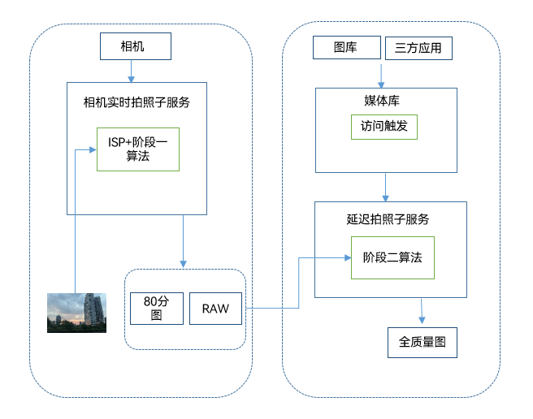
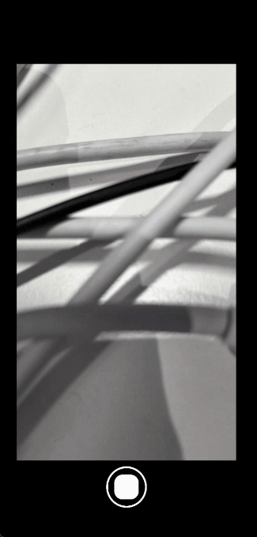
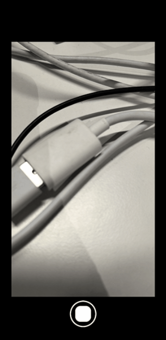

# 相机分段式拍照性能提升实践

## 概述

相机拍照性能依赖算法处理的速度，而处理效果依赖算法的复杂度，算法复杂度越高的情况下会导致处理时间就越长。目前系统相机开发有两种相机拍照方案，分别是[相机分段式拍照](../media/camera/camera-deferred-capture-case.md)和相机单段式拍照：

- 分段式拍照是系统相机开发的重要功能之一，即相机拍照可输出低质量图用作缩略图，提升用户感知拍照速度，同时使用高质量图保证最后的成图质量达到系统相机的水平，构筑相机性能竞争力。这样可以优化系统的拍照响应时延，从而提升用户的体验。
- 单段式拍照是在拍照过程中通过多帧融合以及多个底层算法仅会返回一张高质量图片，这样导致Shot2See（Shot2See指的是从用户点击拍照控件到在缩略图显示区域显示缩略图）完成时延比较长。

分段式拍照和单段式拍照返回的图片在全质量图的情况下图片质量是一致的，但是在低质量的情况下单段式拍照的图片质量要优于分段式拍照。如果开发者考虑Shot2See的完成时延以及获取全质量图，建议使用分段式拍照，否则的话，建议使用单段式拍照。
本篇文章主要以相机Shot2See场景为例，来展示分段式拍照Shot2See的完成时延要低于单段式拍照。

**分段式拍照流程示意图**



## 效果展示

如下效果图所示，单段式拍照从点击拍照控件到在缩略图显示区域显示缩略图的耗时比分段式拍照的时间长。

| 单段式拍照效果图 | 分段式拍照效果图|
|-------------------------------------------------------------------------------|---------------------------------------------------------------------------|
|  |  |

## 性能对比分析方式

代码静态校验：在相机类应用中，如果使用单段式拍照，拍照过程中该场景下仅会返回一张图片，将图片用作Shot2See后的缩略图则会导致Shot2See完成时延比较长。

动态校验：开发者可以通过DevEco Studio中的Profiler工具去抓取Trace，获取到Trace之后，根据PhotoOutputNapi::Capture和OnBufferAvailable找到对应的Trace Marker，通过两者之间的时间段来分析耗时，通过Trace可以查看，单段式拍照的时长超过1s，而分段式拍照的时长为743.1ms。

单段式拍照性能数据如下图所示：


分段式拍照耗时数据如下图所示：


性能对比分析表：

| **拍照实现方式** | **耗时(局限不同设备和场景，数据仅供参考)**  |
|------------| ------- |
| 单段式拍照      | 2.1s | 
| 分段式拍照      | 741.3ms |

优化思路：在需要加快Shot2See完成时延的场景下，使用相机框架开发的分段式拍照方案，加快第一段照片生成的速度。

## 场景示例

下面以应用中相机Shot2See场景为例，通过单段式拍照和分段式拍照的性能功耗对比，来展示两者的性能差异。

**单段式拍照：**

单段式拍照使用了`on(type:'photoAvailable',callback:AsyncCallback<Photo>):void`接口注册了全质量图的监听，默认不使能分段式拍照。具体操作步骤如下所示：

1. 相机媒体数据写入[XComponent组件](../reference/apis-arkui/arkui-ts/ts-basic-components-xcomponent.md)中，用来显示图像效果。具体代码如下所示：

   ```typescript
   XComponent({
       id: 'componentId',
       type: 'surface',
       controller: this.mXComponentController
   })
    .onLoad(async () => {
      Logger.info(TAG, 'onLoad is called');
      this.surfaceId = this.mXComponentController.getXComponentSurfaceId();
      GlobalContext.get().setObject('cameraDeviceIndex', this.defaultCameraDeviceIndex);
      GlobalContext.get().setObject('xComponentSurfaceId', this.surfaceId);
      let surfaceRect: SurfaceRect = {
          surfaceWidth: Constants.X_COMPONENT_SURFACE_HEIGHT, surfaceHeight: Constants.X_COMPONENT_SURFACE_WIDTH
      };
      this.mXComponentController.setXComponentSurfaceRect(surfaceRect);
      Logger.info(TAG, `onLoad surfaceId: ${this.surfaceId}`);
      await CameraService.initCamera(this.surfaceId, this.defaultCameraDeviceIndex);
    })
   ```

2. initCamera函数完成一个相机生命周期初始化的过程。
- 首先通过[getCameraManager](../reference/apis-camera-kit/js-apis-camera.md#cameragetcameramanager)来获取CameraMananger相机管理器类。
- 调用[getSupportedCameras](../reference/apis-camera-kit/js-apis-camera.md#getsupportedcameras)和[getSupportedOutputCapability](../reference/apis-camera-kit/js-apis-camera.md#getsupportedoutputcapability11)方法来获取支持的camera设备以及设备能力集。
- 调用[createPreviewOutput](../reference/apis-camera-kit/js-apis-camera.md#createpreviewoutput)和[createPhotoOutput](../reference/apis-camera-kit/js-apis-camera.md#createphotooutput11)方法来创建预览输出和拍照输出对象。
- 使用CameraInput的open方法来打开相机输入，通过onCameraStatusChange函数来创建CameraManager的注册回调。
- 最后调用sessionFlowFn函数创建并开启Session。具体代码如下所示：

   ```typescript
   async initCamera(surfaceId: string, cameraDeviceIndex: number): Promise<void> {
     Logger.info(TAG, `initCamera cameraDeviceIndex: ${cameraDeviceIndex}`);
     this.photoMode = AppStorage.get('photoMode')
     if (!this.photoMode) {
       return;
     }
     try {
       await this.releaseCamera();
       // 获取相机管理器实例
       this.cameraManager = this.getCameraManagerFn();
       if (this.cameraManager === undefined) {
         Logger.error(TAG, 'cameraManager is undefined');
         return;
       }
       // 获取支持指定的相机设备对象
       this.cameras = this.getSupportedCamerasFn(this.cameraManager);
       if (this.cameras.length < 1 || this.cameras.length < cameraDeviceIndex + 1) {
         return;
       }
       this.curCameraDevice = this.cameras[cameraDeviceIndex];
       let isSupported = this.isSupportedSceneMode(this.cameraManager, this.curCameraDevice);
       if (!isSupported) {
         Logger.error(TAG, 'The current scene mode is not supported.');
         return;
       }
       let cameraOutputCapability =
         this.cameraManager.getSupportedOutputCapability(this.curCameraDevice, this.curSceneMode);
       let previewProfile = this.getPreviewProfile(cameraOutputCapability);
       if (previewProfile === undefined) {
         Logger.error(TAG, 'The resolution of the current preview stream is not supported.');
         return;
       }
       this.previewProfileObj = previewProfile;
       // 创建previewOutput输出对象
       this.previewOutput = this.createPreviewOutputFn(this.cameraManager, this.previewProfileObj, surfaceId);
       if (this.previewOutput === undefined) {
         Logger.error(TAG, 'Failed to create the preview stream.');
         return;
       }
       // 监听预览事件
       this.previewOutputCallBack(this.previewOutput);
       let photoProfile = this.getPhotoProfile(cameraOutputCapability);
       if (photoProfile === undefined) {
         Logger.error(TAG, 'The resolution of the current photo stream is not supported.');
         return;
       }
       this.photoProfileObj = photoProfile;
       // 创建photoOutPut输出对象
       this.photoOutput = this.createPhotoOutputFn(this.cameraManager, this.photoProfileObj);
       if (this.photoOutput === undefined) {
         Logger.error(TAG, 'Failed to create the photo stream.');
         return;
       }
       // 创建cameraInput输出对象
       this.cameraInput = this.createCameraInputFn(this.cameraManager, this.curCameraDevice);
       if (this.cameraInput === undefined) {
         Logger.error(TAG, 'Failed to create the camera input.');
         return;
       }
       // 打开相机
       let isOpenSuccess = await this.cameraInputOpenFn(this.cameraInput);
       if (!isOpenSuccess) {
         Logger.error(TAG, 'Failed to open the camera.');
         return;
       }
       // 镜头状态回调
       this.onCameraStatusChange(this.cameraManager);
       // 监听CameraInput的错误事件
       this.onCameraInputChange(this.cameraInput, this.curCameraDevice);
       // 会话流程
       await this.sessionFlowFn(this.cameraManager, this.cameraInput, this.previewOutput, this.photoOutput);
     } catch (error) {
       let err = error as BusinessError;
       Logger.error(TAG, `initCamera fail: ${err.code}`);
     }
   }
   ```

3. 确定拍照输出流。通过cameraManager.createPhotoOutput方法创建拍照输出流，参数为[CameraOutputCapability](../reference/apis-camera-kit/js-apis-camera.md#cameraoutputcapability)类中的photoProfiles属性。

   ```typescript
   createPhotoOutputFn(cameraManager: camera.CameraManager,
     photoProfileObj: camera.Profile): camera.PhotoOutput | undefined {
     let photoOutput: camera.PhotoOutput | undefined = undefined;
     try {
       photoOutput = cameraManager.createPhotoOutput(photoProfileObj);
       Logger.info(TAG, `createPhotoOutputFn success: ${photoOutput}`);
     } catch (error) {
       let err = error as BusinessError;
       Logger.error(TAG, `createPhotoOutputFn failed: ${err.code}`);
     }
     return photoOutput;
   }
   ```

4. 触发拍照。通过photoOutput类的[capture](../reference/apis-camera-kit/js-apis-camera.md#capture)方法，执行拍照任务。该方法有两个参数，第一个参数为拍照设置参数的setting，setting中可以设置照片的质量和旋转角度，第二参数为回调函数。具体代码如下所示：

   ```typescript
   async takePicture(): Promise<void> {
     Logger.info(TAG, 'takePicture start');
     let cameraDeviceIndex = GlobalContext.get().getT<number>('cameraDeviceIndex');
     let photoSettings: camera.PhotoCaptureSetting = {
       quality: camera.QualityLevel.QUALITY_LEVEL_HIGH,
       mirror: cameraDeviceIndex ? true : false
     };
     await this.photoOutput?.capture(photoSettings);
     Logger.info(TAG, 'takePicture end');
   }
   ```

5. 设置拍照[photoAvailable](../reference/apis-camera-kit/js-apis-camera.md#onphotoavailable11)的回调来获取Photo对象，点击拍照按钮，触发此回调函数，调用getComponent方法根据图像的组件类型从图像中获取组件缓存ArrayBuffer，使用createImageSource方法来创建图片源实例，最后通过createPixelMap获取PixelMap对象。注意:如果已经注册了photoAssetAvailable回调，并且在Session开始之后又注册了photoAvailable回调，会导致流被重启。不建议开发者同时注册photoAvailable和photoAssetAvailable。

   ```typescript
   photoOutput.on('photoAvailable', (err: BusinessError, photo: camera.Photo) => {
     Logger.info(TAG, 'photoAvailable begin');
     if (photo === undefined) {
       Logger.error(TAG, 'photo is undefined');
       return;
     }
     let imageObj: image.Image = photo.main;
     imageObj.getComponent(image.ComponentType.JPEG, (err: BusinessError, component: image.Component) => {
       Logger.info(TAG, `getComponent start`);
       if (component === undefined) {
         Logger.error(TAG, 'getComponent failed');
         return;
       }
       let buffer: ArrayBuffer = component.byteBuffer;
       let imageSource: image.ImageSource = image.createImageSource(buffer);
       imageSource.createPixelMap((err: BusinessError, pixelMap: image.PixelMap) => {
         if (!pixelMap) {
           return;
         }
         this.handleImageInfo(pixelMap);
       })
     })
   })
   ```

   以上代码中执行handleImageInfo函数来对PixelMap进行全局存储并跳转到预览页面。具体代码如下所示：

   ```typescript
   handleSavePicture = (imageInfo: photoAccessHelper.PhotoAsset | image.PixelMap): void => {
     Logger.info(TAG, 'handleSavePicture');
     this.setImageInfo(imageInfo);
     AppStorage.set<boolean>('isOpenEditPage', true);
     Logger.info(TAG, 'setImageInfo end');
   }
   
   setImageInfo(imageInfo: photoAccessHelper.PhotoAsset | image.PixelMap): void {
     Logger.info(TAG, 'setImageInfo');
     GlobalContext.get().setObject('imageInfo', imageInfo);
   }
   ```

6. 进入到预览界面，通过GlobalContext.get().getT<image.PixelMap>('imageInfo')方法获取PixelMap信息，并通过Image组件进行渲染显示。

   ```typescript
   this.curPixelMap = GlobalContext.get().getT<image.PixelMap>('imageInfo');
   
   Image(this.curPixelMap)
     .objectFit(ImageFit.Contain)
     .width(Constants.FULL_PERCENT)
     .height(Constants.EIGHTY_PERCENT)
   ```

**分段式拍照：**

分段式拍照是应用下发拍照任务后，系统将分多阶段上报不同质量的图片。在第一阶段，系统快速上报低质量图，应用通过`on(type:'photoAssetAvailable',callback:AsyncCallback<PhotoAsset>):void`接口会收到一个PhotoAsset对象，通过该对象可调用媒体库接口，读取图片或落盘图片。在第二阶段，分段式子服务会根据系统压力以及定制化场景进行调度，将后处理好的原图回传给媒体库，替换低质量图。具体操作步骤如下所示：

由于分段是拍照和单段式拍照步骤1-步骤4相同，就不再进行赘述。

5. 设置拍照[photoAssetAvailable](../reference/apis-camera-kit/js-apis-camera.md#onphotoassetavailable12)的回调来获取photoAsset，点击拍照按钮，触发此回调函数，然后执行handlePhotoAssetCb函数来完成photoAsset全局的存储并跳转到预览页面。注意:如果已经注册了photoAssetAvailable回调，并且在Session开始之后又注册了photoAvailable回调，会导致流被重启。不建议开发者同时注册photoAvailable和photoAssetAvailable。

   ```typescript
   photoOutput.on('photoAssetAvailable', (err: BusinessError, photoAsset: photoAccessHelper.PhotoAsset) => {
     Logger.info(TAG, 'photoAssetAvailable begin');
     if (photoAsset === undefined) {
       Logger.error(TAG, 'photoAsset is undefined');
       return;
     }
     this.handlePhotoAssetCb(photoAsset);
   });
   ```

   以上代码中执行handleImageInfo函数来对photoAsset进行全局存储并跳转到预览页面。具体代码如下所示：

   ```typescript
   handleSavePicture = (imageInfo: photoAccessHelper.PhotoAsset | image.PixelMap): void => {
     Logger.info(TAG, 'handleSavePicture');
     this.setImageInfo(imageInfo);
     AppStorage.set<boolean>('isOpenEditPage', true);
     Logger.info(TAG, 'setImageInfo end');
   }
   
   setImageInfo(imageInfo: photoAccessHelper.PhotoAsset | image.PixelMap): void {
     Logger.info(TAG, 'setImageInfo');
     GlobalContext.get().setObject('imageInfo', imageInfo);
   }
   ```

6. 进入预览界面通过GlobalContext.get().getT<image.PixelMap>('imageInfo')方法获取PhotoAsset信息，执行requestImage函数中的photoAccessHelper.MediaAssetManager.requestImageData方法根据不同的策略模式，请求图片资源数据，这里的请求策略为均衡模式BALANCE_MODE，
最后分段式子服务会根据系统压力以及定制化场景进行调度，将后处理好的原图回传给媒体库来替换低质量图。具体代码如下所示：

   ```typescript
   photoBufferCallback: (arrayBuffer: ArrayBuffer) => void = (arrayBuffer: ArrayBuffer) => {
     Logger.info(TAG, 'photoBufferCallback is called');
     let imageSource = image.createImageSource(arrayBuffer);
     imageSource.createPixelMap((err: BusinessError, data: image.PixelMap) => {
       Logger.info(TAG, 'createPixelMap is called');
       this.curPixelMap = data;
     });
   };
   
   requestImage(requestImageParams: RequestImageParams): void {
     try {
       class MediaDataHandler implements photoAccessHelper.MediaAssetDataHandler<ArrayBuffer> {
         onDataPrepared(data: ArrayBuffer, map: Map<string, string>): void {
           Logger.info(TAG, 'onDataPrepared begin');
           Logger.info(TAG, `onDataPrepared quality: ${map['quality']}`);
           requestImageParams.callback(data);
           Logger.info(TAG, 'onDataPrepared end');
         }
       };
       let requestOptions: photoAccessHelper.RequestOptions = {
         deliveryMode: photoAccessHelper.DeliveryMode.BALANCE_MODE,
       };
       const handler = new MediaDataHandler();
       photoAccessHelper.MediaAssetManager.requestImageData(requestImageParams.context, requestImageParams.photoAsset,
         requestOptions, handler);
     } catch (error) {
       Logger.error(TAG, `Failed in requestImage, error code: ${error.code}`);
     }
   }
   
   aboutToAppear() {
     Logger.info(TAG, 'aboutToAppear begin');
     if (this.photoMode === Constants.SUBSECTION_MODE) {
       let curPhotoAsset = GlobalContext.get().getT<photoAccessHelper.PhotoAsset>('imageInfo');
       this.photoUri = curPhotoAsset.uri;
       let requestImageParams: RequestImageParams = {
         context: getContext(),
         photoAsset: curPhotoAsset,
         callback: this.photoBufferCallback
       };
       this.requestImage(requestImageParams);
       Logger.info(TAG, `aboutToAppear photoUri: ${this.photoUri}`);
     } else if (this.photoMode === Constants.SINGLE_STAGE_MODE) {
       this.curPixelMap = GlobalContext.get().getT<image.PixelMap>('imageInfo');
     }
   }
   ```

7. 将步骤6获取的PixelMap对象数据通过Image组件进行渲染显示。

   ```typescript
   Image(this.curPixelMap)
     .objectFit(ImageFit.Contain)
     .width(Constants.FULL_PERCENT)
     .height(Constants.EIGHTY_PERCENT)
   ```

## 总结

通过分段式拍照，确保低质量图可接受的基础上，加快了Shot2See的完成时延，同时第二段保证了高质量照片不损失图片效果，达到与系统相机一致的拍照质量。

## 完整示例

[相机分段式拍照源码](https://gitee.com/harmonyos-cases/cases/tree/master/test/performance/camera_shot2see)