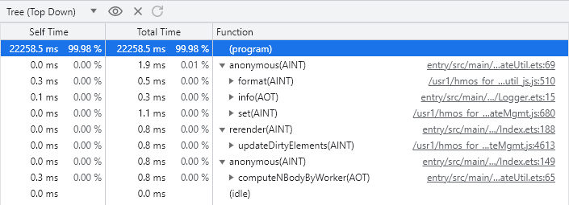

# 使用AOT进行性能优化

## AOT编译概述

ArkTS在运行期间默认情况下会通过解释器执行字节码。字节码的好处是可以做到平台无关（一次编译，处处执行），但是它的性能通常不如C/C++这类直接编译成机器码的语言。对于此种情况，一般会引入两种策略提升代码的执行性能：AOT（Ahead Of Time）和 JIT（Just in time）。JIT即实时编译，虚拟机会在运行阶段将一些热点代码（在程序运行时被频繁执行的代码段）编译成本地代码，来获取更高的执行效率。AOT即预先编译，在应用程序运行前，将代码预先编译成高性能机器代码，避免在运行时的编译性能消耗和内存消耗，让程序在首次运行时就能通过执行高性能机器码获得性能收益。

目前在HarmonyOS系统，支持通过AOT的方式来提高运行效率。然而只做AOT，无法获得准确的程序运行时执行信息，所以在性能优化效果上会不如JIT。为了解决这个问题，方舟 AOT 编译器实现了基于 PGO (Profile-Guided-Optimization, 配置文件引导型优化）的编译优化，即通过结合预先性能分析（profiling）获取的动态运行时类型信息和静态类型信息，预先将字节码静态编译生成高性能优化机器代码。在方舟 AOT 编译器中，记录预先 profiling 运行时信息的文件称为 ap(ark profiling)文件。 对性能有高要求的开发者可通过在 DevEco Studio 设置相关的编译配置项，使用AOT 编译方式提升应用执行性能。

## AOT运行机制介绍
在未启用AOT时，源代码在IDE侧通过编译得到字节码，并且打包成可被安装的可执行文件，在应用运行时，运行时会将字节码解释为机器可执行的机器码。在这个期间，如果有热点代码被反复的执行，那么会增加解释执行的成本，造成性能开销。

图1 未启用AOT执行示意图


采用AOT编译的方式，首先需要在IDE侧，通过hdc或者IDE直接执行相应指令，生成记录运行时信息的ap文件，然后在安装时将ap文件提供给AOT编译器。开启AOT后，在设备侧运行时会执行AOT编译，对ap文件中保存的执行信息（热点函数，分支语句、运行时变量的类型信息等）进行编译优化，生成高性能的机器码，在程序解释执行时，对于热点函数执行时，将直接执行优化后的机器码，便能够极大提升执行效率。

图2 启用AOT编译示意图

 
## 使用AOT编译

本案例基于业界编程语言Benchmarks Game中提出的模拟N体问题，编写了类木星体轨道计算程序的ArkTS实现。

轨道计算作为一个计算密集型程序，会大量占用系统资源计算能力的任务，需要长时间运行，这段时间会阻塞线程其它事件的处理，不适宜放在主线程进行。所以，本文案例基于多线程并发机制，以提高CPU利用率，提升应用程序响应速度。针对500万次时间推移的轨道计算，任务不需要长时间（>3分钟）占据后台线程，且是一个个独立的任务时，所以使用TaskPool开启多线程实现：

关于开启AOT编译的方法可以参考[开启AOT编译模式](https://gitee.com/openharmony/arkcompiler_ets_runtime/blob/master/docs/aot-guide_zh.md)。

## 代码实现      

其中主要执行计算的主函数体如下：  

```ts
export function computeNBodyByTaskPool(totalTimeSteps: number): void {
  Logger.info(TAG, "computeNBodyByTaskPool: start executing")
  let task: taskpool.Task = new taskpool.Task(computeTask, totalTimeSteps);
  try {
    Logger.info(TAG, 'computeNBodyByTaskPool: start calculating...')
    // 向taskpool线程池派发子线程任务
    taskpool.execute(task, taskpool.Priority.HIGH).then((res: number) => {
      Logger.info(TAG, 'computeNBodyByTaskPool: executed successfully, total time costed = ' + res + ' ms.')
      AppStorage.set<String>('timeCost', 'Total time costed = ' + res + ' ms.')
    })
  } catch (err) {
    Logger.error(TAG, 'computeNBodyByTaskPool: execute failed, ' + (err as BusinessError).toString())
  }
  Logger.info(TAG, 'computeNBodyByTaskPool: finish executing')
}
```

被子线程执行的计算任务如下：

```ts
@Concurrent
export function computeTask(totalTimeSteps: number): number {
  const tagInTask: string = 'computeTask';
  const timeStep: number = 0.01; // 单位:hour
  const fractionDigits: number = 9; // 机械能数值小数位
  let start: number = new Date().getTime();

  // 建立孤立系统的动量守恒
  offsetMomentum();
  Logger.info(tagInTask, energy().toFixed(fractionDigits));

  // 更新天体在按指定的时间变化后的位置信息
  for (let i: number = 0; i < totalTimeSteps; i++) {
    advance(timeStep);
  }

  // 判断系统计算前后机械能守恒
  Logger.info(tagInTask, energy().toFixed(fractionDigits));
  let end: number = new Date().getTime();
  return end - start;
}
```

## AOT收益对比      
案例采用TaskPool和Worker两种方式开启子线程，来验证不同数据量规模下，AOT启用与否，对应用运行时间性能的影响。

可以采用Chrome浏览器JavaScript Profiler工具或者Deveco Studio的Profiler工具，抓取项目性能数据如下：

本文中是抓取的结果仅供参考。


- 使用TaskPool开启子线程，计算500万次时间推移期间，天体的运行轨道：   
图3 未启用AOT    
  
图4 启用AOT    


   可以看到，该项目核心计算函数advance的计算性能，提升了8倍左右。

- 使用Worker开启子线程，计算5000万次时间推移期间，天体的运行轨道：  
图5 未启用AOT    
  
图6 启用AOT    
  
可以看到，该项目计算性能，提升了10倍左右。
  > **说明：**
  >
  > 该案例实际所基于的开发环境基本信息如下：  
  > IDE: 4.0.3.601  
  > AOT的收益在不同操作场景下、不同项目间都有差异性，取决于热点场景采集覆盖率、项目本身的TS/ArkTS负载率等因素。上述示例中的收益率不具有普适指导意义。   


AOT预先编译在提升性能的同时，也会带来一些负向的开销，主要体现在编译时间、代码大小等方面的影响。开发者需要在性能收益和开销间进行权衡，从业务需求决策如何使用AOT预先编译。


## AOT的开销影响  
1. 代码大小  
PGO为了提高程序的执行效率，会对代码进行优化，使得代码大小增加。对于HarmonyOS应用，可以从abc(ArkCompiler Bytecode)方舟字节码文件大小和hap应用包大小两方面评代码大小。
2. 编译时间  
PGO需要对源代码进行静态分析，生成性能配置文件，然后将配置文件与源代码一起编译。这个过程会导致编译时间增加。  
针对实践案例中项目N-Body问题，其开销数据如下：   

    | AOT开启状态                      | abc大小 | hap大小              | 编译时间                                        |
    | ------------------------- | -------- | --------------------------------- | --------------------------- |
    | 未启用AOT    | 32832 Byte        | 196 KB                            |6 s 212 ms |
    | 启用AOT      | 32832 Byte        | 206 KB                            |6 s 558 ms |

    > **说明：**
    >
    > AOT开销的膨胀率在不同操作场景下、不同项目间都有差异性，取决于热点场景采集覆盖率、项目本身的TS/ArkTS负载率等因素。上述示例中的膨胀率不具有普适指导意义。  