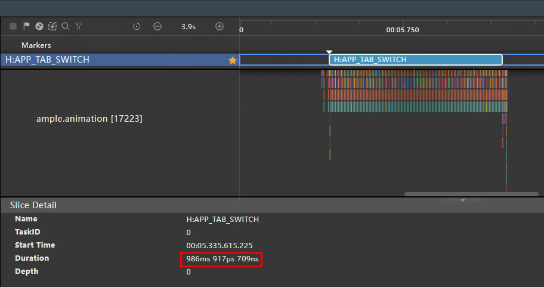
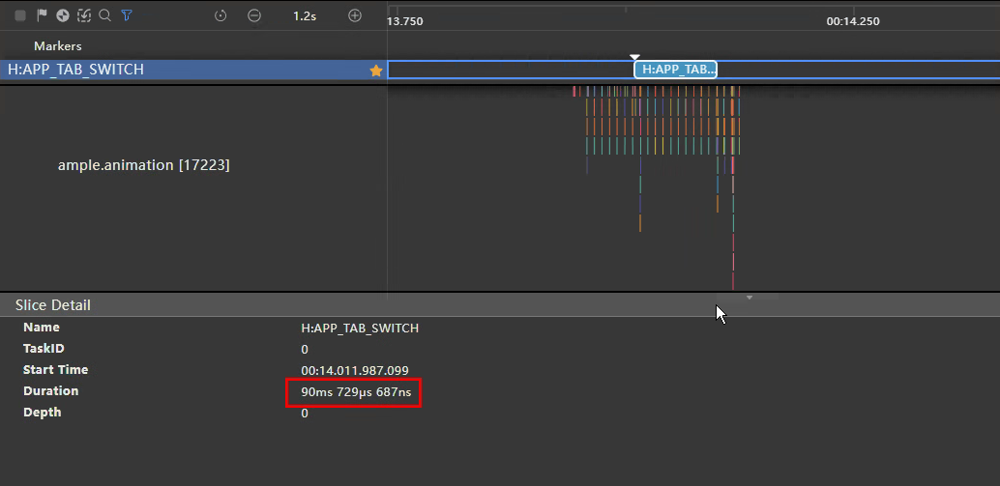
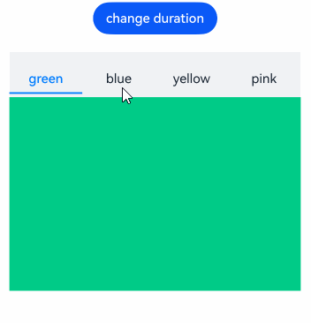
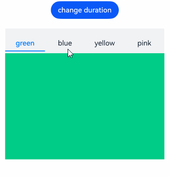
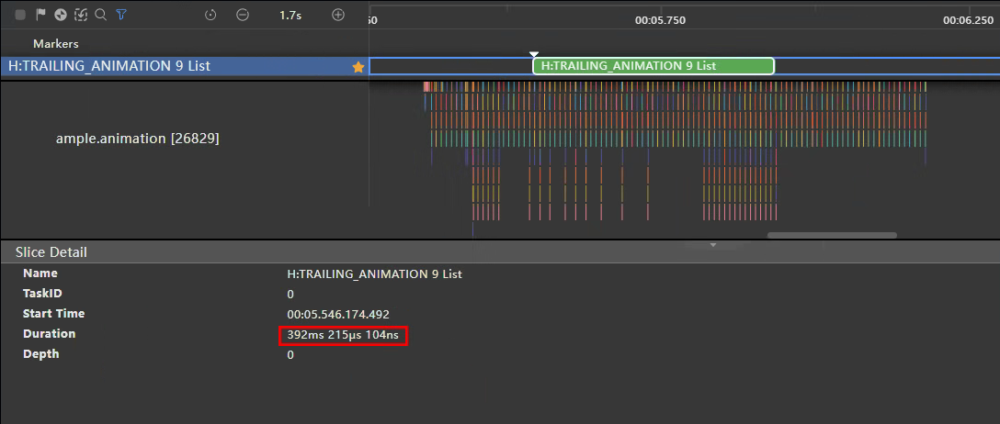
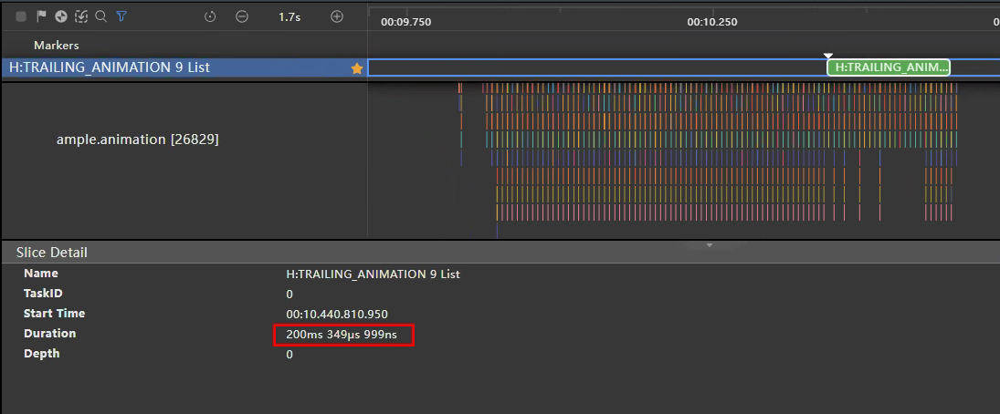

# 合理使用动画

本文列举了部分用于优化动画时延的正反案例，帮助开发者在遇到相似场景时进行优化，解决构建页面动画时遇到动画时延较长的问题。

## 减少动画丢帧

在播放动画或者生成动画时，画面产生停滞而导致帧率过低的现象，称为动画丢帧。

播放动画时，系统需要在一个刷新周期内完成动画变化曲线的计算，完成组件布局绘制等操作。建议使用系统提供的动画接口，只需设置曲线类型、终点位置、时长等信息，就能够满足常用的动画功能，减少UI主线程的负载。

反例：应用使用了自定义动画，动画曲线计算过程很容易引起UI线程高负载，易导致丢帧。

```typescript
@Entry
@Component
struct AttrAnimationExample0 {
  @State widthSize: number = 200
  @State heightSize: number = 100
  @State flag: boolean = true

  computeSize() {
    let duration = 2000
    let period = 16
    let widthSizeEnd = 0
    let heightSizeEnd = 0
    if (this.flag) {
      widthSizeEnd = 100
      heightSizeEnd = 50
    } else {
      widthSizeEnd = 200
      heightSizeEnd = 100
    }
    let doTimes = duration / period
    let deltaHeight = (heightSizeEnd - this.heightSize) / doTimes
    let deltaWeight = (widthSizeEnd - this.widthSize) / doTimes
    for (let i = 1; i <= doTimes; i++) {
      let t = period * (i);
      setTimeout(() => {
        this.heightSize = this.heightSize + deltaHeight
        this.widthSize = this.widthSize + deltaWeight
      }, t)
    }
    this.flag = !this.flag
  }

  build() {
    Column() {
      Button('click me')
        .onClick(() => {
          let delay = 500
          setTimeout(() => { this.computeSize() }, delay)
        })
        .width(this.widthSize).height(this.heightSize).backgroundColor(0x317aff)
    }.width('100%').margin({ top: 5 })
  }
}
```


### 使用系统提供的属性动效API

建议：通过系统提供的属性动效API实现上述动效功能。

```typescript
@Entry
@Component
struct AttrAnimationExample1 {
  @State widthSize: number = 200
  @State heightSize: number = 100
  @State flag: boolean = true

  build() {
    Column() {
      Button('click me')
        .onClick((event?: ClickEvent | undefined) => {
          if (this.flag) {
            this.widthSize = 100
            this.heightSize = 50
          } else {
            this.widthSize = 200
            this.heightSize = 100
          }
          this.flag = !this.flag
        })
        .width(this.widthSize).height(this.heightSize).backgroundColor(0x317aff)
        .animation({
          duration: 2000, // 动画时长
          curve: Curve.Linear, // 动画曲线
          delay: 500, // 动画延迟
          iterations: 1, // 播放次数
          playMode: PlayMode.Normal // 动画模式
        }) // 对Button组件的宽高属性进行动画配置
    }.width('100%').margin({ top: 5 })
  }
}
```


更详细的API文档请参考：[属性动画](../reference/apis-arkui/arkui-ts/ts-animatorproperty.md)。

### 使用系统提供的显式动效API

建议：通过系统提供的显式动效API实现上述动效功能。

```typescript
@Entry
@Component
struct AnimateToExample2 {
  @State widthSize: number = 200;
  @State heightSize: number = 100;
  @State flag: boolean = true;

  build() {
    Column() {
      Button('click me')
        .onClick((event?: ClickEvent | undefined) => {
          if (this.flag) {
            animateTo({
              duration: 2000, // 动画时长
              curve: Curve.Linear, // 动画曲线
              delay: 500, // 动画延迟
              iterations: 1, // 播放次数
              playMode: PlayMode.Normal // 动画模式
            }, () => {
              this.widthSize = 100;
              this.heightSize = 50;
            })
          } else {
            animateTo({
              duration: 2000, // 动画时长
              curve: Curve.Linear, // 动画曲线
              delay: 500, // 动画延迟
              iterations: 1, // 播放次数
              playMode: PlayMode.Normal // 动画模式
            }, () => {
              this.widthSize = 200;
              this.heightSize = 100;
            })
          }
          this.flag = !this.flag;
        })
        .width(this.widthSize).height(this.heightSize).backgroundColor(0x317aff)
    }.width('100%').margin({ top: 5 })
  }
}
```


更详细的API文档请参考：[显式动画](../reference/apis-arkui/arkui-ts/ts-explicit-animation.md)。

### 优化效果

相比于自定义动画，使用系统提供的动效API可提高动画帧数，提高应用性能。

| 动画实现方式  | 帧数（fps） |
|---------|---------|
| 自定义动画   | 60      |
| 属性动效API | 120     |
| 显式动效API | 120     |

## 合理设置隐式动画

Tabs组件在不为BottomTabBarStyle样式时，切换页面时默认加载300ms的隐式动画，如果开发场景不需要该动画效果，会因默认加载导致页面跳转完成时延变长，此时可手动设置`animationDuration`减少动画完成时延。下述正反示例分别为100ms和1000ms的动画时延：

### 反例：

```javascript
@Entry
@Component
struct TabsExample {
  ...
  private controller: TabsController = new TabsController();

  build() {
    Column() {
      Tabs({ barPosition: BarPosition.Start, index: this.currentIndex, controller: this.controller }) {
        TabContent()
        TabContent()
        // ...
      }
      // ...
      // 设置Tabs页面跳转的动画时长为1000ms
      .animationDuration(1000)
    }
    .width('100%')
  }
}
```



### 正例：

```javascript
@Entry
@Component
struct TabsExample {
  ...
  private controller: TabsController = new TabsController();

  build() {
    Column() {
      Tabs({ barPosition: BarPosition.Start, index: this.currentIndex, controller: this.controller }) {
        TabContent()
        TabContent()
        // ...
      }
      // ...
      // 设置Tabs页面跳转的动画时长为100ms
      .animationDuration(100)
    }
    .width('100%')
  }
}
```



### 优化效果

| 优化前 1000ms                                         | 优化后 100ms                                          |   
|----------------------------------------------------|----------------------------------------------------|
|  |  |

上述示例通过减少`animationDuration`数值，减少Tabs切换完成时延。当数值设置为0且TabBar不为BottomTabBarStyle样式时，隐式动效延时为默认的300ms。开发者可根据实际场景适当减少隐式动效时延，如果应用没有特殊的动效要求时，建议设置数值为1，减少阻塞主线程，提高应用性能。

更详细的API文档请参考：[Tabs-animationduration](../reference/apis-arkui/arkui-ts/ts-container-tabs.md#animationduration)。

## 合理设置动效时长

滚动类组件可使用**fling**方法按传入的初始速度进行惯性滚动，不合理的滚动速度设置可能导致动效时长过长，此时应通过加快滚动速度减少动效时长。下述正反示例通过改变List组件惯性滚动速度减少动效时长：

### 反例：

```javascript
@Entry
@Component
struct ListExample {
  scrollerForList: Scroller = new Scroller();

  build() {
    Column() {
      Button('Fling100')
        .onClick(() => {
          // 设置当前滚动初始速度为100vp/s
          this.scrollerForList.fling(100);
        })
      List({ space: 20, initialIndex: 0, scroller: this.scrollerForList }) {
        // ...
      }
    }
  }
}
```

### 正例：

```javascript
@Entry
@Component
struct ListExample {
    scrollerForList: Scroller = new Scroller();

    build() {
        Column() {
            Button('Fling100')
                .onClick(() => {
                    // 设置当前滚动初始速度为10000vp/s
                    this.scrollerForList.fling(10000);
                })
            List({ space: 20, initialIndex: 0, scroller: this.scrollerForList }) {
                // ...
            }
        }
    }
}
```

### 优化效果

*100vp/s：*



*10000vp/s：*



| 示例  | 动效耗时（ms） |
|-----|----------|
| 优化前 | 392      |
| 优化后 | 200      |

上述示例在提高滚动速度到10000vp/s后，相比100vp/s减少了200ms的动画时延。开发者可根据实际场景适当增加滚动速度，在不影响页面效果的情况下减少页面完成时延，提高应用性能。