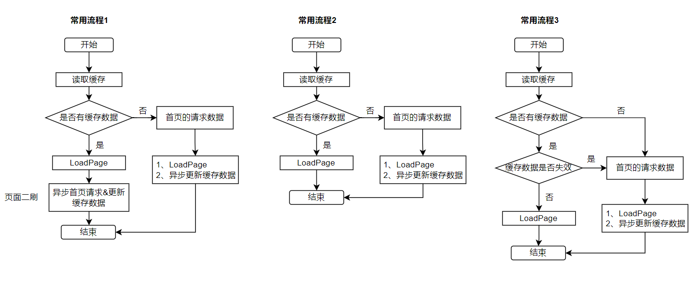
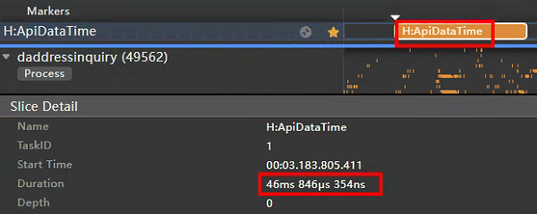
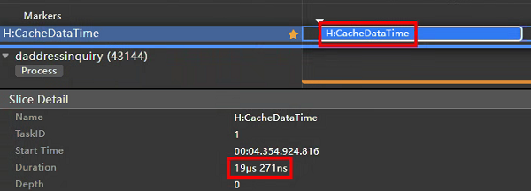
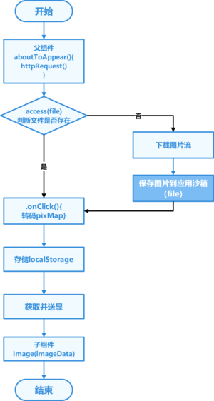
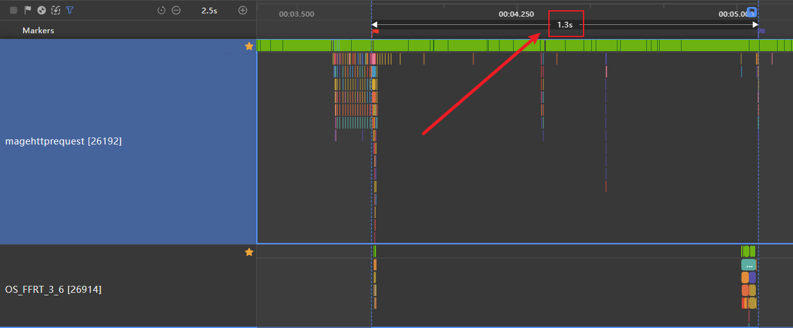
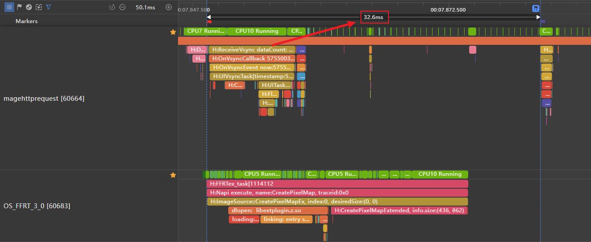
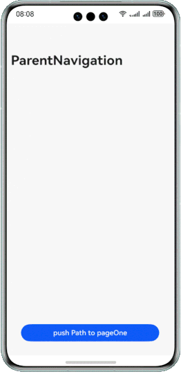

# 合理使用缓存提升性能

## 简介

随着应用功能的日益丰富与复杂化，数据加载效率成为了衡量应用性能的重要指标。不合理的加载策略往往导致用户面临长时间的等待，这不仅损害了用户体验，还可能引发用户流失。因此，合理运用缓存技术变得尤为重要。  
系统提供了[Preferences](https://developer.huawei.com/consumer/cn/doc/harmonyos-guides-V5/data-persistence-by-preferences-V5)、[数据库](https://developer.huawei.com/consumer/cn/doc/harmonyos-guides-V5/data-persistence-by-rdb-store-V5)、[文件](https://developer.huawei.com/consumer/cn/doc/harmonyos-references-V5/js-apis-file-fs-V5)、[AppStorage](https://developer.huawei.com/consumer/cn/doc/harmonyos-guides-V5/arkts-appstorage-V5)等缓存方式，开发者可以对应用数据先进行缓存，再次加载数据时优先展示缓存数据，减少加载时间，从而提升用户体验。  
本文将介绍以下内容，来帮助开发者通过缓存技术提升应用的冷启动速度、预下载网络图片减少Image白块时长，避免卡顿感：

- [冷启动首页时，缓存网络数据](#场景1缓存网络数据)。
- [冷启动首页时，缓存地址数据](#场景2缓存地址数据)。
- [预下载网络图片数据](#场景3预下载图片数据)。

## 识别使用缓存的场景

1. 当应用冷启动过程中，应用的首页数据如果依赖于网络请求获取相应数据。可通过[缓存网络数据](#场景1缓存网络数据)，从而避免在页面冷启动过程中出现较长时间的白屏或白块现象，提升冷启动速度。
2. 当需要应用在冷启动时即时加载首页地址数据，可通过[缓存地址数据](#场景2缓存地址数据)，使用缓存减少首次数据加载展示时间，提升冷启动速度。
3. 当子页面需要加载很大的网络图片时，可以在父页面提前[预下载图片数据](#场景3预下载图片数据)到应用沙箱中，子组件加载时从沙箱中读取，减少Image白块出现时长。

## 冷启动首页时常用的缓存使用流程
图1 冷启动首页中三种常用的缓存使用流程



图1是三种常用的缓存使用流程。常用流程1的详细过程如下：

1.应用冷启动时，读取缓存。

2.判断是否有缓存数据。

3.如果本地没有缓存数据，则需要通过网络、位置服务等方式请求相应数据，然后把数据刷新到首页，同时异步更新缓存数据。

4.如果本地有缓存数据，则把缓存数据先刷新到应用首页，然后异步请求数据进行页面二刷，并更新缓存数据。

常用流程2和1的过程类似，只是常用流程2中省略了异步请求数据进行页面二刷并更新缓存的步骤。而常用流程3和2相比，常用流程3只是在本地有缓存数据时，增加了对缓存数据是否失效的处理。如果缓存数据没有失效，则把缓存数据刷新到应用首页。如果缓存数据已经失效，则需要重新请求数据，然后刷新到首页并更新缓存。

>**说明：**
>
> 上述缓存使用流程仅为开发者提供参考，实际开发中需结合具体业务场景与需求进行灵活的调整与优化。


## 优化示例

### 场景1缓存网络数据
#### 使用场景
在应用启动过程中，开发者往往会遇到冷启动完成时延长的问题。这是由于大部分应用的首页数据依赖于网络请求或定位服务等方式来获取相应数据。如果网络、位置服务等信号差，就会导致应用请求网络和位置数据耗时变长，从而在页面冷启动过程中出现较长时间的白屏或白块现象。
因此可以使用本地缓存首页网络数据解决较长时间的白屏或白块问题。

图2 使用本地缓存首页数据流程图


图2是使用本地缓存首页数据的流程图。使用本地缓存优先展示冷启动首页数据，可以减少首帧展示完成时延，减少用户可见白屏或白块时间，提升用户的冷启动体验。

>**说明：**
>
> 应用需根据自身对于数据的时效性要求，来决定是否使用缓存数据。例如时效性要求为一天时，一天前保存的缓存数据就不适合进行展示，需从网络获取新数据进行展示，并更新本地缓存数据。

#### 场景示例
下面是一个缓存网络数据的场景示例。示例中应用首页需展示一张从网站获取的图片信息，在aboutToAppear()中发起网络请求，待数据返回解析后展示在首页上。之后将图片信息缓存至本地应用沙箱内，再次冷启动时首先从沙箱内获取图片信息。若存在，即可解析并展示，在网络请求返回时再次更新图片信息。 以下为关键示例代码。

```typescript
import { http } from '@kit.NetworkKit';
import { image } from '@kit.ImageKit';
import { BusinessError } from '@kit.BasicServicesKit';
import { abilityAccessCtrl, common, Permissions } from '@kit.AbilityKit';
import { fileIo as fs } from '@kit.CoreFileKit';

const PERMISSIONS: Array<Permissions> = [
  'ohos.permission.READ_MEDIA',
  'ohos.permission.WRITE_MEDIA'
];
AppStorage.link('net_picture');
PersistentStorage.persistProp('net_picture', '');

@Entry
@Component
struct Index {
  @State image: PixelMap | undefined = undefined;
  @State imageBuffer: ArrayBuffer | undefined = undefined; // 图片ArrayBuffer

  /**
   * 通过http的request方法从网络下载图片资源
   */
  async getPicture() {
    http.createHttp()
      .request('https://www.example1.com/POST?e=f&g=h',
        (error: BusinessError, data: http.HttpResponse) => {
          if (error) {
            return;
          }
          // 判断网络获取到的资源是否为ArrayBuffer类型
          if (data.result instanceof ArrayBuffer) {
            this.imageBuffer = data.result as ArrayBuffer;
          }
          this.transcodePixelMap(data);
        }
      )
  }

  /**
   * 使用createPixelMap将ArrayBuffer类型的图片装换为PixelMap类型
   * @param data：网络获取到的资源
   */
  transcodePixelMap(data: http.HttpResponse) {
    if (http.ResponseCode.OK === data.responseCode) {
      const imageData: ArrayBuffer = data.result as ArrayBuffer;
      // 通过ArrayBuffer创建图片源实例。
      const imageSource: image.ImageSource = image.createImageSource(imageData);
      const options: image.InitializationOptions = {
        'alphaType': 0, // 透明度
        'editable': false, // 是否可编辑
        'pixelFormat': 3, // 像素格式
        'scaleMode': 1, // 缩略值
        'size': { height: 100, width: 100 }
      }; // 创建图片大小

      // 通过属性创建PixelMap
      imageSource.createPixelMap(options).then((pixelMap: PixelMap) => {
        this.image = pixelMap;
        setTimeout(() => {
          if (this.imageBuffer !== undefined) {
            this.saveImage(this.imageBuffer);
          }
        }, 0)
      });
    }
  }

  /**
   * 保存ArrayBuffer到沙箱路径
   * @param buffer：图片ArrayBuffer
   * @returns
   */
  async saveImage(buffer: ArrayBuffer | string): Promise<void> {
    const context = this.getUIContext().getHostContext() as common.UIAbilityContext;
    const filePath: string = context.cacheDir + '/test.jpg';
    AppStorage.set('net_picture', filePath);
    const file = await fs.open(filePath, fs.OpenMode.READ_WRITE | fs.OpenMode.CREATE);
    await fs.write(file.fd, buffer);
    await fs.close(file.fd);
  }

  async useCachePic(): Promise<void> {
    if (AppStorage.get('net_picture') !== '') {
      // 获取图片的ArrayBuffer
      const imageSource: image.ImageSource = image.createImageSource(AppStorage.get('net_picture'));
      const options: image.InitializationOptions = {
        'alphaType': 0, // 透明度
        'editable': false, // 是否可编辑
        'pixelFormat': 3, // 像素格式
        'scaleMode': 1, // 缩略值
        'size': { height: 100, width: 100 }
      };
      imageSource.createPixelMap(options).then((pixelMap: PixelMap) => {
        this.image = pixelMap;
      });
    }
  }

  async aboutToAppear(): Promise<void> {
    const context = this.getUIContext().getHostContext() as common.UIAbilityContext;
    const atManager = abilityAccessCtrl.createAtManager();
    await atManager.requestPermissionsFromUser(context, PERMISSIONS);
    this.useCachePic(); // 从本地缓存获取数据
    this.getPicture(); // 从网络端获取数据
  }

  build() {
    Column() {
      Image(this.image)
        .objectFit(ImageFit.Contain)
        .width('50%')
        .height('50%')
    }
  }
}
```

#### 性能分析

下面对优化前后启动性能进行对比分析。分析阶段的起点为启动Ability（即H:void OHOS::AppExecFwk::MainThread::HandleLaunchAbility的开始点），阶段终点为应用首次解析Pixelmap（即H:Napi execute, name:CreatePixelMap, traceid:0x0）后的第一个vsync（即H:ReceiveVsync dataCount: 24bytes now:timestamp expectedEnd:timestamp vsyncId:int的开始点）。

图3 优化前未使用本地缓存


图4 优化后使用本地缓存


图3是优化前未使用本地缓存（从网络端获取数据）的耗时，图4是优化后使用本地缓存的耗时，对比数据如下（性能耗时数据因设备版本环境而异，以实测为准）：

#### 性能对比

| 方案           |  阶段时长(毫秒)  |
|--------------|:----------:|
| （优化前）未使用本地缓存 |   641.8    |
| （优化后）使用本地缓存   |    68.9    |

可以看到在使用本地缓存后，应用冷启动时从Ability启动到图片显示的阶段耗时明显减少。

### 场景2缓存地址数据

#### 使用场景
如果应用每次冷启动都先通过[getCurrentLocation](https://developer.huawei.com/consumer/cn/doc/harmonyos-references-V5/js-apis-geolocationmanager-V5#geolocationmanagergetcurrentlocation)获取位置数据，特别是在信号较弱的区域，这可能导致显著的延迟，迫使用户等待较长时间才能获取到所需的位置信息，从而极大地影响了应用的冷启动体验。  
针对上述问题，下面将通过使用缓存减少首次数据加载展示时间，优化应用启动性能，为开发者优化应用性能提供参考。

下面是一个使用[PersistentStorage（持久化存储UI状态）](https://developer.huawei.com/consumer/cn/doc/harmonyos-guides-V5/arkts-persiststorage-V5)缓存地址数据的场景示例。主要步骤如下：

1.通过persistProp初始化PersistentStorage。

2.创建状态变量@StorageLink(MYLOCATION) myLocation，和AppStorage中MYLOCATION双向绑定。

3.应用冷启动时，先判断缓存AppStorage里MYLOCATION值是否为空（UI和业务逻辑不直接访问PersistentStorage中的属性，所有属性访问都是对AppStorage的访问）。

4.如果缓存为空，则从getCurrentLocation获取地址数据，并加载到页面，同时保存到缓存。如果缓存不为空，则直接从缓存获取地址数据，并加载到页面。

>**说明：**
>
> 为了方便对比性能差异，本例中未做缓存数据是否失效和页面二刷的业务处理。实际业务开发中冷启动时虽然是优先从缓存获取地址数据进行刷新，但是后面还需要再使用getCurrentLocation获取最新地址数据进行页面二刷，以确保地址数据的准确性。

#### 场景示例

```typescript
import { abilityAccessCtrl, common, Permissions } from '@kit.AbilityKit'; // 程序访问控制管理模块
import { BusinessError } from '@kit.BasicServicesKit';
import { hilog, hiTraceMeter } from '@kit.PerformanceAnalysisKit'; // 性能打点模块
import { geoLocationManager } from '@kit.LocationKit'; // 位置服务模块。需要在module.json5中配置ohos.permission.APPROXIMATELY_LOCATION权限。

// 写入与读取缓存位置数据的key值
const MYLOCATION = 'myLocation';
// 定义获取模糊位置的权限
const PERMISSIONS: Array<Permissions> = ['ohos.permission.APPROXIMATELY_LOCATION'];
// 获取上下文信息
const context: common.UIAbilityContext = this.getUIContext().getHostContext() as common.UIAbilityContext;
// 初始化PersistentStorage。PersistentStorage用于持久化存储选定的AppStorage属性
PersistentStorage.persistProp(MYLOCATION, '');

@Entry
@Component
struct Index {
  // 创建状态变量@StorageLink(MYLOCATION) myLocation，和AppStorage中MYLOCATION双向绑定
  @StorageLink(MYLOCATION) myLocation: string = '';

  aboutToAppear() {
    // ApiDataTime表示从getCurrentLocation接口获取位置信息的性能打点起始位置。
    hiTraceMeter.startTrace("ApiDataTime", 1);
    // CacheDataTime表示从AppStorage缓存中获取位置信息的性能打点起始位置。
    hiTraceMeter.startTrace("CacheDataTime", 1);
    // 从AppStorage缓存中获取位置信息
    let cacheData = AppStorage.get<string>(MYLOCATION);
    // 缓存中如果有位置信息，则直接从缓存获取位置信息。如果没有，则从getCurrentLocation接口获取位置信息。
    if (cacheData !== '') {
      // 缓存中有位置信息，则从缓存中直接获取位置信息，并结束性能打点
      hiTraceMeter.finishTrace("CacheDataTime", 1);
      AlertDialog.show({
        message: 'AppStorage:' + cacheData,
        alignment: DialogAlignment.Center
      });
    } else {
      // 缓存中没有位置信息，则从接口获取位置信息
      this.apiGetLocation(PERMISSIONS, context);
    }
  }

  /**
   * 从getCurrentLocation接口获取位置信息。用户需要先授权。
   */
  apiGetLocation(permissions: Array<Permissions>, context: common.UIAbilityContext): void {
    // 获取访问控制模块对象
    let atManager: abilityAccessCtrl.AtManager = abilityAccessCtrl.createAtManager();
    // 拉起弹框请求用户授权。requestPermissionsFromUser会判断权限的授权状态来决定是否唤起弹窗
    atManager.requestPermissionsFromUser(context, permissions).then((data) => {
      // 获取相应请求权限的结果。 0表示已授权，否则表示未授权
      let grantStatus: Array<number> = data.authResults;
      let length: number = grantStatus.length;
      for (let i = 0; i < length; i++) {
        // 如果用户已授权模糊位置的权限，则调用getCurrentLocation获取位置信息，并保存到AppStorage
        if (data.permissions[i] === 'ohos.permission.APPROXIMATELY_LOCATION' && grantStatus[i] === 0) {
          // 设置位置请求参数
          let requestInfo: geoLocationManager.CurrentLocationRequest = {
            'priority': geoLocationManager.LocationRequestPriority.FIRST_FIX, // 设置优先级信息。FIRST_FIX表示快速获取位置优先，如果应用希望快速拿到一个位置，可以将优先级设置为该字段。
            'scenario': geoLocationManager.LocationRequestScenario.UNSET // 设置场景信息。UNSET表示未设置场景信息。当scenario取值为UNSET时，priority参数生效，否则priority参数不生效；
          };
          try {
            // 获取当前位置
            geoLocationManager.getCurrentLocation(requestInfo).then((result) => {
              // 获取位置信息后，结束性能打点
              hiTraceMeter.finishTrace("ApiDataTime", 1);
              let locationData = JSON.stringify(result);
              // 保存到本地缓存
              AppStorage.setOrCreate(MYLOCATION, JSON.stringify(locationData));
              AlertDialog.show({
                message: 'getCurrentLocation:' + locationData,
                alignment: DialogAlignment.Center
              });
            })
              .catch((error: BusinessError) => {
                hilog.error(0x0000, "UseCacheInsteadAddressInquiry", `getCurrentLocation: error= ${error}`);
              });
          } catch (err) {
            hilog.error(0x0000, "UseCacheInsteadAddressInquiry", `err: ${err}`);
          }
        } else {
          // 如果用户未授权，提示用户授权。
          AlertDialog.show({
            message: '用户未授权，请到系统设置中打开应用的位置权限后再试。',
            alignment: DialogAlignment.Center
          });
          return;
        }
      }
    }).catch((err: BusinessError) => {
      hilog.error(0x0000, "UseCacheInsteadAddressInquiry", `failed to request permissions from user. Code is ${err.code} , message is ${err.message}`);
    })
  }

  build() {
    Column() {
      Button('clear cache').onClick(() => {
        // 清除AppStorage缓存中的位置信息
        this.myLocation = '';
        AlertDialog.show({
          message: 'cache cleared',
          alignment: DialogAlignment.Center
        });
      })
    }
    .height('100%')
    .width('100%')
  }
}
```

#### 性能分析

下面使用DevEco Studio内置的Profiler中的启动分析工具Launch，对使用getCurrentLocation获取地址数据及使用缓存获取地址数据的冷启动性能进行对比分析。本例中通过在aboutToAppear进行起始位置的[性能打点](https://developer.huawei.com/consumer/cn/doc/harmonyos-references-V5/js-apis-hitracemeter-V5)，然后在使用本地缓存和使用getCurrentLocation获取到地址数据的位置分别进行结束位置的性能打点来分析两者的性能差异。对比性能前，需要先打开一次应用页面，在弹出位置信息授权弹窗时选择允许授权的选项。

优化前未使用本地缓存（通过getCurrentLocation获取地址数据）的测试步骤：先打开示例页面，点击'clear cache'按钮（清除本地位置信息的缓存）后退出应用，再使用Launch抓取性能数据。

图5 优化前未使用本地缓存



优化后使用本地缓存（通过PersistentStorage获取地址数据）的测试步骤：在使用getCurrentLocation获取地址数据后退出应用（本例中在getCurrentLocation获取地址数据数据后会保存到本地缓存），再使用Launch工具抓取性能数据。

图6 优化后使用本地缓存



图5是优化前未使用本地缓存（从getCurrentLocation获取地址数据）的耗时，图6是优化后使用本地缓存（从PersistentStorage获取地址数据）的耗时，对比数据如下（性能耗时数据因设备版本环境而异，以实测为准）：

#### 性能对比
| 方案                     | 阶段时长 |
| ------------------------ | :------: |
| （优化前）未使用本地缓存 |   46ms   |
| （优化后）使用本地缓存   |   19μs   |

由此可见，在冷启动首页需要加载地址数据的场景中，先采用本地缓存策略获取地址数据相比调用getCurrentLocation接口，能显著缩短地址数据的获取时间，减少用户等待，提升冷启动完成时延性能与用户体验。

### 场景3预下载图片数据
#### 原理介绍
在通过Image组件加载网络图片时，通常会经历四个关键阶段：组件创建、图片资源下载、图片解码和刷新。当加载的图片资源过大时，Image组件会在图片数据下载和解码完成后才刷新图片。这一过程中，由于图片下载较耗时，未成功加载的图片常常表现为空白或占位图（一般为白色或淡色），这可能引发“Image 白块”现象。为了提升用户体验并提高性能，应尽量避免这种情况。  
图1 Image加载网络图片两种方式对比


为了减少白块的出现，开发者可以采用预下载的方式，可以将网络图片通过应用沙箱的方式进行提前缓存，将图片下载解码提前到组件创建之前执行，当Image组件加载时从应用沙箱中获取缓存数据。非首次请求时会判断应用沙箱里是否存在资源，如存在直接从缓存里获取，不再重复下载，减少Image加载大的网络图片时白屏或白块出现时长较长的问题，提升用户体验。
>**说明：**
>
> 1. 开发者在使用Image加载较大的网络图片时，网络下载推荐使用HTTP工具提前预下载。
> 2. 在预下载之后，开发者可根据业务自行选择数据处理方式，如将预下载后得到的ArrayBuffer转成BASE64、使用应用沙箱提前缓存、直接转PixelMap、或是业务上自行处理ArrayBuffer等多种方式灵活处理数据后，传给Image组件。

#### 使用场景
当子页面需要加载很大的网络图片时，可以在父页面提前将网络数据预下载到应用沙箱中，子组件加载时从沙箱中读取，减少白块出现时长。

#### 场景示例
开发者使用Navigation组件时，通常会在主页引入子页面组件，在按钮中添加方法实现跳转子页面组件。当子页面中需展示一张较大的网络图片时，而Image未设置占位图时，会出现点击按钮后，子组件的Image组件位置出现长时间的Image白块现象。

本文将以应用沙箱提前缓存举例，给出减少Image白块出现时长的一种优化方案。

【优化前】：使用Image组件直接加载网络地址。

以下为部分示例代码：
```typescript
@Builder
export function PageOneBuilder(name: string) {
  PageOne()
}

@Component
export struct PageOne {
  pageInfo: NavPathStack = new NavPathStack();
  @State name: string = 'pageOne';

  build() {
    NavDestination() {
      Row() {
        // 不推荐用法：使用Image直接加载网络图片的方式，受到图片下载与解析的耗时影响，极易出现白块。
        Image("https://www.example.com/xxx.png") // 此处请填写一个具体的网络图片地址。
          .objectFit(ImageFit.Auto)
          .width('100%')
          .height('100%')
      }
      .width('100%')
      .height('100%')
      .justifyContent(FlexAlign.Center)
    }
    .title(this.name)
  }
}
```
>**说明：**
>
> 1. 使用Image直接加载网络图片时，可以使用.alt()的方式，在网络图片加载成功前使用占位图，避免白块出现时长过长，优化用户体验。
> 2. 使用网络图片时，需要申请权限ohos.permission.INTERNET。

【优化后】：子页面PageOne中需展示一张较大的网络图片，在父组件的aboutToAppear()中提前发起网络请求，并做判断文件是否存在，已下载的不再重复请求，存储在应用沙箱中。当父页面点击按钮跳转子页面PageOne，此时触发pixMap请求读取应用沙箱中已缓存解码的网络图片并存储在LocalStorage中，通过在子页面的Image中传入被@StorageLink修饰的变量ImageData进行数据刷新，图片送显。

图2 使用预下载的方式，由开发者灵活地处理网络图片，减少白块出现时长。  
  
以下为关键示例代码：

1. 在父组件里aboutToAppear()中提前发起网络请求，当父页面点击按钮跳转子页面PageOne，此时触发pixMap请求读取应用沙箱中已缓存解码的网络图片并存储在localStorage中。非首次点击时，不再重复调用getPixMap()，避免每次点击都从沙箱里读取文件。
```typescript
import { fileIo as fs } from '@kit.CoreFileKit';
import { image } from '@kit.ImageKit';
import { common } from '@kit.AbilityKit';
import { httpRequest } from '../utils/NetRequest';

let para: Record<string, PixelMap | undefined> = { 'imageData': undefined };
let localStorage: LocalStorage = new LocalStorage(para);

@Entry(localStorage)
@Component
struct MainPage {
  @State childNavStack: NavPathStack = new NavPathStack();
  @LocalStorageLink('imageData') imageData: PixelMap | undefined = undefined;
  @State fileUrl: string = '';

  getPixMap() { // 从应用沙箱里读取文件
    try {
      let file = fs.openSync(this.fileUrl, fs.OpenMode.READ_WRITE); // 以同步方法打开文件
      const imageSource: image.ImageSource = image.createImageSource(file.fd);
      const options: image.InitializationOptions = {
        'alphaType': 0, // 透明度
        'editable': false, // 是否可编辑
        'pixelFormat': 3, // 像素格式
        'scaleMode': 1, // 缩略值
        'size': { height: 100, width: 100 }
      };
      fs.close(file);
      imageSource.createPixelMap(options).then((pixelMap: PixelMap) => {
        this.imageData = pixelMap;
      });
    } catch (e) {
      console.error('资源加载错误，文件或不存在！');
    }
  }

  aboutToAppear(): void {
    // 获取应用文件路径
    let context = this.getUIContext().getHostContext() as common.UIAbilityContext;
    let filesDir = context.filesDir;
    this.fileUrl = filesDir + '/xxx.png'; // 当使用实际网络地址时，需填入实际地址的后缀。
    httpRequest(context); // 在父组件提前发起网络请求
  }

  build() {
    Navigation(this.childNavStack) {
      Column() {
        Button('push Path to pageOne', { stateEffect: true, type: ButtonType.Capsule })
          .width('80%')
          .height(40)
          .margin({ bottom: '36vp' })
          .onClick(() => {
            if (!localStorage.get('imageData')) { // 非首次点击，不再重复调用getPixMap(),避免每次点击都从沙箱里读取文件。
              this.getPixMap();
            }
            this.childNavStack.pushPath({ name: 'pageOne' });
          })
      }
      .width('100%')
        .height('100%')
        .justifyContent(FlexAlign.End)
    }
    .backgroundColor(Color.Transparent)
      .title('ParentNavigation')
  }
}
```
2. 在NetRequest.ets中定义网络请求httpRequest()，通过fs.access()检查文件是否存在，当文件存在时不再重复请求，并写入沙箱中。
```typescript
import { http } from '@kit.NetworkKit';
import { BusinessError } from '@kit.BasicServicesKit';
import { fileIo as fs } from '@kit.CoreFileKit';
import { common } from '@kit.AbilityKit';

export async function httpRequest(context: common.UIAbilityContext) {
  // 获取应用文件路径
  let filesDir = context.filesDir;
  let fileUrl = filesDir + '/xxx.png'; // 当使用实际网络地址时，需填入实际地址的后缀。
  fs.access(fileUrl, fs.AccessModeType.READ).then((res) => { // 检查文件是否存在
    if (!res) { // 如沙箱里不存在地址，重新请求网络图片资源
      http.createHttp()
        .request('https://www.example.com/xxx.png', // 此处请填写一个具体的网络图片地址。
          (error: BusinessError, data: http.HttpResponse) => {
            if (error) {
              // 下载失败时不执行后续逻辑
              return;
            }
            // 处理网络请求返回的数据
            if (http.ResponseCode.OK === data.responseCode) {
              const imageData: ArrayBuffer = data.result as ArrayBuffer;
              // 保存图片到应用沙箱
              readWriteFileWithStream(fileUrl, imageData);
            }
          }
        )
    }
  })
}

// 写入到沙箱
async function readWriteFileWithStream(fileUrl: string, imageData: ArrayBuffer): Promise<void> {
  let outputStream = fs.createStreamSync(fileUrl, 'w+');
  await outputStream.write(imageData);
  outputStream.closeSync();
}
```
3. 在子组件中通过在子页面的Image中传入被@StorageLink修饰的变量ImageData进行数据刷新，图片送显。
```typescript
@Builder
export function PageOneBuilder(name: string,param: Object) {
  PageOne()
}

@Component
export struct PageOne {
  pageInfo: NavPathStack = new NavPathStack();
  @State name: string = 'pageOne';
  @LocalStorageLink('imageData') imageData: PixelMap | undefined = undefined;

  build() {
    NavDestination() {
      Row() {
        Image(this.imageData) // 正例：此时Image拿到已提前加载好的网络图片，减少了白块出现时长
          .objectFit(ImageFit.Auto)
          .width('100%')
          .height('100%')
      }
      .width('100%')
        .height('100%')
        .justifyContent(FlexAlign.Center)
    }
    .title(this.name)
  }
}
```
#### 性能分析
下面，使用trace对优化前后性能进行对比分析。

【优化前】

分析阶段的起点为父页面点击按钮开始计时即trace的H:DispatchTouchEvent，结束点为子页面图片渲染的首帧出现即H:CreateImagePixelMap标签后的第一个Vsync，记录白块出现时间为1.3s，其中以H:HttpRequestInner的标签起始为起点到H:DownloadImageSuccess标签结束为终点记录时间，即为网络下载耗时1.2s，因此使用Image直接加载网络图片时，出现长时间Image白块，其原因是需要等待网络下载资源完成。

图3 直接使用Image加载网络数据  


【优化后】

分析阶段的起点为父页面点击按钮开始计时即trace的H:DispatchTouchEvent，结束点为子页面图片渲染的首帧出现即H:CreateImagePixelMap标签后的第一个Vsync，记录白块出现时间为32.6ms，其中记录H:HttpRequestInner的标签耗时即为提前网络下载的耗时1.16s，对比白块时长可知提前预下载可以减少白块出现时长。

图4 使用预下载的方式


>**说明：**
>
> 网络下载耗时实际受到网络波动影响，优化前后的网络下载耗时数据总体差异在1s内，提供的性能数值仅供参考。

#### 效果对比
|                                                     （优化前）<br/>直接使用Image加载网络数据，未使用预下载                                                      |                                                                （优化后）使用预下载                                                                 |
|:-----------------------------------------------------------------------------------------------------------------------------------------:|:-----------------------------------------------------------------------------------------------------------------------------------------:|
|    |    |

#### 性能对比
对比数据如下：

| 方案                          | 白块出现时长(毫秒)       | 白块出现时长        |
|:----------------------------|:-----------------|:--------------|
| （优化前）直接使用Image加载网络数据，未使用预下载 | 1300             | 图片位置白块出现时间较长。 |
| （优化后）使用预下载                  | 32.6             | 图片位置白块出现时间较短。 |

>**说明：**
>
> 测试数据仅限于示例程序，不同设备特性和具体应用场景的多样性，所获得的性能数据存在差异，提供的数值仅供参考。

由此可见，加载网络图片时，使用预下载，提前处理网络请求并从应用沙箱中读取缓存数据的方式，可以减少用户可见Image白屏或白块出现时长，提升用户体验。
## 总结

本文通过介绍了如何识别使用缓存场景以及优化方法。
- 提升应用冷启动速度：将频繁请求的网络数据或位置信息等缓存起来，可以在下次启动时优先加载缓存数据，避免网络延迟或位置服务信号差导致的白屏或白块现象。
- 避免Image加载网络图片长时间白块问题：加载网络图片时，使用预下载，提前处理网络请求并从应用沙箱中读取缓存数据的方式，可以减少用户可见Image白屏或白块出现时长。

希望通过本文的学习，开发者可以掌握合理使用缓存方法，提升用户体验。