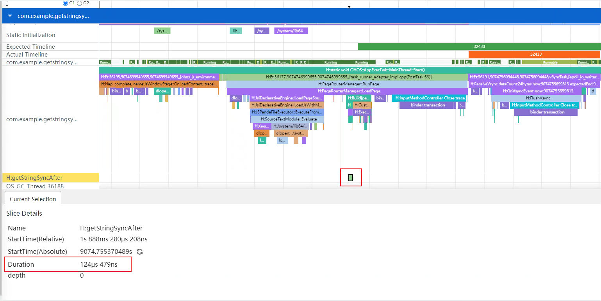

# 合理使用系统接口

## 简介

在应用开发中，经常会调用系统接口，比如本地文件读取接口，处理服务端数据接口。如果不进行合理的使用，可能会引起延迟卡顿丢帧等性能问题，本文以下列系统接口为例，对系统接口的合理使用进行了总结。

- 避免在ResourceManager的getXXXSync接口入参中直接使用资源信息
- 使用wordBreak属性替换零宽空格(\u200b)

## 避免在ResourceManager的getXXXSync接口入参中直接使用资源信息

避免在[ResourceManager](https://developer.huawei.com/consumer/cn/doc/harmonyos-references/js-apis-resource-manager-0000001774281590#ZH-CN_TOPIC_0000001857915357__resourcemanagergetresourcemanager)的getXXXSync接口入参中直接使用资源信息，推荐使用资源id作为入参，例如推荐用法为：resourceManager.getStringSync($r('app.string.test').id)。
下面以[getStringSync](https://developer.huawei.com/consumer/cn/doc/harmonyos-references/js-apis-resource-manager-0000001774281590#ZH-CN_TOPIC_0000001857915357__getstringsync10)为例，测试一下这两种参数在方法中的使用是否会有耗时区别。

### 反例

```ts
@Entry
@Component
struct Index {
  @State message: string = 'getStringSync';

  aboutToAppear(): void {
    hiTraceMeter.startTrace('getStringSync', 1);
    // getStringSync接口的入参直接使用资源，未使用资源ID
    getContext().resourceManager.getStringSync($r('app.string.test'));
    hiTraceMeter.finishTrace('getStringSync', 1);
  }

  build() {
    RelativeContainer() {
      Text(this.message)
        .fontSize(50)
        .fontWeight(FontWeight.Bold)
    }
    .height('100%')
    .width('100%')
  }
}
```

通过[SmartPerf Host](performance-optimization-using-smartperf-host.md)工具抓取Trace。持续时间为1.621ms。


### 正例

```ts
@Entry
@Component
struct Index {
  @State message: string = 'getStringSyncAfter';

  aboutToAppear(): void {
    hiTraceMeter.startTrace('getStringSyncAfter', 2);
    // getStringSync接口的入参使用了资源ID
    getContext().resourceManager.getStringSync($r('app.string.test').id);
    hiTraceMeter.finishTrace('getStringSyncAfter', 2);
  }

  build() {
    RelativeContainer() {
      Text(this.message)
        .fontSize(50)
        .fontWeight(FontWeight.Bold)
    }
    .height('100%')
    .width('100%')
  }
}
```

通过[SmartPerf Host](performance-optimization-using-smartperf-host.md)工具抓取Trace。持续时间为0.124ms。



| 写法                                                  | 耗时情况 |
| ----------------------------------------------------- | -------- |
| 资源信息为参数：getStringSync($r('app.string.test'))  | 1.621ms  |
| 资源ID为参数：getStringSync($r('app.string.test').id) | 0.124ms  |

可得出结论：参数为资源信息时比参数为资源ID值时耗时更多。所以当需要使用类似方法时，使用资源ID值作为参数更优。

## 使用wordBreak属性替换零宽空格(\u200b)

零宽空格（Zero Width Space, ZWSP）是一个特殊的Unicode字符。它是一个不可见的字符，其宽度为零，不占用任何可见空间。在文本处理系统中，尽管它在视觉上是不可见的，但它在文本中确实存在，并可以作为潜在的断点，即允许在此位置断开行。这意味着如果一行文本过长需要自动换行时，文本可以在零宽空格的位置进行折行，而不影响单词的完整性。

虽然零宽空格在许多情况下都是有用的，但它也可能引起问题，特别是在文本处理和数据清洗中。不注意这些看不见的字符可能导致数据的意外错误、搜索失败、数据不一致等问题。因此，在处理来自不同源的文本数据时，了解和考虑这些不可见字符是非常重要的。

避免在文本组件内使用零宽空格(\u200b)的形式来设置断行规则，推荐使用[wordBreak](https://developer.huawei.com/consumer/cn/doc/harmonyos-references-V5/ts-basic-components-text-V5#wordbreak11)，wordBreak在使用性能方面优于零宽空格。例如推荐用法为：Text(this.diskName).wordBreak(WordBreak.BREAK_ALL)。

### 反例

```ts
@CustomDialog
export struct DiskFormatDialog {
  private diskName: string = '';
  build() {
    Column() {
      Text(this.diskName.split("").join("\u200B"))
      .textAlign(TextAlign.Start)
    }
  }
}
```

### 正例

```ts
@CustomDialog
export struct DiskFormatDialog {
  private diskName: string = '';
  build() {
    Column() {
      Text(this.diskName)
      .textAlign(TextAlign.Start)
      .wordBreak(WordBreak.BREAK_ALL)
    }
  }
}
```
