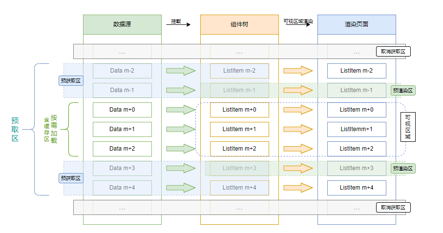
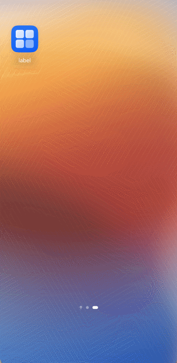
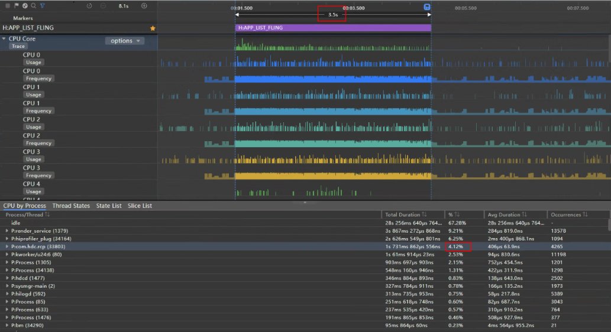

# 滑动白块问题解决指导

当应用程序需要使用列表显示内容时，通常会使用List+LazyForEach组件来实现。但是列表中需要显示耗时加载的内容时，仅依靠List+LazyForEach不足以获得最优的用户体验。例如显示在线网络图片，在弱网以及快速滑动浏览的场景下，由于来不及完成图片加载、解码显示，列表中图片显示位置会出现白块占位符，影响用户浏览体验。

## 问题场景

假设开发者想要在应用中开发一个在线音乐显示列表，列表中每一个Item包含专辑封面、歌曲名称都要在线实时下载后再显示。专辑封面图片的下载和显示需要一些时间，具体取决于网络的通道质量、图像大小等因素。如果当前Item显示在屏幕上时，其对应的图像尚未加载完成，则将出现白块（图像的占位符）。为列表显示提供数据加载能力常用方法是使用[LazyForEach](../quick-start/arkts-rendering-control-lazyforeach.md)。LazyForEach会在提供的数据源上进行迭代，并在每次迭代中创建相应的组件。当在列表组件中使用LazyForEach时，ArkUI框架会在列表的可见区域按需创建Item组件。当Item超出屏幕时，ArkUI框架会销毁并回收组件，以减少内存占用。目前仅[List](../reference/apis-arkui/arkui-ts/ts-container-list.md)、[Grid](../reference/apis-arkui/arkui-ts/ts-container-grid.md)、[Swpier](../reference/apis-arkui/arkui-ts/ts-container-swiper.md)和[WaterFlow](../reference/apis-arkui/arkui-ts/ts-container-waterflow.md)组件支持使用LazyForEach。

## 优化思路

动态预加载会根据历史任务加载耗时情况，动态调整屏幕可视区域外数据预取数量，配合懒加载设置，可在列表不断滑动时，屏幕可视区外实时更新列表数据，通过预取和预渲染数据提升列表滑动体验。

## 优化前代码示例

设置`cachedCount=5`：

```ts
// ...
build() {
  Column() {
    List() {
      LazyForEach(this.dataSource, (item: SongInfoItem) => {
        ListItem() {
          ListItemComponent({ songInfo: item })
            .height(`${100 / this.ITEMS_ON_SCREEN}%`)
            .margin({ left: 20, bottom: 20 })
        }
      })
    }
    .cachedCount(5)
    .width("100%")
    .height("100%")
    .friction(0.4)
  }
}
```

.gif)

处理白块问题的常用方案是使用LazyForEach的cachedCount属性来减少白块（设置cachedCount属性，可以支持列表预加载屏幕以外的Item项）。如上图所示，可以看到当用户在滑动列表时，依旧出现了很多白块。

如若使用更大的cachedCount值来解决，设置`cachedCount=40`：

.gif)

如上图所示，可以看到在滑动过程中白块确实变少了。但是新的问题出现了：与较小的cachedCount相比，首屏加载需要更长的时间，这同样影响用户使用体验。

### 过小的cachedCount值

过小的cachedCount值会导致列表预取的Item数量不足。当用户滑动列表时，后台可能来不及准备好足够多的预取项，特别是内容数据量大或网络条件特别差的时候，列表滑动过程就容易出现很多白块。

### 过大的cachedCount值

虽然较大的cachedCount值可以缓解缺少预取项的情况，但在列表没有滑动时，过大的cachedCount值可能导致可见区域的加载时间过长。这在首屏加载场景尤其明显：cachedCount越大，完成可见区域所需的加载耗时就越长，因为许多不可见Item需要被预取，占用资源。“首屏问题”在快速滑动后（使用ScrollBar快速滑动），屏幕加载Item也会出现耗时过长现象。cachedCount值越大，快速滚动后完成下载可见区域中项目所需的时间就越多。

在良好的网络中设置过大的cachedCount值可能会导致资源浪费：预取了过多的Item，导致额外的CPU、网络开销浪费。

结论：仅依靠cachedCount无法完美解决内容白块问题，需要引入一种能够动态适应外部条件变化（网络条件、内存变化等）的机制来解决这个问题。

## 优化指导

动态预加载根据历史任务加载耗时情况，动态调整屏幕可视区域外数据预取数量，配合懒加载设置，可在列表不断滑动时，屏幕可视区域外实时更新列表数据，通过预取和预渲染数据提升列表滑动体验。

Prefetcher支持应用动态自适应网络状态，通过提前下载一些图片或资源，确保相关资源在需要时能立即显示，以尽可能减少白块出现的概率。

LazyForEach懒加载可以通过使用Prefetcher来预取和预渲染数据，在使用Prefetcher后，除屏幕内显示的ListItem组件外，还会预先将屏幕可视区外的部分列表项数据进行预渲染和预取。这样当列表向下滑动时，会先显示预渲染组件，屏幕可视区外会动态调整预取范围。预取逻辑在Prefetcher的BasicPrefetcher类中实现，BasicPrefetcher支持预取和预渲染（图像解码、添加到组件树等）过程分离、自适应调整与获取范围、优先加载可视区域、以及取消不必要任务（快速滚动列表的场景下，智能取消不必要任务），其渲染过程如下：

1.首先请求n条数据，并在屏幕上显示m条数据。

2.当列表滑动，缓存列表项需要从屏幕可视区外进入可视区内时，此时显示预渲染组件，屏幕可视区外会动态调整预取范围，相比仅设置cachedCount提升了显示效率。

3.当列表不断滑动，屏幕可视区外实时更新列表项、更新预取数据和预渲染数据。

图1 动态预加载渲染过程示意图



## 优化后代码示例

实现DataSourcePrefetching类，继承IDataSourcePrefetching接口，并实现prefetch方法，如下代码所示：

```
import { SongInfoItem } from '../model/LearningResource';
import { HashMap } from '@kit.ArkTS';
import fs from '@ohos.file.fs';
import { IDataSourcePrefetching } from '@kit.ArkUI';
import { http } from '@kit.NetworkKit';

let PREFETCH_ENABLED: boolean = false;
const IMADE_UNAVAILABLE = $r('app.media.startIcon');

export default class DataSourcePrefetching implements IDataSourcePrefetching {
  private dataArray: Array<SongInfoItem>;
  private listeners: DataChangeListener[] = [];
  private readonly requestsInFlight: HashMap<number, http.HttpRequest> = new HashMap();
  private readonly cachePath = getContext().getApplicationContext().cacheDir;

  constructor(dataArray: Array<SongInfoItem>) {
    this.dataArray = dataArray;
  }
  
  async prefetch(index: number): Promise<void> {
    PREFETCH_ENABLED = true;
    const item = this.dataArray[index];
    if (item.cachedImage) {
      return;
    }
    // 数据请求
    const request: http.HttpRequest = http.createHttp();
    // 缓存网络请求对象，便于在需要取消请求的时候进行处理
    this.requestsInFlight.set(index, request);
    try {
      // 发送http请求获得响应
      const response = await request.request(item.albumUrl);
      if (response.responseCode !== 200 || !response.result) {
        throw new Error('Bad response');
      }
      const imageBuffer: ArrayBuffer = response.result as ArrayBuffer;
      // 将加载的数据信息存储到缓存文件中
      item.cachedImage = await this.cache(item.songId, imageBuffer);
      // 删除指定元素
      this.requestsInFlight.remove(index);
    } catch (err) {
      item.cachedImage = IMADE_UNAVAILABLE;
    } finally {
      // 移除有异常的网络请求任务
      this.requestsInFlight.remove(index);
    }
  }
}
// ...
```

在应用列表界面，首先创建DataSourcePrefetching、BasicPrefetcher对象，然后在List的onScrollIndex回调中调用BasicPrefetcher的visibleAreaChanged方法，传入List的可见区域起始坐标。至此完成代码的优化。

```ts
import { SongInfoItem } from '../model/LearningResource';
import DataSourcePrefetching from '../model/ArticleListData';
import { ObservedArray } from '../utils/ObservedArray';
import { ReusableArticleCardView } from '../components/ReusableArticleCardView';
import Constants from '../constants/Constants';
import { util } from '@kit.ArkTS';
import PageViewModel from '../components/PageViewModel';
import { BasicPrefetcher } from '@kit.ArkUI';

@Entry
@Component
export struct LazyForEachListPage {
  @State collectedIds: ObservedArray<string> = ['1', '2', '3', '4', '5', '6'];
  @State likedIds: ObservedArray<string> = ['1', '2', '3', '4', '5', '6'];
  @State isListReachEnd: boolean = false;
  // 创建DataSourcePrefetching对象，具备任务预取、取消能力的数据源
  private readonly dataSource = new DataSourcePrefetching(PageViewModel.getItems());
  // 创建BasicPrefetcher对象，默认的动态预取算法实现
  private readonly prefetcher = new BasicPrefetcher(this.dataSource);

  build() {
    Column() {
      Header()
      List({ space: Constants.SPACE_16 }) {
        LazyForEach(this.dataSource, (item: SongInfoItem) => {
          ListItem() {
            Column({ space: Constants.SPACE_12 }) {
              ReusableArticleCardView({ articleItem: item })
            }
          }
          .reuseId('article')
        })
      }
      .cachedCount(5)
      .onScrollIndex((start: number, end: number) => {
        // 列表滚动触发visibleAreaChanged，实时更新预取范围，触发调用prefetch接口
        this.prefetcher.visibleAreaChanged(start, end)
      })
      .width(Constants.FULL_SCREEN)
      .height(Constants.FULL_SCREEN)
      .margin({ left: 10, right: 10 })
      .layoutWeight(1)
    }
    .backgroundColor($r('app.color.text_background'))
  }
}
// ...
```

## 优化前后对比

本文案例中的长列表一屏可以加载6条数据，为了测试动态预加载方案与设置不同的cachedCount对应用性能的影响。来测试快速滑动场景下出现的白块数量、CPU开销占比以及首屏加载时长。如下对比场景设置数据cachedCount=5、cachedCount=40。最终，使用IDE的profiler工具检测下述指标，得到的数据如下所示：


### 滑动列表场景对比

| cachedCount = 5                                              | cachedCount = 40                                             | 动态预加载                                              |
| ------------------------------------------------------------ | ------------------------------------------------------------ | ------------------------------------------------------- |
| .gif) | .gif) |  |

| 数据设置       | 首屏加载   | 滑动过程白块数量                       |
| -------------- | -------------- | ------------------------------ |
| cachedCount=5  | 首屏加载快 | 滑动过程中白块很多         |
| cachedCount=40 | 首屏加载慢 | 滑动过程中没有白块或很少 |
| 动态预加载     | 首屏加载快 | 滑动过程中没有白块或很少 |

###  CPU开销对比

利用Profiler工具分析得到相关trace图，追踪流程为应用侧的APP_LIST_FLING（列表从开始滚动到结束）的整个过程，从而观察应用的CPU占比。（注：不同设备特性和具体应用场景的多样性，所获得的性能数据存在差异，提供的数值仅供参考）

图2 cachedCount=5 CPU占比trace图

_CPU.png)

cachedCount=5的CPU占比为3.96%。

图3 cachedCount=40 CPU占比trace图

_CPU.png)

cachedCount=40的CPU占比为5.04%。

图4 动态预加载CPU占比trace图



动态预加载的CPU占比为4.12%。

| 数据设置       | CPU占比 |
| -------------- | ------- |
| cachedCount=5  | 3.96%   |
| cachedCount=40 | 5.04%   |
| 动态预加载     | 4.12%   |

### 首屏加载时长对比

利用Profiler工具分析得到相关trace图，追踪流程从Create Process（应用进程创建阶段）标签开始，到首屏全部图片加载完毕结束，从而观察应用的首屏加载时长。（注：不同设备特性和具体应用场景的多样性，所获得的性能数据存在差异，提供的数值仅供参考）

图5 cachedCount=5首屏加载时长trace图

_time.png)

cachedCount=5首屏加载时长为530.4ms

图6 cachedCount=40首屏加载时长trace图

_time.png)

cachedCount=40首屏加载时长为1.8s

图7 动态预加载首屏加载时长trace图


动态预加载首屏加载时长为545.5ms

| 数据设置       | 首屏加载时长 |
| -------------- | ------------ |
| cachedCount=5  | 530.4ms      |
| cachedCount=40 | 1.8s         |
| 动态预加载     | 545.5ms      |

## 总结

从实验数据可以看出：

1）当cachedCount=5时，首屏加载时间短，滑动过程中出现大量白块，滑动时CPU占比较小。

2）当cachedCount=40时，首屏加载时间过长，滑动过程中并未出现白块，滑动时CPU占比较大。

3）当在cachedCount=5时的基础上设置动态预加载时，首屏加载时间短，滑动过程中并未出现白块，滑动时CPU占比较小。

**因此当用户使用LazyForEach在线加载含有图片等数据量比较大的资源时，可以考虑使用动态预加载来预防弱网以及快速滑动场景中出现的白块问题。**

动态预加载是在模拟弱网以及快速滑动的状态下加载数据测试而得出的数据结论。当利用网络数据来探讨LazyForEach代码如何进行网络数据的加载和优化时，可以使用动态预加载，使用动态预加载这项技术后，因将预取和预渲染分离且在滑动过程中实时更新列表项、预取数据和预渲染数据，故能在弱网和快速滑动场景中明显减少滑动过程中出现的白块现象。
